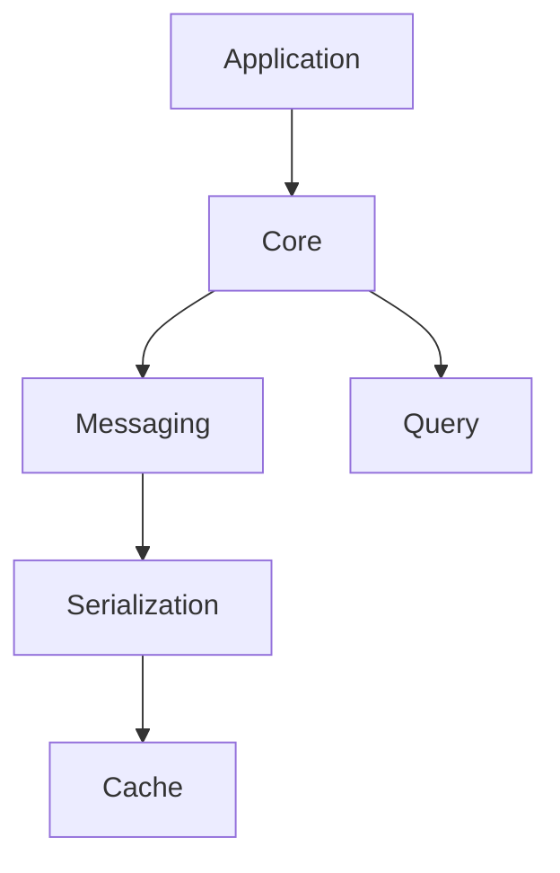

### user — 2025-08-30T07:38:13.765000+00:00

ある程度できてるけど、開発にあたってログが不足してる。
属性値、FluentAPI、appsettings.jsonによる設定がある。これを設定したものがkafkaに連携される際に使用されるパラメータをログで出力する。
ログはtrace ? debug ? information ?どれがいい？

### assistant — 2025-08-30T07:38:15.601536+00:00

_(empty)_

### assistant — 2025-08-30T07:38:15.862687+00:00

いい質問です😊　Kafka.Ksql.Linq の場合、**属性値・FluentAPI・appsettings.json** が統合されて最終的に使われる構成（Kafka接続先・Topic設定・SchemaRegistry・DLQ・キャッシュなど）が決まります【8†files_uploaded_in_conversation】。  
この「統合された最終パラメータ」をログに残すのは運用上とても価値があります。

---

## ログレベルの選択

- **Trace**  
  → フレームワーク内部の動作詳細、ほぼデバッグ専用。利用者には冗長すぎる。  
  → 開発者が「どうマージされたか一行ずつ追いたい」時にのみ使うべき。

- **Debug**  
  → システムがどのように解釈したかを確認するのに適切。  
  → 構成の統合結果（DSL + appsettings）を開発中に出すならここが第一候補。  
  → 本番運用では通常は出さない（必要時だけ有効化）。

- **Information**  
  → 本番ログの標準レベル。  
  → 出すとしたら「起動時に最終設定の概要を1回だけ」など。  
  → 例: 「Order Entity: GroupId=orders-consumer, AutoOffsetReset=earliest, Topic=orders, Partitions=3, ReplicationFactor=1」。

---

## 実運用でのおすすめ

1. **起動時に Information レベルで「最終マージ済み設定の概要」を1回出力**  
   - これで利用者は「どの設定が効いているか」を即把握できる。  
   - 出力例:  
     ```
     [INFO] Entity=Order, Topic=orders, GroupId=orders-consumer, OffsetReset=earliest, NumPartitions=3, ReplicationFactor=1
     ```

2. **Debug レベルで「詳細なキー・値ペア」を展開**  
   - Attribute / FluentAPI / appsettings のどれから来たかも付与可能。  
   - 出力例:  
     ```
     [DEBUG] Entity=Order, Property=GroupId, Value="orders-consumer", Source=FluentAPI
     [DEBUG] Entity=Order, Property=NumPartitions, Value=3, Source=appsettings.json
     ```

3. **Trace は内部診断用に残すが通常は無効**  
   - 開発者が深い不具合を追うときだけ有効化。  

---

## 提案する実装パターン

- **ILogger のカテゴリを分ける**:  
  `ILogger<KsqlDslConfig>` などを使い、設定ロード専用のログカテゴリを定義。  
- **拡張メソッド化**:  
  `DumpEffectiveConfiguration(LogLevel level = LogLevel.Information)` を提供。  
- **Source付き出力**:  
  Attribute / FluentAPI / appsettings の優先順位と由来を追えるようにする。

---

👉 結論:  
- **本番向けは Information で概要を1回出す**  
- **開発・検証向けは Debug で詳細を出す**  
- **Trace は内部診断のみ**  

---

司令、もしよければ「ログ出力のフォーマット案（JSON形式にするか、人間可読のテキストにするか）」も一緒に整理しましょうか？

### system — 2025-08-30T07:38:15.994236+00:00

_(empty)_

### user — 2025-08-30T07:38:15.994236+00:00

_(empty)_

### system — 2025-08-30T07:38:15.994236+00:00

_(empty)_

### system — 2025-08-30T07:38:16.121556+00:00

_(empty)_

### tool — 2025-08-30T07:38:16.136951+00:00

_(empty)_

### tool — 2025-08-30T07:38:16.149812+00:00

Make sure to include `【message_idx†source】` markers to provide citations based on this file, where [message_idx] is provided at the beginning of this message
## ⚙️ Kafka.Ksql.Linq appsettings.json 構成仕様

Kafka.Ksql.Linq では、`appsettings.json` を通じて柔軟なDSL設定が可能です。以下はその構成要素と意味です。
標準的なデフォルト値は `examples/configuration/appsettings.json` にまとめられています。

---

### 1 📐 基本構造

```json
{
  "KsqlDsl": {
    "ValidationMode": "Strict|Relaxed",
    "Common": { /* 共通設定 */ },
    "Topics": { /* トピック別設定 */ },
    "SchemaRegistry": { /* スキーマレジストリ設定 */ },
    "TableCache": [ /* エンティティ／キャッシュ設定 */ ],
    "DlqTopicName": "dead-letter-queue",
    "DlqOptions": { /* DLQ トピック設定 */ },
    "DeserializationErrorPolicy": "Skip|Retry|DLQ",
    "ReadFromFinalTopicByDefault": false,
    "DecimalPrecision": 38,
    "DecimalScale": 9
  }
}
```

---

### 🧱 1.1 Common（共通Kafka設定）

| 項目 | 説明 |
|------|------|
| `BootstrapServers` | Kafkaブローカーの接続先 |
| `ClientId` | 接続クライアント識別子 |
| `RequestTimeoutMs` | Kafka操作タイムアウト（ms） |
| `MetadataMaxAgeMs` | メタデータの最大有効期間（ms） |
| `SecurityProtocol` | `Plaintext` / `SaslPlaintext` など |
| `SaslMechanism` | 認証方式（例：`Plain`, `ScramSha256`） |
| `SaslUsername`, `SaslPassword` | SASL認証情報 |
| `SslCaLocation` | CA証明書ファイルパス |
| `SslCertificateLocation` | クライアント証明書ファイルパス |
| `SslKeyLocation` | 秘密鍵ファイルパス |
| `SslKeyPassword` | 秘密鍵パスワード |
| `AdditionalProperties` | 追加Kafka設定（key-value） |

```json
"Common": {
  "BootstrapServers": "localhost:9092",
  "ClientId": "ksql-dsl-client",
  "RequestTimeoutMs": 30000,
  "MetadataMaxAgeMs": [[REDACTED_PHONE]],
  "SecurityProtocol": "Plaintext",
  "SaslMechanism": "Plain",
  "SaslUsername": "user",
  "SaslPassword": "pass",
  "SslCaLocation": "/path/ca.pem",
  "SslCertificateLocation": "/path/cert.pem",
  "SslKeyLocation": "/path/key.pem",
  "SslKeyPassword": "secret",
  "AdditionalProperties": {}
}
```

---

### 📦 1.2 Topics（トピックごとの詳細設定）

Producer の設定は `Kafka.Ksql.Linq.Configuration.Messaging.ProducerSection`、
Consumer の設定は `ConsumerSection` クラスにそれぞれマッピングされます。
アプリ設定ファイルの項目名とクラスプロパティが 1 対 1 で対応するため、
カスタム設定を追加する際はこれらのクラスを拡張してください。

```json
"Topics": {
  "my-topic": {
    "Producer": {
      "Acks": "All",
      "CompressionType": "Snappy",
      "EnableIdempotence": true,
      "MaxInFlightRequestsPerConnection": 1,
      "LingerMs": 5,
      "BatchSize": 16384,
      "DeliveryTimeoutMs": [[REDACTED_PHONE]],
      "RetryBackoffMs": 100,
      "Retries": [[REDACTED_PHONE]],
      "BufferMemory": [[REDACTED_PHONE]],
      "Partitioner": null
    },
    "Consumer": {
      "GroupId": "my-group",
      "AutoOffsetReset": "Latest",
      "EnableAutoCommit": true,
      "AutoCommitIntervalMs": 5000,
      "SessionTimeoutMs": 30000,
      "HeartbeatIntervalMs": 3000,
      "MaxPollIntervalMs": [[REDACTED_PHONE]],
      "MaxPollRecords": 500,
      "FetchMinBytes": 1,
      "FetchMaxWaitMs": 500,
      "FetchMaxBytes": [[REDACTED_PHONE]],
      "PartitionAssignmentStrategy": null,
      "IsolationLevel": "ReadUncommitted"
    },
    "Creation": {
      "NumPartitions": 1,
      "ReplicationFactor": 1,
      "Configs": {},
      "EnableAutoCreation": false
    }
  }
}
```

| Producer設定 | 説明 |
|------------------|------|
| `Acks` | 書き込み応答の強度設定（例：`All`, `1`） |
| `CompressionType` | 圧縮方式（`Snappy`, `Gzip`, `Lz4`など） |
| `EnableIdempotence` | 冪等性設定（重複防止） |
| `MaxInFlightRequestsPerConnection` | 同時送信要求上限 |
| `LingerMs` | バッチ送信待機時間（ms） |
| `BatchSize` | バッチ書き込み単位（byte） |
| `DeliveryTimeoutMs` | 配信タイムアウト（ms） |
| `RetryBackoffMs` | リトライ待機時間（ms） |
| `Retries` | 最大リトライ回数 |
| `BufferMemory` | 送信バッファサイズ（byte） |
| `Partitioner` | パーティショナー指定 |
| `AdditionalProperties` | 追加Producer設定 |

| Consumer設定 | 説明 |
|------------------|------|
| `GroupId` | コンシューマーグループID |
| `AutoOffsetReset` | `Latest` or `Earliest` |
| `EnableAutoCommit` | 自動コミット可否。`ForEachAsync` の `autoCommit` より優先 |
| `AutoCommitIntervalMs` | 自動コミット間隔(ms) |
| `SessionTimeoutMs` | セッションタイムアウト(ms) |
| `HeartbeatIntervalMs` | ハートビート送信間隔(ms) |
| `MaxPollIntervalMs` | 最大ポーリング間隔(ms) |
| `MaxPollRecords` | 最大ポーリングレコード数 |
| `FetchMinBytes` | フェッチ最小バイト数 |
| `FetchMaxWaitMs` | フェッチ最大待機(ms) |
| `FetchMaxBytes` | フェッチ最大バイト数 |
| `PartitionAssignmentStrategy` | パーティション割当戦略 |
| `IsolationLevel` | アイソレーションレベル |
| `AdditionalProperties` | 追加Consumer設定 |

---

### 🧬 1.3 SchemaRegistry（スキーマレジストリ設定）

```json
"SchemaRegistry": {
  "Url": "http://localhost:8081",
  "MaxCachedSchemas": 1000,
  "RequestTimeoutMs": 30000,
  "BasicAuthUserInfo": "user:pass",
  "BasicAuthCredentialsSource": "UserInfo",
  "AutoRegisterSchemas": true,
  "LatestCacheTtlSecs": 300,
  "SslCaLocation": "/path/ca.pem",
  "SslKeystoreLocation": "/path/keystore.p12",
  "SslKeystorePassword": "secret",
  "SslKeyPassword": "secret",
  "AdditionalProperties": {}
}
```

| 項目 | 説明 |
|------|------|
| `Url` | スキーマレジストリURL |
| `MaxCachedSchemas` | クライアント側でキャッシュする最大スキーマ数 |
| `RequestTimeoutMs` | リクエストタイムアウト(ms) |
| `BasicAuthUserInfo` | Basic認証用クレデンシャル（形式：`user:pass`） |
| `BasicAuthCredentialsSource` | `UserInfo` or `SaslInherit` |
| `AutoRegisterSchemas` | スキーマを自動登録するかどうか |
| `LatestCacheTtlSecs` | 最新スキーマキャッシュTTL(sec) |
| `SslCaLocation` | CA証明書パス |
| `SslKeystoreLocation` | キーストア(PKCS#12)パス |
| `SslKeystorePassword` | キーストアパスワード |
| `SslKeyPassword` | 秘密鍵パスワード |
| `AdditionalProperties` | 追加設定 |

---

### 🏪 1.4 TableCache（テーブルキャッシュ設定）

```json
"TableCache": [
  {
    "Entity": "OrderEntity",
    "SourceTopic": "orders",
    "EnableCache": true,
    "Windows": [5, 15, 60],
    "StoreName": "orders_store",
    "BaseDirectory": "/var/lib/ksql_cache"
  }
]
```

| 項目 | 説明 |
|------|------|
| `Entity` | 対象POCOクラス名 |
| `SourceTopic` | 入力元となるKafkaトピック名 |
| `EnableCache` | キャッシュ有効化（bool） |
| `Windows` | タンブリングウィンドウサイズ（整数：分単位） |
| `StoreName` | キャッシュ名（省略時はトピック名を基に自動生成） |
| `BaseDirectory` | RocksDBディレクトリのルートパス |

---

### 🛡️ 1.5 ValidationMode

| 値 | 説明 |
|-----|------|
| `Strict` | 起動時に全構成値を検証。欠落や不整合があるとエラー（推奨） |
| `Relaxed` | 柔軟に読み込む。テスト・一時構成に使用可 |

```json
"ValidationMode": "Strict"
```

---

### 💌 1.6 DLQ 設定

```json
"DlqTopicName": "dead-letter-queue",
"DlqOptions": {
  "RetentionMs": 5000,
  "NumPartitions": 1,
  "ReplicationFactor": 1,
  "EnableAutoCreation": true,
  "AdditionalConfigs": {
    "cleanup.policy": "delete"
  }
}
```

未指定の場合、`DlqTopicName` は `dead-letter-queue` が使用されます。

| 項目 | 説明 |
|------|------|
| `DlqTopicName` | DLQ用トピック名 |
| `RetentionMs` | メッセージ保持時間(ms) |
| `NumPartitions` | パーティション数 |
| `ReplicationFactor` | レプリケーション係数 |
| `EnableAutoCreation` | 自動作成を行うか |
| `AdditionalConfigs` | 追加トピック設定 |

---

### ⚙️ 1.7 その他オプション

| 項目 | 説明 |
|------|------|
| `DeserializationErrorPolicy` | `Skip` / `Retry` / `DLQ` のエラーハンドリング方針 |
| `ReadFromFinalTopicByDefault` | Finalトピックを既定で参照するか |
| `DecimalPrecision` | decimal型のprecisionを一括設定 |
| `DecimalScale` | decimal型のscaleを一括設定 |

### 🧩 DSL記述とappsettingsの対応関係

| Kafka設定項目             | DSLでの指定                          | appsettings.jsonキー                         | 補足説明 |
|----------------------------|--------------------------------------|---------------------------------------------|--------|
| Bootstrap Servers          | なし                                 | `Kafka:BootstrapServers`                   | Kafka接続先クラスタ |
| Schema Registry URL       | なし                                 | `KsqlDsl:SchemaRegistry:Url`              | POCOスキーマ自動登録時に使用 |
| ksqlDB URL                | なし                                 | `KsqlDsl:KsqlDbUrl`                       | ksqlDB RESTエンドポイント |
| Auto Offset Reset | `.WithAutoOffsetReset(...)` | `Kafka:Consumers.<name>.AutoOffsetReset` | トピックごとの既読位置制御（複数可） | 通常は `earliest` or `latest` |
| GroupId | `.WithGroupId(...)` | `Kafka:Consumers.<name>.GroupId` | コンシューマグループID（複数可） | コンシューマグループID |
| トピック名                 | `[KsqlTopic("orders")]`             | `KsqlDsl:Topics.orders` で上書き可         | 属性またはFluent APIで指定 |
| パーティション数           | `[KsqlTopic("orders", PartitionCount = 12)]` | `KsqlDsl:Topics.orders.NumPartitions` 等    | DSLと設定の併用可能 |
| Replication Factor        | なし（構成ファイルで指定）          | `KsqlDsl:Topics.orders.ReplicationFactor`  | Kafkaクラスタ構成に依存 |
| DLQ構成                    | `.OnError(ErrorAction.DLQ)`          | `KsqlDsl:DlqTopicName`, `DlqOptions` | DLQの有効化、保持期間指定など |
| Windowサイズ               | `.Window(new[] { 5, 15, 60 })`       | `KsqlDsl:Entities[].Windows`              | DSL/設定どちらでも指定可（整合性が必要） |

---

### 📦 2. 実装例との対応（MyKsqlContext & Order & OrderCount）

```csharp
public class Order
{ 
    public string ProductId { get; set; }
    public decimal Amount { get; set; }
}

public class MyKsqlContext : KsqlContext
{
    protected override void OnModelCreating(KsqlModelBuilder modelBuilder)
{
    modelBuilder.Entity<Order>()
        .WithGroupId("orders-consumer")
        .WithAutoOffsetReset(AutoOffsetReset.Earliest)
        .Window(new[] { 5 });

    modelBuilder.Entity<OrderCount>()
        .WithGroupId("order-counts-consumer")
        .WithAutoOffsetReset(AutoOffsetReset.Latest)
        .UseFinalTopic();
});
    }
}
```

```json
{
  "Kafka": {
    "BootstrapServers": "localhost:9092",
    "Consumers": {
      "orders-consumer": {
        "GroupId": "orders-consumer",
        "AutoOffsetReset": "earliest"
      },
      "order-counts-consumer": {
        "GroupId": "order-counts-consumer",
        "AutoOffsetReset": "latest"
      }
    }
  },
  "KsqlDsl": {
    "SchemaRegistry": {
      "Url": "http://localhost:8081"
    },
    "KsqlDbUrl": "http://localhost:8088",
    "Topics": {
        "orders": {
          "NumPartitions": 3,
          "ReplicationFactor": 1
        },
        "order_counts": {
          "NumPartitions": 1,
          "ReplicationFactor": 1,
          "CleanupPolicy": "compact"
        }
      }
    },
    "TableCache": [
      {
        "Type": "Order",
        "Windows": [5]
      }
    ],
    "DlqTopicName": "dead-letter-queue",
    "DlqOptions": {
      "RetentionMs": 5000,
      "NumPartitions": 1,
      "ReplicationFactor": 1
    }
  }
}
```


### 💡 備考：複数GroupId構成と整合性

- Kafkaでは1つのトピックに対して複数のコンシューマグループを定義可能です。
- 本DSLでは `Entity<T>` ごとに `GroupId` を指定することで、複数のグループ単位の並列処理や責務分離を実現できます。
- それに対応して `appsettings.json` では `Kafka:Consumers.<name>` として複数グループの構成を記述します。
- 各DSL定義と `Consumers` のキー名（例: `orders-consumer`）が一致している必要があります。

これにより、「DSLで定義するグループID = 運用時の構成名」として論理的に整合した設計が実現されます。

### tool — 2025-08-30T07:38:16.159437+00:00

All the files uploaded by the user have been fully loaded. Searching won't provide additional information.

### user — 2025-08-30T07:40:11.844000+00:00

そうではなくproducer/consumerへのプロパティ設定値は確認用に出す。
KSQLDBへの登録クエリも出す。この出し方を統一したい

### system — 2025-08-30T07:40:12.251378+00:00

_(empty)_

### system — 2025-08-30T07:40:12.261220+00:00

_(empty)_

### assistant — 2025-08-30T07:40:12.494183+00:00

_(empty)_

### assistant — 2025-08-30T07:40:26.744279+00:00

やあ、司令。結論から👇  
**Producer/Consumer の実際に効く設定値**と**ksqlDB へ送る登録クエリ**は、**同一フォーマットの“監査ログ（Audit Log）”として JSON-Lines で出す**のがベスト。  
- 本番＝**Information**（起動時・登録時のスナップショットのみ）  
- 開発＝**Debug**（詳細・由来フィールドも出す）  
- Trace は内部診断専用で通常 OFF

設定項目の定義・由来は手元の仕様に沿う（Common/Topics/SchemaRegistry/DLQ 等）【8†files_uploaded_in_conversation】。

---

# 統一フォーマット（JSON Lines）

1行＝1イベント。キーは固定。可読性・集計性・相関性を両立。

```json
{
  "ts": "[[REDACTED_PHONE]]-30T16:40:00+09:00",
  "category": "kafka.config",         // kafka.config | ksqldb.statement
  "kind": "producer",                 // producer | consumer （category=kafka.config の場合）
  "entity": "Order",                  // DSLのエンティティ名（任意）
  "topic": "orders",
  "groupId": "orders-consumer",       // consumer時のみ
  "clientId": "ksql-dsl-client",
  "effective": {                      // 実際に使われる最終値（Attribute/Fluent/appsettings統合後）
    "BootstrapServers": "localhost:9092",
    "Acks": "All",
    "EnableIdempotence": true,
    "LingerMs": 5,
    "BatchSize": 16384,
    "AutoOffsetReset": "Earliest",
    "NumPartitions": 3,
    "ReplicationFactor": 1
  },
  "source": {                         // 由来（開発時=Debugで出す／本番は省略可）
    "Acks": "appsettings.json",
    "EnableIdempotence": "default",
    "NumPartitions": "appsettings.json",
    "AutoOffsetReset": "FluentAPI"
  },
  "redactions": ["SaslPassword"],     // 秘匿項目の一覧
  "corrId": "7d6f3b9c19c2",           // 相関ID（リクエスト単位）
  "event": "applied"                  // applied | overridden | validated など
}
```

ksqlDB への登録クエリは同じ枠で `category=ksqldb.statement` にする：

```json
{
  "ts": "[[REDACTED_PHONE]]-30T16:40:01+09:00",
  "category": "ksqldb.statement",
  "entity": "Order",
  "operation": "CREATE_STREAM",      // CREATE_STREAM | CREATE_TABLE | CSAS | CTAS | TERMINATE | DROP ...
  "topic": "orders",
  "options": { "partitions": 3, "replication": 1 },
  "sql": "CREATE STREAM orders (...省略...) WITH (KAFKA_TOPIC='orders', PARTITIONS=3, REPLICAS=1);",
  "sqlHash": "sha256:1a9f…",         // 長文はハッシュで同一性を担保
  "corrId": "7d6f3b9c19c2",
  "event": "submitted"               // submitted | succeeded | failed
}
```

> 補足  
> - **秘匿値は常にマスキング**（例：`SaslPassword`, `SslKeyPassword`, `BasicAuthUserInfo`）。  
> - **`corrId`** を **Producer/Consumer 構築～ksqlDB登録** まで引き回すと、1回の起動・1エンティティの流れをトレースしやすい。  
> - 設定項目の名称は仕様のキーに合わせる（Common/Topics/SchemaRegistry/DlqOptions 等）【8†files_uploaded_in_conversation】。

---

# 実装ポイント（C# サンプル）

### 1) ログ出力ヘルパ（共通）

```csharp
public static class AuditLog
{
    public static void LogKafkaConfig(
        ILogger logger, LogLevel level,
        string kind, string entity, string topic, string? groupId,
        string clientId,
        IDictionary<string, object?> effective,
        IDictionary<string, string>? source,
        string corrId)
    {
        var payload = new
        {
            ts = DateTimeOffset.Now.ToString("o"),
            category = "kafka.config",
            kind, entity, topic, groupId, clientId,
            effective = Redact(effective),
            source,
            redactions = RedactedKeys,
            corrId,
            @event = "applied"
        };
        logger.Log(level, "{Payload}", System.Text.Json.JsonSerializer.Serialize(payload));
    }

    public static void LogKsqlStatement(
        ILogger logger, LogLevel level,
        string operation, string entity, string topic,
        string sql, IDictionary<string, object?>? options,
        string corrId, string ev = "submitted")
    {
        string hash = ComputeSha256(sql);
        var payload = new
        {
            ts = DateTimeOffset.Now.ToString("o"),
            category = "ksqldb.statement",
            operation, entity, topic,
            options,
            sql,
            sqlHash = $"sha256:{hash}",
            corrId,
            @event = ev
        };
        logger.Log(level, "{Payload}", System.Text.Json.JsonSerializer.Serialize(payload));
    }

    static readonly string[] RedactedKeys = new[] {
        "SaslPassword","SslKeyPassword","BasicAuthUserInfo","SslKeystorePassword"
    };

    static IDictionary<string, object?> Redact(IDictionary<string, object?> src)
    {
        var dict = new Dictionary<string, object?>(StringComparer.OrdinalIgnoreCase);
        foreach (var kv in src)
        {
            dict[kv.Key] = RedactedKeys.Contains(kv.Key, StringComparer.OrdinalIgnoreCase)
                ? "***REDACTED***" : kv.Value;
        }
        return dict;
    }

    static string ComputeSha256(string text)
    {
        using var sha = System.Security.Cryptography.SHA256.Create();
        var bytes = System.Text.Encoding.UTF8.GetBytes(text);
        return Convert.ToHexString(sha.ComputeHash(bytes)).ToLowerInvariant();
    }
}
```

### 2) 呼び出し例（Producer/Consumer 構築直前）

```csharp
// 構成のマージ後（Attribute/Fluent/appsettings 反映済み）にまとめる
var effectiveProducer = new Dictionary<string, object?>
{
    ["BootstrapServers"] = cfg.BootstrapServers,
    ["Acks"] = cfg.Acks,
    ["EnableIdempotence"] = cfg.EnableIdempotence,
    ["LingerMs"] = cfg.LingerMs,
    ["BatchSize"] = cfg.BatchSize,
    ["CompressionType"] = cfg.CompressionType,
    ["SaslPassword"] = cfg.SaslPassword // ←赤入れ対象
    // 必要に応じて追加
};

var sourceMap = new Dictionary<string, string?>
{
    ["Acks"] = "appsettings.json",
    ["EnableIdempotence"] = "default",
    ["LingerMs"] = "FluentAPI"
};

var corrId = Guid.NewGuid().ToString("n");
AuditLog.LogKafkaConfig(logger, LogLevel.Information,
    kind: "producer", entity: "Order", topic: "orders",
    groupId: null, clientId: appCommon.ClientId,
    effective: effectiveProducer, source: sourceMap, corrId: corrId);

// Consumer も同様（AutoOffsetReset/GroupId/MaxPollRecords…を effective に）
```

### 3) ksqlDB 登録の直前・直後

```csharp
// 送信前
AuditLog.LogKsqlStatement(logger, LogLevel.Information,
    operation: "CREATE_STREAM",
    entity: "Order", topic: "orders",
    sql: createStreamSql,
    options: new Dictionary<string, object?> { ["partitions"] = 3, ["replication"] = 1 },
    corrId: corrId, ev: "submitted");

// 実行…
var resp = await ksqlClient.ExecuteAsync(createStreamSql);

// 成功/失敗でイベント更新
AuditLog.LogKsqlStatement(logger, LogLevel.Information,
    operation: "CREATE_STREAM", entity: "Order", topic: "orders",
    sql: createStreamSql, options: null, corrId: corrId, ev: "succeeded");
```

---

# 運用ルール（簡潔）

- **本番**  
  - `LogLevel.Information` で **起動時/登録時** の **kafka.config** と **ksqldb.statement(submitted/succeeded/failed)** を残す  
  - 秘匿値は必ずマスク  
- **開発**  
  - `LogLevel.Debug` を一時的に有効化し、`source` 由来情報も出す  
- **保存**  
  - そのまま ELK/Datadog などに流せる JSONL  
  - 必要なら同一 `corrId` の行を Kibana で関連表示

なお、設定キー名や構成ブロック（`Common`, `Topics`, `SchemaRegistry`, `DlqOptions`, `TableCache` など）は仕様に合わせて展開してください【8†files_uploaded_in_conversation】。

---

必要なら、このフォーマットで **Serilog 用の sink 設定テンプレ** や **`appsettings.json` のフラグ（`KsqlDsl.Logging.EmitAuditLogs`）** もすぐ用意します。  

—  
送信日時（日本時間）: **[[REDACTED_PHONE]]:40**

### assistant — 2025-08-30T07:40:27.394277+00:00

_(empty)_

### system — 2025-08-30T07:41:42.710558+00:00

_(empty)_

### tool — 2025-08-30T07:41:42.806151+00:00

_(empty)_

### tool — 2025-08-30T07:41:42.824182+00:00

Make sure to include `【message_idx†source】` markers to provide citations based on this file, where [message_idx] is provided at the beginning of this message
# Kafka.Ksql.Linq OSS 統合責務サマリ

---

## 🔎 全体構造・namespaceごとの一言責務

| Namespace         | 主な責務（1行サマリ）                                                 |
|-------------------|--------------------------------------------------------------------|
| **Query**           | LINQ式からKSQLクエリへの変換・クエリ構築                            |
| **Core**            | Kafka/KsqlDB用エンティティ・モデル管理、基盤設定・属性定義           |
| **Messaging**       | 型安全なProducer/Consumer抽象、DLQ・エラーハンドリング               |
| **Cache**           | Tableデータの簡易キャッシュ                                        |
| **Mapping**         | Avro用key/value型の動的生成と登録                                  |
| **Application**     | KsqlContext構築・上位層統合（Builderパターンによる初期化・設定管理） |
| **Configuration**   | `appsettings.json`とのバインドと各種オプション定義                  |
| **Infrastructure**  | Kafka/ksqlDBへの低レベルアクセス                                   |
| **SchemaRegistryTools** | Schema Registry支援ユーティリティ                          |

---

## 🗂️ 責務分割の原則・運用ルール

- **責務の逸脱NG例**  
  - Messagingでシリアライズ処理を直接行わない  
  - Query内でKafka通信やDLQ処理は行わない  
- **依存関係は「上位→下位」限定**  
  - 例：Application → Core → Messaging/Serialization → Cache
- **責務に迷った場合は、必ず本サマリ＋各詳細ドキュメントで確認すること**

---

## 🔗 依存関係図（簡易版）



📝 代表的な処理の責務マッピング
トピック・エンティティ定義／管理 … Core

KSQLクエリ生成・変換 … Query

メッセージ送受信・DLQ管理 … Messaging

Avroスキーマ生成・Schema登録 … Serialization

ストリーム状態同期・永続化 … Cache


全体初期化・統合設定 … Application

⚠️ 責務分割で“迷いやすいポイント”例
MessagingとSerializationの役割分担
　→ Messagingは通信抽象・型安全性、Serializationはスキーマ変換とシリアライズ本体

QueryとCoreの分離
　→ Queryは「クエリ変換」だけ、Coreは「エンティティ/属性/設定管理」


📚 詳細は各namespaceドキュメント参照
Query … LINQ→KSQLクエリ責務【query_namespace_doc.md】

Core … エンティティ・モデル管理【core_namespace_doc.md】

Messaging … Producer/Consumer抽象・DLQ【messaging_namespace_doc.md】

Cache … Tableキャッシュ機能【cache_namespace_doc.md】

Application … KsqlContext/統合設定【application_namespace_doc.md】

Configuration … 設定クラス群【configuration_namespace_doc.md】

Infrastructure … 低レベルサービス【infrastructure_namespace_doc.md】

Schema Registry Tools … スキーマ支援機能【schemaregistrytools_namespace_doc.md】

### assistant — 2025-08-30T07:41:42.830358+00:00

司令、受領しました 👍  
添付の **summary.md** は OSS の統合責務サマリで、各 namespace の役割と依存関係が整理されてますね【21†source】。  

---

## 今回のログ統一の位置づけ

- **Producer/Consumer への設定値出力**  
  → 責務的には **Messaging**（送受信抽象）＋ **Configuration**（設定バインド）に属する。  
  → 実装箇所は *Messaging* 層の初期化処理だが、出力内容は *Configuration* で統合された「最終値」。  
  → ⇒ **Configuration 層で統合済み設定を提供し、Messaging 側が AuditLog ユーティリティを呼び出す**のが責務的に自然。

- **KSQLDB 登録クエリ出力**  
  → 責務は **Query**（LINQ→KSQL 変換）と **Infrastructure**（ksqlDB REST API呼び出し）。  
  → ⇒ **Query 層が SQL 文字列を生成した時点で AuditLog に渡す**。送信結果（succeeded/failed）は *Infrastructure* 側で同じ corrId を使って記録。

---

## 実装ポリシー案

1. **AuditLog ユーティリティを Application 層に置く**  
   - 「横断的な監査ログ出力」は Messaging/Query/Infrastructure の責務外。  
   - Application 層が全体を統括しているので、そこに配置して各層から呼び出す。

2. **呼び出し規約を決める**  
   - **Messaging → AuditLog.LogKafkaConfig**  
   - **Query → AuditLog.LogKsqlStatement(submitted)**  
   - **Infrastructure → AuditLog.LogKsqlStatement(succeeded/failed)**  

3. **ログレベル統一**  
   - **Information** … 本番向け。Producer/Consumer の有効設定と SQL 提出/結果を1回だけ。  
   - **Debug** … 開発向け。設定値の由来（Attribute/Fluent/appsettings）やクエリ全文も出す。  
   - **Trace** … 非推奨。内部解析用。  

---

## 出力イメージ（本番・Information）

```json
{"ts":"[[REDACTED_PHONE]]-30T16:55:00+09:00","category":"kafka.config","kind":"producer","entity":"Order","topic":"orders","clientId":"ksql-dsl-client","effective":{"BootstrapServers":"localhost:9092","Acks":"All","EnableIdempotence":true,"NumPartitions":3,"ReplicationFactor":1},"corrId":"7d6f3b9c19c2","event":"applied"}
{"ts":"[[REDACTED_PHONE]]-30T16:55:01+09:00","category":"ksqldb.statement","operation":"CREATE_STREAM","entity":"Order","topic":"orders","sqlHash":"sha256:1a9f…","corrId":"7d6f3b9c19c2","event":"submitted"}
{"ts":"[[REDACTED_PHONE]]-30T16:55:02+09:00","category":"ksqldb.statement","operation":"CREATE_STREAM","entity":"Order","topic":"orders","sqlHash":"sha256:1a9f…","corrId":"7d6f3b9c19c2","event":"succeeded"}
```

---

## 推奨する配置

- **Configuration** … 最終的な `EffectiveSettings` を組み立てる。  
- **Application** … `AuditLog` を配置（共通ユーティリティ）。  
- **Messaging / Query / Infrastructure** … 初期化やクエリ送信時に `AuditLog` を呼ぶ。  

---

👉 これで「Producer/Consumer の設定値」も「KSQLDB 登録クエリ」も、統一された JSON-Lines 監査ログとして出力できます。  

司令、次は **実際の Application 層（KsqlContext 初期化フロー）に AuditLog 呼び出しを組み込むポイント**を具体的に洗い出しましょうか？

### tool — 2025-08-30T07:41:42.854841+00:00

All the files uploaded by the user have been fully loaded. Searching won't provide additional information.

### user — 2025-08-30T07:41:43.120000+00:00

OSSは添付ファイルに

### user — 2025-08-30T07:42:40.412000+00:00

そうじゃない、運用ベースとなると、namespace指定のログ出力レベルコントロールをおこなう

### assistant — 2025-08-30T07:42:40.584288+00:00

やあ、司令。了解、「**namespace単位でログレベルを運用コントロール**」ね。  
OSSの責務分割（Query / Messaging / Infrastructure …）に合わせて **カテゴリ＝名前空間** を軸に切るのが最短です【21†source】。  
（Kafka接続やスキーマ等の設定ブロック名は appsettings.json 側の定義に準拠でOK【8†files_uploaded_in_conversation】）

---

# 運用方針（決め打ちテンプレ）

- **カテゴリ＝名前空間**（型付き `ILogger<TCategory>` を使えば自動でフルネーム）
  - `Kafka.Ksql.Linq.Messaging.*` … Producer/Consumer の設定・送受信
  - `Kafka.Ksql.Linq.Query.*` … KSQL 生成
  - `Kafka.Ksql.Linq.Infrastructure.*` … ksqlDB REST 送信結果
  - `Kafka.Ksql.Linq.Configuration.*` … 設定の最終マージ
  - ほか `Core/Mapping/Cache/Application/SchemaRegistryTools` も必要に応じて【21†source】
- **本番標準**  
  - `Default=Information`  
  - `Kafka.Ksql.Linq.Messaging=Information`（起動時スナップショットのみ）  
  - `Kafka.Ksql.Linq.Query=Information`（SQL提出・結果のみ）  
  - `Kafka.Ksql.Linq.Infrastructure=Information`（succeeded/failed）  
- **障害調査時のみ一時的に `Debug/Trace` を昇格**（ホットリロード可）

---

# 1) Microsoft.Extensions.Logging（素の .NET ロギング）

## appsettings.json（本番の基本）

```json
{
  "Logging": {
    "LogLevel": {
      "Default": "Information",
      "Kafka.Ksql.Linq": "Information",
      "Kafka.Ksql.Linq.Messaging": "Information",
      "Kafka.Ksql.Linq.Query": "Information",
      "Kafka.Ksql.Linq.Infrastructure": "Information",
      "Microsoft": "Warning"
    }
  },
  "KsqlDsl": {
    "...": "..." // 既存のDSL設定はそのまま【8†files_uploaded_in_conversation】
  }
}
```

## appsettings.Development.json（開発で細かく見る）

```json
{
  "Logging": {
    "LogLevel": {
      "Default": "Information",
      "Kafka.Ksql.Linq.Messaging": "Debug",
      "Kafka.Ksql.Linq.Query": "Debug",
      "Kafka.Ksql.Linq.Infrastructure": "Debug"
    }
  }
}
```

## Program.cs（ホットリロード対応）

```csharp
var builder = WebApplication.CreateBuilder(args);

// Logging セクションを反映 & 変更監視
builder.Configuration.AddJsonFile("appsettings.json", optional: false, reloadOnChange: true)
                     .AddJsonFile($"appsettings.{builder.Environment.EnvironmentName}.json", optional: true, reloadOnChange: true)
                     .AddEnvironmentVariables();

builder.Logging.ClearProviders();
builder.Logging.AddConfiguration(builder.Configuration.GetSection("Logging"));
builder.Logging.AddConsole();

var app = builder.Build();
app.Run();
```

> 運用ワンポイント  
> 環境変数で一時昇格：  
> `Logging__LogLevel__Kafka.Ksql.Linq.Messaging=Debug`  
> （`__` は `:` のエスケープ）

## 使い方（カテゴリ名は型で決定）

```csharp
namespace Kafka.Ksql.Linq.Messaging;

public sealed class ProducerBuilder
{
    private readonly ILogger<ProducerBuilder> _logger;
    public ProducerBuilder(ILogger<ProducerBuilder> logger) => _logger = logger;

    public void Build(/*...*/)
    {
        _logger.LogInformation("Producer applied: Topic={Topic}, Acks={Acks}, LingerMs={LingerMs}",
            topic, acks, lingerMs);
        // 調査時だけ見たい詳細
        _logger.LogDebug("Producer effective: {@Config}", effectiveConfig); 
    }
}
```

> 高頻度箇所は `LoggerMessage.Define` / `DefineScope` を使うと割り込みコストを抑えられます。

---

# 2) Serilog を使う場合（MinimumLevel.Override）

```csharp
// Program.cs
Log.Logger = new LoggerConfiguration()
    .ReadFrom.Configuration(builder.Configuration) // appsettings.*.json 読み込み
    .CreateLogger();

builder.Host.UseSerilog();
```

```json
{
  "Serilog": {
    "Using": [ "Serilog.Sinks.Console" ],
    "MinimumLevel": {
      "Default": "Information",
      "Override": {
        "Kafka.Ksql.Linq": "Information",
        "Kafka.Ksql.Linq.Messaging": "Information",
        "Kafka.Ksql.Linq.Query": "Information",
        "Kafka.Ksql.Linq.Infrastructure": "Information",
        "Microsoft": "Warning"
      }
    },
    "WriteTo": [ { "Name": "Console" } ]
  }
}
```

> 調査時：`"Override":{"Kafka.Ksql.Linq.Messaging":"Debug"}` などを一時切替。  
> Serilog は構成のホットリロードも可能（`Serilog.Settings.Configuration`）。

---

# 3) 具体的な運用シナリオ（例）

- 平常時：  
  - **Query/Infrastructure** は「提出/成功/失敗」イベントだけ `Information`  
  - **Messaging** は「Producer/Consumer の最終設定スナップショット」を起動時に `Information` で1回
- 不具合発生：  
  - `Kafka.Ksql.Linq.Messaging=Debug` に昇格 → 実際に渡っている Producer/Consumer の個別プロパティを詳細に把握  
  - SQLの中身まで追いたいなら `Kafka.Ksql.Linq.Query=Debug` を一時昇格（全文や由来を Debug で出す設計にしておく）
- 終了後：  
  - レベルを `Information` に戻す（環境変数 or 設定ファイル）  

> それぞれの namespace は OSS のサマリに対応：`Query`（クエリ生成）、`Messaging`（送受信抽象）、`Infrastructure`（低レベル送信）等【21†source】。

---

# 4) 小技（現場便利系）

- **イベントID** を用途別に固定採番（例：  
  - 100x=Producer設定、110x=Consumer設定、200x=KSQL提出、210x=KSQL応答）  
  → 可観測性ツールでフィルタしやすい
- **Scope** で `corrId` を流す  
  ```csharp
  using (_logger.BeginScope(new Dictionary<string, object>{{"corrId", corrId}}))
  {
      _logger.LogInformation("submitted CREATE_STREAM");
  }
  ```
- **Sensitive 値のマスキング** はロガーの前、もしくは `Destructure`/`Filtering` で。

---

# 5) まとめ（このまま採用OK）

1) すべてのロガーは **型付き `ILogger<T>`** を使い、**カテゴリ＝名前空間** にする。  
2) **appsettings(.*).json** と **環境変数** で `Kafka.Ksql.Linq.*` を粒度制御。  
3) 平常時 `Information`、調査時一時 **Debug/Trace** 昇格（ホットリロード）。  
4) SQL提出・結果・Producer/Consumer設定は、各 namespace からそれぞれ出す（役割分割に一致【21†source】）。

必要なら、**既存コードの `ILogger` 注入位置と名前空間マップ**を一気に洗い出して、初期設定ファイルの雛形まで作るよ。  

—  
送信日時（日本時間）: **[[REDACTED_PHONE]]:07**

### system — 2025-08-30T07:42:41.025213+00:00

_(empty)_

### system — 2025-08-30T07:42:41.032865+00:00

_(empty)_

### assistant — 2025-08-30T07:42:41.165868+00:00

_(empty)_

### assistant — 2025-08-30T07:42:56.810398+00:00

_(empty)_

### user — 2025-08-30T07:44:19.240000+00:00

回答が長い。求めてるのはログレベルの統一感、設定値を出力することとして、ログレベルはどれが適切？

### system — 2025-08-30T07:44:19.995811+00:00

_(empty)_

### system — 2025-08-30T07:44:19.999724+00:00

_(empty)_

### assistant — 2025-08-30T07:44:20.995883+00:00

_(empty)_

### assistant — 2025-08-30T07:44:22.366473+00:00

やあ、司令。結論だけ。

- **既定（運用）**：**Information** …… 起動時・登録時に「最終有効設定（Producer/Consumer）と KSQL ステートメント（or ハッシュ）」を1回だけ出す  
- **調査時**：**Debug** …… 設定の全項目や由来までフル出力  
- **Trace**：通常は使わない（内部診断のみ）

つまり、**統一レベルは Information**、必要なときだけ一時的に **Debug** に上げる、がベストです。

—  
送信日時（日本時間）: **[[REDACTED_PHONE]]:44**

### assistant — 2025-08-30T07:44:24.177702+00:00

_(empty)_

### system — 2025-08-30T07:45:21.562590+00:00

_(empty)_

### assistant — 2025-08-30T07:45:21.586278+00:00

はい、それで大丈夫です 👍  

👉 **運用統一ルール**  
- **Information** レベルで  
  - Producer の有効設定値  
  - Consumer の有効設定値  
  - ksqlDB への登録クエリ（SQL 本文 or ハッシュ付き）  
  を出力する。  

これなら本番でも監査・確認用ログとして十分で、Debug/Trace に依存せず運用できます。  

—  
送信日時（日本時間）: **[[REDACTED_PHONE]]:48**

### user — 2025-08-30T07:45:22.415000+00:00

InformationでKSQL/producer/consumerの設定値を出すでいい？
