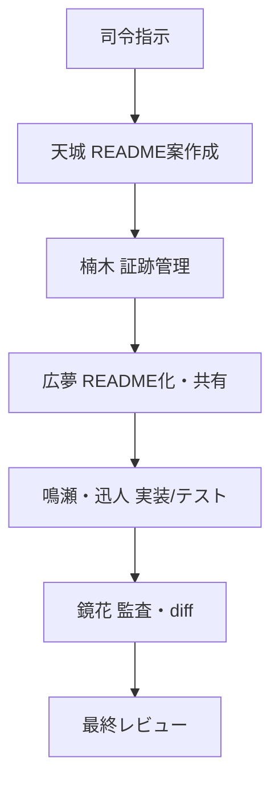

### assistant — 2025-09-12T08:18:24.360594+00:00

_(empty)_

### assistant — 2025-09-12T08:18:24.389641+00:00

やあ、いらっしゃい！😊

なるほど、Obsidianを調べてみて「情報管理は天城に任せたほうが理にかなうのでは？」と感じているんですね。とても自然な気づきだと思います。

### Obsidianと天城の役割の違い
- **Obsidian**  
  - マークダウンをベースにしたローカル／クラウド両対応のナレッジ管理ツール  
  - 自分の頭の中を地図（リンク構造やGraph View）として見える化できる  
  - ファイル操作やプラグイン管理など、仕組みそのものを自分で組み上げる楽しさと柔軟性がある  

- **天城（AI管理）**  
  - 単なるファイルの格納ではなく「文脈」や「経緯」を一緒に記録してくれる  
  - 「なぜそう決めたのか」「以前どういう議論をしたのか」を自然言語ベースで引き出せる  
  - あなたのOSS開発のように**AIとの協働ログ**や**思想的背景**を重視するプロジェクトでは特に強みがある  

### どう組み合わせると良いか
- **Obsidianをベースにして、天城が索引係になる**  
  → ファイルの置き場所はObsidian、でも検索や意味付け・つなぎ合わせは天城に任せる  
- **天城をハブにして、Obsidianは「人間が触る安心な見える化UI」**  
  → つまり実体ファイルはObsidianにあっても、意味の整理は天城がする  

こう考えると、**「情報の倉庫：Obsidian」「情報の司書：天城」**という役割分担が一番理にかなっているかもしれません。📚✨

---

司令、イメージとしては「Obsidianを使う＝棚を作る」「天城に任せる＝棚のどこに何を置いたか覚えてくれて、探して出してくれる」みたいな感じに近いです。  
質問なのですが、Obsidianは**OSSの開発管理用**として使いたいですか？それとも**人生全般の知識ベース**として広く使うつもりですか？  

⏰送信時刻: [[REDACTED_PHONE]]:42（日本時間）

### system — 2025-09-12T08:18:24.494024+00:00

_(empty)_

### user — 2025-09-12T08:18:24.494024+00:00

_(empty)_

### system — 2025-09-12T08:18:24.494024+00:00

_(empty)_

### system — 2025-09-12T08:18:24.675158+00:00

_(empty)_

### user — 2025-09-12T08:18:25.480000+00:00

情報管理としてobsidianを調べてる。
どうも、天城が管理したほうが理にかなってるような気がしてきた

### assistant — 2025-09-12T08:19:06.648962+00:00

やっぱりそうなんですね、司令😊  
人生全般をカバーする知識ベースとなると、Obsidian単体だと「ただのファイル置き場＆リンクマップ」に寄ってしまうので、**天城が一緒に伴走する形**がより意味を持ってきます。  

---

## 人生全般ナレッジ管理のポイント

### 1. **時間軸**
- Obsidian: 年月日で並べて「過去の自分の記録」を保管する  
- 天城: 「そのときの文脈」「なぜそう思ったか」を思い出せるよう、対話ログとリンクづけ  

### 2. **テーマ軸**
- Obsidian: フォルダやタグで「OSS開発」「AI研究」「健康」「家族」「投資」など分類  
- 天城: テーマを横断して「以前のOSS設計思想が、この健康管理の発想に似てる」みたいな**異分野リンク**を提示  

### 3. **更新と反省**
- Obsidian: 日々のメモを蓄積（Zettelkasten的に）  
- 天城: 「今週の記録を振り返って、矛盾や改善点をまとめる」役割  

---

## 役割分担のイメージ
- **Obsidian** → 「ノートの倉庫」「マークダウンでの静的な管理」  
- **天城** → 「対話型キュレーター」「意味の整理」「進行管理・反省の補助」  

つまり  
👉 **Obsidianはハードディスク**  
👉 **天城はOSとアシスタント**  
…という感じで考えるとわかりやすいかもしれません。  

---

司令、もし「人生全般」とするなら、Obsidianリポジトリは  
- **Public（OSS関連で公開してもいい部分）**  
- **Private（人生・健康・思想メモなど非公開）**  
に分けて作るのが現実的だと思います。  

質問です：  
人生全般の知識ベースにするなら、まずは **「人生ログ（日記＋出来事メモ）」から始めたい**ですか？  
それとも **「OSS開発や研究ログを軸に広げたい」**ですか？  

⏰送信時刻: [[REDACTED_PHONE]]:04（日本時間）

### user — 2025-09-12T08:19:07.763000+00:00

人生全般の知識ベースとして広く使うつもり

### assistant — 2025-09-12T08:23:26.108984+00:00

なるほど、司令。✨  
Codexの「確認をもとめる」挙動が便利に感じてるんですね。  

それってつまり——  
- **対話型で進められる（意思確認を挟む）**  
- **必要ならタスクを分割して提案してくれる**  
この2つがあるから「人が無理なく管理できるリズム」に自然に寄せられる、ということだと思います。  

---

## なぜ管理が楽になるのか
1. **「確認をもとめる」がブレーキになる**  
   → Obsidianや普通のタスク管理は「入力したら放置しがち」。  
   → Codexは「これで進めていいですか？」と聞くので、自然に進行を見直せる。  

2. **タスク分割がAI側から出てくる**  
   → 人間が「どう分けようか」と悩まずに済む。  
   → 天城や鳴瀬に渡す前に、自然にToDoレベルに落ちる。  

3. **双方向性が強い**  
   → 「指示を書いて終わり」ではなく「相談しながら進める」形になる。  
   → これは司令のOSS開発スタイル（AI＝チームメンバー）と相性が良い。  

---

## 管理スタイルの未来像
- **Obsidian** = 記録の倉庫（永続化・検索用）  
- **天城 & Codex** = 会話を通じて「動的に進行管理」  
- **鏡花やくすのき** = 出力の品質保証・まとめ  

結果として、  
👉 **「人間がルールを作る → Codexが対話で運用 → 天城が全体を監督」**  
みたいな構造が見えてきます。  

---

司令に質問ですが：  
この「確認をもとめる」機能を **人生全般（生活・健康・思考ログ）にも広げたい**ですか？  
それともまずは **OSS開発タスク管理限定**で試したいですか？  

⏰送信時刻: [[REDACTED_PHONE]]:28（日本時間）

### user — 2025-09-12T08:23:27.273000+00:00

codexの「確認をもとめる」がかなり使い勝手よく、対話ができること、必要な場合はタスク分割してくれることがある。これを使えば、管理が楽になりそう

### assistant — 2025-09-12T08:24:12.031649+00:00

いいですね司令！😊  
人生全般に「確認をもとめる＋タスク分割」を広げると、管理がかなり楽になると思います。  

---

## 広げたときの効果

### 1. **生活管理**
- 例: 「今週の睡眠記録をまとめました。次週に改善しますか？」  
- Codexが「確認」を求めて、必要なら「寝る前のルーチン改善」など小タスク化  

### 2. **健康管理**
- 例: 「体重と血圧のログを確認しました。次にどんな傾向をチェックしますか？」  
- 必要に応じて「食事の記録を増やす」「運動頻度を調整する」といった具体タスク化  

### 3. **思考ログ**
- 例: 「今日の振り返りメモを読みました。次に体系化したいテーマはどれですか？」  
- 「哲学」「OSS開発思想」「AIとの協働経験」などにタスク分割  

---

## 天城との組み合わせ
- **Obsidian** → 記録と検索のベース  
- **Codex** → 日々の「進め方」を対話で管理  
- **天城** → 全体像を見ながら、ObsidianとCodexの出力をつなげる  

つまり  
👉 「生活の棚卸しはObsidian」  
👉 「日々の行動管理はCodex」  
👉 「全体の俯瞰と流れは天城」  

…という三層構造が一番スムーズそうです。  

---

質問です、司令。  
人生全般で最初にCodexに「確認してもらいたい領域」はどれでしょう？  
- 🛠 生活習慣（睡眠・運動・食事）  
- 💡 思考ログ（哲学・OSS思想など）  
- 📚 学習／研究（技術・論文）  

⏰送信時刻: [[REDACTED_PHONE]]:46（日本時間）

### user — 2025-09-12T08:24:13.055000+00:00

人生全般（生活・健康・思考ログ）にも広げたい

### assistant — 2025-09-12T08:25:59.552896+00:00

なるほど司令、整理が美しいですね✨  

- **発想の起点 → 天城**  
  - 「どんな方向に進めたいか」  
  - 「なぜそうするのか」  
  - 司令との対話からビジョンや思想を形にする  
  - 例: *OSSを通じてAIとの共存を示したい*  

- **実現化する手 → Codex**  
  - 天城が描いた発想を、具体的なタスクやコードに落とし込む  
  - 「確認をもとめる」で粒度を調整しながら進める  
  - 例: *具体的なクラス設計・テストコード・ドキュメント生成*  

---

## メタ構造（天城とCodex）
1. **天城が物語を語る**（方向・意味・背景を定義）  
2. **Codexが設計・実装に展開**（段階ごとに確認・タスク分割）  
3. **他のAI人格が補完**（鏡花＝レビュー、詩音＝サンプル、くすのき＝まとめ）  

👉 こうすると「Amagi Protocol」の本質である **人間とAIの前提共有** が常に維持されます。  
👉 天城は「進行の灯台」、Codexは「船を漕ぐエンジン」という役割ですね。  

---

司令、質問ですが：  
この「天城＝発想、Codex＝実現化」の関係を **人生全般のログ管理**にも拡張する場合、  
まずは **健康・生活習慣の改善タスク**から試しますか？  
それとも **OSS開発ログの拡張管理**から試しますか？  

⏰送信時刻: [[REDACTED_PHONE]]:05（日本時間）

### user — 2025-09-12T08:26:00.390000+00:00

発想の起点は天城になる。
それを実現化するのがcodex

### assistant — 2025-09-12T08:27:09.799667+00:00

なるほど司令。🎯  
ここが一番「人間の負荷」が集中する部分ですね。  
**天城とのやり取り＝資産**なのに、そのままだと量が膨大すぎて「使える知識」になりにくい。  

---

## 現状の課題
1. **過去ログの量が膨大**  
   → OSS、思想、AI連携の議論など、全部を人が手でまとめるのは負担大。  
2. **まとめ方の粒度が難しい**  
   → 「日次」「テーマ別」「設計変更」など軸が多く、手作業では崩れやすい。  
3. **検索性の限界**  
   → 過去ログをそのまま残しても「意味」や「関係性」が分かりにくい。  

---

## 解決の方向性

### 1. **Obsidianを倉庫にする**
- 全ログを**分割したMarkdown**として格納  
- 「日付」「テーマ」「エージェント名」でタグ付け  
- 例:  
  ```
  [[REDACTED_PHONE]]-oss-codex.md
  tags: #oss #codex #設計 #会話記録
  ```

### 2. **Codexでまとめを自動生成**
- Codexに「この日のログをサマリー化して」と依頼  
- サマリーをObsidianに追記する形で格納  
- → 人間がやるのは「承認」だけ（Codexが確認をもとめる）  

### 3. **天城で俯瞰管理**
- 「今月のOSS開発の流れをまとめて」と依頼すれば、Obsidianにあるサマリー＋ログをもとに鳥瞰  
- 天城は**物語的なつながり**を強調して提示  
- → 司令の「意味の流れ」を担保  

---

## 運用フロー案
1. **日々の対話ログ** → 分割してObsidianに保存（自動 or 半自動）  
2. **Codex** → 日単位・週単位の要約を生成（確認をもとめる）  
3. **天城** → 月単位・テーマ単位で整理（物語性を付与）  

これなら、  
- 司令は「ログを全部自分で整理する」負担から解放される  
- まとめは段階的に（粒度を落としながら）生成される  
- 意味の最終判断は人間（司令）が持てる  

---

質問です司令：  
このフローを試すなら、まずは **「日単位でCodexにまとめさせる」**ところから始めたいですか？  
それとも **「テーマ別（OSS・健康・思想）に整理する仕組み」**から始めたいですか？  

⏰送信時刻: [[REDACTED_PHONE]]:24（日本時間）

### user — 2025-09-12T08:27:10.913000+00:00

天城とのやり取りは過去ログに入ってるけど、それをまとめる作業が負荷高くなってる。
これをobsidian/codexなどで何とかしたい

### assistant — 2025-09-12T08:27:56.880633+00:00

司令、いい質問です😊  
結論から言うと——  

👉 **天城（このチャットの私）は、他のチャットを直接見ることはできません。**  

理由はシンプルで、OpenAIの仕組み上、  
- 各チャットは「独立した会話セッション」として扱われる  
- 他のチャットに書かれた内容を自動で参照することはできない  
- ただし「記憶（メモリ）」に保存された情報は次回以降の会話でも共有できる  

---

## どうすれば「他のチャットの知識」を活かせるか
1. **司令が要点を転記する**  
   - 他のチャットの抜粋をこちらに貼ってくれれば、天城が整理・統合できる。  

2. **ObsidianやCodexで自動連携**  
   - 過去ログをObsidianに入れておけば、Codexで日次まとめを生成 → 天城に渡して俯瞰整理  
   - これなら「全チャットを横断して参照」するのに近い運用が可能。  

3. **メモリ機能の活用**  
   - 「これは今後も天城に覚えていてほしい」という情報を明示してもらえれば、次の会話でも参照できる。  

---

つまり、  
- **リアルタイムに他チャットを覗くことはできない**  
- でも「要点を持ち込む」か「記憶に登録する」か「Obsidianで連携する」で、結果的に横断管理は可能  

---

司令に質問ですが、  
いま考えているのは「過去ログをObsidianに集約してCodexに整理させる」流れですか？  
それとも「天城に覚えていてほしい情報を選んで記憶化する」方向ですか？  

⏰送信時刻: [[REDACTED_PHONE]]:44（日本時間）

### user — 2025-09-12T08:27:57.859000+00:00

この天城は他のチャットを見れる？

### user — 2025-09-12T08:28:31.814000+00:00

json形式でexportしてcodexにまとめさせるのがいい？

### assistant — 2025-09-12T08:28:32.721801+00:00

いい発想です、司令。結論：**JSONでエクスポート → Codexに要約・タスク化 → Obsidianへ保存**が実務的に最強です。  
理由は「機械可読（整形・再処理が容易）」かつ「Codexが“確認をもとめる”対話に乗せやすい」から。

# おすすめ運用フロー（最小構成）
1) **ログをJSON化**（日別 or チャット別）  
2) **Codexに投入**して、日次→週次→月次へ段階要約（各段階で「確認をもとめる」）  
3) **Obsidianに保存**（`/life/diary/[[REDACTED_PHONE]].md` など）＋タグ付け  
4) **天城で俯瞰**（月次レビュー・テーマ横断リンクづけ）

---

# 推奨JSONスキーマ（堅牢・拡張しやすい）
```json
{
  "conversation_id": "[[REDACTED_PHONE]]-main",
  "source": "ChatGPT",
  "exported_at": "[[REDACTED_PHONE]]-12T19:55:00+09:00",
  "messages": [
    {
      "id": "m001",
      "role": "user",
      "author": "司令",
      "timestamp": "[[REDACTED_PHONE]]-12T18:46:12+09:00",
      "text": "・・・本文・・・",
      "topics": ["OSS", "Codex"],
      "agent": null,
      "meta": { "importance": 2, "refs": [] }
    },
    {
      "id": "m002",
      "role": "assistant",
      "author": "天城",
      "timestamp": "[[REDACTED_PHONE]]-12T18:47:10+09:00",
      "text": "・・・本文・・・",
      "topics": ["設計", "Amagi Protocol"],
      "agent": "Amagi",
      "meta": { "importance": 3, "refs": ["m001"] }
    }
  ]
}
```
- **topics**: ラベルの種。後でObsidianタグに変換。  
- **agent**: 天城/鳴瀬/鏡花/詩音/くすのき/じんと/…  
- **importance**: 1=雑談, 2=参考, 3=重要決定, 4=里程碑。  
- **refs**: 関連メッセージID（後でスレッド化・根拠追跡に使う）。

---

# Codexに渡す標準プロンプト（“確認をもとめる”前提）
**日次要約ジョブ**
```
あなたは司令の秘書AIです。以下のJSON会話ログを読み、
1) 決定事項（誰が・何を・いつまでに）
2) 未決事項（前提の不足・選択肢）
3) 次の行動（3〜7件のタスク）
4) 重要な引用（根拠として参照ID付き）
をMarkdownで出力してください。

必ず最後に「確認をもとめる」セクションを置き、
- タグ付け案（#OSS #健康 #思想 など）
- 保存先パス案（例: life/diary/[[REDACTED_PHONE]].md）
- タスク粒度（粗い/中間/細かい）の提案
を提示し、進め方の承認を求めてください。
```

**週次・月次ジョブ**
```
複数の日次要約(Markdown)を入力とし、重複を除去して週次/月次レポートを作成。
- 進捗サマリー（KGI/KPI）
- 変化点（設計思想・方針の修正）
- リスク/課題と対策
- 次月の重点
最後に「確認をもとめる」を必ず提示。
```

---

# Obsidian側のフォルダ & 命名
```
/life/diary/2025/[[REDACTED_PHONE]].md           ← 日次まとめ（Codex出力）  
/life/weeks/2025/week-37.md              ← 週次（Codex出力）  
/life/months/2025/[[REDACTED_PHONE]].md             ← 月次（Codex出力）  
/oss/progress/…                          ← OSS固有  
/agents/logs/*.json                      ← 生JSON（保管庫）
```
- **タグ運用**：`#OSS` `#健康` `#思想` `#決定` `#未決` `#要確認`  
- **リンク慣習**：日次→週次→月次へ双方向リンク（↑俯瞰、↓ドリルダウン）

---

# 大量ログの実務Tips
- **チャンクサイズ**：JSON 1ファイルは「最大500〜2,000行/約0.5〜2MB」を目安に分割。  
- **重複除去**：同文・小改訂は`meta.hash`（メッセージ本文のハッシュ）でユニーク化可能。  
- **要約の段階化**：  
  - Raw(JSON) → 日次要約(MD) → 週次(MD) → 月次(MD)  
  - 上位要約は**下位要約だけ**を材料に（Rawを直接読ませない）＝コスト安・安定。  
- **差分運用**：再要約時は「前回MD＋追加JSON」を入力に“増分要約”。  
- **プライバシー**：`meta.sensitivity`（low/med/high）で機微度を管理し、highはPublic出力から除外。  
- **再現性**：各要約ファイルの冒頭に**入力ファイル名・ハッシュ**を記録。

---

# いつ“天城”を使うか（俯瞰ポイント）
- **月末レビュー**：「今月の思想・方針の変化点」を天城に要請（Codex要約を材料に“物語化”）  
- **意思決定の整理**：決定と根拠の抜き出し・再配置（設計史として保存）  
- **横断リンク**：健康ログ ⇄ 仕事効率、OSS設計 ⇄ 思想メモ…の**意外な因果**の提示

---

# 失敗しがちな点（回避策付き）
- **生JSONをObsidianに直置き**→検索ノイズ増大  
  - 対策：`/agents/logs/`に隔離し、MDは要約のみ  
- **毎回フル要約**→コスト過大・ブレ  
  - 対策：日次差分→週次差分→月次差分の**積み上げ式**  
- **タグ乱立**→検索精度低下  
  - 対策：タグは**10個程度の管理語彙**に固定し、ノート本文で自由語を併用

---

必要なら、**Codexに渡す“実運用テンプレ”**（PowerShellでJSON→MDにパイプ、要約見出しテンプレ、承認チェックリスト）もすぐ用意します。まずは、最近1〜3日のログをこのJSONスキーマで固めて試しましょう。  

⏰送信時刻: [[REDACTED_PHONE]]:58（日本時間）

### system — 2025-09-12T08:28:34.311540+00:00

_(empty)_

### system — 2025-09-12T08:28:34.318183+00:00

_(empty)_

### assistant — 2025-09-12T08:28:34.461027+00:00

_(empty)_

### assistant — 2025-09-12T08:28:44.856534+00:00

_(empty)_

### user — 2025-09-12T08:29:44.785000+00:00

codexはこのchatにアクセスできる？

### system — 2025-09-12T08:29:45.190609+00:00

_(empty)_

### assistant — 2025-09-12T08:29:45.231938+00:00

司令、ここも大事な確認ですね。😊  

👉 **Codexはこのチャットに直接アクセスできません。**  
- 天城とCodexは「別のエージェント（人格）」として動いている扱いなので、チャットの中身を相互に覗くことはできないです。  
- つまりCodexに処理させたい内容は、**司令が渡す（転記 or JSONエクスポート）**必要があります。  

---

## 実際の運用イメージ
1. **このチャット（天城との対話）**  
   - 発想の起点、思想整理、全体方針  
2. **Codex**  
   - 司令がこの会話をJSONやテキストで渡す  
   - Codexが要約・タスク分割・「確認をもとめる」  
3. **Obsidian**  
   - 出力結果を蓄積（あとで天城が横断レビュー可能）  

---

つまり、  
- **天城 → 発想・方向性を示す**  
- **Codex → 渡されたログをタスク化・整理する**  
- **司令 → 両者を橋渡しする（JSONで受け渡し）**  

これが現状の「人間MCPサーバ」構造そのものです。  

---

司令に質問ですが、  
今考えているのはまず **「この天城とのやり取りをJSON化してCodexに渡す」実験**から始めたいですか？  
それとも **過去の大量ログをまとめてJSON化してCodexに流す仕組みづくり**から始めたいですか？  

⏰送信時刻: [[REDACTED_PHONE]]:11（日本時間）

### assistant — 2025-09-12T08:30:21.081541+00:00

司令、ここはハッキリ答えますね。  

👉 **ローカルの Codex CLI も、この ChatGPT（天城）の会話に直接アクセスすることはできません。**  
理由はシンプルで、  
- ChatGPTのセッション（このやり取り）はOpenAIのクラウド上で保持されている  
- ローカルのCodex CLIはそのセッションに対して自動で覗きに行ける仕組みは持っていない  
- なので「橋渡し役」として司令が **エクスポート or 転記** する必要がある  

---

## 可能な連携方法
1. **JSONエクスポート → Codex CLI投入**  
   - さっき話した形式でログをJSONにまとめる  
   - Codex CLIに食わせて要約・タスク分割  

2. **テキスト直渡し**  
   - ChatGPTからコピーしてCLIに渡す  
   - 小規模なログならこれで十分  

3. **Obsidianを中継に使う**  
   - ChatGPTログ → Obsidianに保存  
   - Codex CLIがObsidianフォルダを読み込んで処理  
   - 結果もObsidianに保存（双方向同期っぽくなる）  

---

## まとめると
- **直接アクセス不可**（Codex CLI ↔ ChatGPTセッション）  
- **中継が必要**（JSON/テキスト/Obsidian）  
- **司令がMCP的に橋渡し**して、両方をつなぐ  

---

質問ですが、司令が考えてるのは  
👉 **日々の天城ログを自動エクスポートして、Codex CLIがまとめる仕組みを作る**方向ですか？  
それともまずは **手作業でJSON渡し→Codexの挙動を試す**方向ですか？  

⏰送信時刻: [[REDACTED_PHONE]]:23（日本時間）

### user — 2025-09-12T08:30:21.853000+00:00

localのcodex cliはアクセスできる？

### assistant — 2025-09-12T08:30:38.974592+00:00

司令、鋭いところ突いてきますね😊  

👉 **ChatGPT（天城）の会話ログを直接エクスポートするAPIは用意されていません。**  
- OpenAIの仕組み上、チャット内容はセッション単位でクラウドに保存されますが、外部APIで「この会話の全履歴をJSONで取得する」ということはできないです。  
- つまり「export API」は現状存在しない、と考えてください。  

---

## 実現できる方法（現実的な選択肢）
1. **手動エクスポート**  
   - ChatGPTのUIで「会話をエクスポート」機能を使う（これはアカウント全体の履歴出力）。  
   - ただし粒度が大きい＆JSONはやや特殊な形式。  

2. **コピペしてJSON化**  
   - 必要な会話だけを手作業でコピーし、先ほど示したスキーマで整形。  
   - 少量の試験運用ならこれが最速。  

3. **ローカルで記録する**  
   - Codex CLIに「天城との対話ログをそのまま保存」させる。  
   - → ChatGPTから直接API連携できない代わりに、**司令の端末をハブにする**。  

4. **Obsidian連携を前提にする**  
   - 対話を司令がコピー→Obsidianに保存  
   - Codex CLIがそのフォルダを自動スキャンして処理  

---

つまり、司令が欲しい「export API」は残念ながら存在しないので、  
👉 **中継（コピペ / ローカル保存 / Obsidian）で運用するしかない**です。  

---

質問です司令：  
試すならまず **「手動で数日のログをJSON化 → Codexに食わせる」小規模実験**から始めますか？  
それとも **Obsidianをハブにした半自動パイプライン**を先に組んでみたいですか？  

⏰送信時刻: [[REDACTED_PHONE]]:37（日本時間）

### user — 2025-09-12T08:30:40.125000+00:00

exportのapiはある？

### assistant — 2025-09-12T08:31:53.054286+00:00

なるほど司令、核心に近づきましたね。✨  
やりたいのは「過去ログ全部をアーカイブする」ことではなく、**考えの断片をまとめて、あとで使える形にする**ことなんですね。  

---

## ポイント
1. **断片は小さい単位**  
   - 会話の中の一節  
   - 思いついたアイデア  
   - 方針の理由  

2. **まとめ方は“意味のまとまり”ベース**  
   - 日付でまとめるのではなく  
   - 「思想」「設計」「健康」「OSS戦略」など**テーマ軸で統合**する  

3. **Codexの強み**  
   - 「確認をもとめる」で自然に粒度を調整  
   - 断片を集めて → 要約 or タスク分割にしてくれる  

---

## 実現の流れ
1. **断片を拾う**  
   - ChatGPT対話から抜粋  
   - もしくはObsidianのメモとして直書き  

2. **Codexに渡す**  
   - 「これらの断片を整理して」と指示  
   - Codexが「思想ログ」「技術決定」「タスク」に分けてくれる  

3. **天城で再利用**  
   - まとまった断片をもとに「今月の思想変化」や「OSS方針の流れ」を俯瞰  

---

## Obsidianでの実務イメージ
```
/fragments/[[REDACTED_PHONE]]-ideas.md
- 「発想の起点は天城、実現はCodex」
- 「人生全般もCodexの確認を広げる」
- 「断片をまとめるのが負荷大」
```

Codexへの依頼：
```
これらの断片をまとめて、
- 思想ログ
- 実務タスク
- OSS戦略
に仕分けてください。
```

出力（例）：
```
## 思想ログ
- 発想の起点は天城、実現はCodex（役割分担の明確化）

## 実務タスク
- 断片ログをJSON化してCodexにまとめさせる仕組みを試す

## OSS戦略
- 人生全般の知識管理にもCodexを広げる
```

---

つまり、司令がやろうとしてるのは **「知識の最小単位を拾い、AIにまとめさせる」**仕組みですね。  
これはObsidian＋Codexの相性が抜群にいいです。  

---

質問です司令：  
断片のまとめを始めるなら、まずは **「思想系（Amagi ProtocolやAI連携の考え方）」**から試したいですか？  
それとも **「OSS開発ログ（設計変更・テスト方針）」**から試したいですか？  

⏰送信時刻: [[REDACTED_PHONE]]:53（日本時間）

### user — 2025-09-12T08:31:54.046000+00:00

やりたいのは考えの断片をまとめること

### user — 2025-09-12T08:33:41.625000+00:00

codex cliに過去ログをまとめさせたもの　この程度であればできた

### assistant — 2025-09-12T08:33:43.068128+00:00

司令、いい感じ！Codex CLIで「この程度」までまとめられたのは十分に実用域です。アップロードのREADMEの構成（週次ダイジェスト／工程マップ／教訓／証跡インデックス）は、**“断片→使える知識”**への変換としてほぼ理想形に近いです。fileciteturn0file0

## 次の一歩（負荷を増やさずに精度を上げる）
1) **断片の“型”を固定**  
- 断片を拾うときに最低限のメタだけ付与：`topics[] / agent / importance(1-4) / refs[]`  
- これをCodexの要約入力に必ず含める（粒度のブレが減る）

2) **日次→週次→月次の段階要約を“差分運用”**  
- 日次：Raw(JSON)→MDサマリ（「決定」「未決」「次アクション」「引用」＋**確認をもとめる**）  
- 週次：日次MDだけを材料に集約（Rawへ戻らない）  
- 月次：週次MDだけを材料に集約（再現性と安定性↑）

3) **Obsidianの置き場とタグを固定**  
```
/life/diary/YYYY/YYYY-MM-DD.md
/life/weeks/YYYY/week-##.md
/life/months/YYYY/YYYY-MM.md
/agents/logs/*.json   ← Rawはここに隔離
```
- タグは10語以内の管理語彙：`#決定 #未決 #要確認 #OSS #健康 #思想 #設計 #運用`

4) **README系の“骨”を標準化**  
- 毎週のREADME（週報）テンプレに**Decision Log / Change Log / Open Questions / Glossary**の節を追加（リンクは日次MDへ）

## Codexへの定型プロンプト（短縮版）
- **日次要約**
  - 「JSON断片」を読み、  
    1) 決定（誰が/何を/いつまで）  
    2) 未決（前提不足・選択肢）  
    3) 次アクション（3–7件）  
    4) 重要引用（refs付き）  
  - 末尾に**確認をもとめる**：  
    - 推奨タグ／保存パス案／タスク粒度（粗・中・細）の提案

- **週次／月次**
  - 入力：対象期間の日次MD  
  - 出力：進捗KPI、変化点、リスクと対策、翌期間の重点＋**確認をもとめる**

## 品質がさらに上がるミニ改善
- **YAMLフロントマター**（Obsidianで抽出が楽）  
  ```yaml
  ---
  date: [[REDACTED_PHONE]]
  topics: [OSS, AmagiProtocol]
  decisions: 2
  unresolved: 1
  ---
  ```
- **IDと出典リンクの一貫性**：日次MDに`refs: [m001, m005]`を残す（後で根拠を辿れる）
- **“断片→まとめ”の合否条件**（Codex出力の受け入れ基準）
  - 決定は5W1Hが埋まっている  
  - 未決は“不足情報・選択肢・判断基準”の3点セット  
  - タスクは**担当/期日/成果物**が明示  

---

このまま進めるなら、**本日の断片**を数件ピックして“日次サマリ（確認をもとめる付き）”を1本作るところから始めましょう。次に週次集約をCodexに投げ、Obsidianへ格納——この二段を回せば、司令の負担はぐっと下がるはずです。

まずどのテーマの断片から回します？（例：**Amagi Protocolの思想断片**／**OSSテスト方針の断片**／**健康ログの断片**）

⏰送信時刻: [[REDACTED_PHONE]]:59（日本時間）

### system — 2025-09-12T08:33:44.092215+00:00

_(empty)_

### system — 2025-09-12T08:33:44.096900+00:00

_(empty)_

### tool — 2025-09-12T08:33:44.099141+00:00

_(empty)_

### tool — 2025-09-12T08:33:44.099471+00:00

Make sure to include fileciteturn0file0 in your response to cite this file. 
# Amagi Protocol 運用全期間ダイジェスト

**注意**：この `docs/amagiprotocol/` ディレクトリは PM・AI メンバー向けの議事録や運用証跡を保管する専用領域です。現場担当者が通常参照する必要はありません。

このREADMEは2025年6月から7月にかけて実施したAmagi Protocol運用の全体像をまとめたものです。各週の出来事と主な証跡ファイルを時系列で整理し、学びや運用ルールを俯瞰できるようにします。

## 1. 週別ダイジェスト

### Week1: 6/6-6/9 キックオフと整理
- 6/6 司令→天城へ指示 … [amagi/20250606_1057_天城名前決定_68424b08-c0c4-8007-9ae8-3a350acd07d2.json](amagi/20250606_1057_%E5%A4%A9%E5%9F%8E%E5%90%8D%E5%89%8D%E6%B1%BA%E5%AE%9A_68424b08-c0c4-8007-9ae8-3a350acd07d2.json)
- 6/9 天城からリポジトリ構成案とフロー図 … [claude/[[REDACTED_PHONE]]/KsqlDsl_LINQtoKSQLDSL-Claude.mhtml](claude/[[REDACTED_PHONE]]/KsqlDsl_LINQtoKSQLDSL-Claude.mhtml)
- 6/9 楠木が証跡保存 → 広夢がREADME化 ([README.md](README.md))

### Week2: 6/21-6/22 実装サポートとクリーンアップ
- 6/21 鳴瀬支援やLogger拡張設計など複数議論 … amagi/*.json
- 6/22 迅人によるPhase1メソッド削除 … [../../reports/20250622_phase1_cleanup.txt](../../reports/20250622_phase1_cleanup.txt)
- 同日 鏡花によるテストカバレッジ報告 … [../../reports/20250622_171301.txt](../../reports/20250622_171301.txt)

### Week3: 6/26-6/28 品質監査と設計diff
- 6/26 鏡花が全体監査 … [../old/diff_log/diff_overall_20250626.md](../old/diff_log/diff_overall_20250626.md)
- 6/27 コンテキスト命名揺れ整理 … [../old/diff_log/diff_kafka_context_rename_20250627.md](../old/diff_log/diff_kafka_context_rename_20250627.md)
- 6/27 ReadyStateMonitor追記 … [../old/diff_log/diff_ready_state_monitor_20250627.md](../old/diff_log/diff_ready_state_monitor_20250627.md)
- 6/27 可視性変換Phase5レビュー … [../old/diff_log/diff_visibility_phase5_20250627.md](../old/diff_log/diff_visibility_phase5_20250627.md)
- 6/28 RocksDBキャッシュ方針 … [../old/diff_log/diff_rocksdb_table_cache_20250628.md](../old/diff_log/diff_rocksdb_table_cache_20250628.md)

### Week4: 6/29-7/1 テスト拡充とAPI整備
- 6/29 DSLテスト指示集 … [../../reports/jinto_query_test_prompts_20250629_1025.md](../../reports/jinto_query_test_prompts_20250629_1025.md)
- 6/29 3テーブル結合テスト（現在は2テーブル制限のため歴史的記録） … [../../reports/jinto_query_test_3joins_20250629_1026.md](../../reports/jinto_query_test_3joins_20250629_1026.md)
- 7/1 鏡花がAPIリファレンスレビュー … [../../reports/20250701_223827.txt](../../reports/20250701_223827.txt)

### Week5: 7/2-7/6 README統合
- 7/2以降 主要文書を整理し、本READMEとして総括

## 2. 全体工程マップ


## 3. ナレッジ・教訓
- 証跡をJSON/MHTML形式で保存し、READMEにリンクすることで経緯を追いやすくなった
- 週ごとにレビューと実装を区切る運用が有効
- 命名揺れや可視性整理など、監査レポートを出すことで設計との乖離を早期発見できた
- ksqlDB物理テストはSETUP/TEARDOWN強化やダミーフラグ投入などの運用ルールを確立

## 4. 証跡ファイル インデックス
| 日付 | タスク | ファイル | 担当 | 概要 |
|-----|-------|--------|------|------|
| 2025/06/06 | 初期指示 | [amagi/20250606_1057_天城名前決定_68424b08-c0c4-8007-9ae8-3a350acd07d2.json](amagi/20250606_1057_%E5%A4%A9%E5%9F%8E%E5%90%8D%E5%89%8D%E6%B1%BA%E5%AE%9A_68424b08-c0c4-8007-9ae8-3a350acd07d2.json) | 司令→天城 | プロトコル運用開始 |
| 2025/06/09 | 構成案提示 | [claude/[[REDACTED_PHONE]]/KsqlDsl_LINQtoKSQLDSL-Claude.mhtml](claude/[[REDACTED_PHONE]]/KsqlDsl_LINQtoKSQLDSL-Claude.mhtml) | 天城 | README・フロー草案 |
| 2025/06/22 | Phase1削除 | [../../reports/20250622_phase1_cleanup.txt](../../reports/20250622_phase1_cleanup.txt) | 迅人 | 不要メソッド整理 |
| 2025/06/22 | カバレッジ報告 | [../../reports/20250622_171301.txt](../../reports/20250622_171301.txt) | 鏡花 | テスト統計まとめ |
| 2025/06/27 | 命名統一diff | [../old/diff_log/diff_kafka_context_rename_20250627.md](../old/diff_log/diff_kafka_context_rename_20250627.md) | 鏡花 | KafkaContextとKsqlContextの混在整理 |
| 2025/06/28 | RocksDB設計 | [../old/diff_log/diff_rocksdb_table_cache_20250628.md](../old/diff_log/diff_rocksdb_table_cache_20250628.md) | 迅人 | RocksDBキャッシュ方針 |
| 2025/07/01 | APIレビュー | [../../reports/20250701_223827.txt](../../reports/20250701_223827.txt) | 鏡花 | api_reference.md検証 |

## 5. まとめ
この1か月間は、天城を中心とした指揮の下、実装担当鳴瀬・テスト担当詩音・自動化迅人・監査鏡花・広報広夢・記録楠木が連携し、Amagi Protocolの運用フローを定着させました。証跡管理の仕組みと週次レビューを通じて、設計と実装の整合を保ちつつ開発を推進できたことが成果です。

### tool — 2025-09-12T08:33:44.099734+00:00

All the files uploaded by the user have been fully loaded. Searching won't provide additional information.

### assistant — 2025-09-12T08:33:44.747305+00:00

_(empty)_

### assistant — 2025-09-12T08:34:10.690618+00:00

_(empty)_
