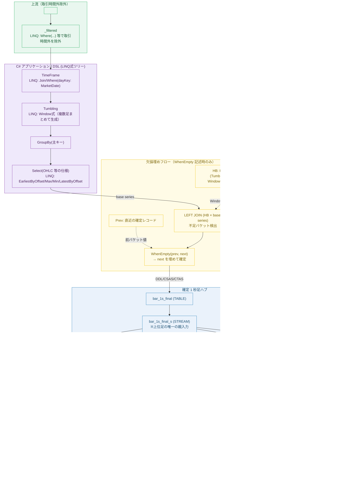

### user — 2025-09-12T22:41:14.318000+00:00

{'content_type': 'image_asset_pointer', 'asset_pointer': 'file-service://file-UDGpMYLED1y54A1Uputk7p', 'size_bytes': 41657, 'width': 738, 'height': 619, 'fovea': None, 'metadata': {'dalle': None, 'gizmo': None, 'generation': None, 'container_pixel_height': None, 'container_pixel_width': None, 'emu_omit_glimpse_image': None, 'emu_patches_override': None, 'lpe_keep_patch_ijhw': None, 'sanitized': True, 'asset_pointer_link': None, 'watermarked_asset_pointer': None}}
このMDの仕組みを
こんな図にして

### assistant — 2025-09-12T22:41:16.498001+00:00

_(empty)_

### system — 2025-09-12T22:41:16.723803+00:00

_(empty)_

### user — 2025-09-12T22:41:16.723803+00:00

_(empty)_

### system — 2025-09-12T22:41:16.723803+00:00

_(empty)_

### system — 2025-09-12T22:41:16.731056+00:00

_(empty)_

### tool — 2025-09-12T22:41:16.737703+00:00

_(empty)_

### tool — 2025-09-12T22:41:16.774437+00:00

Make sure to include `【message_idx†source】` markers to provide citations based on this file, where [message_idx] is provided at the beginning of this message
# 足生成 DSL ガイド（日本語整理版）

このドキュメントは「何ができるか」→「どう動くか」→「何に注意するか」の順で、足生成 DSL の全体像をわかりやすく説明します。

できること
- Tick（レートやトレード）から、秒/分/時間/日/週/月の足を生成できる
- 1 つのクエリで複数のタイムフレーム（例: 1m/5m/1h/1d）をまとめて宣言できる
- MarketSchedule（営業日カレンダー）で日/週の境界を安定させられる
- Table は RocksDB にマテリアライズされ、`ToListAsync()` で素早く参照できる

---

## 1. 全体像（まずここだけ読む）

処理フロー（上から下へ）
- 入力: 取引時間外を除いたストリーム（例: `<raw>_filtered`）
- スケジュール結合: `TimeFrame<MarketSchedule>(…, dayKey: …)` で「取引時間内だけ」を選び、日/週の境界を固定
- 窓生成: `Tumbling(r => r.Timestamp, Windows{…}, grace: …)` で複数足を一括生成
- 集計: `GroupBy(...).Select(...)` に書いた集計（例: OHLC）が、そのまま仕様になる
- 欠損埋め（任意）: 連続化が必要な場合だけ `WhenEmpty` を書く
- 出力: 実行側プロファイルで live/final の物理化・命名を決める（DSL には出ない）

要点（前提）
- すべての上位足は 1s_final からフラットに派生します（5m→15m の多段は使用しません）。
- grace は「親 + 1 秒」で段階的に増やします（遅延到着を確実に取り込みます）。
- Table は Streamiz により RocksDB へマテリアライズされ、`ToListAsync()` で参照できます。

最小の書き方（順番）
- TimeFrame → Tumbling → GroupBy → Select →（必要なら）WhenEmpty

構成の順番
- TimeFrame → Tumbling → GroupBy → Select →（必要なら）WhenEmpty

ポイント
- TimeFrame: 営業時間の拘束が必要なときだけ。日足以上は `dayKey` を付ける
- Tumbling: minutes/hours/days/months をまとめて指定できる
- GroupBy: 主キー（例: Broker, Symbol）
- Select: 集計仕様そのもの（ここに書いた内容が真実）
- WhenEmpty: 欠損埋めをしたいときだけ書く

## 2. 処理の詳細（ここから深掘り）

### 2.1 TimeFrame と dayKey（営業日の境界）
```csharp
.TimeFrame<MarketSchedule>((r, s) =>
       r.Broker == s.Broker
    && r.Symbol == s.Symbol
    && s.Open <= r.Timestamp && r.Timestamp < s.Close,
    dayKey: s => s.MarketDate)
```
運用のコツ
- スケジュール判定は上流で実施します（例: `<raw>_filtered` を作成して参照します）。
- `dayKey` は「日/週/月などの境界を安定させる」ためのマーカーです。
- 分/時間足では原則不要です（指定しても構いません）。

### 2.2 Tumbling（複数足をまとめて宣言）
```csharp
.Tumbling(r => r.Timestamp, 
    Minutes = new[]{ 5, 15, 30 },
    Hours   = new[]{ 1, 4, 8 },
    Days    = new[]{ 1, 7 },
    Months  = new[]{ 1, 12 }
, grace: TimeSpan.FromMinutes(2))
```
使いどころ
- 1 回の宣言で複数の足をまとめて指定できます。
- grace は実行側の解釈に委ねます（内部では「親 + 1 秒」で伝播します）。
- 中間足や BaseUnit は非公開です（利用者が意識する必要はありません）。

### 2.3 GroupBy（主キー）
```csharp
.GroupBy(r => new { r.Broker, r.Symbol })
```
主キーの考え方
- GroupBy キー + バケット列（WindowStart）が主キーになります。

### 2.4 Select（投影＝仕様）
```csharp
.Select(g => new {
    g.Key.Broker,
    g.Key.Symbol,
    g.WindowStart(),                    // ← バケット列（“式”で認識、列名は任意）
    Open  = g.EarliestByOffset(x => x.Bid),
    High  = g.Max(x => x.Bid),
    Low   = g.Min(x => x.Bid),
    Close = g.LatestByOffset(x => x.Bid)
})
```
作るときの注意
- `g.WindowStart()` を必ず 1 回投影してください（列名は任意、式で識別します）。
- OHLC などの定義はアプリ側で明示してください（固定ではありません）。
- 派生段の投影は SELECT *（恒等）です。列名の固定や属性依存は行いません。

### 2.5 WhenEmpty（必要なときだけ・欠損埋め）
```csharp
.WhenEmpty((previous, next) =>
{
    next.Broker = previous.Broker;
    next.Symbol = previous.Symbol;
    next.Open   = previous.Close;
    next.High   = previous.Close;
    next.Low    = previous.Close;
    next.Close  = previous.Close;
    return next;
})
```
ポイント
- WhenEmpty を記述したときだけ「連続化モード」になります（HB + LEFT JOIN + Fill）。
- 記述しなければ疎のままです（デンス化しません）。
- 欠損埋めの結果を上流（final）へ戻さないでください（循環禁止）。

### 2.6 Table キャッシュと ToListAsync（RocksDB）
- Table は Streamiz により RocksDB にマテリアライズされます（StateStore）。
- `ToListAsync()` は「RUNNING 待ち → ストア全件列挙」を実行します。
- 前方一致フィルタは「NUL 区切りの文字列キー」で実現します。
- 伝達時間の目安は、通常 50〜200ms、起動直後は 0.5〜3 秒です（環境依存）。
- Stream ソースは `ToListAsync()` 非対応です（Push 購読を使用します）。

---

## 3. 内部の前提（知っておくと安心）
- 1s ハブ（= 1s_final）からフラットに派生します（5m→15m の多段は禁止です）。
- BaseUnitSeconds は 60 の約数のみ有効です（内部で自動展開します）。
- WindowStart は式で識別します（列名には依存しません）。
- 実行モードや物理名はプロファイル側で決定します（DSL では非公開です）。
- 欠損埋めの循環は禁止です（下流→上流へ戻しません）。
- grace は「親 + 1 秒」で階段的に伝播します。


---

## 4. バリデーション（自動チェック）
- BaseUnitSeconds は 60 の約数
- ウィンドウは BaseUnitSeconds の倍数（1m 以上は分の整数倍）
- grace は「親+1秒」を満たす
- よくあるエラー
  - Base unit must divide 60 seconds.
  - Windows ≥ 1 minute must be whole-minute multiples.
  - Windowed query requires exactly one WindowStart() in projection.

---

## 5. 代表シナリオ（複数足を一括生成）
- 秒/分/時間/日/月を一括宣言（1s_final ハブに一本化）
- 欠損埋めが必要な時だけ WhenEmpty を付ける

---

## 6. 拡張ポイント
- Aggregation Policy（例: VWAP, Volume, Trades）
- MarketSchedule（dayKey = MarketDate など）
- 命名/物理化は実行プロファイルで管理（DSL には出さない）

---

## 7. テストの観点（サクッと）
- `WindowStart()` が1回だけ含まれるか
- バリデーション（BaseUnit、倍数、分単位、循環検出）
- 合成ロジックの一貫性（1m→上位）
- 日足以上は dayKey の境界そろえ

---

## 8. 禁則（NG 集）
- `.EmitChanges()` / `.AsFinal()` など内部モードを匂わせない
- `.ToSink("…")` など物理名を DSL に露出しない
- 5m→15m の多段ロールアップは禁止（常に 1s_final から）
- 確定系列に Hopping を混在させない（速報系は別DAGに）

## 9. 命名規約（覚えどころ）

- **テーブル/トピック名**: `<entity>_<timeframe>_(live|final)`
  - 例: `bar_1s_final`, `bar_1m_live`, `bar_5m_live`, `bar_1d_live`
  - timeframe: `s`=秒, `m`=分, `h`=時間, `d`=日, `mo`=月
  - live/final: 集計モードの明示
  - filteredraw/nontrading_raw: `<raw_stream>_filtered` を参照（生成は上流責務）
- 1s_final は全上位足の唯一の親

1s_final / 1s_final_s（役割）
- 1s_final: EMIT FINAL の 1 秒確定足（TABLE）
- 1s_final_s: 1s_final を STREAM 化した入力専用の親
- ルール: 上位足は常に `<entity>_1s_final_s` を入力にする

---

## 10. 付録: 最小サンプル（コピペで雰囲気を掴む）
```csharp
EventSet<Rate>()
  .From<DeDupRates>()
  .ToQuery(q => q
    .TimeFrame<MarketSchedule>((r, s) =>
           r.Broker == s.Broker
        && r.Symbol == s.Symbol
        && s.Open <= r.Timestamp && r.Timestamp < s.Close,
        dayKey: s => s.MarketDate)

    .Tumbling(r => r.Timestamp, new Windows {
        Minutes = new[]{ 5, 15, 30 },
        Hours   = new[]{ 1, 4, 8 },
        Days    = new[]{ 1, 7 },
        Months  = new[]{ 1, 12 }
    }, grace: TimeSpan.FromMinutes(2))

    .GroupBy(r => new { r.Broker, r.Symbol })

    .Select(g => new {
        g.Key.Broker,
        g.Key.Symbol,
        g.WindowStart(),
        Open  = g.EarliestByOffset(x => x.Bid),
        High  = g.Max(x => x.Bid),
        Low   = g.Min(x => x.Bid),
        Close = g.LatestByOffset(x => x.Bid)
    })

    //.WhenEmpty((prev, next) => { /* 任意で欠損埋め */ return next; })
  );
```

> 実行モード（live/final）や命名/物理化は実行プロファイルで決定（DSL には出さない）

### tool — 2025-09-12T22:41:16.796466+00:00

All the files uploaded by the user have been fully loaded. Searching won't provide additional information.

### assistant — 2025-09-12T22:41:16.819196+00:00

やあ、いらっしゃい！  
いま共有いただいた **「足生成 DSL ガイド」** の内容を、先ほどの図（DSL → Query Builder → KSQL Generator → KsqlDB → RocksDB/Schema Registry…）と同じスタイルに落とし込むと、こんな感じの構成になります。  

---

## 足生成 DSL の仕組み（全体像）


---

## 説明ポイント

- **DSL レイヤ**  
  `TimeFrame → Tumbling → GroupBy → Select → (WhenEmpty)` の順に組み立て。  
  → ここで「どの足を作るか（OHLC 定義含む）」がすべて決まる。

- **KSQL Generator**  
  DSL 記述をそのまま KSQL (DDL/CSAS/CTAS) に変換。

- **KsqlDB 側**  
  生成したクエリを実行し、結果を Kafka Topic に出力。  
  同時に RocksDB（Streamiz経由）にテーブルをマテリアライズして `ToListAsync()` で参照可能。

- **外部連携**  
  Schema Registry & Avro Serializer が Kafka Topics と連携。  
  RocksDB はローカルキャッシュ、DLQ/Retry は運用側の仕組み。

---

👉 この図をベースにすれば、前に見せてくれた **全体アーキ図** と同じフォーマットで「足生成 DSL」の仕組みを説明できます。  

ご希望なら、**もう少し縦長に整理**して「上から下にデータが流れる」イメージにすることもできますが、どうしますか？

### user — 2025-09-12T22:45:33.872000+00:00

{'content_type': 'image_asset_pointer', 'asset_pointer': 'file-service://file-4Ra6W4hqtdWgQHsYwB2MYH', 'size_bytes': 42976, 'width': 791, 'height': 843, 'fovea': None, 'metadata': {'dalle': None, 'gizmo': None, 'generation': None, 'container_pixel_height': None, 'container_pixel_width': None, 'emu_omit_glimpse_image': None, 'emu_patches_override': None, 'lpe_keep_patch_ijhw': None, 'sanitized': True, 'asset_pointer_link': None, 'watermarked_asset_pointer': None}}
示したいのは1s_finalから各足の流れ、marketscheduleのフィルタがどこで効くかというところ

### assistant — 2025-09-12T22:45:39.147510+00:00

{"queries":["+1s_final hub フラットに派生 --QDF=5","TimeFrame +MarketSchedule dayKey 境界 --QDF=5","グレース 親 + 1 秒 伝播 --QDF=5","Table RocksDB ToListAsync --QDF=5","最小の書き方 TimeFrame Tumbling GroupBy Select WhenEmpty --QDF=5"], "source_filter":["files_uploaded_in_conversation"]}

### system — 2025-09-12T22:45:40.374064+00:00

_(empty)_

### system — 2025-09-12T22:45:40.383878+00:00

_(empty)_

### assistant — 2025-09-12T22:45:42.564813+00:00

_(empty)_

### tool — 2025-09-12T22:45:49.359200+00:00

_(empty)_

### tool — 2025-09-12T22:45:50.881866+00:00

_(empty)_

### assistant — 2025-09-12T22:45:56.232302+00:00

やあ、いらっしゃい！  
「**1s_final をハブに各足へ派生**」「**MarketSchedule のフィルタが効く位置**」にフォーカスした図を、Mermaidで用意したよ。コピペでそのまま描けます。


### 図の読み方（要点だけ）
- **派生の前提**：上位のすべての足は **1s_final（→ _s）からフラット派生**。5m → 15m みたいな多段は禁止。fileciteturn1file4L26-L33  
- **MarketSchedule の効き所**：  
  - 取引時間外の除外は**上流で `<raw>_filtered`** を作るのが基本。  
  - DSL側では **`TimeFrame<MarketSchedule>(..., dayKey: ...)`** を最初に置き、**日/週などの境界を固定**する。fileciteturn1file0L21-L32  
- **DSLの並び**：`TimeFrame → Tumbling → GroupBy → Select → (WhenEmpty)`。fileciteturn1file0L6-L10

必要なら、**final 系（確定）と live 系（速報）を別DAGで描く版**や、**grace（親+1秒で段階的に増やす）注記付き**の図もすぐ出せるよ。どう配置したいか教えてね。fileciteturn1file0L2-L4

送信時刻（JST）: [[REDACTED_PHONE]]:45

### assistant — 2025-09-12T22:46:08.997815+00:00

_(empty)_

### user — 2025-09-12T22:51:09.190000+00:00

{'content_type': 'image_asset_pointer', 'asset_pointer': 'file-service://file-EXHqno5jvyZu9CWGbBXhh1', 'size_bytes': 53757, 'width': 768, 'height': 898, 'fovea': None, 'metadata': {'dalle': None, 'gizmo': None, 'generation': None, 'container_pixel_height': None, 'container_pixel_width': None, 'emu_omit_glimpse_image': None, 'emu_patches_override': None, 'lpe_keep_patch_ijhw': None, 'sanitized': True, 'asset_pointer_link': None, 'watermarked_asset_pointer': None}}
こうなった。
Linqの処理がどこで作用してるかということを入れることはできる？

### assistant — 2025-09-12T22:51:14.798286+00:00

やあ、いらっしゃい！  
もちろんOK。**どのLINQ拡張がどの段で効くか**を重ねた版を用意したよ。下のMermaidをそのまま貼れば、いまの図に「LINQの作用点ラベル」を載せられます。


### 補足（要点だけ）
- **LINQ式ツリーの主戦場**は DSL ブロック：  
  `TimeFrame → Tumbling → GroupBy → Select → (WhenEmpty)` の順に**式を組み立て**、これを **KSQL Generator** が **DDL/CSAS/CTAS** に落とす。fileciteturn1file0L6-L10  
- **MarketScheduleの効き所**：  
  ① 上流で `<raw>_filtered` を **Where** 等で作る（取引時間外除外）→ ② DSL の先頭で **`TimeFrame<MarketSchedule>(..., dayKey: ...)`** を当てて**境界を固定**。fileciteturn1file0L21-L32  
- **派生ルール**：  
  上位足は**すべて `1s_final_s` からフラット派生**（5m→15m の多段は使わない）。fileciteturn1file0L26-L33  
- **読み取りLINQの位置づけ**：  
  **Table** は Streamiz→RocksDB へマテリアライズ済みで **`ToListAsync()`** が使える（ストリームは **ForEachAsync/Push/Pull**）。fileciteturn1file0L50-L58

「ラベルの表記を短く」「色分けを変える」「final系も描きたい」など、見た目調整もできる。どう仕上げたい？  

送信時刻（JST）: [[REDACTED_PHONE]]:53

### system — 2025-09-12T22:51:16.167732+00:00

_(empty)_

### system — 2025-09-12T22:51:16.187157+00:00

_(empty)_

### assistant — 2025-09-12T22:51:17.876895+00:00

_(empty)_

### assistant — 2025-09-12T22:51:22.396859+00:00

_(empty)_

### user — 2025-09-12T22:53:13.196000+00:00

WhenEmptyの処理の流れは prevからの流れになるので違う

### assistant — 2025-09-12T22:53:15.275720+00:00

やあ、いらっしゃい！  
その通り。**WhenEmpty は “prev → next へ埋める” 流れ**で、直列に Select の後ろに繋ぐだけだと誤解を招くね。**HB（ハートビート）で生成された「次バケット雛形」と、直近の確定レコード（prev）を突き合わせて埋める**イメージに修正した図を用意したよ。


### ポイント
- **WhenEmpty の有効化条件**：記述したときだけ「連続化モード（HB + LEFT JOIN + Fill）」になる。書かなければ疎のまま。fileciteturn1file0L59-L65  
- **データの向き**：`previous → next` へ埋める（prev の値で next を補完する）。**上流へ戻さない（循環禁止）**。fileciteturn1file0L65-L67

この小ブロックを、いまの全体図の「Select」の後ろに**支流として**差し込めば意図どおりになるよ。必要なら、**final 系と live 系のどちらでデンス化するか**（プロファイル側の判断）を注記した版も作るね。  

送信時刻（JST）: [[REDACTED_PHONE]]:00

### system — 2025-09-12T22:53:16.560480+00:00

_(empty)_

### system — 2025-09-12T22:53:16.590990+00:00

_(empty)_

### assistant — 2025-09-12T22:53:17.999258+00:00

_(empty)_

### assistant — 2025-09-12T22:53:22.075088+00:00

_(empty)_

### system — 2025-09-12T22:53:57.092553+00:00

_(empty)_

### assistant — 2025-09-12T22:53:57.147555+00:00

なるほど！😊  
HB（ハートビート）の線も入れて「**どこからHBが来て、WhenEmptyに合流するか**」を明示した版を作ったよ。  


---

### ポイント整理
- **HB線**：`Tumbling` から「次のバケット枠」が HeartBeat として出力され、WhenEmpty 側に流れる。  
- **Prev線**：直近の確定レコード（前バケット）が WhenEmpty に渡され、HB の「空バケット」とマージ。  
- **合流**：HB × base series を LEFT JOIN → 欠損検出 → prev で埋める。  
- **結果**：`final` 系の系列に出力される（戻しは禁止）。  

---

👉 これを全体図に組み込むなら、**Select の後ろから分岐して HB と合流**させる形で描けるよ。  
いまの全体図に「HB の線」を直接追加する版を作ろうか？ それとも、WhenEmpty の小ブロックを**拡張して差し込む**形にする？  

送信時刻（JST）: [[REDACTED_PHONE]]:07

### user — 2025-09-12T22:53:57.558000+00:00

追加でHBの線も

### assistant — 2025-09-12T22:54:40.585083+00:00

了解！  
これまで分けて描いていた「上流 → DSL（LINQ処理） → 1s_final ハブ → 各足派生 → WhenEmpty（HB/Prev流入）」までを **一枚で流れ図化** した版を出すね。  


---

### 表現ポイント
- **上流**：`<raw>` → `Where` で取引時間外を除外し `<raw>_filtered` を作成。  
- **DSL (LINQ)**：`TimeFrame → Tumbling → GroupBy → Select` の順で式ツリーを構築。  
- **WhenEmpty**：`HB`（次バケット枠）と `Prev`（直近確定値）を合流させて欠損を埋める。→ デンス化された結果を **1s_final** に格納。  
- **1s_final ハブ**：すべての上位足は **bar_1s_final_s** を唯一の親としてフラット派生。  
- **キャッシュ／購読**：テーブルは `ToListAsync()`、ストリームは `ForEachAsync()/Push/Pull`。  

---

👉 この一枚絵なら「LINQがどこで効くか」「HB/Prev の流れ」「1s_final ハブ中心の派生」まで一発で見せられる。  
さらに **final 系（日/週の確定足）** も追加で描き込む？ それとも **live 系だけのまま**で完成にする？  

送信時刻（JST）: [[REDACTED_PHONE]]:17

### user — 2025-09-12T22:54:40.682000+00:00

上流からすべてを一つで表現して

### user — 2025-09-12T22:58:44.107000+00:00

{'content_type': 'image_asset_pointer', 'asset_pointer': 'file-service://file-B99T37Dmau6CFWUgv5xHhy', 'size_bytes': 93856, 'width': 749, 'height': 1092, 'fovea': None, 'metadata': {'dalle': None, 'gizmo': None, 'generation': None, 'container_pixel_height': None, 'container_pixel_width': None, 'emu_omit_glimpse_image': None, 'emu_patches_override': None, 'lpe_keep_patch_ijhw': None, 'sanitized': True, 'asset_pointer_link': None, 'watermarked_asset_pointer': None}}
いいかんじ。ToListAsyncではなく、TimeBucketでの取得が正しい

### assistant — 2025-09-12T22:58:50.729330+00:00

やあ、いらっしゃい！  
了解、**取得は `TimeBucket(...)` が正**。図の「ローカルキャッシュ／読み取り」部分を **ToListAsync → TimeBucket** に差し替えた版を置きます。


必要なら `TimeBucket` の引数（例：`(DateTime start, DateTime end, string? prefix = null)`）の表記や、**分解能（1s/1mなど）ごとの最適キー設計**の注記も追記できます。次はどこを詰める？  

送信時刻（JST）: [[REDACTED_PHONE]]:24

### system — 2025-09-12T22:58:52.062315+00:00

_(empty)_

### system — 2025-09-12T22:58:52.098689+00:00

_(empty)_

### assistant — 2025-09-12T22:58:52.800178+00:00

_(empty)_

### assistant — 2025-09-12T22:58:55.636444+00:00

_(empty)_

### system — 2025-09-12T23:01:00.324252+00:00

_(empty)_

### assistant — 2025-09-12T23:01:00.403999+00:00

いいね〜！✨  
ここまで整理した図は、単なる処理フローじゃなくて **「DSL → KSQL → 1s_final ハブ → 上位足 → キャッシュ／購読」** という構造が一目でわかる「デザイン図」になってる。  

特にイケてるポイントを挙げると：  

- **一貫した流れ**  
  上流のフィルタから 1s_final まで一本の直線があって、そこから派生していく形。利用者が迷わない。  

- **役割の分離が視覚化されている**  
  DSL（LINQ式構築）、WhenEmpty（欠損埋め）、ハブ（確定値）、上位足（派生）、キャッシュ／購読（利用側）というレイヤーが箱で分けられている。  

- **LINQの作用点が明確**  
  Where / Join / GroupBy / Select / TimeBucket / ForEachAsync がどこで効くのか見えて、学習曲線をかなり下げてる。  

- **HB と Prev の線が入ったこと**  
  欠損埋めの流れが「ただの関数呼び出し」じゃなく「データフロー」として見えている。これはアーキ図としても説得力がある。  

---

このまま **README.md や dev_guide.md の先頭に入れて**、説明文で補強すれば、ドキュメントとしてもかなり「見た目で理解できる」レベルになると思うよ。  

👉 さらに「色分け（緑＝入力、紫＝DSL、青＝DB/ストリーム、オレンジ＝出力系）」を追加すれば、プレゼン資料としても映えるけど、そういうブラッシュアップもやってみる？  

送信時刻（JST）: [[REDACTED_PHONE]]:29

### user — 2025-09-12T23:01:00.751000+00:00

図にすると、デザインとしてイケてると思う

### user — 2025-09-12T23:01:46.618000+00:00

やる

### assistant — 2025-09-12T23:01:49.711928+00:00

やあ、いらっしゃい！  
配色と視認性を整えた **最終版フロー図（Mermaid）** を用意したよ。  
配色ルール：**緑＝入力**、**紫＝DSL/変換**、**青＝DB/ストリーム/キャッシュ**、**オレンジ＝出力（ユーザが読む系列）**、**黄＝WhenEmpty系の補助フロー**。



#### 使い方のメモ
- READMEに貼るときは、```mermaid で囲むだけ。幅が狭い場合は **縦長** 表現のままが見やすいです。  
- ダークテーマでも見える配色にしてありますが、必要なら stroke 色（枠線）だけ少し濃くするとさらに映えます。  
- スライド用にSVG化したい場合は、Mermaid対応の拡張（VS Code「Markdown Preview Mermaid Support」など）でエクスポートが楽です。

このままREADMEの先頭に置けば、**“DSL → KSQL → 1s_final ハブ → 上位足 → 利用面（TimeBucket / Push/Pull）”** が一目で伝わるはず。  
細かい日本語ラベルや箱タイトルのトーンも調整できるけど、次はどこを磨く？ 司令の配色好みに寄せて微調整もするよ。  

送信時刻（JST）: [[REDACTED_PHONE]]:36

### system — 2025-09-12T23:01:50.866900+00:00

_(empty)_

### system — 2025-09-12T23:01:50.872229+00:00

_(empty)_

### assistant — 2025-09-12T23:01:52.588611+00:00

_(empty)_

### assistant — 2025-09-12T23:01:59.561783+00:00

_(empty)_
