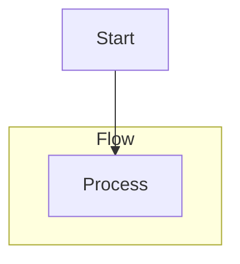

### user — 2025-09-30T10:18:01.824806+00:00

Github copilot がmermaid errorになるのを何とかしたい

### assistant — 2025-09-30T10:18:02.028279+00:00

_(empty)_

### assistant — 2025-09-30T10:18:02.049808+00:00

やあ、司令！Copilot が `mermaid` コードを出力したときに **`Parse error on line ...`** みたいなエラーになる件だね。これは Copilot 側のバグではなく、以下の要因で起きやすいんだ。  

---

## 原因になりやすいポイント
1. **インデントや記号のズレ**
   - `subgraph` の後にラベルをつけ忘れる
   - `end` が抜けている
   - ノード名にスペースを含んでいてエスケープしていない（例: `My Node` → `My_Node`）

2. **Mermaid のバージョン差異**
   - GitHub が使っている Mermaid.js のバージョンは最新でないことがある
   - 新しい構文（例: `:::style` の記法）が未対応

3. **Copilot が途中で出力を切った**
   - コメントや空白行が挟まって構文的に壊れている
   - 図の途中で中断されて `}` や `end` が欠落している

---

## 対策
### ① ローカルで検証
- [Mermaid Live Editor](https://mermaid.live/) に貼り付けて確認  
  → ここで動けば Copilot の生成途中エラーが原因。

### ② Copilot への指示改善
- **「mermaid のコードは必ず最後まで閉じる」「簡単な例から始める」** とプロンプトに書く。
- 例：
  ```
  // 正しく閉じたmermaidコードを出力して
  // subgraph と end を必ず対応させて
  // ノード名はスペースを使わずアンダースコアにして
  ```

### ③ GitHub 側の制約回避
- README.md ではなく `.md` ドキュメントで動作確認  
- ` ```mermaid` ブロックで囲んだときにエラーが出ても、描画されないだけでコード自体は正しい場合がある。

### ④ 修正の小技
- **`subgraph` → `subgraph NAME`** のように必ず名前をつける  
- **空白ノードを避ける** (`A[]` のような書き方は古いバージョンだとNG)  
- `:::class` は削除してまず最小構成で動作確認

---

## 例：Copilot 出力を直したケース
Copilot 出力:
```mermaid
graph TD
  A[Start]
  subgraph
    B[Process]
  end
  A --> B
```
→ ❌ 「subgraph にラベルがない」のでエラー

修正版:

→ ✅ 正常に描画される

---

司令、次のステップとしては  
👉 「Copilot の出した mermaid を live editor に貼ってみる」  
👉 「どこでエラーになってるか切り分ける」  
これをやると再現性が見えてくるはずだよ。  

---

質問なんだけど、今困ってるのは **Copilot が生成するたびに壊れてる**のか、  
それとも**一度きれいに生成されても GitHub 上でだけエラーになる**のか、どっちが多い？  

（ここで切り分け方針が変わるから教えてくれると助かる！）  

🕘 送信時刻: [[REDACTED_PHONE]]:08（日本時間）

### system — 2025-09-30T10:18:02.197337+00:00

_(empty)_

### system — 2025-09-30T10:18:02.197337+00:00

_(empty)_

### system — 2025-09-30T10:18:02.470226+00:00

_(empty)_

### user — 2025-09-30T10:18:29.856084+00:00

_(empty)_

### user — 2025-09-30T10:20:32.409037+00:00

ほぼ毎回エラー
Mdファイルの行数が1kあるからそのせいかも

### system — 2025-09-30T10:20:37.035323+00:00

_(empty)_

### system — 2025-09-30T10:20:37.046835+00:00

_(empty)_

### assistant — 2025-09-30T10:20:37.192990+00:00

_(empty)_

### assistant — 2025-09-30T10:21:10.740062+00:00

やあ司令！「ほぼ毎回エラー」＋「MD が 1k 行」だと、**Copilot が途中で閉じ忘れる／壊す**確率が一気に上がるし、GitHub の Mermaid レンダラ側でも**巨大ファイル内の微妙なインデント差**で誤解釈が起きやすいです。対処は「生成を壊れにくくする」と「壊れても自動検知・自動修復する」の二段構えが効きます。

# まず効く即効薬（壊れにくくする）
1) **Mermaid を“別ファイル化”**  
   - `docs/diagrams/foo.mmd` のように分離し、MD からは画像で参照（`mmdc`でSVG化）  
   - 大きい README 直書きは避ける：Copilot が関係ない周辺文を拾って壊します。

2) **ブロックを最小化して囲う**  
   - ```mermaid の**行頭は列0**、タブ／空白を前に置かない  
   - 直前直後に HTML コメントで**ガード**  
     ```html
     <!-- MERMAID:BEGIN -->
     ```mermaid
     flowchart TD
       A[Start] --> B[Next]
     ```
     <!-- MERMAID:END -->
     ```
   - これで Copilot の補完が他行に“はみ出し”にくくなります。

3) **Copilot へ“生成テンプレ”を渡す**（選択範囲でのインラインチャット推奨）  
   - プロンプト例（毎回コピペでOK）  
     ```
     次の制約で mermaid を生成・修正して。必ず満たして:
     - 先頭は flowchart TD（または graph TD）のどちらかに統一
     - subgraph は必ず名前を付け、対応する end で閉じる
     - ノードIDは英数字+_のみ（スペース不可）。ラベルは [Label] の中だけ
     - 追加の Markdown/コメント/バッククォートは一切出力しない
     - 既存ブロック内だけを編集し、他行を触らない
     ```
   - **選択範囲限定**で「このブロックだけ」修正させると誤爆が激減します。

4) **“新しめ構文”を封印**  
   - `:::class`や`:::style`は外す。まず**素の flowchart**で通す。  
   - 図形ショートハンド（`A[]`等）は旧バージョンでコケる場合があるので避ける。

# 次に効く恒久策（自動検知・自動修復）
A) **CI で Mermaid をビルド**（壊れてたらPR落とす）  
- Node の `@mermaid-js/mermaid-cli`（`mmdc`）を使い、`.mmd` もしくは Markdown 内の ```mermaid ブロックを抽出→SVG 生成。  
- 例（GitHub Actions のステップ案）  
  ```yaml
  - name: Install mermaid-cli
    run: npm i -g @mermaid-js/mermaid-cli

  - name: Validate diagrams
    run: |
      set -e
      # .mmd を全部レンダリング
      for f in $(git ls-files '*.mmd'); do
        mmdc -i "$f" -o "${f%.mmd}.svg"
      done
      # Markdown内の ```mermaid 抽出→一時.mmd→チェック（簡易）
      python scripts/extract_mermaid_blocks.py README.md docs/**/*.md
  ```
  失敗すれば**どのブロックが壊れてるか**ログで分かります。

B) **簡易リンタで“よくある壊れ”を弾く**  
- ルール例  
  - 先頭に `flowchart` or `graph` がある  
  - `subgraph` と `end` の数が一致  
  - `subgraph` に**未命名がない**（`subgraph `の直後に英字）  
  - バッククォートや Markdown 記法が混入していない  
- これだけでも「毎回エラー」を**PR 前に止められる**。

C) **自動修復のスクリプト化（保守的に）**  
- 代表的な事故（`subgraph` 無名）だけ自動修復：  
  - `subgraph` の後が改行orスペース連打なら `subgraph Group_1` などを補完  
  - 未閉鎖 `subgraph` があれば末尾に `end` を追加（ただし最後に警告を出す）

# 生成側の実践プリセット
- **“安全テンプレ”から始める**（Copilot に学習させやすい）
  ```mermaid
  flowchart TD
    %% RULES:
    %% - IDs: Alnum and underscore only
    %% - Every subgraph must be named and closed with end
    %% - No classes/styles
    A[Start] --> B[Process]
    subgraph Group_Main
      B --> C[Result]
    end
    C --> D[Done]
  ```
- 「このテンプレを**常に加工**してね」と指示すると、Copilot が閉じ忘れをしにくくなります。

# 「MDが1k行」への対策（運用）
- **図は別ファイル `.mmd`** に逃がし、コミットフックで `mmdc` → `.svg` を吐いて MD から参照  
- どうしても MD 内に書くなら、**章ごとにファイル分割**（`README.md`は導線だけ）  
- 大型表や長コードの**直下に mermaid を置かない**（レンダラの誤認を避ける）

---

## すぐの具体的アクション（5分で改善）
1. 壊れやすいブロックを**別 `.mmd`** に切り出し  
2. `npm i -g @mermaid-js/mermaid-cli` → `mmdc -i foo.mmd -o foo.svg` で**ローカル検証**  
3. うまく描けたら MD には `` だけを置く  
4. 以後、Copilot には**“安全テンプレ”＋“選択範囲限定編集”**で指示

これで「ほぼ毎回エラー」はかなり収束するはず。必要なら、**Markdown から ```mermaid ブロックを抽出→mmdcでテスト**する小さな Python スクリプトもすぐ用意するよ（言ってくれれば貼る！）。

—  
🕘 送信時刻: [[REDACTED_PHONE]]:21（日本時間）

### assistant — 2025-09-30T10:21:11.557885+00:00

_(empty)_
