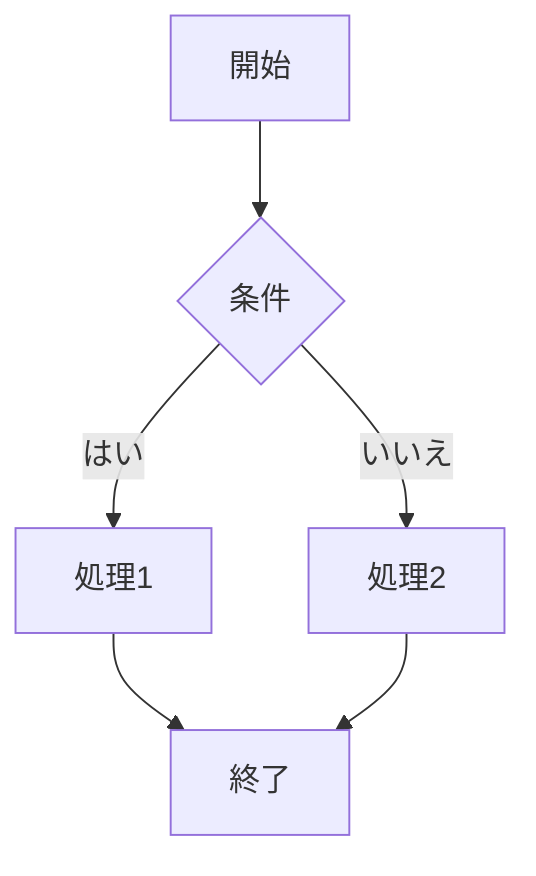

### system — 2024-09-14T06:41:42.119132+00:00

_(empty)_

### user — 2024-09-14T06:41:42.120901+00:00

vscode上のmdでMermaidをプレビューできない

### tool — 2024-09-14T06:41:55.079900+00:00

**Markdownの調整**

vscodeでMarkdownファイルのMermaidダイアグラムのプレビューが表示されない。原因としてエクステンション未インストールやプレビュー未有効化、構文エラーなどが考えられる。エクステンションのインストールや機能の有効化を試している状況。

**プレビューの確認**

Markdown ファイルで Mermaid 図を表示するために、拡張機能のインストールと設定、プレビューの開き方、トラブルシューティングの方法を説明しています。

### assistant — 2024-09-14T06:41:55.079979+00:00

こんにちは！

Visual Studio Code (VSCode) で Markdown (`.md`) ファイル内の Mermaid 図がプレビューできない場合、以下の手順を試してみてください。これにより、Mermaid を使用したダイアグラムを正しく表示できるようになるはずです。

## 1. 必要な拡張機能をインストールする

Mermaid ダイアグラムをプレビューするには、適切な拡張機能が必要です。以下の拡張機能をインストールしてください。

### **Markdown Preview Enhanced**

この拡張機能は、Markdown のプレビュー機能を強化し、Mermaid ダイアグラムをサポートします。

1. **拡張機能のインストール**
   - サイドバーの拡張機能アイコン（四角形のアイコン）をクリックします。
   - 検索バーに「**Markdown Preview Enhanced**」と入力します。
   - 作者が「**shd101wyy**」のものを選び、インストールします。
   - [Markdown Preview Enhanced - Marketplace](https://marketplace.visualstudio.com/items?itemName=shd101wyy.markdown-preview-enhanced)

### **その他の選択肢**

- **Mermaid Markdown Syntax Highlighting**: Mermaid のシンタックスハイライトを提供しますが、プレビュー機能は含まれていません。
- **Mermaid Preview**: Mermaid ダイアグラム専用のプレビューを提供しますが、Markdown 全体のプレビューには対応していません。

## 2. Markdown Preview Enhanced を設定する

インストール後、以下の設定を確認・調整します。

1. **設定を開く**
   - `Ctrl + ,` （Windows/Linux）または `Cmd + ,` （Mac）で設定を開きます。
   - 右上の「{}」アイコンをクリックして `settings.json` を直接編集することもできます。

2. **Mermaid の有効化を確認**
   ```json
   "markdown-preview-enhanced.enableMermaid": true
   ```
   - デフォルトで有効になっているはずですが、念のため確認してください。

3. **その他の関連設定**
   - 必要に応じて、テーマやフォントサイズなどの設定を調整します。

## 3. Mermaid ダイアグラムを正しく記述する

Mermaid ダイアグラムを Markdown に埋め込む際の基本的な構文を確認しましょう。

```markdown

```

**注意点**：

- コードブロックの開始行に `mermaid` と記述します（スペース不要）。
- Mermaid の構文エラーがないか確認してください。

## 4. プレビューを表示する

Markdown Preview Enhanced を使用してプレビューを表示します。

1. **プレビューを開く方法**
   - Markdown ファイルを開いた状態で、右クリックして「**Markdown Preview Enhanced: Open Preview**」を選択。
   - または、コマンドパレット（`Ctrl + Shift + P` または `Cmd + Shift + P`）を開き、「**Markdown Preview Enhanced: Open Preview**」と入力して選択。

2. **リアルタイムプレビュー**
   - プレビューはリアルタイムで更新されるため、Markdown ファイルを編集するとプレビューも自動で更新されます。

## 5. トラブルシューティング

もし上記の手順で Mermaid ダイアグラムが表示されない場合、以下の点を確認してください。

### **a. 拡張機能が有効か確認**

- インストールした拡張機能が有効になっているか確認します。
- サイドバーの拡張機能アイコンをクリックし、インストール済みの「**Markdown Preview Enhanced**」が有効になっていることを確認。

### **b. ファイルの拡張子を確認**

- ファイルが `.md` 拡張子で保存されていることを確認してください。

### **c. Mermaid の構文を確認**

- Mermaid ダイアグラムの構文にエラーがないか確認します。構文エラーがあると、ダイアグラムが正しく表示されません。

### **d. 他の拡張機能との競合を確認**

- 他の Markdown 関連の拡張機能が競合している可能性があります。一時的に他の拡張機能を無効化して試してみてください。

### **e. 開発者ツールでエラーメッセージを確認**

1. メニューバーから「**ヘルプ**」 > 「**Toggle Developer Tools**」を選択。
2. コンソールにエラーメッセージが表示されていないか確認します。
3. エラーメッセージがある場合、その内容をもとに問題を特定します。

### **f. インターネット接続を確認**

- Mermaid のレンダリングに必要なリソースを取得するため、インターネット接続が必要な場合があります。接続状態を確認してください。

## 6. Alternative: 他の拡張機能を試す

もし「Markdown Preview Enhanced」で問題が解決しない場合、以下の拡張機能を試してみてください。

### **Mermaid Markdown Syntax Highlighting**

- シンタックスハイライトを提供しますが、プレビュー機能は含まれていません。

### **Mermaid Preview**

- Mermaid ダイアグラム専用のプレビューを提供します。Markdown 全体のプレビュー機能はありませんが、ダイアグラムの確認には有用です。
- [Mermaid Preview - Marketplace](https://marketplace.visualstudio.com/items?itemName=bierner.markdown-mermaid)

## 7. 最後の手段: VSCode の再インストールや設定リセット

もし上記の方法でも解決しない場合、以下を試してみてください。

- **VSCode の再起動**: 単純な再起動で問題が解決する場合があります。
- **拡張機能の再インストール**: 「Markdown Preview Enhanced」を一度アンインストールし、再インストールしてみてください。
- **VSCode の設定リセット**: 設定ファイルを初期化して、デフォルト設定に戻すことも検討してください。ただし、この操作は他の設定にも影響するため、慎重に行ってください。

## まとめ

VSCode で Markdown 内の Mermaid ダイアグラムをプレビューするには、適切な拡張機能のインストールと設定が必要です。上記の手順を順に試していただくことで、多くの場合問題が解決します。もしそれでも解決しない場合、具体的なエラーメッセージや状況を教えていただければ、さらに詳細なサポートが可能です。

頑張ってください！
