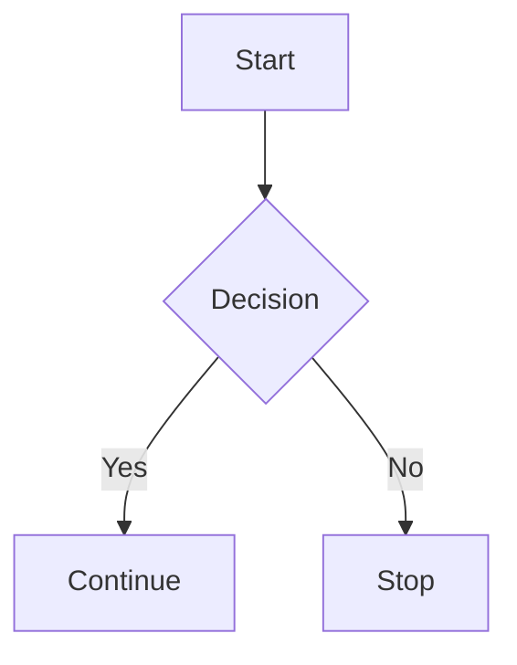

### system — 2024-09-14T06:51:28.433698+00:00

_(empty)_

### user — 2024-09-14T06:51:28.443024+00:00

mermaidの図を小さく表示する設定

### tool — 2024-09-14T06:51:36.073889+00:00

**サイズの調整方法を考える**

Mermaid図のサイズを小さくするための方法を探ってる。CSS、SVG属性、Mermaidの設定オプションなど、いくつかの方法が考えられている。

### assistant — 2024-09-14T06:51:36.073984+00:00

Mermaid の図を小さく表示するための設定方法はいくつかあります。以下に代表的な方法を紹介します。

### 1. Mermaid 設定でサイズを調整する

Mermaid では、`%%{init: {}}%%` ディレクティブを使用して初期設定を行うことができます。この中で `themeVariables` や `fontSize` などを設定して図全体のサイズを調整することが可能です。



### 2. CSS を使用して SVG のサイズを変更する

Mermaid は SVG 形式で図を生成するため、CSS を用いて SVG のサイズを調整することができます。以下のようにスタイルを追加して、図のサイズを制御します。

```html
<style>
  .mermaid {
    width: 300px;
    height: 200px;
  }
</style>

<div class="mermaid">
graph TD
    A[Start] --> B{Decision}
    B -->|Yes| C[Continue]
    B -->|No| D[Stop]
</div>
```

### 3. ビューポート (`viewBox`) を調整する

Mermaid の図自体のスケーリングを制御するために、`viewBox` 属性を調整する方法もあります。これにより、図全体の表示サイズを変更できます。


### 4. Markdown 環境での調整

もし Markdown 環境（例えば GitHub や Obsidian）で Mermaid を使用している場合、図を囲むコンテナに対してスタイルを適用することでサイズを変更できます。

```markdown
<div style="width: 400px; height: 300px;">

</div>
```

### 5. レスポンシブデザインの活用

複数のデバイスで適切に表示されるように、レスポンシブデザインを取り入れることも有効です。CSS の `max-width` や `height` をパーセンテージで指定することで、画面サイズに応じて図のサイズを調整できます。

```css
.mermaid {
    max-width: 100%;
    height: auto;
}
```

```html
<div class="mermaid">
graph TD
    A[Start] --> B{Decision}
    B -->|Yes| C[Continue]
    B -->|No| D[Stop]
</div>
```

### まとめ

Mermaid の図を小さく表示する方法は、使用する環境や目的に応じて様々です。上記の方法を参考に、最適なサイズ調整を行ってください。特に CSS を活用する方法は柔軟性が高く、他のスタイル設定と組み合わせて使いやすいです。

もし特定の環境（例：特定の Markdown エディタやウェブサイト）での設定方法が知りたい場合は、詳細を教えていただければさらに具体的なアドバイスが可能です。
