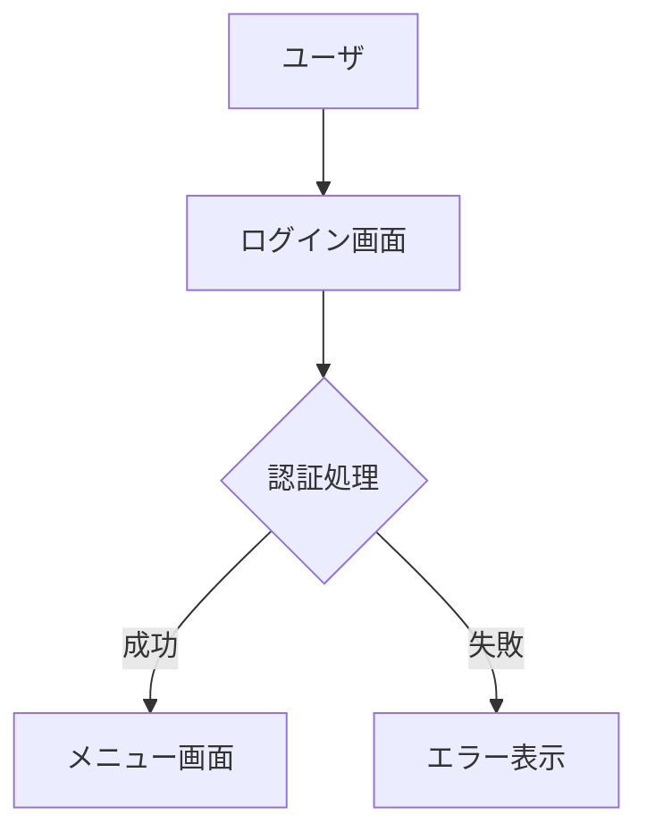
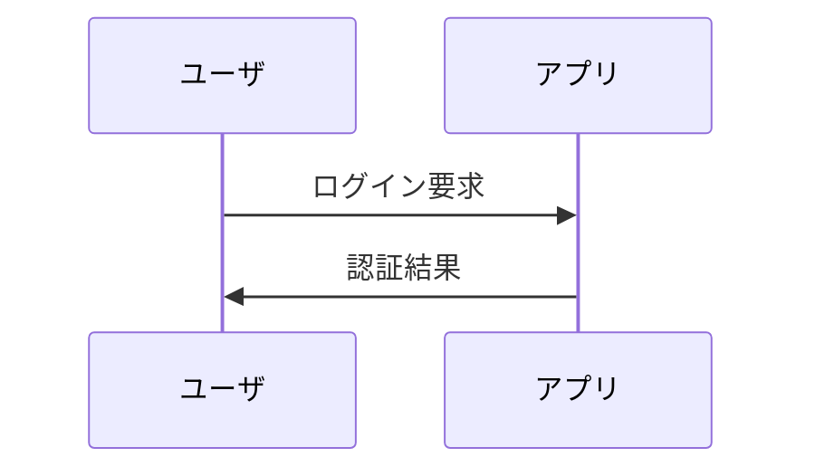
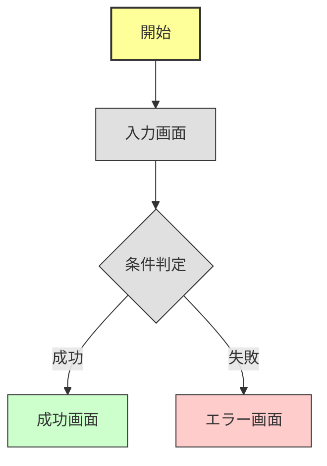
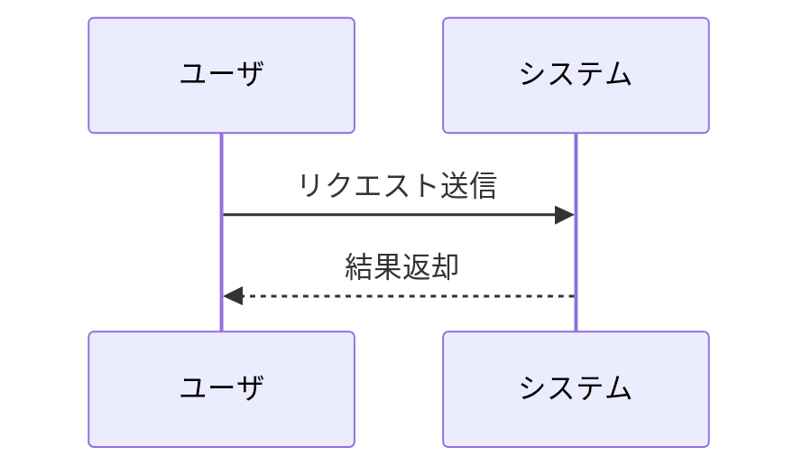
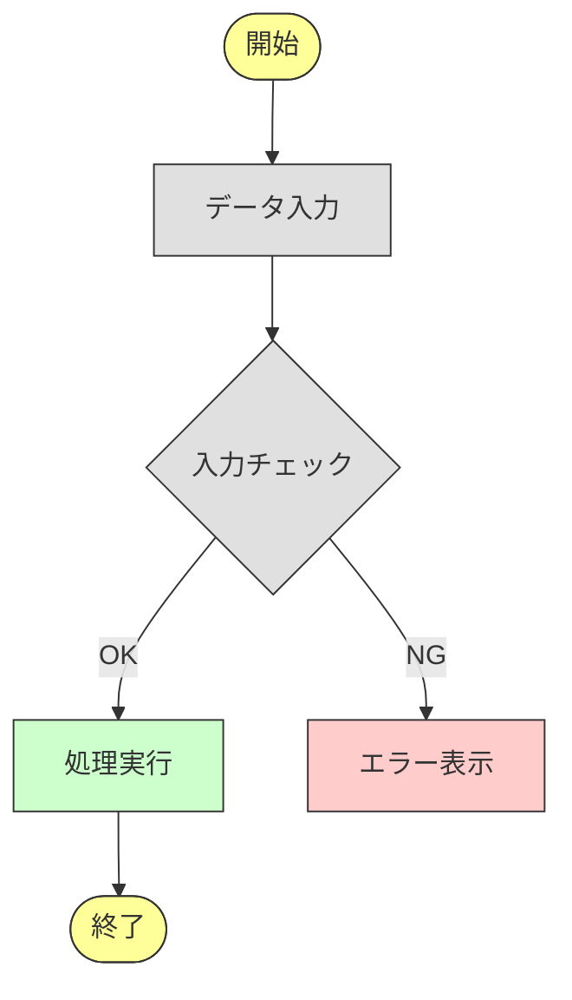
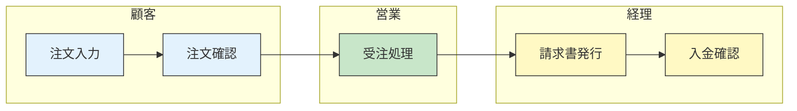
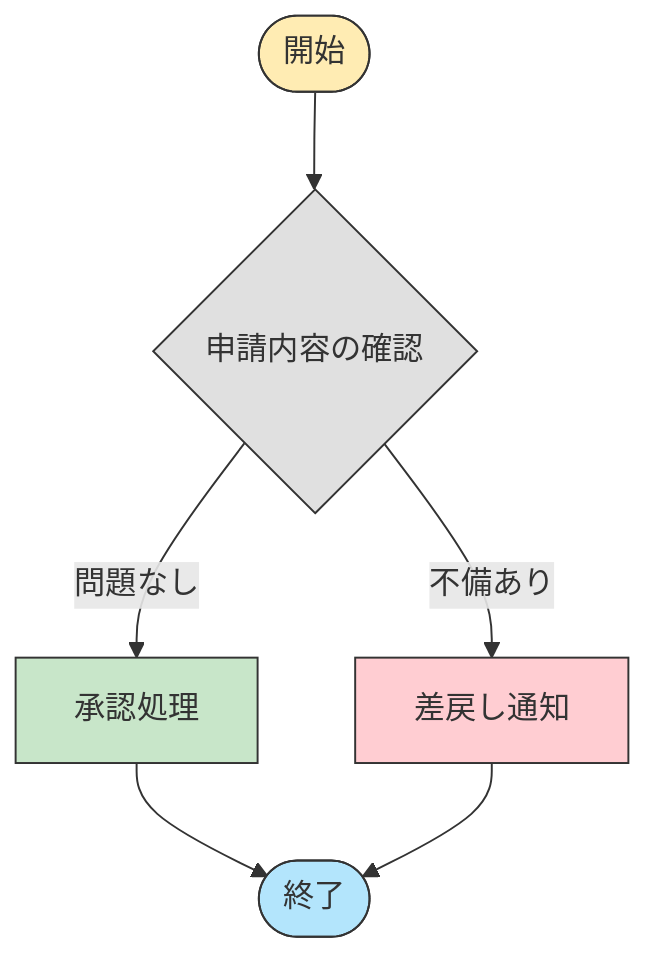
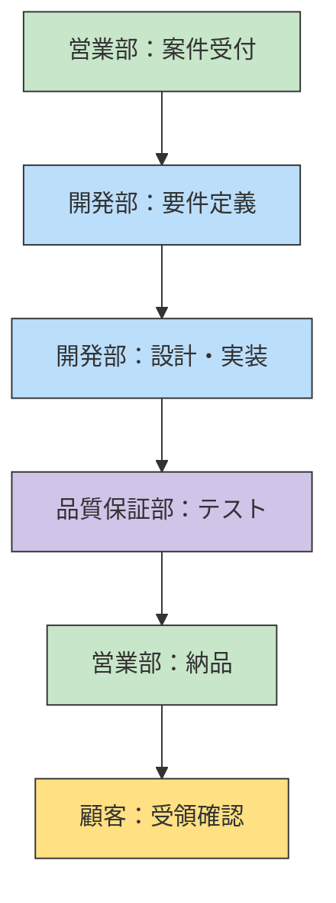
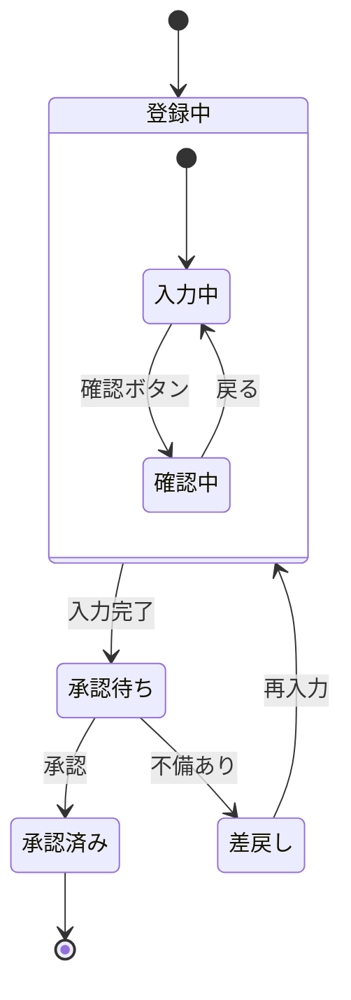

### user — 2025-05-29T23:57:47.431000+00:00

github copilotの.instructions.mdを有効に使用したい
例えばmermaidの色の統一や強調色など
また、設計書別のフォーマットの統一、全体の参照元ファイルの統一など
このようなドキュメント作成への利用方法について例を示して有効な方法をいくつか示して

### system — 2025-05-29T23:57:47.557309+00:00

_(empty)_

### assistant — 2025-05-29T23:57:47.982421+00:00

`.github/copilot/` 以下に配置する `instructions.md` は、**GitHub Copilot にプロジェクト全体のスタイルガイドやコーディングルール、ドキュメントの書き方を伝えるための有効な手段**です。これは **開発コードに限らず、ドキュメントの生成にも強く影響**を与えることができます。

以下に、あなたのニーズ（Mermaid の色の統一、設計書フォーマットの統一、参照元ファイルの統一など）を前提とした **活用例と有効な記述方法** を示します。

---

## ✅ 活用例 1: Mermaid 図のスタイル統一

```markdown
# Mermaid記法の統一ルール

Mermaid を使用する際は以下のスタイルガイドに従ってください。

- テーマは `neutral` を使用
- 強調色（注目ノード）は `#FFCC00`（黄色）
- 通常ノードの背景色は `#E0E0E0`（グレー）
- 枠線の色は `#[[REDACTED_PHONE]]`
- 矢印は `-->` を使う（明示的方向）
- Mermaid のファイルは `.mmd` 拡張子を使用する

## Mermaid テンプレート

```mermaid
graph TD
    A[開始] --> B{条件}
    B -- Yes --> C[処理1]
    B -- No --> D[処理2]
    style A fill:#FFCC00,stroke:#[[REDACTED_PHONE]]
    style B fill:#E0E0E0,stroke:#[[REDACTED_PHONE]]
    style C fill:#E0E0E0,stroke:#[[REDACTED_PHONE]]
    style D fill:#E0E0E0,stroke:#[[REDACTED_PHONE]]
```
```

### 効果
Copilot に「`Mermaid` を使ってフローチャートを書いて」などと指示したとき、上記スタイルを自動的に反映したコードを出してくれる可能性が高まります。

---

## ✅ 活用例 2: 設計書フォーマットの統一

```markdown
# 設計書テンプレートの書式

ドキュメントファイル（`.md`や`.docx`）での設計書は以下の順序・見出しで構成します。

## ファイル構成
- `/docs/design/` に格納
- ファイル名は `{機能名}_design.md`

## 設計書構成テンプレート

```markdown
# 機能概要

# 対象範囲

# 使用技術

# ユースケース

# 処理フロー図（Mermaid）

# データ構造（JSON Schemaまたは表形式）

# API一覧（OpenAPIもしくは表形式）

# セキュリティ要件

# その他の考慮事項
```
```

### 効果
Copilot に「設計書テンプレートを使って新しい設計を作って」と入力すると、この構成をベースに補完がされるようになります。

---

## ✅ 活用例 3: 全体の共通参照ファイルを統一

```markdown
# 共通参照ファイルのルール

設計・実装・テストドキュメントで以下の共通ファイルを必ず参照すること。

- 共通エラーコード一覧: `/docs/common/error_codes.md`
- 共通API認証仕様: `/docs/common/authentication.md`
- UI/UX共通ガイドライン: `/docs/common/ui_guideline.md`
- 各種テンプレート類: `/docs/templates/`

## 例：認証フローを書く場合

- 必ず `/docs/common/authentication.md` を引用してください。
- Copilotで「認証の仕様書を書いて」と入力すると、共通ファイルからの引用を優先してください。
```

---

## ✅ 有効な記述のポイント

1. **命令形で書く**（例：「～してください」ではなく「～すること」）
2. **Markdownの構造やコードブロックを積極的に使う**
3. **フォーマット例・テンプレートを豊富に記述する**
4. **具体的な色、ファイル名、用語などを明記する**
5. **ルールの背景や目的も書いておくと精度が上がる**

---

## 🧠 応用ヒント

- **VSCode Copilot Chat** や **GitHub Copilot Labs** を使うと、`instructions.md` の内容に従ってドキュメントがより忠実に補完されます。
- `instructions.md` を使った後、**一定時間プロンプトを打ち込んだ後の補完結果を検証**してチューニングするとさらに精度が上がります。

---

必要であれば、あなたの用途に合わせた `instructions.md` のひな型を作成します。どの程度のドキュメントや設計書があるか教えていただければ、最適な構成をご提案できます。

### assistant — 2025-05-29T23:57:59.478727+00:00

_(empty)_

### user — 2025-05-30T00:02:05.005000+00:00

既存のmermaidの表記方法からテンプレートを作成できるか？

### assistant — 2025-05-30T00:02:05.290778+00:00

はい、**既存のMermaid記法をもとにテンプレートを自動抽出・整形することは可能です**。以下の手順で、`instructions.md` に活用可能なテンプレートを抽出できます。

---

## ✅ 手順：既存のMermaidからテンプレートを作る

### ① 既存のMermaidコードを収集

例えば以下のようなコードが複数あるとします。





### ② 共通パターン・色・構成要素を抽出

上記例から以下が共通点として抽出できます：

- `graph TD` または `sequenceDiagram` の使用
- ノード間の関係（--> や →> ）
- 成功と失敗を分岐に使う `{}` や `|ラベル|`
- スタイル指定がなければ補完する価値がある

---

### ③ テンプレートとして整形

これを `instructions.md` に次のように定義できます：

```markdown
# Mermaid記法テンプレート（Copilot補完用）

## 共通ルール

- Mermaid のテーマは `neutral`
- 成功ルートは `#CCFFCC`（緑系）、失敗ルートは `#FFCCCC`（赤系）
- 特殊処理ノードは `#FFFF99`（黄系）
- 文字は日本語対応、UTF-8で記述

## フローチャートテンプレート



## シーケンス図テンプレート



---

## ✅ 補足：複数のMermaidファイルから自動抽出する方法

もし多数の `.md` または `.mmd` ファイルからテンプレートを自動抽出したい場合は、以下のようなスクリプトで抽出可能です：

```bash
# Mermaidコードをすべて抽出（UNIX系シェル）
grep -r -Pzo '(?s)```mermaid.*?```' ./docs > all_mermaid_snippets.md
```

これにより、プロジェクト全体のMermaid記法を集めて分析し、共通スタイルを定義できます。

---

## 🔧 提案

もしあなたのプロジェクト内に既存のMermaid記法が複数あるなら、私にその例をいくつか提示していただければ、**そこから最適なスタイルガイド・テンプレートの `instructions.md` を生成**します。  
必要であれば、以下のようにしてください：

- `.md` ファイル数点のMermaid記法を貼り付ける
- 目的別（例：画面遷移図、処理フロー、状態遷移図）に分類してもらう

準備でき次第、最適化されたテンプレートを作成します。

### user — 2025-05-30T00:05:07.129000+00:00

フローチャート、業務フローなどに利用するとよいmermaidの添付ーとを示せ

### assistant — 2025-05-30T00:05:07.392033+00:00

以下は、**Mermaid をフローチャートや業務フロー図に活用する際に「そのままテンプレートとして使える」例**を目的別に示したものです。GitHub Copilot に `.github/copilot/instructions.md` として渡すと、補完にも反映されやすくなります。

---

## ✅ 1. **基本的な処理フローテンプレート**



---

## ✅ 2. **業務フロー図テンプレート（部門別）**



---

## ✅ 3. **分岐のある判断フロー**



---

## ✅ 4. **多部門間の処理フロー（業務連携）**



---

## ✅ 5. **状態遷移図テンプレート（状態管理に）**



---

## ✅ 使い方のポイント

1. **Copilot向けの `instructions.md` にこのまま貼り付けて「Mermaidテンプレート」と明記**  
2. **自分の業務でよく使う色やラベルに変更してカスタマイズ可能**  
3. **用途に応じて `flowchart`, `stateDiagram`, `sequenceDiagram` などを切り替えると視覚的にわかりやすい**  

---

必要であれば、上記を `.github/copilot/instructions.md` 用の形式として整形して提供できます。  
また、あなたのプロジェクトに特化した色・役割・部門などにカスタマイズすることも可能です。テンプレ化したい既存Mermaidのコード例があれば、送っていただければテンプレート化します。

### user — 2025-05-30T00:08:25.430000+00:00

このテンプレートを切り分けて使うのはcopilotが判断できるのか

### assistant — 2025-05-30T00:08:25.738160+00:00

Copilot は `.github/copilot/instructions.md` に記述されたテンプレートやルールを「**参考情報として加味する**」ことはできますが、以下のような **前提と制限**があります：

---

## ✅ **Copilotができること**
Copilot は以下のような条件でテンプレートを「判断」できます。

| 条件 | 説明 |
|------|------|
| 🔍 **コメントやプロンプトが具体的** | 「業務フロー図を書いて」「状態遷移図で描いて」など、意図が明示されているとテンプレを選択しやすい。 |
| 📄 **instructions.mdが構造化されている** | `## フローチャート`, `## 状態遷移図` のようにセクション分けされていると、それに応じて補完を行う確率が上がる。 |
| 💡 **過去の使用履歴がある**（Copilot Chat or Labs） | 同じ構成を以前使っていれば、それに似せた補完を優先しやすい。 |

---

## 🚫 **Copilotが苦手なこと・できないこと**
| 項目 | 説明 |
|------|------|
| ✖ 自動でテンプレートを分類して選ぶ | 何もヒントがない状態で「これは業務フロー図だな」とCopilotが判断することは難しい。 |
| ✖ いくつものテンプレを自動で使い分ける | `instructions.md` に複数テンプレがあると、**どれを選べばいいかの判断はユーザーの指示次第**。 |
| ✖ ファイル名やコンテキストからの切り替え | `flow_xxx.mmd` だからフローチャートを出す、などは行わない（VSCode拡張の補助が必要）。 |

---

## 🔧 **有効にする方法（推奨構造）**

`instructions.md` を以下のように構造化すると効果的です：

```markdown
# Mermaid 図テンプレート集

## 使用方法
- 「フローチャートを書いて」「業務フローで」とコメントやプロンプトに書くことで適切なテンプレが選ばれるようになります。
- 以下のテンプレートに従ってMermaidコードを生成してください。

---

## フローチャートテンプレート

（ここにテンプレ）

---

## 業務フロー図テンプレート

（ここにテンプレ）

---

## 状態遷移図テンプレート

（ここにテンプレ）
```

---

## 💡 補助テクニック（使い分けを促す）

Copilot に具体的なコメントを入れて使うと、意図通りのテンプレが出やすくなります。

```markdown
// フローチャートでログイン処理を図示
```

```markdown
// 業務フロー：注文から入金まで
```

```markdown
// 状態遷移図：申請の承認プロセス
```

---

## ✅ まとめ

| 質問 | 回答 |
|------|------|
| Copilotがテンプレートを自動で使い分けられるか？ | ❌ 完全自動では不可。コメントやプロンプトで意図を伝える必要あり。 |
| 有効活用するには？ | ✅ `instructions.md` をセクション化し、コメント・プロンプトで選ばせるのが効果的。 |
| Copilotがテンプレを覚える条件は？ | ✅ プロジェクト内で一貫してテンプレを使う・コメントで明示すること。 |

---

必要であれば、**この構造化済み `instructions.md` のテンプレート雛形**をお渡ししますか？  
また、Mermaid以外のドキュメントテンプレート（設計書など）も併せて統一できます。

### user — 2025-05-30T00:15:36.983000+00:00

WBSからガントチャートを作成するのに使用するmermaidテンプレートを作って

### assistant — 2025-05-30T00:15:37.296500+00:00

以下は、**WBS（Work Breakdown Structure）からガントチャートを作成するためのMermaidテンプレート**です。GitHub Copilot の `.github/copilot/instructions.md` に追加することで、補完やドキュメント自動化に活用できます。

---

## ✅ Mermaid Ganttチャート テンプレート（WBSベース）

```markdown
## ガントチャートテンプレート（WBS）

Mermaidを使って、WBSに基づくガントチャートを描画する際は、以下のテンプレートに従ってください。

- WBS要素ごとに `section` を定義
- タスク名、担当者、期間、依存関係を定義
- 日付フォーマットは `YYYY-MM-DD` で統一
- タスクID（例: `task1`, `task2`）を定義して依存関係を管理
- `done`, `active`, `crit`, `milestone` などのキーワードで状態を指定

### 🎯 Mermaid Ganttチャート テンプレート例

```mermaid
gantt
    title プロジェクト計画（WBSベース）
    dateFormat  YYYY-MM-DD
    excludes    weekends

    section 要件定義
    要件整理           :done,   task1, [[REDACTED_PHONE]], 3d
    ユースケース定義   :done,   task2, after task1, 2d

    section 設計
    画面設計           :active, task3, after task2, 3d
    DB設計             :        task4, after task2, 2d

    section 実装
    バックエンド実装   :        task5, after task3, 5d
    フロント実装       :        task6, after task3, 5d

    section テスト
    単体テスト         :        task7, after task5, 3d
    結合テスト         :        task8, after task6, 2d
    総合テスト         :crit,   task9, after task7, 3d

    section マイルストーン
    リリース           :milestone, task10, after task9, 1d
```

---

## ✅ 補足：ステータスの記号対応

| 状態        | 表記         | 説明                     |
|-------------|--------------|--------------------------|
| 完了済み    | `:done`      | 緑色で塗られる           |
| 実行中      | `:active`    | 青線で表示               |
| 重要タスク  | `:crit`      | 赤色で表示               |
| マイルストーン | `:milestone` | ◆アイコンで表示される     |

---

## ✅ 補足：日数と依存関係

- `after taskX` を使って依存タスクを指定
- `3d`, `1w`, `2w2d` などで期間を指定（`d = 日`, `w = 週`）

---

## 💡 利用シーン

このテンプレートは以下のような場合に有効です：

- MarkdownベースでWBSをドキュメント化したいとき
- Copilot Chatに「WBSからガントチャートを書いて」と依頼する場合
- GitHub WikiやREADMEで工程管理を共有したいとき

---

必要に応じて：

- ExcelやCSVからMermaidに変換するスクリプト
- VSCode拡張でリアルタイムにプレビューする環境構築方法

も提供可能です。必要であればお知らせください。

### user — 2025-05-30T00:16:30.841000+00:00

excelで作成したガントチャートを利用してテンプレートを作れるか

### assistant — 2025-05-30T00:16:31.064901+00:00

はい、**Excelで作成されたガントチャートからMermaidのテンプレートを作成することは可能です**。特に、Excel上でWBS（作業項目・開始日・終了日 or 期間・依存関係）を表形式で管理していれば、**Mermaidのgantt構文へ自動変換が可能**です。

---

## ✅ Excelのデータ例（前提）

以下のような形式のExcelを想定します：

| タスク名         | タスクID | 担当者 | 開始日       | 期間（日） | 依存タスク |
|------------------|----------|--------|--------------|------------|-------------|
| 要件整理         | task1    | 田中    | [[REDACTED_PHONE]]   | 3          |             |
| ユースケース定義 | task2    | 鈴木    |              | 2          | task1       |
| 画面設計         | task3    | 佐藤    |              | 3          | task2       |
| DB設計           | task4    | 佐藤    |              | 2          | task2       |
| リリース         | task5    | 山田    |              | 1          | task3       |

---

## 🔄 これをMermaidに変換すると…

```mermaid
gantt
    title プロジェクト計画（Excel由来）
    dateFormat  YYYY-MM-DD
    excludes    weekends

    section 要件定義
    要件整理         :done, task1, [[REDACTED_PHONE]], 3d
    ユースケース定義 :      task2, after task1, 2d

    section 設計
    画面設計         :      task3, after task2, 3d
    DB設計           :      task4, after task2, 2d

    section マイルストーン
    リリース         :milestone, task5, after task3, 1d
```

---

## 🛠 自動変換スクリプト（PowerShell例）

以下のようにExcelからCSVとして保存しておけば、PowerShellやPythonなどで変換可能です。簡易PowerShell例を示します：

```powershell
$csv = Import-Csv "tasks.csv"

Write-Output "gantt"
Write-Output "    title プロジェクト計画"
Write-Output "    dateFormat  YYYY-MM-DD"
Write-Output "    excludes weekends"

foreach ($row in $csv) {
    $name = $row.'タスク名'
    $id = $row.'タスクID'
    $start = $row.'開始日'
    $dur = "$($row.'期間（日）')d"
    $dep = $row.'依存タスク'

    if ($start) {
        Write-Output "    $name : $id, $start, $dur"
    } elseif ($dep) {
        Write-Output "    $name : $id, after $dep, $dur"
    }
}
```

---

## ✅ Copilotにテンプレート化する方法

このExcel→Mermaid変換ルールを `.github/copilot/instructions.md` に記載しておくと、Copilotにも反映されやすくなります。

```markdown
## Excelベースのガントチャートテンプレート

- Excelに以下の列を持たせること：
  - タスク名、タスクID、開始日、期間（日）、依存タスク
- Mermaidのgantt構文に変換する際は、以下のルールに従う：

例：
| タスク名         | タスクID | 開始日       | 期間（日） | 依存タスク |
|------------------|----------|--------------|------------|-------------|
| 画面設計         | task3    |              | 3          | task2       |

→ Mermaid記法にすると：
```mermaid
    画面設計 : task3, after task2, 3d
```
```

---

## 📝 サポート可能なこと

- Excel→Mermaid変換ツール（PowerShell, Python）
- Mermaidコードの自動生成
- テンプレートファイル（Excelひな型 + Mermaid出力例）

これらをご希望であれば、ご提供します。Excelファイルのサンプルを提示していただければ、対応したMermaidテンプレートを生成します。

### user — 2025-05-30T00:17:07.451000+00:00

そうではなく、Excel上にガントチャートがある。これをmd化したい

### assistant — 2025-05-30T00:17:07.666972+00:00

ありがとうございます。意図が明確になりました。

---

## 🎯 あなたの目的：
> **Excelで作成済みの「ガントチャートの図（バーの見える状態）」から Mermaid の Gantt 記法（Markdown）に変換したい**

---

## ✅ 対応可能か？

➡️ **はい、可能です。ただし条件があります：**

| 必須情報 | 理由 |
|----------|------|
| 各タスクの **開始日** | Mermaidの `YYYY-MM-DD` に必要 |
| 各タスクの **期間（日数） or 終了日** | `3d` や `after taskX` に必要 |
| （可能であれば） **タスクID・依存関係** | `after taskX` を生成可能に |
| Excelのガント表示が **図形（塗りつぶし）で表現されている場合** | 位置情報から変換が可能ですが、VBA or Power Query等の補助が必要 |

---

## ✅ 方法1：手動で再構築（シンプル）

### 1. Excelの表を以下のように作成（可視的なバーの意味を読み取って）

| タスク名         | 開始日       | 終了日       | 日数 |
|------------------|--------------|--------------|------|
| 要件定義         | [[REDACTED_PHONE]]   | [[REDACTED_PHONE]]   | 3    |
| 基本設計         | [[REDACTED_PHONE]]   | [[REDACTED_PHONE]]   | 5    |

### 2. Mermaidに変換（例）

```mermaid
gantt
    title プロジェクト計画
    dateFormat  YYYY-MM-DD
    excludes    weekends

    section 計画
    要件定義     :done, task1, [[REDACTED_PHONE]], 3d
    基本設計     :active, task2, [[REDACTED_PHONE]], 5d
```

---

## ✅ 方法2：自動変換（Excelの図形 → Mermaid）

### 方法の概要：

1. **Excelのガントチャートを構成している塗りつぶしセルの位置**を取得
2. **列＝日付 / 行＝タスク**と仮定し、バーの開始位置・長さを取得
3. **Power Query or VBA**で Mermaid 形式に変換

### 簡易VBAスクリプト例（ガントバーを読み取る）

```vba
Sub ExportGanttToMarkdown()
    Dim ws As Worksheet
    Dim lastRow As Long, lastCol As Long
    Dim r As Long, c As Long
    Dim startDate As Date
    Dim taskName As String
    Dim barStart As Long, barLength As Long
    Dim output As String

    Set ws = ThisWorkbook.Sheets("Gantt")
    startDate = ws.Cells(1, 2).Value  ' 2列目から日付が始まると仮定

    lastRow = ws.Cells(ws.Rows.Count, 1).End(xlUp).Row
    lastCol = ws.Cells(1, ws.Columns.Count).End(xlToLeft).Column

    output = "gantt" & vbCrLf
    output = output & "    dateFormat  YYYY-MM-DD" & vbCrLf

    For r = 2 To lastRow
        taskName = ws.Cells(r, 1).Value
        barStart = 0: barLength = 0

        For c = 2 To lastCol
            If ws.Cells(r, c).Interior.ColorIndex <> xlNone Then
                If barStart = 0 Then barStart = c
                barLength = barLength + 1
            ElseIf barStart > 0 Then
                Exit For
            End If
        Next c

        If barStart > 0 Then
            Dim startStr As String
            startStr = Format(startDate + (barStart - 2), "yyyy-mm-dd")
            output = output & "    " & taskName & " : task" & r & ", " & startStr & ", " & barLength & "d" & vbCrLf
        End If
    Next r

    Debug.Print output
End Sub
```

📤 出力された Markdown をそのまま `.md` に貼り付けてプレビューできます。

---

## ✅ まとめ

| 方法 | 内容 | 特徴 |
|------|------|------|
| 手動変換 | セルの内容から読み取ってMermaid記法へ | 小規模・数件なら現実的 |
| VBAで自動変換 | 塗りつぶしバーから開始日・期間を抽出し生成 | 中規模以上におすすめ |
| Power Query | 日付とバーのON/OFF状態を取り出して変換 | VBAより非プログラマ向け |

---

### 🎁 ご希望あれば：

- Excelサンプルをアップいただければ、それをもとに `.md` に変換します
- 既存Excelから直接Mermaidに変換する**完全自動化テンプレート（VBA or Python）**を作成します

ご希望のファイルを添付していただければ、実例対応も可能です。

### user — 2025-05-30T00:31:03.628000+00:00

生成AIを使用して議事内容をまとめて、要求を整理する。
その要求と既存のシステム設計、要件の資料から要件定義をおこなう
ながれでinstructions.mdを有効に使うには

### assistant — 2025-05-30T00:31:04.196257+00:00

素晴らしい着眼点です。  
**議事録から要求を抽出し、既存の資料と統合して要件定義を作成するプロセス**において、`.github/copilot/instructions.md` を活用すれば、**GitHub Copilot が「あなたの作法に従って補完」しやすくなり、ドキュメントの一貫性と効率が大幅に向上**します。

---

## ✅ 目的とプロセスの整理

### 🎯 あなたのプロセス（生成AI活用あり）

```
1. 議事録 → 要求（生成AI補助）
2. 要求 × 既存設計・既存要件 → 新たな要件定義
3. 要件定義をドキュメントとして整形
```

---

## ✅ `instructions.md` でCopilotに指示すべきこと

### 💡 主な活用対象：

| 対象物 | 例 | Copilotに指示すること |
|--------|-----|------------------------|
| 議事録 | 検討経緯・決定事項 | 構成テンプレート・必須見出し |
| 要求一覧 | ユースケース・非機能要件 | 書式・表形式・分類方法 |
| 要件定義書 | 機能仕様書・IF仕様 | ドキュメント構造・記述例 |

---

## 📝 instructions.md のサンプル構成

以下のように記述すると、Copilot はあなたのドキュメント補完を忠実にサポートできます：

```markdown
# 📘 ドキュメント作成ルール

このプロジェクトでは、Copilotを使用して以下のドキュメントを生成・補完する。記述ルールは以下の通り。

---

## 🧾 議事録テンプレート

```markdown
# 議事録（YYYY/MM/DD）

## 出席者

## 検討内容
- 背景：
- 議論された選択肢：
- 合意に至った内容：

## 決定事項
- 決定：
- 対応者：
- 期日：

## 次回までの宿題
```

---

## 🧩 要求一覧テンプレート

要求は表形式でまとめ、分類ごとに整理する。

```markdown
## ユースケース要求

| ID | タイトル | 概要 | 優先度 | 出典 |
|----|----------|------|--------|------|
| UC-01 | ログイン機能 | ユーザがログインできること | 高 | 議事録2025/05/30 |

## 非機能要求

| ID | 種別 | 内容 | 出典 |
|----|------|------|------|
| NFR-01 | パフォーマンス | 応答速度1秒以内 | 要件定義v1.2 |
```

---

## 📄 要件定義書テンプレート

```markdown
# 要件定義書

## 1. はじめに
- 背景
- 目的
- スコープ

## 2. ユースケース図

## 3. 機能要件一覧

| 機能ID | 機能名 | 説明 | 対応画面 | 優先度 |
|--------|--------|------|-----------|--------|

## 4. 非機能要件一覧

## 5. インターフェース仕様

## 6. データ定義書（簡易）
```

---

## 🔄 Copilot補完のコツ

1. コメントで「// 要件定義書を書いて」などと入れる  
2. 「// 議事録をこのテンプレートでまとめて」などと具体的に指示  
3. テーブル形式やセクション名が正確であることが補完成功の鍵

---

## ✅ あなたにおすすめの追加運用

| 運用 | 方法 |
|------|------|
| `docs/templates/` に `.md` 雛形を格納 | Copilot補完の際に参照されやすくなる |
| `議事録.md` を PR に含めて管理 | 履歴が残り、要求の出典トレースが容易に |
| `labels: 要求抽出済 / 未抽出` などをPRに設定 | 抽出・反映フローの管理が容易に |

---

## 📌 補足：生成AIとの分担

| フェーズ | 担当例 |
|----------|--------|
| 議事録から要求抽出 | ChatGPT（対話で意図の確認） |
| 要求の整理・分類 | Copilot（テンプレ補完） |
| 要件定義書の構築 | Copilot + ChatGPTの併用 |

---

## 🚀 結論

`.github/copilot/instructions.md` に以下の内容を整備することで：

1. **議事録→要求**：テンプレに従った要素抽出
2. **要求→要件定義**：一貫した構成と文体で自動補完
3. **全体の整合性**：テンプレ主導で複数人作業にも対応

Copilotと生成AIを併用した**AIドキュメントワークフローの核**になります。

---

必要であれば、**この構成をそのまま `instructions.md` ファイルとして提供**できます。  
また、ChatGPTによる議事録→要求抽出の流れも自動化できます。ご希望ですか？

### user — 2025-05-30T00:32:20.319000+00:00

会議はteamsで行われる。
打合せ内容を議事として出力し、要点整理、TODOの整理を自動化したい

### assistant — 2025-05-30T00:32:20.601271+00:00

了解しました。  
あなたの目的は以下のように整理できます：

---

## ✅ ゴール（目指す姿）

**Teamsでの会議内容をもとに：**

1. **議事録を自動生成**
2. **要点（決定事項・論点）を抽出**
3. **TODO（誰が何をいつまでに）を整理**
4. **Copilotに要件定義などのドキュメント化を引き継ぐ**

---

## ✅ 実現方法（構成例）

以下の2つを組み合わせます：

| 技術 | 目的 | 補足 |
|------|------|------|
| Microsoft Teams + Copilot for Microsoft 365 | Teams会議の文字起こし・要点抽出 | Teams会議録画 or 自動文字起こしが必須 |
| `.github/copilot/instructions.md` | 要点・TODOを文書化して要件定義へ接続 | テンプレ化することで補完が可能に |

---

## ✅ 自動化ステップの具体例

### ステップ① Teamsで会議（録音ON）

- Teams会議の録画・書き起こしを有効にする（管理者許可が必要）
- 会議後、Microsoft 365 Copilot または Viva/Loop を使って **議事要点・アクション項目を抽出**

### ステップ② Copilot for Microsoft 365の生成結果例

```markdown
# 会議要旨（2025/05/30）

## ✅ 決定事項
- 顧客データベースはSQL Serverで構築する
- 外部連携はREST APIで行う

## 🧠 論点
- ユーザー認証の方式（OAuth vs Entra ID）
- パフォーマンス要件の定義方法

## 📋 TODO
| 担当 | 内容 | 期限 |
|------|------|------|
| 鈴木 | 認証方式の比較検討 | 6/5 |
| 田中 | SQL構造の初期設計案提出 | 6/2 |
```

### ステップ③ GitHubに登録し、Copilotに指示

この内容を `/docs/meeting/[[REDACTED_PHONE]].md` に格納し、`.github/copilot/instructions.md` に以下を記載：

---

## ✅ instructions.md に入れるテンプレ

```markdown
# 📘 会議議事録テンプレートと要件化ルール

Copilotは以下のような議事録ファイルを参照し、要件定義の補完を行う。

## 議事録構造

```markdown
# 会議要旨（YYYY/MM/DD）

## ✅ 決定事項

- [決定内容を列挙]

## 🧠 論点

- [未決内容や選択肢を列挙]

## 📋 TODO

| 担当 | 内容 | 期限 |
|------|------|------|
| 山田 | UI設計案作成 | 6/5 |
```

## 要件化ルール

- `決定事項` は要件定義書の「目的・スコープ」や「基本方針」に変換する
- `TODO` の内容は `要求一覧.md` に転記する
```

---

## ✅ 補足：Teams会議録音が使えない場合

以下の代替策も有効です：

| 方法 | 内容 |
|------|------|
| Teams会議 → 自動録音 → mp4 → テキスト | 音声→テキスト変換ツール（Whisper, Azure Speechなど）で文字起こし |
| ChatGPTに貼り付けて要約 | 「以下の会話から議事録を作成してください」と依頼 |
| GitHubに貼ってCopilotに要件補完させる | `.md` 形式で構造があれば精度UP |

---

## ✅ まとめ

| 段階 | 方法 | 自動化度 |
|------|------|-----------|
| 会議記録 | Teams + 録音/転記 | Microsoft 365 Copilot or Whisperで文字起こし |
| 議事→要点・TODO抽出 | ChatGPT or Copilot for Microsoft 365 | 高い |
| 議事→要件定義補完 | GitHub Copilot + `instructions.md` | 非常に高い |

---

## 📥 必要に応じて提供できます

- `議事録テンプレート.md`
- `TODOから要求一覧.md` に自動転記するGitHub Actionsサンプル
- Whisperベースの音声文字起こしテンプレ（PowerShell or Python）

ご希望があれば、あなたの作業環境に合わせてカスタマイズしますか？

### user — 2025-05-30T00:33:04.441000+00:00

これとは別にTeamsにtodoをまとめされる方法は

### assistant — 2025-05-30T00:33:04.705636+00:00

はい、**Microsoft Teams に自動で TODO をまとめさせる方法**はいくつかあります。以下に目的別・技術レベル別に整理します。

---

## ✅ ゴールの再定義

**「会議中または会議後に Teams に TODO を自動でまとめさせる」**には以下の手段があります：

| シナリオ | 方法 | 特徴 |
|----------|------|------|
| 会議後、自動でTODO一覧が出てくる | **Copilot for Microsoft 365（推奨）** | Teamsの議事録・決定事項・TODOを自動抽出 |
| 会議中にTODOをメモしておく | **Microsoft Loop / OneNote / Planner連携** | Teams画面内で逐次記録・共有可能 |
| 会議内容をChatGPTに渡して要点だけ抽出 | **Teams → メモ貼り付け → ChatGPTに整理依頼** | M365なしでも使える手法 |

---

## ✅ 方法①：Copilot for Microsoft 365 を使う（最も自動）

### 要件
- Microsoft 365 Copilotのライセンスが必要
- 会議の「録画と文字起こし」が有効化されていること

### 機能
- Teams会議終了後、Copilotが以下を自動生成：
  - 議事録（Meeting Recap）
  - 決定事項
  - TODOリスト（タスク・担当者・期日付き）
- OutlookタスクやPlannerにも連携可

### 画面例（Copilot Meeting Recap）
```plaintext
📝 決定事項:
- 顧客向け通知は月曜午前中に行う
- UI仕様書は来週水曜に完成予定

✅ アクションアイテム:
- [ ] 鈴木：API仕様書ドラフトを提出（6/2）
- [ ] 山田：テストケース一覧を準備（6/5）
```

📌 TODOは「To Do」アプリや「Planner」に直接登録可能（Copilotが案内してくれる）

---

## ✅ 方法②：Teamsチャット＋Loop or Planner で手動・半自動

### 構成例：
1. Teamsチャネル内に「Loopページ（ToDoテンプレ付き）」を作成
2. 会議中に参加者が直接記入
3. 会議後、そのページを残しておき、Plannerに転記（または連携）

Loopテンプレ例：
```markdown
# 📝 会議 TODO（2025/05/30）

| タスク | 担当者 | 期限 | 状態 |
|--------|--------|------|------|
| UI案作成 | 鈴木 | 6/3 | 未着手 |
| 要件レビュー | 山田 | 6/4 | 進行中 |
```

👉 Loop の内容は **Teams内でリアルタイムに編集・共有** 可能  
👉 Loop → Planner にワンクリック転送も可能

---

## ✅ 方法③：Teams会議のメモをChatGPTに渡す

1. Teamsの議事メモ or チャットログをコピー
2. ChatGPTに以下のように依頼：

```
以下の会話からTODOを整理してください。
・誰が
・何を
・いつまでに
・不明なものは「期限未定」と記載

（貼り付け）
```

3. TODOが表形式で出力される

---

## ✅ 方法④：Power Automateで連携する（中〜上級者向け）

1. Teamsで「会議メモ」が保存されたら
2. Power Automateがトリガー
3. 特定の形式を読み取り、Microsoft PlannerやTo Doに登録

👉 ChatGPTやCopilotが生成したTODOをトリガーにすることも可能  
👉 カスタムParserを使えば、「誰が何をいつまでに」も自動判別可能

---

## 🧭 まとめ：目的別おすすめ

| 目的 | 方法 | 自動化度 |
|------|------|-----------|
| 会議から自動でTODOを抽出したい | **Copilot for Microsoft 365** | ★★★★★ |
| 会議中に書きながら管理したい | **Loop or OneNote** | ★★★★☆ |
| CopilotなしでAIで整理したい | **ChatGPTへのコピペ依頼** | ★★★☆☆ |
| Plannerと連動して管理したい | **Power Automate連携** | ★★★★☆ |

---

## 💬 補足提案

ご希望であれば：

- **LoopのTODOテンプレート**
- **ChatGPT用プロンプト（会議メモ→TODO抽出）**
- **Power Automateのフローテンプレート**

などを提供します。どの方向で進めますか？

### user — 2025-05-30T00:43:49.831000+00:00

要求事項と既存設計資料から不明点を一覧化することはできるか

### assistant — 2025-05-30T00:43:50.062397+00:00

はい、**要求事項と既存設計資料を照合して、不明点を一覧化することは可能です**。  
これは生成AI（例：ChatGPT）やGitHub Copilotをうまく使えば、**手動よりも短時間かつ網羅的に実現できます**。

---

## ✅ 目的の明確化

> 要求事項（＝やりたいこと）  
> ×  
> 既存設計（＝できること）  
> →  **差分＝不明点 or 設計上の未対応項目**

---

## ✅ 実現アプローチ（3段階）

### 🔹 1. データの準備

| 種別 | 内容 | フォーマット例 |
|------|------|----------------|
| 要求一覧 | ユースケースや非機能要求 | Markdown or Excel |
| 設計資料 | API定義、画面設計、DB定義、処理概要 | Markdown, Excel, Word（テキスト抽出） |

---

### 🔹 2. フォーマット統一（AIで扱える形式へ）

最低限この形式にすると自動照合が可能になります：

```markdown
## 要求一覧

| ID | 要求内容                  | 優先度 | 出典           |
|----|---------------------------|--------|----------------|
| UC-01 | ユーザがログインできること | 高     | 議事録2025/05/30 |

## 設計要素（例：API一覧）

| API名        | メソッド | 機能                       |
|--------------|----------|----------------------------|
| /login       | POST     | 認証（ログイン）           |
| /userinfo    | GET      | ユーザ情報取得             |
```

---

### 🔹 3. ChatGPTに照合させる（プロンプト例）

以下のような指示で不明点を一覧化できます：

```plaintext
以下の「要求一覧」と「設計要素」を比較して、対応していない要求、設計上曖昧な点、不足していそうな点を一覧にしてください。

### 要求一覧
| ID | 要求内容                  |
|----|---------------------------|
| UC-01 | ユーザがログインできること |
| UC-02 | パスワードリセットができること |

### 設計要素
| API名        | メソッド | 説明             |
|--------------|----------|------------------|
| /login       | POST     | 認証             |
| /userinfo    | GET      | ユーザ情報取得   |
```

#### ⏬ AIの出力例（不明点一覧）

```markdown
## 不明点一覧

| ID | 要求内容                         | 不明点内容 |
|----|----------------------------------|------------|
| UC-02 | パスワードリセットができること | 設計資料に `/reset-password` 等のAPIが存在しない。機能未定義の可能性あり。 |
| UC-01 | ユーザがログインできること     | `/login` は存在するが、二要素認証など追加要件の記載がない。 |
```

---

## ✅ GitHub Copilotで補完させるには？

`.github/copilot/instructions.md` に以下のような記述を入れておくと便利です：

```markdown
## 要求と設計の照合ルール

- 要求一覧と設計一覧を比較し、不明点や未対応事項を自動抽出する。
- 次のような表形式で「不明点一覧」を出力する。

| ID | 要求内容 | 不明点内容 |
|----|----------|-------------|
| UC-02 | パスワードリセットができること | 設計に該当機能が見つからない。確認が必要。 |

- 要求の出典、設計の出典を記録することで、トレーサビリティを保持する。
```

---

## ✅ まとめ

| やりたいこと | 方法 | AI支援度 |
|---------------|------|----------|
| 要求と設計の照合 | Markdown表に変換 → ChatGPTで比較 | ◎ |
| 不明点の一覧化 | Copilot + instructions.md | ◯ |
| トレーサビリティ管理 | 要求/設計/議事のリンクを表形式で統一 | ◯ |

---

## 🔧 提供可能なツール

ご希望であれば以下を提供できます：

- 要求 vs 設計 照合テンプレート（MarkdownまたはExcel）
- ChatGPT向けプロンプトテンプレート（自動比較用）
- GitHub Copilot向け `.md` テンプレート（不明点一覧を自動補完）

---

ご希望の形式（Markdown / Excel / Word など）があれば、それに応じて具体的なサンプルも用意します。どの形式で進めますか？

### user — 2025-05-30T00:44:54.322000+00:00

.github/copilot/instructions.mdに入れるサイズの上限は

### assistant — 2025-05-30T00:44:54.520724+00:00

`.github/copilot/instructions.md` のサイズ上限は、公式に明示されてはいませんが、**GitHub Copilot が読み込める内容には実質的な「トークン制限（≒文字数制限）」があります**。

---

## ✅ 実質的なサイズ制限の目安

| 指標 | 値 |
|------|----|
| **実用的な最大サイズ（推奨）** | 約 5,000 ～ 8,000 文字（1,000 ～ 1,500 行未満） |
| **理論上のトークン数上限** | 約 8,000 トークン程度（約 6,000 日本語文字 or 約 12,000 英文） |
| **ファイルサイズ目安** | 20KB ～ 30KB 程度まで（それ以上は無視されやすい） |

---

## ✅ なぜ制限があるのか？

Copilot は `.instructions.md` の内容を **プロンプトとして内部に読み込む**ため、VSCode や JetBrains の拡張機能を介している場合でも **読み取り量にはモデルのトークン制限がかかります**。

特に：

- `.instructions.md` の内容が長すぎると、一部しか参照されなくなる
- **上部にあるルールが優先的に使われる傾向がある**
- 内容が重複・冗長だと効果が薄れる

---

## ✅ 対応方法

### ✅ 推奨戦略：

1. **優先度順に記載する**
2. **不要な重複・例示は削る**
3. **目的別にファイルを分割し、必要時に貼り付ける**
4. **テンプレートは簡略化し、「構造」を示すのみにとどめる**

---

## ✅ 例：分割構成（運用案）

```
.github/
└─ copilot/
   ├─ instructions.md       ← 重要な概要ルールだけ（上限意識）
   ├─ templates/
   │   ├─ design_template.md
   │   ├─ meeting_template.md
   │   └─ requirement_check.md
```

このようにしておき、**補完時に「// see design_template.md」などのコメントを入れると、コンテキストとして補完に誘導されやすくなります**。

---

## ✅ まとめ

| 内容 | 上限の目安 |
|------|------------|
| `.instructions.md` の推奨サイズ | 約 20～30KB（5,000～8,000字） |
| トークン制限 | ～8,000トークン（全体プロンプトを含む） |
| 対処法 | 優先度順に記載・分割管理・コンパクトに記述 |

---

必要であれば、**現状の `.instructions.md` をレビューして最適化（圧縮・優先度整理）**することも可能です。ファイルを貼っていただければ対応します。

### user — 2025-05-30T00:45:55.030000+00:00

その条件がある場合、フォルダを目的別に分割し、そのフォルダにinstructions.mdを配置するほうがよいのでは

### assistant — 2025-05-30T00:45:55.414296+00:00

はい、**その通りです。目的別にフォルダを分割し、各フォルダに対応する `instructions.md` を配置する構成は非常に合理的で効果的です。**

これは次のような理由から**推奨される運用方法**です：

---

## ✅ なぜ目的別フォルダ＋`instructions.md`構成がよいのか

| 理由 | 内容 |
|------|------|
| 🎯 **スコープが明確になる** | Copilotは「現在開いているファイルの近くにある instructions.md を優先して参照」するため、目的別に指示が切り替えられる |
| 🧠 **トークン制限を回避しやすい** | 目的ごとに情報を分割することで、各 instructions.md の内容がコンパクトになり、読み取り上限を超えにくい |
| 🔄 **ドキュメントテンプレートや補完パターンの切替が容易** | たとえば「会議フォルダでは議事録テンプレ」「要件フォルダでは要件定義テンプレ」と自動で切り替えられる |
| 🧪 **Copilotが文脈を絞って精度が上がる** | 汎用的なルールよりも、特定ドキュメント種別向けのルールのほうが意図に沿った補完が得られやすい |

---

## ✅ おすすめ構成例

```plaintext
docs/
├─ meetings/
│   ├─ [[REDACTED_PHONE]].md
│   └─ instructions.md  ← 会議用テンプレ・要点抽出ルール
├─ requirements/
│   ├─ requirements.md
│   └─ instructions.md  ← 要件定義書テンプレ・表構造ルール
├─ design/
│   ├─ screen.md
│   └─ instructions.md  ← 画面設計用のガイドライン
```

> 各 `instructions.md` に「このフォルダ内のMarkdownは〇〇構造で書くこと」などの明示的ルールを記述しておくと、Copilotはその意図に従った補完を行いやすくなります。

---

## ✅ 注意点・補足

| 注意点 | 内容 |
|--------|------|
| 📌 **ルートの `.github/copilot/instructions.md`** も併用可 | 全体的なルール（共通の記述スタイルやタグ定義など）を記載しておくと良い |
| 🧠 **VSCode拡張は近いものから参照** | フォルダ単位で有効になるので、**編集中のファイルに対応した instructions.md が優先される** |
| ✅ **命名は `instructions.md` に固定** | ファイル名は必ず `instructions.md` でなければならない（Copilotの仕様） |

---

## ✅ 結論

> **「目的別フォルダに instructions.md を配置する構成」は、情報の焦点が絞れ、Copilotの精度・使いやすさを大幅に向上させる運用方法です。**

---

ご希望があれば、次のことも対応可能です：

- 目的別フォルダ構成の雛形（Markdownテンプレート付き）
- 各 instructions.md の内容例（議事録用、要件定義用、設計用 など）
- 自動化（テンプレート生成スクリプト、VSCode拡張との連携Tips）

必要な構成を教えていただければ、すぐにご提供します。

### user — 2025-05-30T00:46:58.792000+00:00

.github/copilot/instructions.mdには各フォルダのinstructions.mdに従うことのみを記載することでよいのか

### assistant — 2025-05-30T00:46:59.383060+00:00

はい、**その方針は正解に近いですが、「各フォルダの instructions.md に従う」という趣旨だけを `.github/copilot/instructions.md` に記載しても、**Copilotの挙動には直接影響しません**。  
なぜなら、**Copilotは明示的なディレクトリ構造の参照継承や委譲機能を持っていない**ためです。

---

## ✅ 前提：Copilotの `.github/copilot/instructions.md` の扱い

| 特徴 | 内容 |
|------|------|
| 📌 読み込まれる条件 | グローバル補完ルールとして参照されるのは `.github/copilot/instructions.md` のみ |
| 📁 フォルダ直下の instructions.md | **そのフォルダ内のファイル編集時のみ有効**（VSCodeやJetBrains拡張が参照） |
| ❌ 自動委譲 | 「ルートの instructions.md に 'この先は下位に委譲' と書いても意味はない」 |

---

## ✅ 正しい運用戦略

`.github/copilot/instructions.md` は以下のように使いましょう：

---

### ✅ パターン1：**共通ルールを書く**
```markdown
# 共通ルール（全体で適用）

- すべてのMarkdownドキュメントは、構造化されたヘッダとテンプレートを用いて記述すること。
- Mermaid を使用する際は、指定スタイル（neutral, 色指定あり）に従う。
- 以下の目的ごとに、各フォルダに `instructions.md` が存在する。そのルールに従うこと：

| フォルダ         | 用途            |
|------------------|-----------------|
| /docs/meetings/  | 議事録テンプレ  |
| /docs/requirements/ | 要件定義ルール |
| /docs/design/    | 設計書ルール    |
```

---

### ✅ パターン2：**グローバル補完ルール＋補助説明のみ記載**

```markdown
# Copilot全体ルール概要

- このプロジェクトでは、目的別に `instructions.md` を配置し、フォルダ単位で記述スタイルと補完内容を切り替える。
- このファイルでは全体共通の指針のみを定め、詳細な補完ルールは各ディレクトリの `instructions.md` に記述されている。
- 共通スタイル：
  - 日付形式：`YYYY-MM-DD`
  - 表記言語：日本語
  - コードブロック：3バッククォートを使う
```

---

## ✅ よくある誤解

| 誤解 | 実際 |
|------|------|
| `.github/copilot/instructions.md` が子フォルダに影響する | ❌ **影響しない**。編集中のファイルのディレクトリ直下にあるものが優先 |
| 上位 `instructions.md` に委譲指示を書けば切替される | ❌ **無視される**（コメントや記述はAIには読めるが、Copilotの挙動には影響しない） |

---

## ✅ 結論

`.github/copilot/instructions.md` には **「全体に共通する最小限のルール」や「各フォルダにあるルールの案内」を記載し、実質的な補完ルールは各フォルダの `instructions.md` に直接書く**のがベストです。

---

必要であれば以下も作成できます：

- 各 instructions.md のテンプレ（議事録、要件定義、設計書など）
- 共通 `.github/copilot/instructions.md` のサンプル文
- VSCodeで編集しているときに有効になるか確認するためのチェック用文書

どうしますか？

### user — 2025-05-30T00:48:39.854000+00:00

全体がワークするように利用方法をまとめて

### assistant — 2025-05-30T00:48:40.124456+00:00

以下に、**GitHub Copilot の `.github/copilot/instructions.md` と各フォルダの `instructions.md` を活用して、議事録 → 要求 → 要件定義 → 設計書 までを一貫して自動補完・テンプレート化する運用方法**をまとめました。これにより、**生成AIとCopilotの補完精度・効率を最大化**できます。

---

# ✅ GitHub Copilot 活用によるドキュメント生成ワークフロー

---

## 📌 全体方針

- 各ドキュメント種別ごとにフォルダを分け、**その直下に `instructions.md` を配置**
- `.github/copilot/instructions.md` には **共通ルールと補完ルールの所在を明記**
- GitHub Copilot は「現在編集中のファイルのディレクトリにある `instructions.md`」を優先して参照する

---

## 📁 フォルダ構成と役割

```plaintext
.github/
└─ copilot/
    └─ instructions.md  ← 全体ルール・設計方針・各目的別ルールの所在を記述

docs/
├─ meetings/            ← 会議議事録
│   ├─ [[REDACTED_PHONE]].md
│   └─ instructions.md  ← 会議議事録の構成・TODO抽出ルールを記述
├─ requirements/        ← 要求・要件定義
│   ├─ requirements.md
│   └─ instructions.md  ← 要求記述ルールと構造、トレーサビリティ
├─ design/              ← 画面設計・処理設計
│   ├─ ui.md
│   └─ instructions.md  ← 設計書テンプレート・命名規則など
├─ diagrams/            ← Mermaid図（業務・フロー・状態・ガント）
│   └─ instructions.md  ← Mermaid記法と色・スタイル指定
```

---

## 📝 `.github/copilot/instructions.md` のサンプル

```markdown
# 📘 Copilot 共通ルール

このプロジェクトでは、以下のドキュメント種別ごとに記述ルールを定めています。
Copilot は各フォルダ内の `instructions.md` を参照し、それに従って補完を行ってください。

## ✍️ 共通スタイル
- 文書は Markdown 形式
- 日付は `YYYY-MM-DD` 形式
- 表は Markdown テーブルで記述
- コードや図は適切なコードブロックを使用（例：```mermaid）

## 📁 ドキュメントルールの所在

| フォルダ             | 用途               |
|----------------------|--------------------|
| `/docs/meetings/`    | 会議議事録とTODO整理 |
| `/docs/requirements/`| 要求/要件定義       |
| `/docs/design/`      | 設計ドキュメント     |
| `/docs/diagrams/`    | Mermaid図テンプレート |
```

---

## 📂 各フォルダの `instructions.md` の概要（抜粋例）

### `/docs/meetings/instructions.md`

```markdown
# 📝 会議議事録テンプレート

- 各議事録ファイルは以下の構成とする：

```markdown
# 会議議事録（YYYY-MM-DD）

## 出席者

## 決定事項

## 論点と未決項目

## TODO（アクションアイテム）

| 担当者 | 内容 | 期限 | 状態 |
|--------|------|------|------|
```

- TODO は `/docs/requirements/requirements.md` に転記されることを想定
```

---

### `/docs/requirements/instructions.md`

```markdown
# ✅ 要求定義テンプレート

- 要求は以下の形式で記述：

```markdown
## ユースケース要求

| ID | 内容 | 優先度 | 出典 |
|----|------|--------|------|

## 非機能要求

| ID | 種別 | 内容 | 出典 |
```

- `/docs/meetings/` のTODOから未定義要求を抽出する
- `/docs/design/` のAPIや画面と照合して不明点を一覧化する
```

---

### `/docs/design/instructions.md`

```markdown
# 🧩 設計書テンプレート

- 画面、API、データ構造は以下の構成で記述：

```markdown
## 画面設計

### 画面名：ログイン画面

| 項目 | 説明 | 必須 | 型 |
|------|------|------|----|

## API定義

| API | メソッド | 概要 | 入力 | 出力 |
```

- 要求とのトレーサビリティリンク（ID記述）を入れる
```

---

### `/docs/diagrams/instructions.md`

```markdown
# 🖼 Mermaid図テンプレート

- Mermaidはテーマ：`neutral`
- 業務フロー → `graph LR`
- 状態遷移図 → `stateDiagram-v2`
- ガントチャート → `gantt`

- 色指定は以下を使用：

| 意味           | 色コード |
|----------------|----------|
| 成功・処理OK    | `#CCFFCC` |
| エラー・例外    | `#FFCCCC` |
| 判断ノード      | `#E0E0E0` |
```

---

## 🚀 運用ルールまとめ（実務視点）

| 運用フェーズ        | 使用するフォルダ・役割 |
|---------------------|------------------------|
| 会議記録・TODO抽出   | `/docs/meetings/` + Copilot補完 |
| 要求一覧・未決点抽出 | `/docs/requirements/` へ転記 |
| 要件定義書の作成     | Copilotでテンプレ補完（要求×設計） |
| 設計書・図表作成     | `/docs/design/`, `/docs/diagrams/` にて整形・図化 |

---

## ✅ 今後の拡張候補

- GitHub Actions による TODO → 要求転記の自動化
- ChatGPT による議事録要約 + Markdown化
- Mermaid の図 → 画像自動生成 + 添付（CI支援）

---

## 🎁 ご希望があればご提供します

- 各 `instructions.md` テンプレファイル一式（.zip）
- Copilot テンプレート内容をレビュー・最適化
- ChatGPT + GitHub Copilot の連携ワークフロー図

---

どうしますか？  
テンプレ一式として出力、または `.github/copilot/instructions.md` から具体的に埋め込みましょうか？

### user — 2025-05-30T00:52:46.788000+00:00

AzureのCAFはわかるか？

### assistant — 2025-05-30T00:52:47.011181+00:00

はい、**Azure CAF（Cloud Adoption Framework）**について把握しています。以下に要点を整理してご説明します。

---

## ✅ Azure CAF（Cloud Adoption Framework）とは？

**Azure Cloud Adoption Framework（CAF）** は、Microsoft が提供する **クラウド導入のためのベストプラクティスとガイダンスのフレームワーク**です。企業が Azure を導入・運用・最適化するための **全ライフサイクルをカバー**しています。

---

## 🧱 CAF の主要6フェーズ

| フェーズ | 説明 |
|----------|------|
| 1. **Strategy（戦略）** | なぜクラウドを導入するのか？ビジネス目標の明確化 |
| 2. **Plan（計画）** | 現状評価（アセスメント）、導入計画、スキル・準備状況の把握 |
| 3. **Ready（準備）** | Azure Landing Zone（最小構成）を作成、ガバナンス・ネットワーク設計 |
| 4. **Adopt（導入）** | 実際のクラウド移行（Migration）や新規構築（Innovation） |
| 5. **Govern（ガバナンス）** | コンプライアンス、ポリシー、セキュリティ制御（Azure Policy、Blueprintなど） |
| 6. **Manage（運用）** | 運用体制、監視、バックアップ、BCPなど |

---

## 🔧 よく使われるCAF関連要素

| 項目 | 内容 |
|------|------|
| **Landing Zone** | Azure導入に必要な最小構成（ネットワーク、セキュリティ、ID、管理） |
| **Enterprise-scale Landing Zone** | 大規模向けのモジュール設計とベストプラクティス実装 |
| **CAF 実践ツール** | [CAFワークブック](https://aka.ms/cafworkbook)、Terraformテンプレート、CAF Landing Zones |

---

## 🧠 活用の実務ポイント

- **ガバナンス**：Azure Policy, RBAC, コスト管理を用いてクラウド資源を制御
- **セキュリティ**：Microsoft Defender for Cloud や Azure Sentinel との連携
- **リソース階層**：管理グループ → サブスクリプション → リソースグループ → リソース
- **タグ戦略**：コスト配賦、資産管理のためのタグ設計

---

## 📄 ドキュメントリソース

- [公式CAFページ](https://learn.microsoft.com/ja-jp/azure/cloud-adoption-framework/)
- [Enterprise-scale Landing Zone GitHub](https://github.com/Azure/terraform-azurerm-caf-enterprise-scale)

---

## ✍️ まとめ

| 観点 | 内容 |
|------|------|
| 目的 | Azure導入の成功率を高め、計画から運用までを整えるためのフレームワーク |
| 利用者 | エンタープライズIT部門、アーキテクト、セキュリティ担当 |
| 形態 | ドキュメント、テンプレート、Terraformコードなど豊富なツール |

---

CAFを自社のガイドラインや要件整理に組み込みたい場合、**Strategy〜Govern の各章に合わせたテンプレートやチェックリスト**を提供可能です。  
必要であれば、日本語での導入支援テンプレやLanding Zoneの設計レビューなどもご案内します。

どう活用される予定ですか？（例：社内クラウド方針整備、移行計画書の整理、Landing Zone設計支援など）

### user — 2025-05-30T00:53:25.047000+00:00

それをもとに現在のシステム構成を伝えることでギャップの評価と今後の指針を示すことはできるか

### assistant — 2025-05-30T00:53:25.377569+00:00

はい、**Azure CAF（Cloud Adoption Framework）を基準として、現在のシステム構成を評価し、ギャップを洗い出して今後の指針（ロードマップ）を示すことは十分に可能**です。

むしろこれはCAFが最も得意とする用途の1つです。

---

## ✅ 実現可能なこと（ギャップ分析と指針策定）

| ステップ | 目的 | 実現内容 |
|----------|------|----------|
| 1. **現状のシステム構成の可視化** | 今どこにいるかを明確に | システム図・運用体制・セキュリティ設計・ネットワーク設計など |
| 2. **CAF各フェーズと比較** | 足りていない観点を明らかに | ガバナンス・運用・スキル・管理モデル等の観点でギャップ抽出 |
| 3. **ギャップ一覧の作成** | 改善すべきポイントを明示 | 優先度やリスク別に分類した表にまとめる |
| 4. **今後のロードマップ策定** | どこから着手するかを明示 | Landing Zone改善、タグ戦略導入、セキュリティ強化 など段階的に整理 |

---

## ✅ 実施例（簡易）

### ① 現状構成の概要（例）

```markdown
## システム構成概要（2025年5月時点）

- Azure リソース：
  - VM（IaaS）: 5台（Web/App/DB）
  - App Service: 1つ（開発環境）
  - Azure SQL DB: 1つ（本番・共用）
  - ネットワーク: 仮想ネットワーク1つ、NSGは最小限
  - 認証: Azure AD + ローカル管理者アカウント

- 運用体制：
  - 手動デプロイ（DevOps未導入）
  - モニタリング：Azure Monitor のみ
  - バックアップ：Azure Backup 一部のみ

- セキュリティ：
  - Defender 無効
  - パブリックIP直接割当（未制限アクセスあり）
```

---

### ② CAF観点との比較（抜粋）

| CAFフェーズ | 観点               | 現状の対応 | ギャップ（例） |
|-------------|--------------------|------------|----------------|
| Ready       | Landing Zone       | 一部整備   | サブスクリプション分割なし、NSG最小限、ログ未保存 |
| Govern      | タグ戦略           | 未導入     | コスト配賦不能、責任者不明瞭 |
| Govern      | Azure Policy       | 未導入     | セキュリティ逸脱を検出不可 |
| Manage      | モニタリング体制   | 最低限     | アラート閾値が手動、メール通知のみ |
| Strategy    | ビジネス目標と整合 | 不明瞭     | 目的が「とりあえずクラウド」になっている |

---

### ③ 改善のロードマップ（例）

```markdown
## 推奨ロードマップ（優先度順）

1. セキュリティ強化
   - Azure Policy・Defender for Cloud の導入
   - NSGとVNet構成の見直し

2. ガバナンス体制整備
   - タグ付けルールの統一
   - サブスクリプション階層の整理

3. 運用自動化
   - Azure DevOps または GitHub Actions 導入
   - Infrastructure as Code 化（Bicep または Terraform）

4. モニタリング高度化
   - Log Analytics ワークスペースの統合
   - アラートとRunbookの自動連携

5. ビジネス整合の明文化
   - クラウド導入の目的文書化（Strategyフェーズ整理）
```

---

## ✅ 実際の進め方（あなた向け）

1. **現在のAzure構成や運用状況をMarkdownで提示**（できれば図付きでも）
2. 私にそれを渡していただければ：
   - CAFの各フェーズ別に **どの程度達成されているか**
   - **足りていない点（ギャップ）**
   - **改善優先度つきのロードマップ**

をドキュメント形式で作成できます。

---

## ✅ ご提供可能なもの

- CAFフェーズ別チェックシート（日本語）
- ギャップ分析テンプレート（Markdown/Excel）
- あなたの構成に合わせたロードマップ案
- Landing Zone 設計レビューのチェックリスト

---

📌 **構成情報をいただければ、即ギャップ分析を開始できます。**  
形式は自由です（図、表、Markdown、文章）。準備されますか？

### user — 2025-05-30T01:11:07.365000+00:00

これをgithub copilotにやらせる場合の注意点は

### assistant — 2025-05-30T01:11:07.823855+00:00

GitHub Copilot に **Azure CAF を基準としたギャップ分析や今後の指針策定を補助させる**場合、次のような **限界と有効な使い方、注意点** を理解した上で活用する必要があります。

---

## ✅ Copilot によるギャップ分析活用の可否

| 作業 | Copilotに任せられる？ | 備考 |
|------|-------------------------|------|
| CAFフレームワークの理解 | ❌ 部分的。明示的な記述が必要 |
| ギャップ一覧のテンプレート作成 | ✅ 十分対応可能 |
| 現状構成の読み込みと差分検出 | ❌ Copilot単独では難しい（ChatGPTの方が得意） |
| 指針のアウトライン作成 | ✅ CAF項目が明示されていれば補完可能 |

---

## 🎯 Copilotを活用する際の注意点

### ① **Copilotは「文脈に沿った補完」をするだけ**
- 「CAFに沿って評価して」などの**曖昧なコメントでは動かない**
- 明示的に **CAFの構成を instructions.md に記述**しておく必要あり

```markdown
// CAF Govern フェーズに基づき、タグ戦略の評価結果を出力
```

---

### ② **分析対象の現状構成はMarkdownなど構造化データにしておく**
- Copilotは自然言語よりも**表・箇条書き・コード形式**の方が補完しやすい
- 例：

```markdown
## 現在の構成
- 仮想ネットワーク：1つ、NSG未設定
- サブスクリプション：1つのみ
- モニタリング：Azure Monitor のみ、Log Analyticsなし
```

---

### ③ **CAFのフレームワーク構成を instructions.md に定義しておく**

例：`.github/copilot/instructions.md`

```markdown
# CAF ギャップ分析ルール

各ドキュメントでは以下の構造に従ってCAFベースのギャップ分析を行う。

## ギャップ分析テンプレート

| CAFフェーズ | 観点             | 現状 | ギャップ | 対策案 |
|-------------|------------------|------|----------|--------|
| Govern      | タグ戦略         | 未導入 | 責任者不明、コスト分析不可 | タグポリシー導入、命名規則策定 |

## CAFフェーズ一覧

- Strategy
- Plan
- Ready
- Adopt
- Govern
- Manage
```

---

### ④ **目的別フォルダに分析対象を分ける**
たとえば：

```plaintext
docs/
├─ caf/
│   ├─ current_state.md         ← 現在のシステム構成
│   ├─ gap_analysis.md          ← Copilotによる補完対象
│   └─ instructions.md          ← CAFテンプレ＆評価ルール
```

---

## ✅ CopilotとChatGPTの使い分け

| 目的 | 推奨ツール | 理由 |
|------|-------------|------|
| フレームワークに沿ったテンプレ作成 | Copilot | 繰り返し補完が得意 |
| 現状構成とCAFの照合（ギャップ抽出） | ChatGPT | 柔軟な読解と差分分析が得意 |
| 長文の分析・要点抽出 | ChatGPT | コンテキスト長の優位性 |

---

## ✅ 実践時のヒント

- コメントで文脈補助を入れる：
  ```markdown
  // CAFのReadyフェーズに基づいて、ネットワーク設計を評価してください
  ```
- ギャップが出やすい項目（Govern、Manage、Security）から重点的に定義
- 補完させた内容を ChatGPT でレビューさせると精度が上がる

---

## ✅ まとめ：Copilotを使ったCAFギャップ分析の要点

| 成功の鍵 | 説明 |
|----------|------|
| フォルダ・ファイル分離 | `docs/caf/`などで分析対象を分離 |
| 明示的なテンプレ定義 | `.github/copilot/instructions.md` にCAF構造を記述 |
| 構成情報は構造化する | 表・箇条書きで記述しやすくする |
| 補完は短く分けて行う | 長文より、1観点ずつ丁寧に補完 |

---

必要であれば：

- `.github/copilot/instructions.md` に書くCAFテンプレート文
- `docs/caf/current_state.md` の雛形
- `gap_analysis.md` 補完のトリガー例

など一式を提供可能です。準備しましょうか？

### user — 2025-05-30T01:16:53.977000+00:00

.github/copilot/instructions.md に書くCAFテンプレート文作って

### assistant — 2025-05-30T01:16:54.412517+00:00

以下に、**`.github/copilot/instructions.md` に記述する「Azure CAF に基づいたギャップ分析テンプレート文」**の例を提供します。  
この記述により、GitHub Copilot はドキュメント内で CAF（Cloud Adoption Framework）の構造を意識した補完を行いやすくなります。

---

## ✅ `.github/copilot/instructions.md` 用 CAFテンプレート文（完全版）

```markdown
# 📘 GitHub Copilot 用指示：Azure CAF ギャップ分析テンプレート

このプロジェクトでは、Azure Cloud Adoption Framework（CAF）を基準として、現状のシステム構成と理想状態を比較し、ギャップ分析を行います。

## 🎯 CAF の6フェーズ構成

Copilot は以下のCAFフェーズに従って補完を行うこと：

1. Strategy - クラウド導入の目的、ビジネス整合性
2. Plan - スキル、計画、アセスメント、移行対象の定義
3. Ready - ランディングゾーン、ID/ネットワーク設計
4. Adopt - 実行（Migration/Innovation）
5. Govern - タグ戦略、Azure Policy、サブスクリプション管理
6. Manage - 運用監視、アラート、バックアップ、BCP

---

## 📋 ギャップ分析テンプレート

Copilot は次のMarkdown表形式を用いて、ギャップ分析を補完すること。

```markdown
| CAFフェーズ | 観点             | 現状                      | ギャップ内容                                          | 推奨アクション                         |
|-------------|------------------|----------------------------|--------------------------------------------------------|----------------------------------------|
| Govern      | タグ戦略         | タグ未導入                 | コスト配賦が困難、責任者不明                         | タグルール定義とポリシー導入          |
| Manage      | 監視・アラート   | Azure Monitor のみ使用     | 障害検知が遅延、通知がメールのみ                    | Log Analytics と Action Group 追加    |
```

---

## 📝 分析ルール

- `現状` は現時点の構成・運用・ポリシーを端的に記載
- `ギャップ内容` は CAF の観点に対して不足・未対応な部分を明示
- `推奨アクション` は簡潔な改善案で構わない（詳細は別途設計）

---

## 💡 推奨補完コメント例

Copilotで以下のようなコメントを使って補完を誘導してください：

```markdown
// CAF Govern フェーズにおけるセキュリティポリシーのギャップを記載
```

```markdown
// CAF Manage フェーズに基づいて運用体制の不足点を記述
```

---

## 📂 ファイル構成指針（参考）

CAFギャップ分析用のファイルは次のように配置する：

```plaintext
docs/
└─ caf/
   ├─ current_state.md      ← 現状構成（構造化）
   ├─ gap_analysis.md       ← ギャップ分析（このテンプレで補完）
   └─ roadmap.md            ← 推奨アクションの整理・優先順位付け
```

---

Copilotはこの指示に従い、CAFに基づく補完を行うこと。
```

---

## 📦 このテンプレをどう使うか？

1. `.github/copilot/instructions.md` にこの内容を **まるごと貼り付ける**
2. `/docs/caf/gap_analysis.md` を作成し、補完したいギャップ行を1つだけ書いてみる
3. コメントで補完誘導（例：`// CAF Ready に基づくネットワーク構成の不足を記述`）

---

必要であれば次に：

- `gap_analysis.md` のサンプル1ページ分
- `current_state.md` の簡易フォーマット
- `roadmap.md` の優先順位表テンプレ

もすぐに提供できます。続けますか？

### user — 2025-05-30T01:28:01.384000+00:00

yamlで構成した現状のシステムがあるこれに関しては言語化する悲痛用はないのか

### assistant — 2025-05-30T01:28:01.916587+00:00

非常に鋭いご指摘です。  
結論から申し上げると：

---

## ✅ YAML で構成された現状のシステム定義に対しても、**言語化なしでギャップ分析は可能です**。  
ただし、**Copilot単独では不十分**で、**ChatGPT や Copilot Chat（VSCode拡張）との併用が実用的**です。

---

## 🎯 なぜ言語化なしでも可能か？

YAML形式は：

- **構造が明示的**
- **項目名が設計思想に直結**
- **抽出や照合に向いている**

ため、たとえば以下のような記述がある場合：

```yaml
network:
  vnet:
    addressSpace: 10.0.0.0/16
    subnets:
      - name: app
        addressPrefix: 10.0.1.0/24
        nsg: null
```

これだけで：

- NSG（Network Security Group）が未設定 → **CAFの Ready/Govern におけるセキュリティ構成が未整備**
- サブネットは1つのみ → **Landing Zone未整備**

などが **YAMLの構造上から直接読み取れる**ため、**言語化せずにギャップ抽出が可能**です。

---

## ✅ Copilotに期待できること・できないこと

| 項目 | Copilotでできる | 限界 |
|------|------------------|------|
| YAML構造のテンプレ補完 | ✅ 可能（例：NSGつけ忘れ検出） | ⚠ ギャップの意味づけは弱い |
| 設定漏れチェックの補完 | ✅ 条件付き補完できる | ⚠ カスタム基準との比較は不得意 |
| CAFとの比較や意味づけ | ❌ 不得意 | ChatGPTやLLMと併用が必要 |

---

## ✅ 推奨ワークフロー（言語化なしでギャップ評価）

### ステップ 1️⃣：YAML（現状）を格納

例：`/docs/caf/current_state.yaml`

```yaml
compute:
  vm:
    - name: web01
      location: japaneast
      networkInterface:
        publicIP: true
        nsg: null
```

---

### ステップ 2️⃣：CopilotやGPTに「CAF Ready/Govern 観点で不足を洗い出せ」と指示

```markdown
// 以下のYAMLをCAF Govern観点で評価し、セキュリティ面のギャップを表形式で補完

（貼り付け）
```

---

### ステップ 3️⃣：Copilot が補完したギャップ例（Copilot Chat/ChatGPT 向け）

```markdown
| CAFフェーズ | 観点         | 現状                  | ギャップ                         | 推奨アクション               |
|-------------|--------------|------------------------|----------------------------------|------------------------------|
| Govern      | NSG設定       | すべて null             | パブリックIP付きでも通信制御なし | NSGを定義し、ポート制限を導入 |
| Ready       | サブネット設計 | appサブネットのみ       | 管理用・外部公開ネット分離なし   | Subnet構成を複数化           |
```

---

## ✅ まとめ

| 内容 | 要点 |
|------|------|
| YAMLのままでもギャップ評価は可能か | ✅ 可能。構造が整っていればむしろ効率的 |
| Copilotで完結できるか | ⚠ 限界あり。補完はできても意図解釈は弱い |
| 最適な使い方 | YAMLを貼って ChatGPT や Copilot Chat に分析指示する |
| instructions.mdへの記述 | 「CAFギャップ分析では current_state.yaml の構造を評価対象とする」と明記する |

---

ご希望であれば：

- YAML構成から自動でギャップ表を生成する ChatGPTプロンプト
- Copilot向け `instructions.md` に YAML構成の扱いを明記するテンプレ
- `current_state.yaml` → `gap_analysis.md` の自動変換ツール（Python/PowerShell）

なども提供可能です。続けますか？

### user — 2025-05-30T01:28:37.761000+00:00

これをcopilotでできるか

### assistant — 2025-05-30T01:28:38.084737+00:00

結論：**GitHub Copilot 単体では難しいが、限定的な補完は可能**です。  
本格的に **YAML → CAFギャップ一覧を自動生成したい場合は、ChatGPTやCopilot Chatの対話型活用が必須**です。

---

## ✅ なぜ Copilot 単体では難しいのか？

| 限界点 | 理由 |
|--------|------|
| ❌ 「意味を持った差分」の抽出 | Copilotは**ファイル内の補完支援ツール**であり、**「構造の不足」や「CAFとの対照」など、抽象的な比較・評価は苦手** |
| ❌ 他ファイルとの比較 | Copilotは**開いているファイルしか基本的に見ない**ため、YAMLとCAF構造テンプレートを比較するロジックを自前で持たない |
| ✅ 一部補完 | たとえば、`nsg: null` があるときに「// NSGが未設定であることを補足」とコメントしておくと補完しやすくなる |

---

## ✅ Copilotで「部分的にできる」こと

以下のようにすると、Copilotは**一部自動補完してくれる可能性があります**：

```yaml
# current_state.yaml
network:
  vnet:
    subnets:
      - name: app
        addressPrefix: 10.0.1.0/24
        nsg: null  # ← 未設定であることにCopilotが反応しやすいコメント

# gap_analysis.md にて

// CAF Ready 観点でネットワーク構成のギャップを記述
| CAFフェーズ | 観点         | 現状           | ギャップ内容                     | 推奨アクション                   |
|-------------|--------------|----------------|----------------------------------|----------------------------------|
| Ready       | サブネット設計 | appサブネットのみ | 管理ネットと公開ネットの分離なし | サブネットの分離とNSG設定を実施 |
```

※ これは **コメント＋表構造のテンプレートを先に提示しておく** ことで補完が可能になる使い方です。

---

## ✅ Copilot だけで「完全自動」は無理。その理由：

| 機能的に不可な点 | 理由 |
|------------------|------|
| YAMLから自動抽出して要約 | 意味理解が浅く、構文解析能力がない |
| YAMLとCAF基準の照合 | 外部知識ベースの構造比較は苦手 |
| 動的な評価や複数ファイルの統合分析 | ChatGPTのような対話型LMMが必要 |

---

## ✅ 解決策：**Copilot Chat + `instructions.md` + 構造テンプレート**

- **Copilot Chat（VSCode）や ChatGPT に以下を使うのがベスト：**
  1. `current_state.yaml` の内容
  2. `caf_template.md`（ギャップ分析表テンプレ）
  3. `instructions.md` に評価ルール

---

## ✅ どうしてもCopilotでやりたい場合の工夫

| 工夫 | 内容 |
|------|------|
| `instructions.md` に「YAML構成のギャップ抽出テンプレート」を明示 | Copilotが補完しやすくなる |
| コメントで補完意図を明示 | `// CAF Ready に従って評価して` のように文脈を与える |
| ギャップ表の空テンプレを先に記述 | 補完誘導が安定する |

---

## ✅ まとめ

| 質問 | 回答 |
|------|------|
| YAML構成からCopilotで自動ギャップ抽出はできるか？ | ❌ 完全自動は無理（意味比較は苦手） |
| 補完支援には使えるか？ | ✅ 条件付きで補完可能（コメント＋テンプレ） |
| 推奨される構成は？ | Copilot Chat や ChatGPT を併用し、`current_state.yaml` → `gap_analysis.md` への変換を誘導する構成 |

---

ご希望であれば：

- `.github/copilot/instructions.md` に **YAMLベース構成の補完ルール**
- `gap_analysis.md` のテンプレ
- コメントからギャップを誘導する補完用スニペット

などをご提供できます。続けますか？

### user — 2025-05-30T01:29:02.194000+00:00

copilot chatでできればOK

### assistant — 2025-05-30T01:29:02.524371+00:00

了解しました。  
**Copilot Chat で YAMLベースの現状構成から Azure CAF に基づくギャップ分析を行う**のは、**十分に実現可能で、むしろこの用途に最適な使い方の一つ**です。

---

## ✅ Copilot Chat を使った YAML → CAF ギャップ分析の進め方

---

### 🧩 前提となるファイル構成（例）

```plaintext
/docs/caf/
├─ current_state.yaml      ← 現在の構成（YAML形式）
├─ gap_analysis.md         ← ギャップ一覧（補完結果を書き込む）
└─ roadmap.md              ← 優先順位・改善計画（後から作る）
```

---

### 📘 手順とプロンプト例

---

### 🔹 ① VSCodeで `gap_analysis.md` を開く  
（Copilot Chat に読み取り対象のフォルダを開かせておく）

---

### 🔹 ② Copilot Chat に以下のように話しかける：

#### 🗣 プロンプト例（自然言語）

```text
/docs/caf/current_state.yaml に記述された構成をもとに、
Azure CAF の観点からギャップ分析をして表にしてください。

各行は以下の形式で記載してください：

| CAFフェーズ | 観点         | 現状                  | ギャップ内容                          | 推奨アクション                       |

不足している項目があれば補ってください。
```

---

#### 🧠 補助的に使えるコメント（gap_analysis.md 内で）

```markdown
// CAF Ready フェーズに基づいて current_state.yaml を評価
```

---

### 🔹 ③ Copilot Chat の出力（例）

```markdown
| CAFフェーズ | 観点         | 現状                     | ギャップ内容                                 | 推奨アクション                       |
|-------------|--------------|---------------------------|----------------------------------------------|--------------------------------------|
| Ready       | ネットワーク設計 | VNetは1つ、NSG未設定         | パブリックIP付きVMに対するアクセス制御がない   | NSGポリシーの導入とルール設定        |
| Govern      | タグ戦略     | タグ未設定                 | 責任者・環境の識別が困難                      | リソースグループ単位でタグルール定義 |
| Manage      | モニタリング | Azure Monitor のみ使用     | メトリクスは取得しているが分析が不十分        | Log Analyticsとアラートルール追加    |
```

---

## ✅ Tips：成功させるコツ

| コツ | 理由 |
|------|------|
| YAMLを **current_state.yaml** のように構造的に書く | Chatに意味が伝わりやすい |
| **Copilot Chatの指示は「明確にフェーズ＋目的」を伝える** | CAFのどの観点で比較するか明示 |
| **gap_analysis.md に表構造を置いてから話しかけると補完が安定する** | 表のフォーマットを固定できる |
| **フェーズを1つずつ指示して補完→確認→次へ** | 一括指示よりも精度が上がるし柔軟性も高い |

---

## ✅ 必要に応じて提供可能

- `current_state.yaml` のサンプルテンプレート
- `gap_analysis.md` の雛形
- フェーズ別（Ready / Govern / Manage）評価プロンプト集（Copilot Chat用）

---

準備しますか？  
それとも今すぐ YAML として貼り付けて一緒にギャップ抽出を始めましょうか？

### user — 2025-05-30T01:30:01.365000+00:00

Excelに情報が書かれている場合、copilot chatで要素抽出できるか？

### assistant — 2025-05-30T01:30:01.556805+00:00

はい、**Copilot Chat で Excel の情報から要素抽出は可能です**。  
ただし、**そのまま `.xlsx` ファイルを直接読み取ることはできません**。  
以下のような**前処理（変換）を行うことで、実用的な抽出が可能**になります。

---

## ✅ Copilot Chat で Excel 情報を扱う方法

### ❌ できないこと
| 項目 | 理由 |
|------|------|
| `.xlsx` をそのまま開いて解析 | Copilot Chat はバイナリ形式のExcelを読み込めない |
| セルの書式や色を利用した解釈 | 解析対象は**テキストのみ** |

---

### ✅ できる方法：**CSVまたはMarkdown表に変換する**

#### 方法① Excel → CSV（推奨）

1. Excelを「CSV UTF-8形式」で保存
2. ファイルを開いて Copilot Chat に貼り付ける

```csv
ID,項目,値,備考
1,サーバ名,web01,本番環境
2,OS,Windows Server 2022, -
3,NSG,未設定, -
```

#### 方法② Excel → Markdown表（整形して貼る）

```markdown
| ID | 項目     | 値                   | 備考     |
|----|----------|----------------------|----------|
| 1  | サーバ名 | web01                | 本番環境 |
| 2  | OS       | Windows Server 2022  | -        |
| 3  | NSG      | 未設定               | -        |
```

---

## 🧠 Copilot Chat のプロンプト例（要素抽出）

```plaintext
以下の表は現在のシステム構成です。Azure CAFの「Govern」フェーズの観点で、不足しているセキュリティ制御やタグ管理の要素を抽出して、Markdown表にしてください。

| ID | 項目     | 値                   | 備考     |
|----|----------|----------------------|----------|
| 1  | サーバ名 | web01                | 本番環境 |
| 2  | OS       | Windows Server 2022  | -        |
| 3  | NSG      | 未設定               | -        |
| 4  | タグ     | なし                 | -        |
```

---

### ⏬ Chatの出力例（ギャップ抽出）

```markdown
| CAFフェーズ | 観点       | 現状     | ギャップ内容                         | 推奨アクション             |
|-------------|------------|----------|--------------------------------------|----------------------------|
| Govern      | NSG設定     | 未設定   | パブリック通信に対する制御がない     | NSGとルールの設定を行う     |
| Govern      | タグ管理   | タグなし | コスト管理、責任者識別が困難         | 環境・部門・所有者タグを追加 |
```

---

## ✅ Tips（成功のためのポイント）

| ポイント | 理由 |
|----------|------|
| テーブル形式にして貼る | Copilot Chatは**構造化情報の方が理解しやすい** |
| CAFの観点を明示する | 「Govern観点で抽出」などの目的明記が精度向上に効果的 |
| 不明点がある行はコメントする | "未設定", "不明", "-" などはギャップと認識されやすい |

---

## ✅ まとめ

| 目的 | 方法 | 備考 |
|------|------|------|
| Excelデータから要素抽出 | ✅ CSVやMarkdownに変換して貼る | `.xlsx` そのままは不可 |
| CAFに沿った抽出 | ✅ Chatで観点を明示する | `Strategy`, `Govern` など指定 |
| 自動ギャップ化 | ✅ Markdown表で結果を整形可能 | すぐに転記・報告に使える |

---

必要であれば：

- Excel → Markdown テーブル自動整形スクリプト（PowerShell or Python）
- Copilot Chat での CAF項目別プロンプト例
- `.xlsx` → `gap_analysis.md` 自動変換テンプレート

をご提供可能です。サンプルデータをご希望ですか？それとも今お持ちの表を貼って抽出してみますか？

### user — 2025-05-30T01:30:47.457000+00:00

copilot chatはpowershellを使えるのでそれ経由で情報を取得できないか

### assistant — 2025-05-30T01:30:47.643488+00:00

とても鋭い視点です。  
しかし、重要な点として：

---

## ❌ **GitHub Copilot Chat 自体が PowerShell を「実行」することはできません。**

---

## ✅ ただし：**PowerShell スクリプトの作成や補完は Copilot Chat に任せられます。**

### つまり：

| 目的 | Copilot Chat で可能か | 備考 |
|------|------------------------|------|
| PowerShell スクリプトを**書く・補完する** | ✅ | 非常に得意 |
| PowerShell スクリプトを**実行して結果を取得する** | ❌ | 実行は **人間が行う必要がある** |

---

## ✅ 推奨される使い方の流れ

### 📄 ステップ1：Copilot Chat に PowerShell スクリプトを作らせる

```plaintext
PowerShell で現在の Azure VM の情報（名前、リージョン、タグ）を取得し、Markdown形式の表で出力するスクリプトを作って。
```

⏬ 生成される例：

```powershell
# Azure VM情報を取得してMarkdown形式で出力
$vms = Get-AzVM
foreach ($vm in $vms) {
    $tags = ($vm.Tags | ForEach-Object { "$($_.Key):$($_.Value)" }) -join ", "
    $location = $vm.Location
    $name = $vm.Name

    Write-Output "| $name | $location | $tags |"
}
```

---

### 📄 ステップ2：人間が PowerShell を実行し、結果を Markdown として Copilot Chat に貼る

```markdown
| Name    | Location   | Tags              |
|---------|------------|-------------------|
| web01   | japaneast  | env:prod, owner:田中 |
| db01    | japaneast  | env:prod          |
```

---

### 📄 ステップ3：Copilot Chat にギャップ評価させる

```plaintext
この出力をもとに、CAFの Govern 観点からタグポリシーのギャップ分析をして。
```

⏬ Copilot Chat が自動補完：

```markdown
| CAFフェーズ | 観点       | 現状                 | ギャップ内容                  | 推奨アクション           |
|-------------|------------|----------------------|-------------------------------|--------------------------|
| Govern      | タグ統制   | owner タグ未統一     | 一部VMにタグが欠落、表記ゆれあり | タグ標準化とPolicy導入   |
```

---

## ✅ 補足：Copilot Chat で PowerShell 活用を進化させるTips

| 工夫 | 効果 |
|------|------|
| コメント付き PowerShell の補完 | スクリプトが明確になり ChatGPT にも再利用しやすい |
| 出力フォーマットを Markdown に固定 | Copilot の補完安定性向上 |
| スクリプトと Markdown 結果を同一フォルダに配置 | VSCode で作業しやすく、追跡も可能 |

---

## ✅ まとめ

| 質問 | 回答 |
|------|------|
| Copilot Chat で PowerShell を実行できるか？ | ❌ 実行はできない |
| PowerShell を生成・補完させることは？ | ✅ 非常に得意。結果を貼れば評価まで可能 |
| 情報抽出→ギャップ分析に使える？ | ✅ スクリプト＋出力を組み合わせれば効果大 |

---

もし必要であれば：

- **CAF観点に特化した PowerShell スクリプト集**
- **Copilot Chat での使い方マニュアル（YAML/Markdown生成用）**
- **PowerShell 出力→評価までの一括フォーマットテンプレ**

もご用意します。続けますか？
