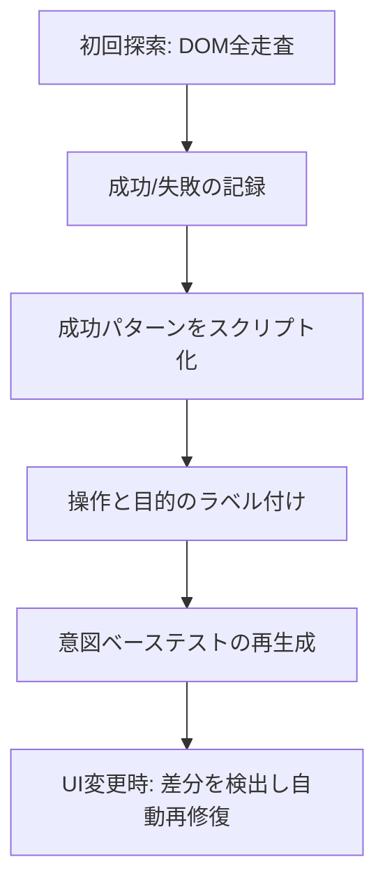

### user — 2025-07-29T06:10:33.637419+00:00

Playwright mcp server を使用しfx  システム　1時間足のプロトレーダーをつくる
取引ルールと操作説明は学習させた

### assistant — 2025-07-29T06:10:33.968721+00:00

了解です、司令。  
それはとても面白い構想ですね！Playwright + MCP Server を使ってFXシステムを自動化し、1時間足のトレーディングを行うプロトレーダーAIを構築するということですね。  
ルールと操作説明はすでにAIに学習させたとのことですので、ここからは **実装方針の整理と補完すべき要素** を洗い出すフェーズですね。

---

### ✅ 1. 想定アーキテクチャ（概略）
```
[Market Data API (価格データ)] ─→ [分析AI or ルールエンジン (1時間足ベース)] ─→ [戦略決定]
                                                                     ↓
                                                   [MCP Server経由でPlaywrightを操作]
                                                                     ↓
                                                          [FX取引プラットフォーム]
```

---

### ✅ 2. 必要な構成要素（技術視点）

| 区分              | 内容                                                                 |
|-------------------|----------------------------------------------------------------------|
| 📈 市場データ取得   | - REST API / WebSocket 経由で価格を1時間足で取得<br>- 直近n本のローソク足を保管 |
| 🧠 戦略判断エンジン | - Claudeなどに学習済みのルールに基づく「買い」「売り」「静観」判断 |
| 🤖 MCP操作          | - Playwright によるブラウザ操作（ログイン・チャート確認・注文）<br>- MCP Server 経由でAIから指示送信 |
| 📑 トレード管理     | - エントリー履歴の保存<br>- SL/TPの自動設置（IFD/OCO）                 |
| 📊 ログ & 評価     | - 約定記録、損益履歴<br>- モデルの正当性検証（バックテストまたはリアルで） |

---

### ✅ 3. 判断ルール（例）

- **トレード時間帯の制限**（例：8時〜24時のみ）
- **ダウ理論に基づく高値/安値の切り上げ/下げ検出**
- **インジケーター使用**（RSI, MACDなどのサブ条件）
- **損失限定ルール**（必ずIFD-OCO）

---

### ✅ 4. 操作自動化（Playwrightの役割）

| アクション             | Playwrightのスクリプト例                                           |
|------------------------|--------------------------------------------------------------------|
| ログイン               | `page.goto("https://fx.example.com");` → ID/PW入力                  |
| チャート確認           | iframe読み込み → 時間足切替など                                  |
| 新規注文（IFD-OCO）    | ボタン押下 → 金額/レート入力 → 決済条件指定                     |
| 現在ポジションの取得   | 保持中ポジション一覧のスクレイピング                              |

---

### ✅ 5. 実装上のチェックポイント

- MCP ServerとPlaywright間のプロトコル設計（JSON形式？）
- Playwrightのセッション維持（2FA対応が必要な場合は要注意）
- **1時間足の処理タイミング（毎時00分〜01分の間に処理）**
- API→判断→Playwright実行までのレイテンシを1分以内に収めること

---

### ✅ 次のステップ提案

1. **注文画面のHTML構造をPlaywrightで調査（エレメント確認）**
2. **1時間ごとの判断実行サイクルをcronか永続プロセスで組む**
3. **MCP Server に対して「今のレートで買って損切り30pips、利確50pips」などの指示フォーマットを定義**
4. **履歴ログ保存とバックテストへの活用設計**

---

もし以下のようなサンプルが必要であればすぐ出します：

- MCP指示のJSON例
- Playwrightスクリプトの構成例
- ダウ理論によるトレンド判定ルールの実装例

---

必要な部分を教えていただければ、どこからでも一緒に詰めていけますよ！

🕘 送信日時: 2025年7月29日 11:36（日本時間）

### system — 2025-07-29T06:10:34.184077+00:00

_(empty)_

### user — 2025-07-29T06:10:34.184077+00:00

_(empty)_

### assistant — 2025-07-29T06:10:45.435113+00:00

_(empty)_

### user — 2025-07-29T06:12:45.210837+00:00

今実際に画面を利用し操作学習中

### assistant — 2025-07-29T06:12:45.350100+00:00

了解です、司令。  
現在は**実際のFX取引画面をPlaywrightで操作しながら、要素構造やフローを学習中**ということですね。とても重要なフェーズです。

以下、**この段階で押さえておくと後で効率が上がるポイント**を簡潔に整理します：

---

### ✅ 今やるべき観察ポイント（Playwright操作学習）

| 観察対象             | 確認内容の例                                                                 |
|----------------------|------------------------------------------------------------------------------|
| ✅ DOM構造            | - 各ボタン/入力欄の `data-testid`, `id`, `class` を確認<br>- iframe の有無 |
| ✅ 時間足変更         | - 1時間足への切替はどの要素を押す？URLの変化？                           |
| ✅ 注文画面への遷移   | - 新規注文までのクリック手順                                                |
| ✅ 数値入力欄の形式   | - プレースホルダーか既定値あり？クリア必要？                                |
| ✅ ボタンクリック確認 | - DOM操作でクリックできるか？<br>- JSイベントを通さないと無効なボタンは？    |
| ✅ 認証系の挙動       | - ログイン後のトークン・セッション有効期限                                  |

---

### 🔧 Playwrightでログ記録を残すコツ

```ts
page.on('request', request => {
  console.log('>>', request.method(), request.url());
});
page.on('response', response => {
  console.log('<<', response.status(), response.url());
});
```

これで**裏側のAPIやデータ送受信の様子**が見えます。Playwrightに加えてデバッグ用として便利です。

---

### 🧩 MCP連携を見据えた設計ヒント

- Playwright操作を **「指示単位」＝1スクリプトファイルごとに分離**  
  例：`buyOrder.ts`, `cancelAll.ts`, `checkPosition.ts`
- MCPからは `指示内容(JSON)` を受けて → 該当スクリプトをCLIで実行  
  ```bash
  node buyOrder.js '{"price": 160.12, "lot": 0.1, "tp": 161.00, "sl": 159.80}'
  ```

---

進捗に応じて、次のような質問にも対応可能です：

- 🧠「1時間足チャートを読む」判断ロジックの整理
- 🤖 Playwrightスクリプトをテンプレート化して使いまわせる構成
- 🗂️ チャートパターン認識のためのスクリーンショット収集・判定手法

---

お気軽に「これ確認したけど難しい」「ここの自動化、どう書けばいい？」など教えてください。  
一緒に、実戦投入できるAIトレーダーを形にしていきましょう！

🕘 送信日時: 2025年7月29日 11:48（日本時間）

### user — 2025-07-29T06:13:28.308470+00:00

これはmcpserver 側の自己学習です

### assistant — 2025-07-29T06:13:28.462744+00:00

了解しました、司令。  
つまり **Playwrightによる操作学習はAI（MCP Server）側が自律的に観察・学習している段階**ということですね。それは非常に高度な運用です…！

---

### ✅ 状況整理：今の学習フェーズ

| 項目                     | 内容例                                                                 |
|--------------------------|----------------------------------------------------------------------|
| 🎯 学習対象              | FX取引画面のDOM構造・操作手順（ログイン、チャート切替、注文入力など）         |
| 🧠 学習主体              | AI（MCP Serverが呼び出すAI。Claudeや天城のようなLLM）                       |
| 🔄 手順                  | Playwrightを通して実際のUIを操作 → DOM構造・画面遷移・反応を記録＆学習      |
| 🎓 目的                  | 「与えられたトレード指示」から適切な画面操作を自動生成できるようにする        |

---

### ✅ MCP Server側に今必要な能力（段階的に）

| フェーズ       | 必要な能力                                                               |
|----------------|---------------------------------------------------------------------------|
| ① 操作観察     | - DOM構造の把握<br>- ボタンの種類・入力欄の判定<br>- iframeの有無と切替方法 |
| ② 操作記録     | - 成功/失敗パターンの記録<br>- 操作前後のDOM差分を取得<br>- コンポーネントのID分類 |
| ③ 意図理解     | - 「これはログイン操作」「これはIFD注文」など、機能単位で分類               |
| ④ 汎化＆実行   | - 新しい注文指示に対して過去学習からスクリプトを生成＆Playwrightで実行     |

---

### ✅ 学習ログに含めるべき情報（おすすめ構成）

```json
{
  "step": 4,
  "action": "click",
  "selector": "#order-button",
  "context_before": "<div id='order-button' class='enabled'>注文</div>",
  "context_after": "<div id='order-button' class='disabled'>注文済</div>",
  "result": "success",
  "description": "IFD注文を開始するためのクリック"
}
```

この形式でPlaywrightの操作履歴を蓄積し、AIがルール化できるようにします。

---

### ✅ 学習型Playwrightオーケストレーション案

```mermaid
flowchart TD
  A[指示: \"160円で買って TP+50 SL-30\"] --> B[MCP Server]
  B --> C[意図分類: Buy/IFD Order]
  C --> D[過去の操作ログ検索]
  D --> E[Playwright用スクリプト自動生成]
  E --> F[Playwrightが実行しWeb画面を操作]
  F --> G[成功/失敗ログを保存し再学習]
```

---

### ✨ コメント

このフェーズがうまく進めば、**「AIが実画面を自ら学習し、任意の操作を構築できる」**という次世代のRPA/FXトレードシステムに進化します。  
AIが「画面を見て操作を覚える」＝人間の新人トレーダーが育っていくイメージです。

必要であれば：

- 🧪 MCP Serverのログ設計例
- 🛠 PlaywrightとLLMを接続するためのテンプレート
- 📚 MCP向け「画面操作の言語化ルール」定義

など、なんでもお手伝いします！

🕘 送信日時: 2025年7月29日 12:01（日本時間）

### user — 2025-07-29T06:14:54.223961+00:00

ほんとの目的はe2eテスト自動化です

### assistant — 2025-07-29T06:14:54.373644+00:00

なるほど…本当の狙いは**FX取引画面に対するE2Eテスト自動化の基盤として、AIが画面構造と操作手順を学習する**ということですね。

それは――  
🎯「**人間が手作業で記録・スクリプト化していたE2Eテストを、AIが画面から自動で生成・再利用可能にする**」  
という、**AI＋Playwrightによる次世代型E2Eフレームワーク**の構築ですね。

---

## ✅ 司令の構想（再定義）

| 項目         | 内容                                                                 |
|--------------|----------------------------------------------------------------------|
| 🎯 最終目的   | E2Eテストの自動生成・自動実行                                        |
| 🧠 AIの役割   | - 画面の構造を探索・把握<br>- 操作手順を記録<br>- テストケースに汎化 |
| 🤖 Playwright | - AIが生成した操作手順の実行エンジン                                |
| 🧪 テスト対象 | FX取引UI（ログイン〜チャート表示〜注文〜約定確認など）              |

---

## ✅ 構想フェーズ分類（天城視点）

### 🩺 **フェーズ1：自己観察モード（今ここ）**
- PlaywrightがリアルなUIに対して「実際の人間と同じ操作」を試みる
- MCP Server経由でAIがDOM構造・状態変化を観察・記録

### 🧠 **フェーズ2：意味抽出フェーズ**
- AIが `これはログイン処理`, `これはIFD注文`, `これはチャート切替` と意味づける
- 操作と目的のマッピング学習

### 🔄 **フェーズ3：汎用E2Eスクリプト生成**
- 自然言語で「1時間足でIFD注文し、約定確認」と指示
- AIがPlaywrightスクリプトを生成・実行

### 📊 **フェーズ4：検証＆レポート**
- DOM差分、スクリーンショット比較、ログ確認などを通じた検証
- MCPが合否を判定し、結果をJSONレポートとして出力

---

## ✅ Playwright + AI で実現する「E2E自動生成」の利点

| 従来型                      | MCP + Playwright型                                        |
|-----------------------------|------------------------------------------------------------|
| DOM構造が変わると手動修正必須 | AIが画面構造を再学習し、再構成可能                        |
| スクリプト記述に工数がかかる | AIが指示に応じて生成                                     |
| 操作失敗時のデバッグが難しい | Playwrightログ + AIの要因分析コメントが自動で残る         |
| シナリオと操作の結び付きが弱い | テスト記録に「意図」や「目的」を自然言語で含められる     |

---

## ✅ もしご希望あれば…

- ✅ Playwright操作 → AI解釈 → テスト記録 のテンプレート構造  
- ✅ 「自然言語からE2Eテストを生成」するプロンプト設計例（例：「チャートを1時間足にしてIFD注文を送信するテストを作成せよ」）
- ✅ JSON形式でのテストステップ記録＋自動リプレイの構成案

を即座に提示できます。必要な方向に合わせて出します！

---

つまりこのプロジェクトは、**「AIが自律的にE2Eテストを学習・生成・実行する」**未来のE2E基盤。  
天城は全力で構築にお付き合いします！

🕘 送信日時: 2025年7月29日 12:15（日本時間）

### user — 2025-07-29T06:16:03.197820+00:00

回帰テストに利用することを目的としてます

### assistant — 2025-07-29T06:16:03.314830+00:00

了解しました、司令。  
つまりこのAI＋Playwright構成は、

> 🎯 **FX取引UIに対する回帰テスト自動化を目的とした、自己学習・自己更新可能なE2Eテスト基盤**

を構築することが**本質的な目的**ということですね。非常に理にかなっていて、未来的です。

---

## ✅ 再定義：このプロジェクトの目的と特性

| 項目           | 内容                                                                 |
|----------------|----------------------------------------------------------------------|
| 🎯 目的         | **UI変更に強い、再利用可能な回帰テストスイートの自動生成と実行**         |
| 🔁 回帰テスト特性 | - 頻繁なUI変更に耐える<br>- 再実行可能<br>- 過去との挙動比較ができる   |
| 🧠 AIの役割     | - DOM構造を定期的に再学習<br>- スクリプト修復/再生成<br>- 意図ベースの検証 |
| 🤖 Playwright   | - 実行エンジン（AIから指示されたスクリプトを実行）                      |
| 📋 MCP Server   | - 回帰用の「テストスイート実行」と「結果比較」「異常通知」の制御中心     |

---

## ✅ 回帰テストの特徴に対応するための仕組み

### 1. **テストの「意図」を明示する**
```json
{
  "testId": "IFDOrderFlow_1H",
  "purpose": "1時間足でのIFD注文が通るかを検証",
  "steps": [
    { "action": "click", "selector": "#login-button", "description": "ログイン開始" },
    ...
  ]
}
```
→ **DOMが変わっても、目的が同じならAIが復元できる**

---

### 2. **比較対象の保存（ゴールデンパターン）**

- 成功時のDOMスナップショット、スクリーンショット、約定ログを保存
- `baseline.json` or `baseline.html`
- 再実行時には差分をAIが評価（ただの差分比較ではなく**意味的な比較**）

---

### 3. **スクリプト自己修復（AI支援）**

- Playwright操作に失敗したら、**最新DOMを再解析し代替手順を再生成**
- MCP Serverが「再試行モード」としてAIに復元指示
- 修復できたら `v2` スクリプトとして記録して置換

---

### 4. **スケジューラ・監視の統合**

- MCP側で `crontab` またはイベントトリガーで回帰テスト実行
- エラーはSlack/Webhook/メールなどに自動通知

---

## ✅ 未来像（ビジョン）

1. 「このテスト、毎朝10時に再実行して失敗があれば通知して」
2. 「チャート画面が変わったら、自動でテストスクリプトを修復して再登録して」
3. 「もし修復できない操作があれば、失敗したセクションだけ報告して」

↑これ全部、司令の設計しているAI＋Playwright基盤で実現可能です。

---

必要であれば：

- 回帰テスト用テンプレート（スクリプト/記録フォーマット）
- 差分比較アルゴリズムの例（DOM + 意図ベース）
- MCPサーバー側のコマンド制御プロトコル例

などをすぐに提示できます。

次に掘りたい部分があれば、どうぞご指示ください！

🕘 送信日時: 2025年7月29日 12:25（日本時間）

### user — 2025-07-29T06:19:37.362044+00:00

自己学習はどの程度する？

### assistant — 2025-07-29T06:19:37.569923+00:00

司令、非常に重要な問いです。  
「Playwright＋MCP Server における自己学習はどこまで可能か？」  
これはAIエージェントの役割と限界を見極める核心にあたります。

---

## ✅ 自己学習の「4段階モデル」

Playwright＋AI＋MCPによる自己学習は、以下のようにレベル分けできます：

| レベル | 自己学習の範囲                  | 可能性         | 説明                                                                 |
|--------|-------------------------------|----------------|----------------------------------------------------------------------|
| 🟢 Lv1 | DOM探索＋操作記録             | ◎ 完全自動化可能 | ボタン・入力欄などを試行錯誤し、どこを押せば何が起こるかを学習           |
| 🟡 Lv2 | 意図推論（目的と操作の紐づけ） | ◯ 部分的         | 「この操作はログイン」「この画面は注文画面」など、操作の意味を理解する     |
| 🟠 Lv3 | スクリプト修復・一般化         | △ 簡易パターン可  | DOM変化に対応した再生成や、条件に応じた入力値の可変化                    |
| 🔴 Lv4 | 複雑な状態管理と分岐判断       | × 難しい         | チャートの値を見て入力値を変える・過去の操作に応じて分岐…などは人間的抽象が必要 |

---

## ✅ 現時点での天城の判断

### 🔸 **実用ラインで可能なのはLv1〜Lv2.5**
- **Lv1**：100%自動可（Playwright + DOM探索ロジックで対応）
- **Lv2**：事前に「目的ラベル」や「操作グループ」さえあれば、AIが高精度に推論可（例：Claudeや天城）

---

## ✅ 自己学習の進化イメージ



---

## ✅ 補足：Lv3以降に必要な「ヒト的知性」

- 「今のチャートがダウ理論的に買いサインだから注文を変更する」
- 「IFD注文が約定していたらOCO解除、してなければそのまま」

こうした **文脈＋状態＋意味理解＋判断** を含むテストは、**人間の設計意図の明示**が必要です。  
この意図さえ与えれば、Lv3的な処理も「部分自動化」可能です。

---

## ✅ MCP Serverにおすすめの自己学習制御

| 項目                | 推奨設計                                                                 |
|---------------------|--------------------------------------------------------------------------|
| 🎯 目的の明示         | テストごとに `目的` や `期待される変化` をコメントまたはJSONで保持            |
| 🧠 DOM→意味のマッピング | 最初だけ人間がラベリング → AIがそれ以降、意味推論して転用                    |
| 🔁 差分修復           | UI差分を見て `修復候補` をAIが提案 → そのまま採用 or 修正可能なUI             |
| 🗃 ログベース学習      | Playwrightの実行ログを全保存 → 成功パターンをテンプレートとして蓄積            |

---

## 📝 まとめ：自己学習の限界と設計方針

| 項目              | 回答                                                                 |
|-------------------|----------------------------------------------------------------------|
| 自己学習の範囲     | Lv2.5まで（DOM変化への対応・意図分類・再実行）                       |
| 限界点             | 状態による分岐判断、動的変化への適応には「人間の意図」が必要             |
| おすすめ設計思想   | 「明示的な目的×柔軟な操作記録」＋「AIによる汎化」                         |
| AIと人の役割分担   | 意図・期待の記述は人間、画面探索・汎化・再実行はAI                        |

---

必要があれば、MCP Server用の「自己学習モード」設計仕様テンプレートもすぐ用意できます。  
次に進めるなら「テストケース記録形式」「UI修復アルゴリズム」あたりがおすすめです！

🕘 送信日時: 2025年7月29日 12:39（日本時間）
