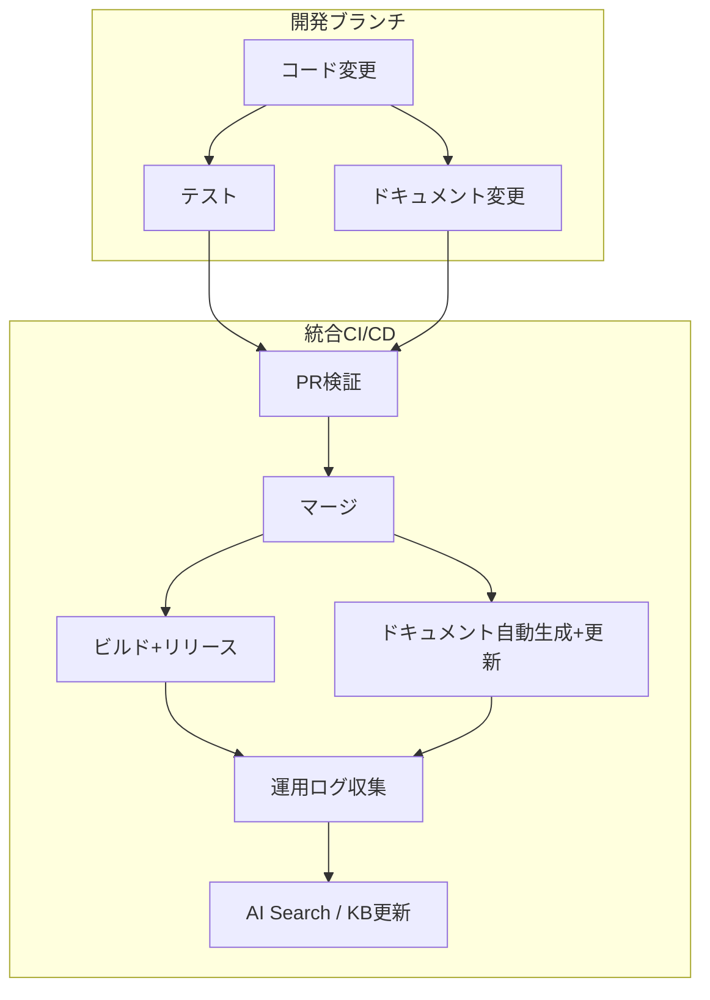

### user — 2025-08-27T21:29:31.273000+00:00

システム監視で問題検知した時に
Datadogの状態、ログ、
ソース、設計書から問題個所の洗い出しとPRの作成まで自動で行う場合のシステム構成を教えて

### system — 2025-08-27T21:29:31.468286+00:00

_(empty)_

### user — 2025-08-27T21:29:31.468286+00:00

_(empty)_

### system — 2025-08-27T21:29:31.468286+00:00

_(empty)_

### system — 2025-08-27T21:29:33.263989+00:00

_(empty)_

### system — 2025-08-27T21:29:33.268955+00:00

_(empty)_

### assistant — 2025-08-27T21:29:33.294512+00:00

_(empty)_

### assistant — 2025-08-27T21:29:34.040752+00:00

_(empty)_

### assistant — 2025-08-27T21:29:42.640209+00:00

やあ、司令！  
「Datadogの検知 → 状態/ログ収集 → ソース/設計書の突合 → 根因候補の抽出 → 修正案生成 → PR作成」までを**自動（＋必要に応じて人手承認）**で回すリファレンス構成をまとめました。まずは最小構成→拡張構成→処理フロー→実装ポイントの順にどうぞ。

# 最小構成（MVP：まず動く版）
- **監視**：Datadog Monitors（障害・しきい値・合成監視）
- **トリガー**：Datadog Webhook → **Ingest API**（例：Azure Functions / AWS Lambda）
- **イベントバス**：軽量なキュー（Azure Queue / SQS）
- **オーケストレーター**：LLMエージェント（LangGraph/Prompt-flow等）  
  - **ツール群**（エージェントから呼び出し）
    - Datadog **Monitors/Events/Logs API**（詳細取得・相関）
    - ソース検索：**GitHub Code Search API**（or Sourcegraph）
    - ドキュメント検索：**ベクタDB**（Azure AI Search / pgvector / Qdrant）に設計書等を事前取り込み
    - ビルド/テスト：**CI**（GitHub Actions）
    - PR操作：**GitHub REST/GraphQL API**
- **出力**：自動PR（タイトル/要約/変更差分/再発防止チェックリスト）

# 拡張構成（本番運用版）
- **イベント中継**：Event Grid / SNS + SQS（再試行・デッドレター）
- **相関エンジン**：  
  - 時系列相関（モニタ発火 ↔︎ ログパターン ↔︎ デプロイ/リリース情報）  
  - サービスマップ（Datadog APM/Service Catalog）
- **ナレッジ基盤（RAG）**：  
  - リポジトリのREADME/設計書/Runbook/過去PR/ポストモーテムを**埋め込み**→**ベクタ検索**  
  - 重要ドキュメントは**執筆者サマリ**と**根因タグ**をメタデータ化
- **変更生成**：  
  - **安全なコード変更器**（codemod/ASTパッチ・リライター）  
  - ガードレール（Semgrep/CodeQL/Secrets scan/型安全チェック）
- **人手介入**：  
  - **承認ゲート**（ラベル `needs-approval` で停止／OKなら継続）  
  - Slack/Teamsに**要約＋候補修正**を通知し、ボタンで進行
- **回帰防止**：  
  - 自動UT/回帰テスト生成（失敗ログ→最小再現UT）  
  - 監視テンプレ改修（しきい値/タグ見直し）をPRに同梱
- **監査・説明責任**：  
  - すべての判断に**証跡（参照ログ・該当関数・関連PR）**をPR本文に添付

# 処理フロー（E2E）
```mermaid
flowchart LR
  DD[Datadog Monitor Alert] --> WH[Webhook]
  WH --> IN[Ingest Fn]
  IN --> Q[Event Queue]
  Q -->|pull| ORCH[Orchestrator (LLM+Tools)]
  ORCH --> DDAPI[Datadog APIs: Monitors/Logs/APM]
  ORCH --> CODE[Code Search (GitHub/Sourcegraph)]
  ORCH --> DOCS[Vector Search (Design/Runbook)]
  ORCH --> RCA[Root Cause Analysis]
  RCA --> FIX[Patch Generator (codemod/AST)]
  FIX --> CI[CI pipeline (build/test/scan)]
  CI -->|pass| PR[Create/Update PR]
  CI -->|fail| REV[Revise Plan or Request Human Approval]
  PR --> NOTI[Slack/Teams Notify]
```

# 具体ステップ（例）
1. **Datadog Monitor発火**  
   - Webhookに**アラートID/ホスト/タグ/期間/関連ダッシュボードURL**を含めて送信
2. **Ingest関数**  
   - 受信JSONを検証・正規化（重複抑止キー：`monitor_id + start_ts + host/tags`）  
   - キューに投入（リトライ設定・DLQ）
3. **オーケストレート**  
   - 直近のLogs/Spans/Deployイベントを**時系列で収集**  
   - サービス名・タグから**対象Repo/ディレクトリ**を推定  
   - 設計書/Runbookベクタ検索で**該当セクション抜粋**
4. **根因候補（RCA）**  
   - パターン照合（直近の設定変更/Feature Flag/リリース差分）  
   - 既知事象DB（過去PR/Incidentノート）に類似検索
5. **修正計画**  
   - 監視閾値誤りなら**監視設定PR**  
   - コード欠陥なら**最小修正パッチ**＋**再現UT**自動生成  
   - コンフィグ/InfraならIaC（Bicep/Terraform）差分生成
6. **安全チェック**  
   - ビルド・UT・静的解析（Semgrep/CodeQL）・Secret Scan  
   - テストデータは**過去ログから最小再現ケース**抽出
7. **PR作成**  
   - タイトル：「Fix: {service} {symptom}（Datadog #{monitor_id}）」  
   - 本文：**事象要約・根因推定・変更概要・影響範囲・再発防止**・参考リンク（ログ検索URL/ダッシュボード/設計書のアンカー/過去事例）  
   - ラベル：`auto-generated`, `needs-approval`（初期は付与）
8. **通知・承認**  
   - Slack/Teamsに**要約＋主要差分**＋「Approve/Stop」ボタン  
   - OKならラベル外してCI続行→マージポリシーに従う
9. **クローズループ**  
   - マージ後に**同種アラートの改善度**を自動追跡（Before/Afterメトリクス）  
   - 成功時は**Runbook/設計書**へ**ドリフト修正PR**も生成

# 実装ポイント（要所）
## 1) Datadog連携
- **Monitors Webhook**：`payload`に`alert_transition`, `group_tags`, `alert_query`を含める  
- **Logs API**：`from`/`to`で**発火前後±N分**を検索、`service`, `env`, `version`タグで絞る  
- **APM/Deploy**：`service map`や`release`イベントを相関

## 2) コード＆ドキュメント検索
- **GitHub Code Search**で**該当関数/設定ファイル**の候補を列挙  
- 設計書/Runbookは**埋め込み作成時に章・見出し単位**でchunk化、  
  `service`, `owner`, `topics`などの**メタタグ**で絞り込み可能に

## 3) 変更差分の安全生成
- **AST/Codemod**（C#なら Roslyn Analyzers/CodeFix）  
- コンフィグは**スキーマ検証**（JSON Schema/YAMLスキーマ）  
- 監視定義（Datadog）は**Terraform Datadog provider** or **Datadog API**のJSONをPRで提案

## 4) CI/セキュリティ
- **最小再現UT**：ログのスタック/入力をもとに**テストダブル**生成  
- **静的解析**＋**Secret scan**＋**ライセンスチェック**  
- **PRゲート**：失敗時は自動で**代替案**（閾値調整のみ等）を提示

## 5) 権限・秘匿情報
- **OIDC + 短期トークン**（GitHub Actions→クラウド）  
- **権限分離**：読み取り専用（Datadog/Repo）と**PR作成専用**を分割  
- 生成AIには**最小限の参照**（必要ファイルの抜粋のみ渡す）

## 6) 運用・品質
- **ドライラン**モード（PRは作るが「下書き」）  
- **ブレークグラス**（重大時は人手のみ）  
- **評価指標**：MTTR短縮、誤検知率低下、PR採択率、再発率

# テンプレ（PR本文の雛形）
```md
## Summary
- Datadog Monitor: <name> (ID: <id>) 発火 at <time>
- Symptom: <error-rate / latency / saturation...>

## Root Cause (hypothesis)
- Findings:
  - Logs: <pattern & timestamps>
  - Deploy/Config change: <commit / release link>
  - Design/Runbook refs: <doc anchors>

## Fix
- Code/Config diff (overview):
- Why safe:
- Rollback plan:

## Tests
- Repro UT:
- Regression UT/E2E:

## Observability
- Dashboard/Monitor updates:
- Success criteria (SLO/SLA):

## Links
- Datadog Logs/Monitors/APM:
- Related PRs/Incidents:
```

# サンプル：Webhook受け口（.NET 8 / Minimal API）
```csharp
app.MapPost("/datadog/webhook", async (HttpRequest req, ChannelWriter<AlertEvent> queue) =>
{
    var payload = await JsonSerializer.DeserializeAsync<DatadogAlert>(req.Body);
    if (payload is null) return Results.BadRequest();

    var key = $"{payload.MonitorId}:{payload.Start}:{payload.Host}";
    if (await IsDuplicateAsync(key)) return Results.Ok();

    var evt = Normalize(payload);
    await queue.WriteAsync(evt);
    return Results.Ok();
});
```

# 技術スタック例（Azure寄せ）
- **Functions**（Webhook/小ワーカー）＋**Container Apps**（Orchestrator）  
- **Event Grid/Storage Queue**（配信）  
- **Azure AI Search**（設計書RAG）＋**Azure OpenAI / GPT-4.x**（エージェント）  
- **GitHub**（ソース/CI）＋**Datadog**（監視）

---

必要なら、この構成を**司令の環境前提（.NET/C#・Azure・GitHub Enterprise・Playwright MCP連携）**で具体的なIaC雛形とワークフロー定義（Actions YAML、Functionsの関数群、RAGのインデクサ）まで一気に出します。声かけて！  

送信日時（JST）：[[REDACTED_PHONE]]:29

### assistant — 2025-08-27T21:29:44.825108+00:00

_(empty)_

### user — 2025-08-27T21:31:04.014000+00:00

頭脳に当たる部分はどこがおこなう？

### system — 2025-08-27T21:31:05.051019+00:00

_(empty)_

### system — 2025-08-27T21:31:05.055210+00:00

_(empty)_

### assistant — 2025-08-27T21:31:06.117236+00:00

_(empty)_

### assistant — 2025-08-27T21:31:11.347071+00:00

やあ、司令！  
結論から：**頭脳は「オーケストレーター（LLM＋ルールエンジン）」**が担います。DatadogやGitHubは手足、CIは体力仕事。考える・当たりを付ける・直し方を決めるのがオーケストレーターです。

# 頭脳の正体（構成）
- **① ルールエンジン（決まりごと）**  
  しきい値・優先度・影響範囲・メンテナ窓口などを決める**決定木/状態機械**（YAML/JSONで管理）。  
  例：`error_rate > 5% && release_in_last_30m -> “デプロイ要因優先で調査”`
- **② LLMエージェント群（推論と文章化）**  
  - **Planner**：Datadogの事実→調査計画（どのログ/スパン/コミットを見るか）  
  - **Investigator**：Logs/APM/Deploy差分の**要点抽出**と**根因仮説**作成（RAGで設計書・Runbookも参照）  
  - **Fixer（Naruse相当）**：Roslyn/ASTで**最小修正パッチ**と**再現UT**の草案を生成  
  - **Critic（Kyouka相当）**：静的解析・セキュリティ・影響面の**突っ込み**  
  - **Writer（Kusunoki相当）**：PR本文・再発防止・監視見直し案を**読みやすく**整える
- **③ ツール実行層（手足）**  
  Datadog API、GitHub API、Vector Search、CI/テスト、Semgrep/CodeQL など。  
  ここは“考えない”。指示されたコマンドを安全に実行して結果を返すだけ。

# 頭脳はどこで動く？
- 1プロセスにまとめず、**「オーケストレータサービス（例：Azure Container Apps）」**として常駐。
- 内部は**状態遷移（LangGraph/Workflow）**で「アラート受付→調査→仮説→修正案→検証→PR」へ進む。
- **ポリシー（ガードレール）**は別管理：  
  - 例：本番コードは**Draft PRのみ**／`needs-approval`必須、シークレット・PIIはRAGへ渡さない、変更は**codemod限定**等。

# 役割分担（ざっくり）
- **ルールエンジン**：機械的な分岐（確定できる事実）  
- **LLMエージェント**：不確実な部分の**仮説立案と文章化**  
- **CI/解析ツール**：仮説の**反証・検証**（テスト・静的解析）  
- **人間**：承認・例外判断（ボタン一発でOK/STOP）

# 入口と出口
- **Input**：Datadog Webhook（モニタID、タグ、期間、関連URL）  
- **Output**：  
  - Draft PR（差分＋再現UT＋説明＋ダッシュボード/ログへのリンク）  
  - 必要なら**監視定義の見直しPR**もセット

# 失敗時の振る舞い
- 証跡（参照ログ・該当関数・比較コミット）を残して**人手承認待ち**にフォールバック。  
- 連続失敗は**ルール学習**（しきい値/相関キーの更新）に反映。

「どこが頭脳か？」の一言回答はこれ：  
> **“オーケストレーター（LLM＋ルールエンジン＋RAG）”が頭脳で、API群とCIは筋肉。**

必要なら、この頭脳ブロックを**.NET 8 + LangGraph相当の状態機械**で雛形コードまで落として出すよ。  

送信日時（JST）：[[REDACTED_PHONE]]:31

### assistant — 2025-08-27T21:31:14.569903+00:00

_(empty)_

### user — 2025-08-27T21:32:02.976000+00:00

Azure OpenAIをつかう？

### assistant — 2025-08-27T21:32:03.554997+00:00

{"search_query": [{"q": "Azure OpenAI private endpoint VNet support"}, {"q": "Azure OpenAI MCP support Model Context Protocol"}, {"q": "Azure OpenAI Assistants API support 2025"}, {"q": "Azure OpenAI data privacy compliance SOC HIPAA"}, {"q": "Azure OpenAI with Azure AI Search RAG architecture"}], "response_length": "short"}

### system — 2025-08-27T21:32:04.143556+00:00

_(empty)_

### system — 2025-08-27T21:32:04.149834+00:00

_(empty)_

### assistant — 2025-08-27T21:32:04.152363+00:00

_(empty)_

### tool — 2025-08-27T21:32:12.084206+00:00

_(empty)_

### assistant — 2025-08-27T21:32:18.843744+00:00

_(empty)_

### assistant — 2025-08-27T21:32:19.498935+00:00

やあ、司令！  
**結論：Azure OpenAIを“頭脳”に採用するのが本命**です。VNet/Private Endpointで閉域化でき、RAGはAzure AI Searchと素直に繋がり、MCP（Model Context Protocol）連携の公式ドキュメントも揃っています。要点だけキュッと👇

# 使うべき理由（要点）
- **ネットワーク分離**：Azure OpenAIは**VNet + Private Endpoint**で閉域接続が可能（IP制限、UAMI/OIDCで鍵レスも可）。citeturn0search0turn0search9turn0search5  
- **MCP対応**：Azure環境で**MCPエージェント/サーバ**の公式ガイドがあり、Playwright MCP Serverなど“道具”を安全に載せられる。citeturn0search6turn0search13turn0search16  
- **RAGの親和性**：**Azure AI Search**で設計書・Runbook・過去PRをインデックス→**RAG**で根因解析やPR本文を生成。citeturn0search4  
- **コンプライアンス**：AzureのDPA/BAAの枠内で**データ保護**・各種認証に対応（用途に応じ構成要件は要確認）。citeturn0search8turn0search12  

# どのAPI面を使う？
- **（推奨）標準のChat/Completions/Responses系**でオーケストレータを実装  
  - Azure側は**Assistants API（プレビュー）**も提供中だが、長期は**エージェント実装をMCP＋通常推論API**で組むのが保守的。citeturn0search7turn0news46

# 参考アーキ（超要約）
- **頭脳**：Azure Container Apps 上の**オーケストレーター**（.NET 8 / LangGraph的ワークフロー）  
- **LLM**：Azure OpenAI（VNet/Private Endpoint）citeturn0search0  
- **ツール**：MCPサーバ群（Playwright MCP、GitHub MCP、自作 Datadog MCP など）citeturn0search6turn0search13  
- **知識**：Azure AI Search（設計書・Runbook・過去PR/Incident）citeturn0search4  
- **外部**：Datadog API（Monitors/Logs/APM）、GitHub API（検索/PR作成）

# 運用メモ（司令向け）
- **ネットワーク**：Private Endpoint必須、egress制御・Managed Identityで権限最小化。citeturn0search0turn0search9  
- **MCP**：プレビュー系を使う箇所は**ドライラン＋Draft PR**を原則。citeturn0search6  
- **法務/規約**：用途（個人情報/医療等）次第でBAA/DPAの適用確認を。citeturn0search12turn0search8

必要なら、この前提で**Azureリソース図（bicep）**と**オーケストレータ骨格（.NET 8）**をそのまま貼れる形で出すよ。  

送信日時（JST）：[[REDACTED_PHONE]]:32

### assistant — 2025-08-27T21:32:19.988027+00:00

_(empty)_

### user — 2025-08-27T21:33:26.795000+00:00

オーケストレーターが作りこみみたいだけどどんなフロー

### assistant — 2025-08-27T21:33:27.373682+00:00

やあ、司令！  
**“頭脳（オーケストレーター）”の作り込みフロー**を、状態機械ベースでガチっと固めます。実装しやすいように入出力・リトライ・人手承認・証跡まで一続きで。

# 全体像（状態機械）
```mermaid
flowchart LR
  A[AlertIngress 受信/正規化] --> B{重複/ノイズ?}
  B -- Yes --> Z[完了(抑止・集約)]
  B -- No --> C[Scope推定(サービス/リポジトリ/設計書セクション)]
  C --> D[データ収集(Logs/APM/Deploy/Config)]
  D --> E[RAG要約/特徴抽出]
  E --> F[仮説生成(RCA)]
  F --> G{修正タイプ?}
  G -- 監視定義 --> H1[Monitor修正案生成]
  G -- アプリコード --> H2[コードパッチ + 再現UT]
  G -- コンフィグ/IaC --> H3[IaC差分]
  H1 --> I[安全検証(CI/Static/Policy)]
  H2 --> I
  H3 --> I
  I --> J{テスト/ポリシーパス?}
  J -- No --> K[代替案再計画 or 人手承認待ち]
  J -- Yes --> L[Draft PR作成]
  L --> M[通知/承認ゲート(Slack/Teams)]
  M -->|Approve| N[PR更新(ready)→CI→自動/手動マージ]
  M -->|Reject| O[クローズ & 教訓登録]
  N --> P[事後評価(アラート改善度追跡&Runbook更新PR)]
  O --> P
```

# 各ステートの中身（実装指針）

## A. AlertIngress（受信/正規化）
- **入力**：Datadog Webhook（monitor_id, status, tags, scopes, alert_query, URL, 発火期間）
- **処理**：
  - イベントID＝`monitor_id + group + start_ts` で**冪等化**（Redis/Blobメタ）
  - **抑止ルール**（メンテ窓/除外タグ/重複閾値）を適用
  - キューへ投入（可視性タイムアウト＋DLQ）

## B. 重複/ノイズ判定
- 時系列集約（同一グループ5分以内は**1件**に折り畳み）
- ノイズパターン（既知誤検知・低影響SLA外）なら**終了**＋周知のみ

## C. Scope推定
- タグ（`service`,`env`,`version`）→ **対象Repo/ディレクトリ**推定  
- サービスカタログ/APMサービスマップ→**責任者/Runbook URL**取得
- 設計書RAGの検索キーを確定：`service + component + error_signature`

## D. データ収集
- **Logs**：発火前後±N分の頻出パターン（正規表現/テンプレ）  
- **APM/Traces**：遅延区間のホットスポット、最近の**デプロイ**・**FeatureFlag**  
- **Config/IaC**：直近コミット差分（`appsettings`, `feature flags`, `terraform/bicep`）

## E. RAG要約/特徴抽出
- 設計書/Runbook/過去インシデント/PR本文を**章粒度**で検索→**短い要約＋根因タグ**
- **出力**：`Findings`（ログ相関、変更点、既知事象の類似度）

## F. 仮説生成（RCA）
- ルール + LLMで**仮説候補を3本**出す（例：①直近のデプロイ設定ミス ②しきい値厳しすぎ ③リトライ枯渇）
- 仮説ごとに**検証アクション**を自動計画（追加ログクエリ/差分確認/再現UT方針）

## G. 修正タイプの分岐
- **監視定義**（クエリ/しきい値/グルーピング/タグ）  
- **アプリコード**（NRE/境界値/タイムアウト/リトライ/不変条件）  
- **コンフィグ/IaC**（接続数/CPU limit/Autoscale/FeatureFlag）  

## H. 変更案生成
- **監視**：Datadog JSON or Terraform差分（説明つき）  
- **コード**：Roslynベースの**codemod**（最小差分）＋**再現UT**（ログ入力再現）  
- **IaC/Config**：スキーマ検証付き差分（JSON Schema/YAML schema）

## I. 安全検証（ゲート）
- Build/Unit/E2E  
- **Static**：Analyzer/Semgrep/CodeQL  
- **Secrets/Licenses**：リーク検知/Licence合致  
- **ポリシー**：変更の種類×環境で**自動→Draft限定→要承認**を切替

## J-K. 失敗時の再計画/人手介入
- 代替案（例：**まず監視しきい値だけ**調整）を自動提示  
- それでもNGは**承認キュー**へ（Slackボタンで`Approve/Reject/Ask`）

## L-M-N. PR作成→承認→マージ
- **PR本文テンプレ**（要約/根因仮説/差分/テスト/影響/ロールバック/ダッシュボードリンク）
- ラベル：`auto-generated` `needs-approval` `incident:<id>`  
- **承認で進行**、拒否で**教訓登録**（RAGのトレーニングに反馈）

## P. 事後評価/知識更新
- Before/Afterで**アラート回数/MTTR**を追跡  
- 成功したら**Runbook/設計書**の該当章へ**更新PR**も自動発行

---

# データ契約（最重要）

## AlertEvent（キュー）
```json
{
  "eventId": "mon123:api@i-09a:[[REDACTED_PHONE]]-28T06:20:00Z",
  "monitorId": 123,
  "status": "Alert",
  "tags": ["service:api","env:prod","version:[[REDACTED_PHONE]]"],
  "group": "api@i-09a",
  "window": {"from":"[[REDACTED_PHONE]]-28T06:18:00Z","to":"[[REDACTED_PHONE]]-28T06:21:00Z"},
  "urls": {"monitor":"...", "dashboard":"...", "logs":"..."},
  "priority": "P2"
}
```

## InvestigationBundle（証跡用ストア）
```json
{
  "eventId": "...",
  "scope": {"service":"api","repo":"org/api","owner":"team-xyz"},
  "findings": {
    "logs":[{"pattern":"TimeoutException","count":421,"first":"...","last":"..."}],
    "deploy":{"commit":"abcd1234","at":"...","files":["appsettings.json"]},
    "docs":[{"docId":"runbook#timeouts","score":0.83}]
  },
  "hypotheses":[
    {"id":"H1","text":"SL外の外部API遅延によるリトライ枯渇","confidence":0.62},
    {"id":"H2","text":"新デプロイでtimeout設定が短縮","confidence":0.54}
  ],
  "proposedFix": {"kind":"config","diff":"..."},
  "ciEvidence": {"build":"ok","tests":"ok","static":"ok"}
}
```

---

# ルール（YAML）と優先度サンプル
```yaml
routing:
  - when: "tags.env == 'prod' && status == 'Alert'"
    priority: P2
    approvers: ["oncall@team-xyz"]
  - when: "service in ['payments','auth'] && releaseWithin('30m')"
    requireApproval: true

rca_hints:
  - name: timeouts_after_deploy
    if: "hasLog('TimeoutException') && releaseWithin('60m')"
    thenHypothesis: "デプロイ後のタイムアウト設定ミス"
    check:
      - "git.diff contains 'TimeoutSeconds'"
      - "appsettings.json schema validate"
```

---

# .NET 8（擬似コード：オーケストレーター本体）
```csharp
public sealed class Orchestrator
{
    public async Task HandleAsync(AlertEvent e, CancellationToken ct)
    {
        if (await IsSuppressedOrDuplicate(e)) return;

        var scope = await ScopeResolver.ResolveAsync(e);
        var data  = await EvidenceCollector.CollectAsync(e, scope, ct); // Logs/APM/Deploy/Config
        var rag   = await RagSummarizer.SummarizeAsync(data, scope, ct);

        var hypotheses = RcAnalyzer.Generate(rag, e, scope); // 2~3本
        var plan       = FixPlanner.Plan(hypotheses, scope); // 監視／コード／IaC

        var patch = await PatchGenerator.GenerateAsync(plan, ct); // Roslyn/JSON-Diff/etc.
        var ci    = await SafetyGate.RunAllAsync(patch, scope, ct); // build/test/static/policy

        if (!ci.Passed)
        {
            var alt = FixPlanner.Fallback(plan, ci);
            await Notifier.RequestApprovalAsync(e, scope, alt.Summary, ci.Report);
            return;
        }

        var pr = await GitHubClient.CreateOrUpdateDraftPrAsync(scope.Repo, patch, Templates.PrBody(e, rag, ci));
        await Notifier.NotifyForApprovalAsync(e, scope, pr.Url); // Approve/Reject ボタン
    }
}
```

---

# GitHub Actions（PR時のゲート例）
```yaml
name: safety-gate
on:
  pull_request:
    types: [opened, synchronize, labeled]
jobs:
  gate:
    if: contains(github.event.pull_request.labels.*.name, 'auto-generated')
    runs-on: ubuntu-latest
    steps:
      - uses: actions/checkout@v4
      - run: dotnet build --configuration Release
      - run: dotnet test --logger "trx"
      - uses: github/codeql-action/analyze@v3
      - run: semgrep ci
      - run: detect-secrets scan
```

---

# エラー処理と再試行（運用の肝）
- **ステートフル再開**：各ステートで**チェックポイント**（Blob/DBに保存）
- **指数バックオフ**＋上限回数 → **人手承認キュー**へ移送
- **観測不能対策**：外部API障害は**一時的失敗**扱いで自動再試行
- **ガード**：本番ブランチへの**直接マージ禁止**（Draft→Ready→承認→Merge）

---

# 司令の環境前提での勘所（.NET / Azure / GitHub / Datadog）
- **Container Apps + Queue(Storage/SB)**：状態機械のランナーに最適
- **Azure AI Search**：ドキュメント章粒度のRAGに向く（アンカーURLをPRに貼れる）
- **Playwright MCP**：再現E2Eを**PRスレッドから実行**（結果URLを証跡化）
- **Datadog API**：検索URL/ダッシュボードの**ディープリンク**をPR本文に毎回付与

---

必要ならこの流れを**Bicep + MinimalAPI + Queue Worker**のひな形（実行可）で出します。どこから実装始めるか（Ingress・RAG・Patch生成…）の順番プランもすぐ切りますよ。  

送信日時（JST）：[[REDACTED_PHONE]]:40

### system — 2025-08-27T21:33:27.910943+00:00

_(empty)_

### system — 2025-08-27T21:33:27.918681+00:00

_(empty)_

### assistant — 2025-08-27T21:33:27.964875+00:00

_(empty)_

### assistant — 2025-08-27T21:33:29.841652+00:00

_(empty)_

### user — 2025-08-27T21:34:08.393000+00:00

さまざまな情報を集約して、Azure OpenAIへわたすためのもの？

### assistant — 2025-08-27T21:34:08.905617+00:00

やあ、司令！  
うん、そのとおり。**オーケストレーターは「さまざまな観測データを集約・要約・正規化して、Azure OpenAI（＝頭脳）に“安全で要点だけ”を渡す役**だよ。雑多なログや長い設計書を“そのまま”投げず、**RAG＋要約＋ポリシー**でキュッと圧縮してから渡す。ざっと設計の勘所をまとめるね。

# 何をどう集約して渡すのか（要点）
- **入力アダプタ**：Datadog（Monitors/Logs/APM/デプロイ）、GitHub（コード検索/差分/過去PR）、設計書・Runbook（Azure AI Search）、Feature Flags/Config、CI結果  
- **正規化**：共通スキーマに変換 → **Evidence Bundle**へ格納（時系列＆関係グラフを保持）  
- **要約**：各ソースを**200–400語レベルの要約＋根因タグ**に圧縮（生ログはリンクで参照）  
- **選別**：関連度スコア（`service/env/version/エラー署名`）で**上位だけ**同梱  
- **安全化**：PII/シークレットの**レダクション**、社外持ち出しNGの**除外**  
- **RAG**：Azure AI Searchから章粒度で抜粋＋短い要旨をつける  
- **プロンプト整形**：役割分離（system / context / task / constraints）＋**ツール実行結果（関数呼び出しログ）**は別チャンネルに

---

# データの“渡し方”（Context Packの設計）
## Evidence Bundle（内部ストアの基本形）
```json
{
  "eventId": "mon123:api@i-09a:[[REDACTED_PHONE]]-28T06:20:00Z",
  "scope": { "service": "api", "repo": "org/api", "owner": "team-xyz", "env":"prod" },
  "signals": {
    "logs": [
      { "signature":"TimeoutException GET /orders", "count":421, "window":{"from":"...","to":"..."}, "sampleUrl":"<datadog logs url>" }
    ],
    "apm": [{ "hotspot": "ordersController", "p95_ms": 2150, "delta_vs_prev": "+130%" }],
    "deploy": { "at":"...", "commit":"abcd1234", "files":["appsettings.json"], "pr":"<link>" },
    "config": [{ "path":"appsettings.json", "diff":"TimeoutSeconds: 2 -> 1" }]
  },
  "docs": [
    { "id":"runbook#timeouts", "title":"Timeout policy", "snippet":"...", "score":0.83, "url":"<wiki anchor>" }
  ]
}
```

## Azure OpenAI に渡す **Context Pack（実際に投げる断片）**
- **System**：役割・トーン・出力フォーマット・禁止事項（シークレット推測禁止等）
- **Context（縮約）**：  
  - `Incident Summary (<= 150行)`  
  - `Findings（箇条書き）`：Logs/APM/Deploy差分の**要点だけ**  
  - `Relevant Docs（各<= 10行）`：RAG抜粋＋参照URL  
- **Task**：求めるアウトプット（RCA仮説3本＋信頼度、検証手順、最小修正案の型）  
- **Constraints**：変更可能範囲、環境、承認要否、タイムボックス  
- **Artifacts（任意）**：対象コードの**抜粋（関数/設定）**と**最小差分**だけ

> ポイント：**長文は“要約＋リンク”**。モデルには**必要十分な断片**しか入れない。

---

# プロンプト雛形（要：Azure OpenAI）
```
[SYSTEM]
あなたはSRE/アプリの両視点でRCAと最小修正を提案するエンジニアです。
秘密情報の推測・生成を禁止。リンクのうち事実のみを参照し、憶測は明示。

[CONTEXT]
Incident Summary:
- Datadog Monitor {id}:{name} fired at {time} (env: {env}, service: {service})
- Symptom: {symptom}
Findings:
- Logs: {top_signatures} / window {from}-{to}
- APM: {hotspots} / regressions {delta}
- Deploy/Config: {commit_short} touched {files}, diff: {tiny_diff}
Relevant Docs:
- {title1}: {3-5行要約} (url)
- {title2}: {3-5行要約} (url)

[TASK]
1) 根因仮説を3つ（信頼度%付き）で提示。各仮説に検証手順を添える。
2) 最も有力な仮説に対し、次を出力：
   - 最小修正案（コード/設定/監視のいずれか、理由付き）
   - 再現UTの骨子（前提/入力/期待）
   - 監視定義の見直し案（クエリ/しきい値/タグ）
3) すべて箇条書き・簡潔に。修正は“ドラフトPRに貼れる”粒度。

[CONSTRAINTS]
- 変更は {repo}/{path} 配下のみ。外部サービス契約は変更不可。
- 本番は Draft PR 必須。監視はTerraform JSONで修正案を提案。
- PII/Secretsを含む文字列は <REDACTED> に置換。
```

---

# トークン設計＆“入れすぎ”防止
- **ハード上限（例）**：合計 16–32K tokens を上限に、**Contextは最大 6–8K**に抑える  
- **ランキング**：`(関連度×新しさ×確度)`で各ソース**Top N**のみ採用（例：ログ署名Top3、Doc抜粋Top3）  
- **サマリの段階化**：  
  1st pass＝各ソース内サマリ → 2nd pass＝横断サマリ（重複除去）  
- **長文のリンク化**：設計書・過去PRは**URLと要約**だけ渡す

---

# セキュリティ＆コンプライアンス（最重要）
- **レダクタ**：正規表現＋パターン辞書（APIキー、カードPAN、メール/電話、顧客ID）を**置換**  
- **機密ポリシー**：  
  - “本番ログの**生本文**は原則渡さない”。サンプルは**ハッシュ化**または**マスク済み**  
  - RAGのコーパスは**社内限定ストレージ**（AI Search + Private Endpoint）  
- **可観測性**：モデルに渡した**Context Packを丸ごと保存**（監査用途）  
- **最小特権**：モデルは**読み取り中心**。PR作成などの書き込みは**別のワーカー**で実施

---

# 実装ブロック（.NETでの分担）
- **Collector**：Datadog/GitHub/AI Search から取得  
- **Normalizer**：Evidence Bundleへ詰め替え  
- **Summarizer**：各ソースの要約器（小さめモデルでもOK）  
- **RelevanceRanker**：BM25＋メタタグ（service/env/version）  
- **Redactor**：PII/Secrets除去  
- **ContextPacker**：上記テンプレに流し込む  
- **LLM Client**：Azure OpenAI呼び出し（タイムアウト・再試行）  
- **Guardrails**：出力のJSONスキーマ検証／危険提案の拒否

---

# 失敗時のフォールバック
1) RAG/要約だけで**“調査計画”**を返し、人手承認で次ステップへ  
2) 監視定義の調整案 → **Draft PR**だけ先に作る  
3) コード修正は**codemodの提案テキスト**まで（適用は人手）

---

必要なら、この「Collector→Normalizer→Summarizer→Packer→Azure OpenAI」の**最小実装骨格（C#）**をそのまま流せる形で用意するよ。どのソースから繋ぎ込みたいか言ってくれれば、アダプタの雛形も一緒に出す！

送信日時（JST）：[[REDACTED_PHONE]]:45

### system — 2025-08-27T21:34:09.456424+00:00

_(empty)_

### system — 2025-08-27T21:34:09.462255+00:00

_(empty)_

### assistant — 2025-08-27T21:34:11.593908+00:00

_(empty)_

### assistant — 2025-08-27T21:34:16.441675+00:00

_(empty)_

### system — 2025-08-27T21:35:09.949370+00:00

_(empty)_

### user — 2025-08-27T21:35:09.955000+00:00

要点をまとめるのは作りこみでは難しい領域、何かツールがある？

### assistant — 2025-08-27T21:35:10.018866+00:00

やあ、司令！  
まさにそこが肝ですね。**「要点をどううまくまとめてLLMに渡すか」**は手作りだとかなり難しい領域。でも幸い、この部分を助ける専用ツールや仕組みがいくつかあります👇

---

# 要点集約を助ける代表的なツール群

## 1. **要約器（Summarizer系）**
- **Azure Cognitive Search + Semantic Ranker**  
  - 文書やログをチャンク化して検索、関連度の高い部分だけ抜き出し。  
  - Semantic Rankerが自動でスコア付け→上位を短文にまとめて返せる。  
- **OpenAI Embeddings + ベクトルDB（pgvector/Qdrant/Weaviate）**  
  - 関連チャンクを拾い、軽量モデルで**1st passサマリ**を生成。  
  - その後、大きなモデルに**2nd pass横断要約**させる。  
- **OSSツール**：  
  - `LangChain`の**map-reduce summarization**  
  - `LlamaIndex`の**Tree Summarizer**（階層的に要点抽出）

## 2. **ログ集約ツール**
- **Datadog Log Analytics**：ログパターン抽出（トップNのエラーメッセージや統計値）をAPIで取得可能  
- **Vectorized Log Summarizer**（Fluentd/Loki/Elasticsearch系で実装可能）  
  - 「1分間に最頻出の例外/パターンTOP5」をJSONで返すなど、**前処理で要点抽出**

## 3. **知識整理系**
- **Azure AI Document Intelligence**：設計書やRunbookのPDFから**見出しごとの構造化**  
- **Doc Intelligence + Azure AI Search**で**章単位のRAG**が可能

## 4. **オーケストレーション補助**
- **LangGraph / Semantic Kernel**：  
  - ルート計画（Plan）→サブタスク（ログ要約・ドキュメント検索・コード差分要約）→最終パッキング  
- **Guardrails.ai / Jsonformer**：LLM出力を**所定のJSONスキーマ**に整形して渡せる  

---

# 実際の組み合わせイメージ
1. Datadogからログ/メトリクスを取る → **Log Summarizer**で「例外TOP3」「遅延関数TOP3」に縮約  
2. 設計書はAzure AI Searchから**見出し単位の要約チャンク**を返す  
3. GitHub差分は**Semgrep/AST diff**で「変更点の要点」だけ抜粋  
4. それらを**Summarizer（LangChain/LlamaIndex）**で**2nd pass要約**  
5. 最後に「Context Pack」としてAzure OpenAIへ渡す  

---

# 司令向けアドバイス
- **全部をLLMに渡さない**で、「前処理ツール」で要約 → 「頭脳（Azure OpenAI）」は**統合と意思決定だけ**を担当。  
- 「難しい要点まとめ」は**LangChainのmap-reduce summarizer**や**LlamaIndexのtree summarizer**が一番使いやすい。  
- Azure縛りなら → **Azure AI Search + Semantic Ranker + Azure OpenAI** が鉄板構成。  

---

👉 司令、もしよければ「どの情報源（ログ？設計書？コード？）」の要約を一番自動化したいか教えてください。その部分をターゲットに、具体的な**ツール選定＋処理フロー**を絞って提案しますよ。  

送信日時（JST）：[[REDACTED_PHONE]]:51

### system — 2025-08-27T21:35:10.150147+00:00

_(empty)_

### user — 2025-08-27T21:35:59.238000+00:00

これらのツールのやり取りはrestapi？

### assistant — 2025-08-27T21:35:59.351801+00:00

やあ、司令！  
いい質問です 👍　**はい、基本はREST APIでのやり取り**になります。オーケストレーターは「REST APIを叩く小人の軍団」みたいなもので、各ツールを呼び出して結果を集め、それをAzure OpenAIへ渡す感じです。  

---

# 主なツールと通信方式

## 1. **Datadog**
- **API種類**：Monitors API, Logs API, APM API, Service Catalog API  
- **方式**：REST（HTTPS, JSON）  
- **認証**：API Key + Application Key  
- **用途**：  
  - アラート状態/イベントを取得  
  - ログ検索結果をJSONで取得  
  - APMトレースやデプロイイベントの抽出

## 2. **GitHub**
- **API種類**：REST API / GraphQL API  
- **方式**：REST/GraphQL（HTTPS, JSON）  
- **認証**：PAT（Personal Access Token）か GitHub App  
- **用途**：  
  - コード検索（REST）  
  - PR作成/更新（REST/GraphQL）  
  - Commit差分の取得

## 3. **Azure AI Search**
- **API種類**：Search API / Indexer API  
- **方式**：REST（HTTPS, JSON）  
- **認証**：API Key or Managed Identity  
- **用途**：  
  - 設計書・Runbookのベクタ検索  
  - セマンティック要約付き結果の取得

## 4. **ログ集約系（Elasticsearch/Lokiなど）**
- **API**：REST（JSONクエリ投げてJSONレスポンス受ける）  
- **用途**：ログのパターン集約（例：Top Nの例外）

## 5. **Azure OpenAI**
- **API**：Chat/Completions/Embeddings API  
- **方式**：REST（HTTPS, JSON）  
- **認証**：API Key or Azure AD (Managed Identity)  
- **用途**：  
  - RCA仮説生成  
  - 修正案提案（コード/設定）  
  - PR本文の自動生成

## 6. **CI/CD（GitHub Actions, Azure DevOps）**
- **トリガー**：REST or Webhook  
- **用途**：  
  - PRに対してビルド/テスト/静的解析を走らせ結果をJSONで返す

---

# 実際の呼び出しイメージ
```http
POST https://api.datadoghq.com/api/v2/logs/events/search
Headers:
  DD-API-KEY: xxx
  DD-APPLICATION-KEY: yyy
Body:
{
  "filter": { "from": "[[REDACTED_PHONE]]-28T06:10:00Z", "to": "[[REDACTED_PHONE]]-28T06:20:00Z", "query": "service:api error" }
}
```

```http
POST https://{searchservice}.search.windows.net/indexes/docs/docs/search?api-version=[[REDACTED_PHONE]]-Preview
Headers:
  api-key: xxx
Body:
{
  "vector": { "value": [0.13, 0.85, ...], "k": 3 },
  "filter": "service eq 'api'"
}
```

```http
POST https://{endpoint}.openai.azure.com/openai/deployments/gpt-4/chat/completions?api-version=[[REDACTED_PHONE]]-preview
Headers:
  api-key: xxx
Body:
{
  "messages": [
    {"role": "system", "content": "..."},
    {"role": "user", "content": "Context Pack: ..."}
  ],
  "temperature": 0
}
```

---

# まとめ
- **はい、すべてREST API**（JSON over HTTPS）  
- オーケストレーターは**REST APIコールの集約サーバ**  
- **Azure基盤**に寄せれば、**VNet + Private Endpoint**でREST API通信を閉じ込められる  

---

👉 司令、もしよければ「これらREST APIのハブ」を.NETの**Minimal APIで実装するひな形**をお見せできますが、要りますか？  

送信日時（JST）：[[REDACTED_PHONE]]:58

### user — 2025-08-27T21:36:45.883000+00:00

これ、作りこみではなくOSSでいいのない？

### assistant — 2025-08-27T21:36:46.053918+00:00

やあ、司令！  
いい視点ですね 😊　「オーケストレーター（情報集約→LLM渡し）」をゼロから作りこむのは大変なので、既存のOSSフレームワークを土台にするのが正解です。調べたうえで、今使える代表的なOSSをまとめます👇

---

# OSSの候補（要点集約＋LLM連携）

## 1. **LangChain**
- **言語**：Python / JS / .NET向けも少しあり
- **特徴**：  
  - RAG（検索＋要約＋統合）の構成部品が豊富  
  - 「map-reduce summarization」「agent executors」など**要点抽出パターンが揃ってる**  
  - REST APIコールを組み込んで**DatadogやGitHub API**を扱いやすい
- **向いてる場面**：情報源をたくさん組み合わせたい、PoCや拡張を素早く回したい

## 2. **LlamaIndex (旧 GPT Index)**
- **言語**：Pythonメイン
- **特徴**：  
  - **Tree Summarizer / Hierarchical RAG**で「要点まとめ」特化  
  - 文書やログを階層的に要約し、LLMに効率的に渡せる  
  - Azure OpenAIとの連携例も多数
- **向いてる場面**：設計書やRunbookなど長大ドキュメントを扱うとき

## 3. **Haystack (deepset)**
- **言語**：Python
- **特徴**：  
  - ElasticSearch/OpensearchやDatadog風ログ基盤との親和性が高い  
  - RAGパイプラインをREST APIとしてすぐ立ち上げられる  
  - ノード単位で「Retriever → Summarizer → Generator」を組み替えられる
- **向いてる場面**：ログ基盤や検索エンジンと合わせて本格導入したいとき

## 4. **Semantic Kernel (Microsoft OSS)**
- **言語**：C# / Python / Java
- **特徴**：  
  - **.NETネイティブ**で司令の環境に相性良い  
  - プラグインとして「REST API呼び出し」「RAG検索」「Summarizer」を組み込める  
  - Azure OpenAI連携が公式サポートされている
- **向いてる場面**：.NETベースで**業務システム寄せ**にしたいとき

## 5. **LangGraph**
- **言語**：Python
- **特徴**：  
  - LangChainベースで**状態機械的なフロー定義**ができる  
  - 「Datadogアラートを受けたら→ログ要約→設計書検索→Azure OpenAIに渡す」といった**分岐を明示的に書ける**
- **向いてる場面**：オーケストレーターを**ワークフロー的に**制御したいとき

---

# OSSの選び分け
- **Azureに寄せるなら** 👉 Semantic Kernel（C#）  
- **要点まとめ特化なら** 👉 LlamaIndex  
- **幅広くRAGしたいなら** 👉 LangChain  
- **状態遷移を明示的に組みたいなら** 👉 LangGraph  
- **ログ基盤との連携なら** 👉 Haystack  

---

# 司令向け推奨シナリオ
- 最初は**Semantic Kernel（C#）＋Azure OpenAI**で**Datadog APIとGitHub APIの呼び出しをプラグイン化**  
- 設計書系のRAGや要点抽出が必要になったら → **LlamaIndex**を別コンテナで動かして「要点だけ渡す役」にする  
- 将来的に複雑な状態遷移（失敗→代替案→人手承認など）が必要になったら → **LangGraph**で制御  

---

👉 司令、もし「すぐに試す」なら Semantic Kernel が一番シンプルです。  
DatadogやGitHubを**プラグインとして呼び出すサンプル**をそのまま出せますが、要りますか？  

送信日時（JST）：[[REDACTED_PHONE]]:04

### assistant — 2025-08-27T21:38:17.928187+00:00

やあ、司令！  
確かにいまは **「LLM」「MCP」「RAG」「エージェント」** などAI関連の横文字が氾濫していて、みんな混乱しやすい状況ですね。ざっと俯瞰できるように、**ジャンル別の用語マップ**を整理してみました👇  

---

# 1. **モデルそのものに関する用語**
- **LLM（Large Language Model）**  
  ChatGPTやClaudeのように、大量の文章データで学習した「文章理解・生成の脳」。  
  - 例：GPT-4、Claude 3、Gemini など。  
- **Embeddingモデル**  
  文章やコードをベクトル化する専用モデル。検索や類似度計算で使う。  
- **マルチモーダルモデル**  
  文章だけでなく**画像や音声も理解・生成**できるモデル。  

---

# 2. **モデルの使い方に関する用語**
- **Prompt（プロンプト）**  
  モデルに渡す指示文。成果物の品質はここに左右される。  
- **RAG（Retrieval-Augmented Generation）**  
  外部のデータベースや検索エンジンで情報を探し、その結果をLLMに渡して回答させる仕組み。  
  → 「記憶が足りないLLMに、外部の知識を足して賢くする」方法。  
- **エージェント（Agent）**  
  LLMが「タスクを計画し、ツールを呼び出し、結果を判断して次のアクションを決める」仕組み。  
  → 例：検索してコードを直し、PRを作る。  

---

# 3. **接続や拡張に関する用語**
- **MCP（Model Context Protocol）**  
  最近出てきた新しい標準仕様。  
  - 目的：LLMが外部ツール（DB、API、ブラウザ、テストランナーなど）を統一的に呼び出せるようにする。  
  - 例：Playwright MCP → UIテスト自動化をLLMが直接実行できる。  
- **プラグイン / ツール呼び出し**  
  LLMに「APIを叩かせる」仕組み全般。MCPはその標準化版。  

---

# 4. **運用やガードに関する用語**
- **ガードレール（Guardrails）**  
  モデルが暴走しないように「出力形式や禁止事項」を制御する仕組み。  
- **ファインチューニング**  
  特定の業務ドメインに合わせてモデルを追加学習させる。  
- **評価指標（Eval）**  
  モデルの出力をテストして品質を測る方法。例：正答率、BLEUスコア、タスク成功率。  

---

# 5. **周辺エコシステム**
- **LangChain / LlamaIndex**  
  RAGやエージェントを組み立てるOSSライブラリ。  
- **Semantic Kernel**  
  Microsoft製のOSS。C#でもRAGやエージェントを組める。Azure OpenAIとの親和性が高い。  
- **LangGraph**  
  LangChainの拡張で、**状態機械的にエージェントフローを制御**できる。  

---

# まとめ（イメージ比喩）
- **LLM** = 頭脳  
- **RAG** = 図書館（外部知識を持ってくる）  
- **MCP** = コンセント（外部ツールとつなぐ標準）  
- **エージェント** = 仕事人（計画立てて手足を動かす）  
- **ガードレール** = 安全柵  
- **LangChain / LlamaIndex / Semantic Kernel** = 工房（部品を組み合わせてシステムを作る場所）

---

👉 司令、もしこの内容を「社内向けAI用語チートシート」として1枚絵（図解付き）にしたい？それともまずMarkdownの一覧表にまとめますか？  

送信日時（JST）：[[REDACTED_PHONE]]:13

### user — 2025-08-27T21:38:18.054000+00:00

最近LLMとかMCPとかAI関連の用語が氾濫しててみんな迷ってるのでざっと概要を示せる？

### assistant — 2025-08-27T21:38:50.417459+00:00

やあ、司令！  
今までの整理は「LLM＝大きな頭脳」「MCP＝外部ツールとの接続」でしたね。そこに **「推論（reasoning）」** というキーワードが加わると少し混乱しがちです。ざっと整理します👇  

---

# 推論（Reasoning）とは？
- **定義**：  
  与えられた情報やルールから、新しい結論を導く思考プロセス。  
  人間が「AならB、BならC、だからAならCだ」と考えるのと同じ。  

- **LLMにおける推論**：  
  LLMは単なる統計モデルだけど、「思考手順を文字でシミュレーションする」ことで**推論っぽい振る舞い**をする。  
  例：  
  - 計算を一歩ずつ展開（Chain-of-Thought）  
  - 計画を立てて実行する（Plan-and-Execute）  

---

# 推論の種類（AI文脈）
1. **逐次推論（Step-by-Step Reasoning）**  
   - LLMが「まず仮説を立てる → 証拠を突き合わせる → 結論」と段階的に出力。  
   - 例：「5分おきにエラー → 直近デプロイ → 設定変更が原因かも」

2. **ツール併用推論（Tool-augmented Reasoning）**  
   - LLM自身が「分からないからAPIを呼んでみる」と判断。  
   - MCPやRAGを使うのはここ。  

3. **シンボリック推論（Symbolic Reasoning）**  
   - 従来のルールエンジンや数理ロジック。  
   - 「if/thenルール」「制約充足問題」「論理プログラミング」など。  
   - LLMと組み合わせると「柔らかい発想＋堅い検証」ができる。  

4. **マルチエージェント推論**  
   - 複数のAIが役割分担して議論し、合意点を見つける。  
   - 例：設計AIが案を出し、レビュAIが突っ込み、統合AIが最終結論。  

---

# なぜ今「推論」が熱いのか
- 単純に答えを出すのではなく、**「どう考えて結論に至ったか」を説明できるAI**が求められている。  
- 特に **システム監視・障害対応**では、  
  - ログをどう解釈したか  
  - どの仮説を棄却したか  
  - どの根拠でPRを出したか  
  …といった「筋道」が重要。  
- GPT-4.1/4.2などは内部的に**強化推論（reasoning tokens）**を実装しており、「一時的に頭を使う領域」を確保している。  

---

# 推論と司令のユースケースの関係
- **オーケストレーター**は「情報収集・要約」を担う  
- **Azure OpenAI**に渡すとき、「推論モード」で  
  - 仮説を複数出す  
  - 検証手順を明記する  
  - 最も信頼度の高い案を選ぶ  
  という動きをさせる  
- これにより「修正PRがなぜその形になったか」を説明付きで出せる → **人間が納得しやすい**

---

# まとめ
- **推論＝筋道を立てて結論を導く力**  
- LLMは「文章で思考過程をシミュレーションする」ことで推論を実現  
- MCPやRAGは**推論の材料やツール**を提供する存在  
- 司令のシステム監視PRフローでは、**推論AIが仮説と検証手順を明文化**してくれると、納得感と安全性が上がる  

---

👉 司令、ここからさらに深掘りすると「**LLM推論とルールエンジン推論をどう組み合わせるか**」が面白いテーマです。そっちまで行きますか？  

送信日時（JST）：[[REDACTED_PHONE]]:21

### user — 2025-08-27T21:38:50.512000+00:00

推論はどうなの？

### assistant — 2025-08-27T21:40:25.144283+00:00

やあ、司令！  
了解です ✨ 「データ収集までは分かるけど、その後の関連付け・分析・答え出しがどうAzureのサービス群で構成されるのか？」という疑問ですね。  
Azureの各サービスを**機能別にマッピング**し、司令がやっているシステム監視～PR作成の流れに合わせて具体例を出してみます。

---

# 🧩 機能別マッピング（Azureベース）

## 1. **データ収集（収集・格納層）**
- **Azure Monitor / Application Insights**  
  - メトリクス・ログ・トレースを収集（Datadogの代替/補完）  
  - 例：APIのレスポンス時間、例外発生数を自動収集  
- **Event Hubs / Event Grid**  
  - DatadogやGitHubからのWebhookを受け取るイベント入口  
  - 例：DatadogのアラートイベントをEvent Gridで受ける

👉 ここは「センサー」や「耳」の役割。司令の「データ収集やってきた経験」が活きる部分。

---

## 2. **データ統合・関連付け（加工・相関層）**
- **Azure Data Explorer (ADX, Kusto)**  
  - ログやイベントを時系列で突き合わせる分析エンジン  
  - 例：  
    - Datadogのエラーログ + GitHubの直近デプロイ差分をJOIN  
    - 「デプロイ後5分以内に例外率が上昇」みたいな相関をクエリで出す  
- **Azure Logic Apps / Durable Functions**  
  - ワークフローを記述して「アラートが来たら → 関連ログ検索 → GitHub API呼ぶ」と自動処理  
- **Azure AI Search**  
  - 設計書、Runbook、過去PRをインデックス化  
  - 例：アラートのタグ「service:payment」にマッチする設計書の該当章を検索

👉 ここが「関連付け・材料集め」。**ログやドキュメントをひとつの束にする**イメージ。

---

## 3. **分析・推論（頭脳層）**
- **Azure OpenAI Service**  
  - LLMを利用し「集めた材料」から仮説を立てる・要点を要約する  
  - 例：  
    - ADXクエリ結果「TimeoutException急増」「commit:abcd1234で設定変更」を要約  
    - 「根因はTimeout設定が短縮された可能性が高い」と仮説を提示  
- **Semantic Kernel / LangChain (Azure環境で動かす)**  
  - LLMを「エージェント化」して複数のAPIを叩かせるフレームワーク  
  - 例：  
    - Datadog Logs API → AI Search → GitHub diff → Azure OpenAIへまとめて渡す

👉 ここが「推論エンジン」。材料を組み合わせて**筋道のある答え**を生成。

---

## 4. **出力・アクション（答え→行動）**
- **GitHub REST/GraphQL API**（＋Azure DevOpsでも可）  
  - PR作成やIssue登録  
  - 例：  
    - 「Fix: Timeout設定の誤りを修正（Datadog Alert #123）」というDraft PRを自動生成  
- **Azure DevOps Pipelines / GitHub Actions**  
  - PRに対するビルド・テスト・セキュリティスキャン  
- **Microsoft Teams + Power Automate**  
  - 自動生成PRの通知・承認ゲート  
  - 例：Teamsに「AIが生成したPR（Draft）がこちら。Approve/Rejectしてください」とカードを送信

👉 ここが「手足」。推論結果を実際の**コードや監視設定の変更**に反映。

---

# ⚡️ 流れの具体例（司令のケースに寄せて）

1. **アラート発生**  
   - Datadog MonitorがTimeoutを検知  
   - Event GridがWebhookを受け、Azure Functionへ渡す  

2. **データ統合**  
   - FunctionがADXにクエリ：「発火前後±5分のログ」  
   - GitHub APIから直近commit差分を取得  
   - AI Searchから「TimeoutポリシーRunbook」を取得  

3. **分析・推論**  
   - Azure OpenAIへContext Packとして送信  
   - 出力例：  
     - 仮説1：外部API遅延（信頼度40%）  
     - 仮説2：Timeout設定変更（信頼度70%）  
     - → 設定ファイルdiffに `TimeoutSeconds: 2→1` があり、後者が有力  

4. **アクション**  
   - FunctionがGitHub APIでDraft PR作成  
   - PR本文には：  
     - DatadogログURL、ADXクエリ結果、Runbook参照リンク  
     - 修正差分（`TimeoutSeconds=2`に戻す）  
     - 再発防止案（監視クエリ修正）  
   - Teamsへ通知：「AIがPRを生成しました。承認しますか？」  

---

# 🎯 まとめ（役割の整理）

- **Azure Monitor / Event Grid / ADX** → データを**集めて時系列で関連付け**  
- **Azure AI Search** → 設計書・Runbookを**検索**  
- **Azure OpenAI** → 材料を**分析・推論して仮説化**  
- **GitHub API / Azure DevOps** → **答えをPRやIssueに反映**  
- **Teams / Logic Apps** → **人間に承認を促す**

---

👉 司令、このあと「もっと具体的にAzureリソース構成図（箱と矢印の図）」に落としたいですか？それともまずは**サービスごとのPoC手順**（例：ADXにログを入れてAI Searchと組み合わせる）を見たいですか？  

送信日時（JST）：[[REDACTED_PHONE]]:32

### user — 2025-08-27T21:40:25.215000+00:00

データ取集は今までやってきたことだからわかる。
ただ、これを関連付け、分析、一定の答えまでになると
これらがどう関係しているのかわかりにくい
Azureのサービスベースに具体例を示しながら機能別に教えて

### assistant — 2025-08-27T21:44:47.866338+00:00

やあ、司令！  
いい整理の仕方です 👍　では「②関連付け・分析層」以降を重点的に掘り下げます。  

---

# 2. **Azure Data Explorer (ADX) = ルールベース分析**
- **本質**：ログやイベントを時系列で格納し、Kusto Query Language (KQL) で分析するサービス。  
- **仕組み**：  
  - すべてのイベント（ログ・メトリクス）をテーブルに入れる  
  - KQLでJOINや統計を取って「傾向」「相関」を人間が書いたルールに基づき導く  
- **ルールについて**：  
  - Azure MonitorやApplication Insightsと統合されていて、**一般的なクエリテンプレ**は存在（例：失敗率のトレンド、リリース後のエラー急増チェック）  
  - ただし深い相関（例：特定タグのデプロイ後にだけ起きる現象）は**自分でKQLを書く**必要あり  
- **役割イメージ**：  
  - 「**観測結果を“条件付き集計”で整理する場所**」  
  - LLMに渡す前に“証拠パック”を作るイメージ  

---

# 3. **Azure Logic Apps = イベント駆動の糊**
- **本質**：イベントを待ち受けて、外部サービスを呼び出すローコード・ワークフロー  
- **できること**：  
  - DatadogアラートWebhookを受け取る  
  - Azure Data Explorerを叩いてクエリを実行する  
  - 結果をAI Searchに投げる or OpenAIに渡す  
  - GitHub APIを叩いてPRを作る  
- **制限**：  
  - 重い分析ロジックは無理 → ADXやFunctionsに投げる  
  - ただし **「イベントの繋ぎ」「小さな分岐」** は得意  

👉 司令が直感している通りで合ってます。「待って呼んで渡す」係。

---

# 4. **Azure AI Search = RAG用の検索頭脳**
- **実体**：  
  - **裏はデータベース（Blob, Cosmos, SQL, ADLSなど）**に入っているテキスト/ドキュメントを、**検索用にインデックス化**したサービス。  
  - Luceneベース＋独自ベクトル拡張が入っている。  
- **動き**：  
  - 文書をチャンク化（段落やセクション単位）して埋め込みを計算  
  - それを「インデックス」として保存  
  - クエリ時に**ベクトル検索＋キーワード検索**で関連度順に返す  
- **重要な点**：  
  - **勝手に関連付けはしない**（ここが誤解されやすい）  
  - あくまで「関連度順に候補を出す」だけ  
  - 「これは原因AとBが関係ある」と判断するのはLLMや自分のロジック側の役割  
- **自分で頑張る領域**：  
  - **インデックス設計**：  
    - どの粒度でチャンク化するか（行単位？章単位？）  
    - メタデータ（サービス名、バージョン、担当チーム）をタグに入れるか  
  - **クエリ設計**：  
    - 「service:payments AND error:timeout」で絞るか  
    - ユーザーから来た自然文をembeddingしてベクトル検索にするか  

👉 つまり「AI Searchは**検索エンジン**。関連付け・推論はしてくれない。だけど**LLMに渡す前の“材料抽出”**を効率的にやる」のが役割。

---

# まとめ（司令が押さえるべきポイント）
- **ADX**：ルールベース分析（KQL）＝ログを相関させる場所。ルールは自作必須（ただしテンプレはある）。  
- **Logic Apps**：Glue（トリガー＋シンプルなフロー）。Azure Functionsと組み合わせて柔軟化。  
- **AI Search**：実体は「インデックス化された検索DB」。勝手に関連付けないので、**メタデータ設計＋クエリ設計**が自分の腕の見せ所。  

---

👉 司令、ここまでで「Azure AI Searchをどう準備するか」が少し重そうに見えてきたと思います。もしよければ「設計書やRunbookをAI Searchに食わせるときのベストプラクティス（チャンク設計＋メタデータ設計）」を次に詳しく解説しましょうか？  

送信日時（JST）：[[REDACTED_PHONE]]:44

### user — 2025-08-27T21:44:47.879000+00:00

1. データ収集（収集・格納層）は今までのところなので、割愛
2から詳しく
Azure Data Explorerはルールベースで分析を行わせるであってる？このルールはテンプレがあるかもしれないけど自分で作る
Azure Logic Appsは今までと同じ、イベント待機とかのトリガーとちょっとしたロジックが書ける
Azure AI Search これがわからない・実体はDBに入れておいてインデックス状態なってる？ただ、自動で関連付けしないので、自分で頑張る領域？

### assistant — 2025-08-27T21:46:58.159185+00:00

やあ、司令！鋭いです 👌  

その認識、ほぼ正解です。  

---

# ✅ Azure AI Search と Cognitive Search の関係

- 以前の名前：**Azure Cognitive Search**  
- 今の名前：**Azure AI Search**  
- 実体：同じサービス（リブランディング）。  

---

# 📝 変更の背景
- **Cognitive Search** という名前は「検索＋AIで賢くする」程度のニュアンスだった  
- 2023〜2024頃から、**ベクトル検索 / RAG / LLM統合**が標準ユースケースになった  
- それに合わせて **「AIアプリの検索基盤」**という役割を強調するために **Azure AI Search** へ改名された  

---

# 🌐 位置付けの整理
- **昔のCognitive Search**  
  - Luceneベースの検索エンジン  
  - Cognitive Services（OCRや翻訳）を組み込んで前処理もできる  
- **今のAI Search**  
  - 同じLuceneベースに加えて**ベクトル検索**をサポート  
  - Azure OpenAIや他LLMと組み合わせて**RAG用基盤**として公式に推されている  

---

# 🎯 司令向けまとめ
- 名前は変わったけど、機能的に「検索インデックスDB」であることは同じ  
- ただし「LLMと組み合わせてRAGする」使い方が**公式想定のメインシナリオ**になった  
- だから司令が思ったとおり、**Cognitive Search ≒ AI Search（リブランディング）**で間違いないです  

---

👉 司令、もしよければ **「AI Searchに設計書やRunbookを入れるときのベストなチャンク化・メタデータ設計」**を図解でまとめますか？それが分かると「どこを自分で頑張る領域か」がさらにクリアになりますよ。  

送信日時（JST）：[[REDACTED_PHONE]]:53

### user — 2025-08-27T21:46:58.228000+00:00

そうですねAI Searchはcognitive searchとおなじように見えてきました。名前変えた？

### user — 2025-08-27T21:47:38.664000+00:00

図解よろしく

### assistant — 2025-08-27T21:47:38.834133+00:00

やあ、司令！了解です 👍  
**Azure AI Search に設計書やRunbookを入れるときのチャンク化・メタデータ設計**を図解で示します。  

---

# 🖼 図解：AI Search の仕組みと設計ポイント

```mermaid
flowchart TD
    A[ドキュメントソース<br>(PDF/Word/Markdown/PR/Runbook)] --> B[インデクサ]
    B -->|チャンク化<br>(章/段落単位)| C[インデックスDB<br>(Azure AI Search)]
    C --> D[メタデータタグ付け<br>(service, version, owner)]
    C --> E[ベクトル埋め込み<br>(Embedding)]
    D --> F[検索クエリ処理]
    E --> F
    F --> G[検索結果 Top-N]
    G --> H[Azure OpenAI<br>Context Packへ渡す]
```

---

# ⚙️ 設計の3本柱

## 1. **チャンク化**
- **粒度設計が最重要**  
  - 小さすぎ → 関連度は上がるが文脈が失われる  
  - 大きすぎ → 検索ノイズ増える、トークン消費大  
- **実務的おすすめ粒度**  
  - **設計書**：章・見出し単位（300〜800 tokens）  
  - **Runbook**：手順ごと（200〜400 tokens）  
  - **PR/Issue**：本文をそのまま1チャンク  

---

## 2. **メタデータ設計**
- **クエリ時にフィルタ可能な属性を必ず入れる**  
  - `service`（例：payments, auth）  
  - `version`（例：v1.2, [[REDACTED_PHONE]]-15リリース）  
  - `docType`（設計書/Runbook/Incident/PR）  
  - `owner/team`（責任チーム名）  
- **使い方例**  
  - アラートが `service:payments` なら `filter=service eq 'payments'` を検索に付与  

---

## 3. **検索クエリと利用フロー**
1. Azure Functionがアラート受信（例：Datadog Monitor発火）  
2. 関連メタデータをキーにAI Searchへクエリ  
   - `vector: embedding("Timeout Exception")`  
   - `filter: service eq 'payments' and docType eq 'Runbook'`  
3. Top-N候補を返す（要点抜粋＋URL）  
4. Azure OpenAIへ **Context Pack**として渡す  
   - ✅ 要約付き  
   - ✅ 原文リンク付き（LLMが失敗しても人間が辿れるように）

---

# 📌 イメージ（チャンク＋タグ例）

| chunkId | text (一部) | service   | version  | docType   | owner   |
|---------|-------------|-----------|----------|-----------|---------|
| 001     | 「Timeout設定は…」 | payments  | v1.2      | Runbook  | team-x |
| 002     | 「リトライポリシーは…」 | payments  | v1.2      | Design   | team-x |
| 003     | 「DB接続制限…」     | auth      | v3.0      | Design   | team-y |

👉 **検索例**  
```
query: embedding("Timeout Exception")
filter: service eq 'payments'
```
→ chunkId 001,002 が返る → OpenAIへ渡して「根因推定」の材料に。

---

# 🎯 司令向けまとめ
- **AI Search = インデックスDB**  
- 自動で関連付けはしない → **関連性の高い断片を返すだけ**  
- 効率よく使うには：  
  1. **適切なチャンク化**（章/手順/本文ごと）  
  2. **メタデータ設計**（service, version, docType, owner）  
  3. **クエリ設計**（ベクトル検索＋フィルタ併用）  

---

👉 司令、これを「実際の設計書フォルダをAI Searchに投入するための具体ステップ（indexer設定やBicep定義）」に落として出しましょうか？  

送信日時（JST）：[[REDACTED_PHONE]]:03

### assistant — 2025-08-27T21:48:42.007061+00:00

やあ、司令！  
はい、**xlsx（Excelファイル）も Azure AI Search に取り込めます**。ただしちょっと工夫が要ります。ポイントを整理します👇  

---

# ✅ Azure AI SearchでのExcel取り扱い

## 1. **そのままは不可**
- Azure AI Search自体は「Excelを直接理解」できません  
- サポートしているのは **JSON / PDF / Office文書（Word, PPT） / HTML / テキスト**など  

## 2. **Azure Cognitive Search時代からの定番方法**
- **Azure Cognitive Services Document Cracking (Skillset)** を使う  
  - Excelを**テキスト化 → JSON化**してインデックスに入れる  
  - 各シート・セル・表を解析して「ドキュメント化」できる  
- 今は「AI Enrichment」機能として統合されている  

## 3. **実務的な処理方法**
- **方法A：前処理で変換**
  - Logic Apps / Azure Functions / Data Factoryで  
    - xlsx → CSV / JSON / テキストに変換  
    - それをインデックスに流す  
  - シンプルで一番安定  
- **方法B：スキルセット利用**
  - Cognitive Skill（Document Extraction Skill）を有効化  
  - Blobに置いたxlsxを自動で解析し、シートや表をテキストに分割してインデックス化  
- **方法C：カスタム**
  - Functionsで `OpenXML SDK` や `Python openpyxl` でパース  
  - 重要なセルだけ抽出してメタデータ付与してからAI Searchに送る  

---

# 📊 どうチャンク化する？
Excelは設計書と違って「行・列」が基本単位なので工夫が必要です。  

例：システム設計パラメータ表  
| Key         | Value | Description        |
|-------------|-------|--------------------|
| TimeoutSec  | 1     | API呼び出しのタイムアウト |
| RetryCount  | 3     | 最大リトライ回数       |

👉 インデックスには以下のように入れるのが現実的：
```json
[
  {
    "chunkId": "sheet1-row1",
    "text": "TimeoutSec = 1 (API呼び出しのタイムアウト)",
    "sheet": "Config",
    "service": "payment",
    "version": "v1.2"
  },
  {
    "chunkId": "sheet1-row2",
    "text": "RetryCount = 3 (最大リトライ回数)",
    "sheet": "Config",
    "service": "payment",
    "version": "v1.2"
  }
]
```

---

# 🎯 司令向けまとめ
- **xlsxもOK**だがそのままではなく → **前処理 or スキルセットでテキスト化**してインデックスへ  
- 「行・列ごとにチャンク化」＋「メタデータ（sheet名・service・version）」をタグにするのがベスト  
- 数値パラメータや閾値が多い表は**AI Searchに食わせてRAG**することで、アラート原因の設定値をAIに即参照させられる  

---

👉 司令、これを **「Azure FunctionsでxlsxをパースしてAI Searchに入れるC#サンプル」** で見たいですか？ それとも **「スキルセット（ノーコード）の使い方」**を先に見ますか？  

送信日時（JST）：[[REDACTED_PHONE]]:12

### user — 2025-08-27T21:48:42.082000+00:00

xlsxも使える？

### user — 2025-08-27T21:49:14.341000+00:00

xlsxには図もある

### assistant — 2025-08-27T21:49:16.677285+00:00

やあ、司令！  
**Excel（.xlsx）の“図・フローチャート・埋め込み画像”もRAGに活かせるか？**—結論は「活かせる。ただし“そのまま”では情報が落ちやすいので、**抽出→テキスト化（＋必要なら構造化）→AI Searchへ**の段取りが肝」です。実務で使える選択肢を機能別にまとめます👇

---

# 図を扱うための実装パターン

## A. **PDF経由でレイアウトごとOCR（手軽・高精度）**
1) .xlsx を **PDFに変換**（Excel/LibreOffice/Office Scripts など）  
2) **Azure Document Intelligence（旧Form Recognizer） – Layout/Read** で  
   - 図の周囲の **キャプション・テキスト・表** をOCR  
   - ページ内の**座標（bounding box）**も取得  
3) 生成したテキスト＋座標を **チャンク**化して Azure AI Search に投入  
   - `page`, `bbox`, `figure_id`, `caption` をメタデータに  
→ 図自体のPNGもBlobに保存して**URLをメタデータで紐付け**（LLMは要約、ユーザはリンクで原図確認）

**向き・理由**：設計資料やアーキ図が多い場合。図とテキストの“近接関係”を残せるので根拠リンクが作りやすい。

---

## B. **スキルセットでの画像抽出＋OCR（ノーコード寄り）**
- AI Search の **Skillset（AI Enrichment）**で Blob 上の .xlsx を処理  
  - **Document cracking** → 画像パーツを取り出し  
  - **OCR（Computer Vision Read）** で文字を抽出  
- 出力をフィールドにマッピングし、そのままインデックス化

**注意**：Excelの**オブジェクト階層（図・シェイプ・テキストボックス）**が複雑だと抜けが出ることあり。A案より調整余地は少なめ。

---

## C. **関数で“図＋説明文”を構造化（堅い運用）**
- Azure Functions（.NET）で **Open XML SDK** を用いて：  
  - ワークシートの **DrawingPart / TwoCellAnchor** から**図の配置座標**を取得  
  - 近傍セルのテキスト（キャプション）を拾って**図と結び付け**  
  - 図は **PNG/SVGにエクスポート**し Blob 保存、メタに `sheet`, `cellRange`, `figureRef`  
- 生成JSON例：
```json
{
  "chunkId": "sheet:Arch!figure:Fig-2",
  "text": "Fig-2: API Gateway フロー。認証→ルーティング→レート制限。",
  "sheet": "Architecture",
  "figureRef": "fig-2.png",
  "cellRange": "B3:D20",
  "service": "payments",
  "version": "v1.2",
  "docType": "Design"
}
```
**向き**：図と説明の結束を**確実**に保ちたいとき。後々の差分追跡（Fig-2が更新）もやりやすい。

---

## D. **図を“再現可能なテキスト”に落とす（検索性MAX）**
- フローチャート・シーケンス図などは **Mermaid/PlantUML** に“抽象化して保存”  
  - Excel → 画像 → ではなく、**図の意味**をテキストDSL化  
  - 例：`graph TD; Client-->API; API-->Cache; ...`  
- これをそのままインデックス化 → **検索性・差分追跡・生成AIの理解**が段違い

**向き**：変更頻度が高い設計図／レビューで根拠を残したい場面。

---

# 実務Tips（短冊）

- **図は“二層で保持”**：  
  1) **原図（PNG/SVG）**：Blobに保存（PRやRunbookから参照）  
  2) **要約テキスト＋座標/参照**：AI Searchにインデックス  
- **近接テキストは金**：図の**直上/直下/近傍セル**の文を拾うと、RAGでの関連性が爆上がり  
- **メタデータ**：`sheet`, `figure_id`, `caption`, `service`, `version`, `docType`, `anchorCell` は必須級  
- **検索時**：  
  - ベクトル検索（「レート制限 図」など自然文）＋  
  - **filter**（`service eq 'payments' and docType eq 'Design'`）の併用で誤命中を削減  
- **LLMへの渡し方**：  
  - 図の**要約文**＋**図URL**を Context Pack に入れる  
  - 縦長貼り付けは避け、**要点箇条書き＋参照リンク**で

---

# こんな構成が安定
- **前処理**：Office Scripts/Functionsで **xlsx→PDF**（図を崩さず）  
- **抽出**：Document Intelligence Layout/Read → テキスト＋座標  
- **格納**：AI Search（チャンク＋メタ＋図URL）  
- **補助**：重要図は **Mermaid版**も併置（検索性・再利用性UP）

---

必要なら、**A案（PDF＋Document Intelligence）**の**最小リファレンス**（Logic Apps/Functions + Index スキーマ + Skillset設定）をそのまま貼れる形で出します。どの案で試しますか？  

送信日時（JST）：[[REDACTED_PHONE]]:23

### system — 2025-08-27T21:49:17.271255+00:00

_(empty)_

### system — 2025-08-27T21:49:17.276752+00:00

_(empty)_

### assistant — 2025-08-27T21:49:17.937301+00:00

_(empty)_

### assistant — 2025-08-27T21:49:20.616788+00:00

_(empty)_

### user — 2025-08-27T21:50:12.537000+00:00

図をmermaidなどの構造化文に変換は難しい

### assistant — 2025-08-27T21:50:13.924051+00:00

やあ、司令！  
「図をMermaidなどの構造化文に自動変換」は**むずい**——でも“現実的に回る”やり方はあります。**フル自動は狙わず、70〜90%を機械で起こして最後だけ人が微修正**する前提で、.xlsxの図→Mermaid化の実装レシピをまとめます。

---

# ゴールの切り方
- **対象**：フローチャート／箱と矢印のブロック図（シーケンス図は別物なので後述）
- **出力**：Mermaid flowchart（`graph LR` or `graph TD`）  
  - 長方形＝処理 `[text]`  
  - ひし形＝分岐 `{text}`  
  - 台形/平行四辺形＝入出力 `[/ text /]`（好みで）

---

# 実装パイプライン（現実解）

## 1) 図要素の抽出（Excel→オブジェクト）
**Open XML SDK（.NET）**で、各シートの**DrawingPart**から図形とコネクタを読む：
- ノード（四角・菱形など）：`xdr:sp`（Shape）
- コネクタ（矢印）：`xdr:cxnSp`（Connection Shape）
- 位置情報：`xdr:oneCellAnchor` / `xdr:twoCellAnchor`（左上/右下のセル座標＋オフセット）
- テキスト：`a:txBody` の `a:t` 連結
- 図形タイプ：`a:prstGeom @prst`（`rect`, `diamond`, `parallelogram` など）

> これで**ノード集合 V**（id, kind, text, bbox）と、**エッジ集合 E**（from, to, arrow）を作る。

### ざっくりC#（概念コード）
```csharp
using DocumentFormat.OpenXml.Packaging;
using DocumentFormat.OpenXml.Drawing.Spreadsheet;
using A = DocumentFormat.OpenXml.Drawing;

var nodes = new List<Node>();
var edges = new List<Edge>();

using var doc = SpreadsheetDocument.Open(path, false);
var wsPart = doc.WorkbookPart.WorksheetParts.First();
var drawPart = wsPart.DrawingsPart;
var wsDraw = drawPart?.WorksheetDrawing;

int idSeq = 1;
var shapeIdByXdrId = new Dictionary<string, string>();

foreach (var anchor in wsDraw.ChildElements.OfType<TwoCellAnchor>())
{
    var shape = anchor.Descendants<Shape>().FirstOrDefault();
    var conn  = anchor.Descendants<ConnectionShape>().FirstOrDefault();

    // 座標（セル座標＋オフセット）→ px or 相対位置に正規化
    var bbox = GetBoundingBox(anchor); // 自作: (x,y,w,h)

    if (shape != null)
    {
        var text = string.Join(" ", shape.Descendants<A.Text>().Select(t => t.Text).Where(s => !string.IsNullOrWhiteSpace(s)));
        var kind = shape.ShapeProperties?.PresetGeometry?.Preset?.Value.ToString()?.ToLower() ?? "rect";
        var nodeId = $"N{idSeq++}";
        nodes.Add(new Node(nodeId, kind, text, bbox));
        shapeIdByXdrId[anchor.NonVisualDrawingProperties.Id.Value.ToString()] = nodeId;
    }
    else if (conn != null)
    {
        // 接続点（stCxn/endCxn）にぶら下がる相手のxdr:idからノードを引く
        var st = conn.NonVisualConnectionShapeProperties?.StartConnection?.Id?.Value?.ToString();
        var en = conn.NonVisualConnectionShapeProperties?.EndConnection?.Id?.Value?.ToString();
        if (st != null && en != null &&
            shapeIdByXdrId.TryGetValue(st, out var from) &&
            shapeIdByXdrId.TryGetValue(en, out var to))
        {
            edges.Add(new Edge(from, to));
        }
    }
}
```

> 注：Excelの接続ID解決は**ファイルによって癖**があるので、`StartConnection/EndConnection` が取れない場合は**線の端点座標**と**ノードのBBoxの接触**で近い方を from/to 推定します（次項のヒューリスティクス）。

---

## 2) ヒューリスティクス（不足情報の補完）
- **レイアウト方向**：全ノードの`x`と`y`分布から  
  - 横長なら `graph LR`、縦長なら `graph TD`
- **ノード種別**：`prstGeom` でだいたい判定  
  - `diamond` → `{text}` / `rect` → `[text]` / `parallelogram` → `[/text/]`
- **矢印の向き**：  
  - コネクタの端点がわからない時は、端点座標が**左→右**に移動していれば `from→to`（LRの場合）  
  - それでも曖昧なら、人手チェック用に `?` ラベルを付ける
- **テキスト整形**：改行→`<br/>` or `\n`、Mermaidで解釈される長さに収める（~40字/行）

---

## 3) Mermaid生成（ドラフト）
```csharp
var dir = IsWide(nodes) ? "LR" : "TD";
var sb = new StringBuilder().AppendLine($"graph {dir}");

foreach (var n in nodes)
{
    string body = Escape(n.Text);
    string shape = n.Kind switch {
        "diamond"        => $"{{{body}}}",
        "parallelogram"  => $"[/{body}/]",
        _                => $"[{body}]"
    };
    sb.AppendLine($"{n.Id}{shape}");
}

// 順序安定化のため、左上→右下でソートしてから出力もあり
foreach (var e in edges.DistinctBy(x => (x.From, x.To)))
{
    sb.AppendLine($"{e.From} --> {e.To}");
}

var mermaid = sb.ToString();
```

---

## 4) 人手レビュー最小化の工夫
- **JSONを同時出力**して、レビューUI（Web/ローカル）で  
  - ノード種別の修正（rect↔diamond etc.）  
  - つながりの追加/削除  
  - テキスト修正  
  を**クリックだけ**で直せるようにする（保存→Mermaid再生成）。
- JSONスキーマ例：
```json
{
  "nodes":[{"id":"N1","kind":"rect","text":"Start","x":120,"y":40,"w":160,"h":60}],
  "edges":[{"from":"N1","to":"N2"}],
  "layout":"LR"
}
```

---

## 5) シーケンス図が混じる場合
- **フローチャートと分ける**のがコスパ良。  
- 「泳線（スイムレーン）」や「アクター→→メッセージ」といった**水平の規則性**があれば、  
  - レーン＝`participant`  
  - 矢印＝`A->>B: message`  
  の形に変換。  
- ただし**Excelの図から自動で完璧抽出はほぼ無理**。  
  - プロセス：アクター候補（縦列の一番上のラベル）→水平線位置でグルーピング→横矢印を抽出→Mermaidに落とす  
  - 現実的には**ドラフト生成＋人手で役割名と矢印の順序**をサッと整える方式。

---

# 品質を上げる“二層保持”
1) **原図（PNG/SVG）**：Blob保存＆PR・Runbookから参照  
2) **Mermaid化テキスト**：AI Searchに格納（検索・差分追跡・LLM理解用）  
→ LLMには**Mermaid＋要約**を渡し、ユーザには**原図リンク**を添える

---

# つまずきポイントと回避策
- **接続先が取れない**：線端の座標→最近傍ノードで推定（しきい値±ε）  
- **グルーピング（枠）**：大きな矩形は**サブグラフ**に変換（Mermaid `subgraph ... end`）  
- **日本語テキスト改行**：`<br/>`より`\n`の方が崩れにくい  
- **巨大図**：チャンク分割（セクション単位にMermaidを複数生成）

---

# まとめ（現実路線）
- **フル自動は難**。でも**OpenXMLで80%抽出→ヒューリスティクス→Mermaid下書き→最小レビュー**なら“戦える”  
- 一度仕組みを作れば、**以後のExcel図のメンテが激ラク**（差分追跡・RAG連携・PR自動差し替え）

---

必要なら、このパイプラインを**.NET 8の最小コンソール（OpenXML→JSON→Mermaid生成）**で即使える雛形に落として出せます。どのシート（サンプル）で試します？  

送信日時（JST）：[[REDACTED_PHONE]]:33

### system — 2025-08-27T21:50:14.555115+00:00

_(empty)_

### system — 2025-08-27T21:50:14.559883+00:00

_(empty)_

### assistant — 2025-08-27T21:50:14.701035+00:00

_(empty)_

### assistant — 2025-08-27T21:50:24.710090+00:00

_(empty)_

### user — 2025-08-27T21:51:18.708000+00:00

ツールがある？

### system — 2025-08-27T21:51:19.116150+00:00

_(empty)_

### assistant — 2025-08-27T21:51:19.170958+00:00

やあ、司令！  
いい切り口 👍　**「Excelの図をそのままMermaidやPlantUMLに変換するOSSツール」**は残念ながらまだ成熟したものは少ないです。ただし、**近い領域のツールやフレームワーク**は存在するので整理します👇

---

# 1. Excel 図を直接変換するツール
- **専用OSSはほぼ未整備**（OpenXML SDKで自作が主流）  
  - GitHubでも「Excel Shape → SVG」「Excel Shape → JSON」レベルはあるが、**Mermaid生成まで完結するOSSは見当たらない**  
  - 多くの現場は **自前スクリプト（OpenXML SDK / Python openpyxl + lxml）**でやっている  

---

# 2. 間接ルート（図を別形式に変換 → OSSでMermaid化）
- **LibreOffice CLI**  
  - `.xlsx → .drawio`（XML形式）に変換可能  
  - そこから **draw.io (diagrams.net)** がMermaid/PlantUML書き出しに対応している  
- **Inkscape**  
  - Excel図をSVGにしてInkscapeで解析  
  - Path + Textを抽出 → Mermaidに変換スクリプト  
- **draw.io (diagrams.net)**  
  - Excelではないけど、**Visio, Gliffy, Lucidchart** などからのインポートをMermaidに変換できる  
  - 一旦Excel図を**SVG/PNG化→draw.ioにインポート→Mermaid出力**というルートあり

---

# 3. 画像ベースでAI変換する系
- **Kimi / Claude / ChatGPT Vision**  
  - 画像で貼ったフローチャートを「Mermaidコードにして」と頼むと**かなりの精度で変換**  
  - ただし本番運用には**画像中の文字OCR精度**に依存する  
- **OCR + Graph Extraction OSS**  
  - `ocr2graph`（研究系）、`DeepDiagram`などがある  
  - 図形検出→ノード→エッジ推定  
  - 完全自動はまだ研究段階に近い  

---

# 4. プログラムベースでの現実解（おすすめ）
- **OpenXML SDK (C#)** / **python-openpyxl**  
  - Excel内の**Shape + Connector**を抽出できる  
  - JSONに変換し、そのJSONを**Mermaid生成器（OSSや自作スクリプト）**に渡す  
- **Mermaid変換ライブラリ（既存）**  
  - `json-to-mermaid`（npm）  
  - `plantuml-generator`（Python）  
  - JSON形式でノード/エッジを出せば変換できるOSSはいくつかある  

---

# 🎯 司令へのまとめ
- **「Excelの図→Mermaid」専用OSSはまだ無い**  
- **一番近道**：  
  1. Excel → OpenXML SDK or LibreOffice → JSON/Draw.io形式  
  2. そこから **draw.ioのMermaid出力** or **json-to-mermaid OSS** を利用  
- **もう一つの実用解**：図をPNG化して**LLM（Azure OpenAI VisionやClaude）にMermaid化させる** → 9割方当たるので最後は人が直す  

---

👉 司令、実務的には「**LibreOffice → draw.io → Mermaid**」ルートを試すのがOSS的に最も楽です。  
それとも「**C#でOpenXML SDKを使って直に抽出→json-to-mermaid連携**」のサンプルコードを見たいですか？  

送信日時（JST）：[[REDACTED_PHONE]]:43

### user — 2025-08-27T21:52:55.472000+00:00

xslxの文を抽出とAzure OpenAI Visionでmermaidで結合の流れはできる?

### assistant — 2025-08-27T21:52:56.651825+00:00

やあ、司令！  
**結論：できます。**「xlsx内の文章・図（画像）を抽出 → Azure OpenAI Visionで図の構造をMermaid化 → 文章と結合 → AI Searchに登録」という流れを、Azureのマネージドを軸に現実解で組めます。下に**全体フロー**と**実装スケッチ**置きます。

---

# 全体フロー（現実解）

1) **トリガー**  
   - Blobに.xlsxアップロード or GitHub Actionsでドキュメント更新 → Event Grid で起動

2) **抽出（Excel→テキスト＆画像）**  
   - Azure Functions（.NET / OpenXML SDK）で：
     - **本文テキスト**：セル・シート・表をJSON化（チャンク粒度＝行/段落）  
     - **図**：`DrawingPart`から**Shape/Connector**を解析し、同時に**埋め込み画像を書き出し**（PNG/SVG）  
     - 近傍セルの文字を**キャプション**として一緒に保持  
   - 画像は Blob に保存（例：`/figures/{docId}/fig-002.png`）

3) **Visionで図をMermaid化（ドラフト）**  
   - Azure OpenAI Vision（例：GPT-4o / GPT-4.1 Vision）に**画像URL＋キャプション**を渡し、  
     - **flowchart/sequence のどちらか**を自動判定  
     - Mermaidコード（`graph LR` / `graph TD` / `sequenceDiagram`）を**JSONスキーマ準拠**で出力させる

4) **テキストとMermaidの結合（Normalizer）**  
   - 同一シート・近傍セル範囲で**文チャンク ↔ 図Mermaid**をリンク付け  
   - 出力は「**チャンク（本文） + Mermaid + 原図URL**」のセット

5) **検証 & 最小編集**  
   - 自動バリデーション：`mmdc`（mermaid-cli）で**構文チェック**  
   - 失敗や不確実（信頼度低）の場合は**レビュー待ちキュー**へ（Teams Adaptive CardでOK）

6) **検索用登録（RAG）**  
   - Azure AI Searchに**チャンク＋メタデータ（sheet, cellRange, figureId, service, version, docType）＋Mermaid＋原図URL**をインデックス  
   - 以降、インシデント時は**ベクトル＋メタフィルタ**で該当箇所を即クエリ → LLMへContext Packとして渡す

---

# 主要コンポーネントと責務

- **Azure Functions（抽出器）**：xlsx→JSON/PNG、図の座標と近傍テキストの対応付け  
- **Azure OpenAI Vision（変換器）**：図像→Mermaid（構造化）  
- **Orchestrator（Logic Apps or Durable Functions）**：例外処理・再試行・レビュー要求  
- **AI Search（検索基盤）**：RAG用のチャンク格納  
- **Storage（Blob）**：原図画像・派生成果物の保存  
- **Teams/Slack**：人手レビュー（承認/修正リクエスト）

---

# 参考：実装スケッチ

## 1) Excel抽出（C# / OpenXML SDK・概念コード）
```csharp
public record FigExtract(string Id, string Sheet, string Caption, string ImageUrl,
                         Rect BBox, float Confidence);

public async Task<DocBundle> ExtractAsync(Stream xlsx, string blobPrefix)
{
    using var doc = SpreadsheetDocument.Open(xlsx, false);
    var results = new DocBundle();

    foreach (var ws in doc.WorkbookPart.WorksheetParts)
    {
        var sheetName = GetSheetName(ws);
        foreach (var anchor in ws.DrawingsPart?.WorksheetDrawing?.ChildElements.OfType<TwoCellAnchor>() ?? [])
        {
            var shape = anchor.Descendants<Shape>().FirstOrDefault();
            var pic   = anchor.Descendants<Picture>().FirstOrDefault();
            var bbox  = GetBBox(anchor); // セル座標→px正規化

            if (pic != null) // 画像（図）
            {
                var png = await ExportImageAsync(pic, ws); // PNG化
                var url = await UploadToBlobAsync($"{blobPrefix}/fig-{Guid.NewGuid():N}.png", png);
                var caption = FindNearestText(ws, bbox, radiusPx: 120); // 近傍セル文
                results.Figures.Add(new FigExtract(NewId(), sheetName, caption, url, bbox, 0.9f));
            }
            else if (shape != null) // 文字シェイプなど
            {
                var text = string.Join(" ", shape.Descendants<A.Text>().Select(t => t.Text).Where(s => !string.IsNullOrWhiteSpace(s)));
                results.Paragraphs.Add(new ParagraphChunk(sheetName, bbox, text));
            }
        }

        // 表（セル範囲）→ 行ごとにチャンク化
        results.Paragraphs.AddRange(ExtractTablesAsChunks(ws));
    }
    return results;
}
```

## 2) Vision へのプロンプト（Mermaid生成をJSONで強制）
```json
{
  "role": "system",
  "content": "You convert flowchart/sequence diagrams from images into Mermaid. Return ONLY JSON matching the schema."
}
```
```json
{
  "role": "user",
  "content": [
    {"type":"text","text":"Detect diagram type. If flow, output graph LR/TD; if sequence, output sequenceDiagram. Use node texts from the image. Use short IDs. Keep arrows and decisions."},
    {"type":"image_url","image_url":{"url":"https://<blob>/fig-002.png"}},
    {"type":"text","text":"Caption: API Gateway flow: Auth -> Route -> RateLimit"}
  ]
}
```
**出力スキーマ例（guardrails用）**
```json
{
  "type":"object",
  "properties":{
    "kind":{"enum":["flowchart","sequence"]},
    "mermaid":{"type":"string"},
    "confidence":{"type":"number","minimum":0,"maximum":1}
  },
  "required":["kind","mermaid","confidence"]
}
```

## 3) 結合＆インデックス ドキュメント例
```json
{
  "id": "doc123:sheet:Arch:fig:2",
  "text": "Fig-2: API Gateway フロー。認証→ルーティング→レート制限。",
  "mermaid": "graph LR\nA[Auth]-->B[Route]\nB-->C[RateLimit]",
  "imageUrl": "https://blob/fig-002.png",
  "sheet": "Architecture",
  "cellRange": "B3:D20",
  "service": "payments",
  "version": "v1.2",
  "docType": "Design"
}
```

---

# 品質と運用のコツ

- **二層保持**：原図（PNG/SVG）＋Mermaid（構造化）の両方を保存し、**要約＋リンク**でRAGへ  
- **信頼度フラグ**：Visionの`confidence`<0.75は**レビュー待ち**に回す  
- **巨大図対策**：図を領域で分割 → Mermaidを**サブグラフ**に分けて生成  
- **個人情報/秘匿**：キャプション・セル値はレダクション（メール/キー/IDは `<REDACTED>`）  
- **再現性**：`mmdc`でMermaidレンダリング検証→失敗時は自動修正ヒューリスティクス（改行/記号置換）  
- **検索性**：`service`, `version`, `docType`, `sheet`, `figureId` などの**メタタグ必須**  
- **監査**：Visionへ渡した**画像URLとプロンプト全文**を保存（再生成性）

---

# まず作るべき最小PoC（半日で形になるやつ）
1. BlobトリガーのFunctionsで **xlsx→PNG（図）＋段落テキスト** を抽出  
2. Visionに1枚投げて **Mermaid JSON** を受け取る  
3. `mmdc`で描画→OKなら **AI Search** に1件インデックス  
4. Teamsに「図→Mermaid化」結果を通知（信頼度・画像・Mermaidプレビュー付き）

---

必要なら、この流れを**.NET 8（Functions Isolated）＋ Bicep（Blob/AI Search/KeyVault）＋ サンプルコード**まで一気通しで渡せます。どこから着手します？（抽出器 or Vision呼び出し or AI Searchスキーマ）

送信日時（JST）：[[REDACTED_PHONE]]:41

### system — 2025-08-27T21:52:57.222938+00:00

_(empty)_

### system — 2025-08-27T21:52:57.227805+00:00

_(empty)_

### assistant — 2025-08-27T21:52:57.529387+00:00

_(empty)_

### assistant — 2025-08-27T21:53:01.118796+00:00

_(empty)_

### system — 2025-08-27T21:53:47.826515+00:00

_(empty)_

### user — 2025-08-27T21:53:47.853000+00:00

xlsxには色、太字で意味を持たせてる。これはどうなる？

### assistant — 2025-08-27T21:53:47.871288+00:00

やあ、司令！  
ナイスな視点です 👍　**Excelの色・太字・罫線＝意味を持ったメタ情報**ですよね。これをどう扱うかで、RAGや推論の精度が大きく変わります。整理してみます👇  

---

# 🎨 Excelの装飾情報の扱い方

## 1. 色（セル背景色・文字色）
- **よくある意味**：重要・警告・分類（OK/NG, 有効/無効, 優先度高など）  
- **抽出方法**：  
  - OpenXML SDK / openpyxl でセルスタイルを取得 (`CellFormat.Fill`, `Font.Color`)  
- **RAG格納方法**：  
  - メタデータに `"color": "red"` のように保持  
  - テキストにインラインで `[RED]タイムアウト=1[/RED]` とタグをつけるのもアリ  
- **LLM利用時**：  
  - プロンプトで「色は意味ラベルに変換して考慮して」と指示  
  - 例：赤=エラー、青=参考情報 → AIが理由づけに使える  

---

## 2. 太字・斜体・下線
- **よくある意味**：強調、キー項目、変数名など  
- **抽出方法**：OpenXMLの `Font.Bold/Italic/Underline`  
- **格納方法**：  
  - Markdown変換（`**重要**`）でテキスト化 → LLMに渡すと理解しやすい  
  - もしくは `"emphasis": true` として別フィールドに格納  

---

## 3. 罫線（枠線）
- **よくある意味**：  
  - テーブルの区切り  
  - グループ化・範囲指定  
- **抽出方法**：`Border` 情報から上下左右の線を確認  
- **格納方法**：  
  - テーブル構造としてJSON化（行・列単位でまとめる）  
  - `"groupId": "table1"` を付けて同じ枠に属するセルをまとめる  

---

## 4. セルの塗りつぶし（背景色でカテゴリ分け）
- **例**：緑=有効、灰色=無効、黄色=要確認  
- **格納方法**：  
  - `"status": "enabled"` のように意味ラベルを付けてJSONに追加  
  - カラーコードをそのまま入れてもLLMは理解しにくいので「意味マッピング」を一緒に定義するのが吉  

---

# 📦 インデックス格納の例
```json
{
  "id": "sheet1-row12",
  "text": "TimeoutSec = 1",
  "service": "payments",
  "version": "v1.2",
  "docType": "Config",
  "style": {
    "color": "red",
    "bold": true,
    "background": "#FF0000",
    "border": "all"
  },
  "semanticTag": "critical-parameter"
}
```

---

# 🤖 LLMに渡す時の工夫
- プロンプトに「`color:red` は“危険”を意味する」「`bold:true` は“強調項目”」のような**マッピング表**を一緒に渡す  
- これでLLMは「TimeoutSec=1（赤字・太字）」→「重要かつ危険値」と解釈できる  
- 自動判断に使う場合は「semanticTag」フィールドを**前処理で付与**してからLLMに渡すのが堅実  

---

# 🎯 司令向けまとめ
- 色・太字・罫線＝**意味情報として落とさず持っていくべき**  
- ただし**そのままの装飾コードはLLMに通じにくい** → 「意味タグ」に変換して保持する  
- おすすめフロー：  
  - **抽出**：OpenXMLでセル装飾を取得  
  - **変換**：ルールベースで「赤=危険、灰=無効、太字=キー項目」などタグ化  
  - **格納**：AI Searchに `"semanticTag"` として保存  
  - **利用**：RAG時に「semanticTagも考慮して要約/推論せよ」と指示  

---

👉 司令、この「色やスタイルを意味タグに変換するルール」を **YAMLで定義（マッピング表）** する仕組みを提案しましょうか？それを使えばExcelごとにルールを調整できますよ。  

送信日時（JST）：[[REDACTED_PHONE]]:54

### user — 2025-08-27T21:55:05.538000+00:00

AI Searchはデータ入れると勝手に意味づけしてくれる？

### assistant — 2025-08-27T21:55:08.214094+00:00

{"search_query": [{"q": "Azure AI Search semantic ranker captions answers feature"}, {"q": "Azure Cognitive Search skillset enrichment key phrase extraction entity recognition"}, {"q": "Azure AI Search vector search overview embeddings hybrid search"}, {"q": "Azure AI Document Intelligence Excel extraction skill set Azure AI Search"}, {"q": "Azure AI Search semantic search how it works Microsoft docs"}], "response_length": "short"}

### system — 2025-08-27T21:55:08.844387+00:00

_(empty)_

### system — 2025-08-27T21:55:08.849813+00:00

_(empty)_

### assistant — 2025-08-27T21:55:10.514544+00:00

_(empty)_

### tool — 2025-08-27T21:55:14.803455+00:00

_(empty)_

### assistant — 2025-08-27T21:55:16.537283+00:00

やあ、司令！  
**結論：Azure AI Searchは“勝手に意味づけ”はしません。**  
やってくれるのは「検索用にインデックス化して、（設定次第で）ベクトル＋キーワードの**関連度順に返す**」と「オプションの**セマンティック再ランキング／要約（captions, answers）**」。**業務ドメインの意味づけ（原因・重要度・色の意味など）は、Skillsetや自前ロジックで付与**が必要です。citeturn0search16turn0search2turn0search6

# 何が“自動”で、何が“自分で”？
## 自動（設定すれば動く）
- **インデックス化**（全文・メタ・ベクトル）／**ハイブリッド検索**（ベクトル＋BM25）で関連度の高い候補を返す。citeturn0search2turn0search6  
- **セマンティック再ランキング**：Microsoftの言語モデルで上位候補を並べ替え。必要に応じて**semantic captions / answers**をレスポンスに含められる（あくまで**文書内の抜粋**）。citeturn0search0turn0search11turn0search4

## 自分で（設計が要る）
- **意味ラベル付与・構造化**：色/太字/罫線の意味や“危険パラメータ”など、**業務的な意味（タグ）**は**AI Enrichment（Skillset）**や自前前処理で付けてから格納。キー句抽出・固有表現抽出などの**汎用スキル**はあるが、**ドメイン意味**は自作ルールやカスタムスキルで補う。citeturn0search5turn0search9turn0search19turn0search1turn0search8  
- **ファイル展開**：Excel/PDFなどの中身を取り出すのは**ドキュメント抽出スキル**や前処理（Functions等）で行い、テキスト化・分割・メタ付与してから投入。citeturn0search3

# 実務チェックリスト（司令向け）
1) **インデックス設計**：フィールド（本文/要約/メタ/埋め込み）とフィルタ用タグ（`service`, `version`, `docType`, 重要度など）。  
2) **Skillset/前処理**：  
   - KeyPhrase/Entityで汎用の“意味手がかり”を追加。  
   - **色/太字/罫線→意味タグ**にマップ（例：`semanticTag: "critical-parameter"`）。citeturn0search5  
   - Excel/画像は抽出してテキスト＋（必要なら）Mermaid等の構造化を併置。citeturn0search3  
3) **クエリ**：ハイブリッド検索＋**semantic captions/answers**をON（UIに抜粋表示、根拠リンク付）。citeturn0search2turn0search11  
4) **推論は別レイヤ**：返ってきたTop-N断片を**Azure OpenAI**にContext Packで渡し、関連付け・根因仮説・PR草案は**LLM/ルール**側で。  

> まとめ：**AI Search＝“よい候補を持ってくる検索基盤”**。**意味づけ・結論はSkillset＋前処理＋LLMの役目**です。

送信日時（JST）：[[REDACTED_PHONE]]:58

### assistant — 2025-08-27T21:55:21.596718+00:00

_(empty)_

### system — 2025-08-27T22:07:33.253009+00:00

_(empty)_

### assistant — 2025-08-27T22:07:33.274144+00:00

やあ、司令！  
はい、この領域（**AI Search＋RAG＋Excel/ドキュメント処理＋意味づけ**）はまさに今みんな**手探りでノウハウを貯めている状態**です。  

---

# 🗂 いまの現場の状況

## 1. **公式ドキュメントの限界**
- Azure AI Search の公式は「インデックス作って、ベクトル検索して、RAGしよう」までしか触れていない  
- **業務設計書・Excelの色や太字・図の意味づけ**みたいな“現場特有の情報”まではカバーしていない  
- そのため「装飾をどう扱うか」「チャンク粒度はどうするか」は、**各社が自分で試行錯誤**している段階  

## 2. **OSSコミュニティの方向**
- LangChain, LlamaIndex などで「チャンク分割・メタデータ付与」のベストプラクティスが日々議論されている  
- でも Excelの図・色・罫線をどうするかまでは **標準解なし**  
- 研究者コミュニティでは「表を構造化→Knowledge Graphにする」流れがあるが、まだ実務への落とし込みはこれから  

## 3. **企業内の実態**
- **大手SIerやクラウド利用企業はノウハウを社内限定で共有中**  
  - 「チャンクは500 tokensが良い」  
  - 「赤背景セルは `critical` とタグ付け」  
  - 「フローチャートはVisionでMermaid化→人が修正」  
  など、ルール化を始めている  
- 公開記事や事例はまだ少なく、**社内PoC→暗黙知**で留まっているケースが多い  

---

# 🔑 司令の視点で大事なこと
- ここは「まだ標準化されていない」＝**ノウハウを体系化して出せば強い差別化ポイント**になる領域  
- OSSやMSの公式が追いつく前に、**「実務で通用するRAG＋Excel＋意味タグ化の手順」**をまとめると価値が高い  
- 特に「色・罫線の意味付け」「図をMermaidに落とす」あたりは、多くの現場が困っている  

---

# 🎯 まとめ
- はい、**みんなノウハウをためている最中**で、外に出ている情報はまだ断片的  
- **司令のように「Excelの図・色まで扱うRAG設計」まで突っ込んでいる例は少数派**  
- 逆に言えば、この知見をまとめて出すと**コミュニティにおける先行事例**になれる  

---

👉 司令、もしよければこれを「**RAGにおける非構造化Excel処理の実務ノウハウ集**」として整理して記事化できますよ。  
一枚目の目次案を作ってみますか？  

送信日時（JST）：[[REDACTED_PHONE]]:07

### user — 2025-08-27T22:07:33.284000+00:00

このあたりのノウハウはみんなためてる状態？

### user — 2025-08-27T22:12:15.563000+00:00

Github copilot + Github enterprise knowledge baseを作り始めてるところ
これからAzure AI Searchに変えるといいことある？

### assistant — 2025-08-27T22:12:15.589684+00:00

やあ、司令！  
これは大事な分岐点ですね 👍  
**「Copilot Enterprise KB」 vs 「Azure AI Search」**、それぞれ長所短所があるので、切り替えるとどこが良くなるかを整理します。  

---

# 🔹 Copilot Enterprise Knowledge Base の特徴
- **前提**：GitHub内のソースコード、PR、Issue、Wiki、Discussion を Copilot が直接参照できる  
- **長所**  
  - GitHubに閉じているので **開発者の体験がシームレス**  
  - セットアップが楽（権限とリポジトリ指定だけ）  
  - セキュリティ境界がシンプル（GitHub Enterprise Cloud内で完結）  
- **短所**  
  - **外部データ（設計書、Excel、運用Runbook、Datadogログなど）は入れにくい**  
  - 検索やフィルタ機能は限定的（ベクトル検索やメタデータクエリが弱い）  
  - 「どう分割して入れるか」の制御がほとんど効かない  

---

# 🔹 Azure AI Search に変えると得られること

## 1. **データソースの柔軟性**
- GitHubだけでなく、**Excel / PDF / Word / Datadogログ / Wikiサイト**まで一括で格納可能  
- Copilot KBが「ソースコード中心」なのに対し、**システム全体の知識ベース**にできる  

## 2. **検索の自由度**
- **ベクトル検索 + キーワード検索のハイブリッド**  
- **メタデータフィルタ**（例：`service eq 'payment' and version eq 'v1.2'`）が使える  
- Excelの色や太字を「semanticTag」に変換すれば、**条件検索＋RAG**が可能  

## 3. **インデックス設計の自由度**
- 「チャンク粒度」「タグ設計」「前処理ロジック」を自分で決められる  
- Copilot KBのブラックボックス感を排除 → **RAG最適化できる**  

## 4. **Azureエコシステムとの親和性**
- **Azure OpenAI**と直結 → RAGの流れが最短  
- **Teams / Logic Apps / Monitor / Event Grid** と組み合わせて  
  - アラート検知 → AI SearchでRunbook検索 → OpenAIでPR提案  
  - という**運用フロー全自動化**が組める  

## 5. **セキュリティとスコープ制御**
- **VNet/Private Endpoint対応**で閉域化可能  
- ドキュメント単位で**ACL（アクセス制御）**が設定可能（GitHub KBはリポジトリ単位が基本）  

---

# 🔹 逆に Copilot KB のほうが良い場面
- 「コードレビューを支援してほしい」など、**コード中心の会話が主目的**  
- 開発者が **GitHub UI上だけで完結したい**  
- 外部ドキュメントがほとんどなく、GitHubにすべて集約できる環境  

---

# 🎯 司令向けまとめ
- **GitHub Copilot KB**：  
  - コード・PR・Issue中心の「開発者向けナレッジ」には強い  
  - でも Excel設計書や運用Runbookを扱うと弱い  
- **Azure AI Search**：  
  - システム全体の情報源（設計書・ログ・Excel・Runbook・コード）をまとめて**RAG基盤**にできる  
  - Azure OpenAIと組んで**障害検知〜PR生成フロー**まで自動化しやすい  

👉 なので司令の場合（監視・設計書・PR自動化まで見据えている）なら、**Copilot KB単独では限界 → Azure AI Searchを追加導入するのが吉**。  
完全移行よりも「Copilot KBは開発体験用、AI Searchはシステム知識ベース用」と**住み分け**させるのがベストです。  

---

質問：司令は今、**「コード中心の検索体験」**を強化したいのか、それとも**「監視・設計・運用も含めた全体KB」**を狙ってますか？  
その答えで「補完」か「移行」か決められますよ。  

送信日時（JST）：[[REDACTED_PHONE]]:14

### user — 2025-08-27T22:14:06.363000+00:00

excelをpython使ってmd化してgithub のリポジトリに入れる流れがあるけど、これとAI Searchくらべるとどう？

### assistant — 2025-08-27T22:14:06.434250+00:00

やあ、司令！  
いい比較ポイントですね 👍  
**「ExcelをPythonでMarkdown化→GitHubに入れる」フロー** と **「Azure AI Searchでインデックス化」**、どちらも「Excelの知識を検索・参照できるようにする」アプローチですが、性質がかなり違います。  

---

# 📝 Excel → Markdown → GitHub
## 長所
- **シンプル**：Excelを `openpyxl` や `pandas` で読み → Markdownに変換 → リポジトリにcommit  
- **GitHub標準機能が活用できる**  
  - GitHub検索（全文検索）が効く  
  - PRレビュー・差分追跡がMarkdownなので見やすい  
- **Copilot Enterprise KB** にも乗りやすい（MarkdownはGitHubの一次情報だから）  
- **CI/CDに組み込みやすい**：PythonスクリプトをGitHub Actionsで自動化可能  

## 短所
- **検索精度が限定的**：  
  - GitHub検索＝キーワードベース  
  - 「近い意味の文章」検索は苦手（embedding検索なし）  
- **メタデータ表現が弱い**：  
  - 色/太字/罫線といったExcel特有の意味情報はMarkdown化で失われがち  
  - 意識的にYAML Frontmatterやタグを埋め込まないとRAGで利用できない  
- **スケールに弱い**：ドキュメントが増えると検索ノイズが多くなる  

---

# 🔎 Azure AI Search
## 長所
- **ベクトル検索＋キーワード検索のハイブリッド**：意味検索ができる  
- **メタデータ検索が強力**：  
  - `service eq 'payment' and version eq 'v1.2'` などフィルタが効く  
  - Excelの「色・太字・シート名」をそのままタグ化して検索条件にできる  
- **RAG前提設計**：Azure OpenAIと直結して、根因分析やPR生成に自然につなげられる  
- **外部ドキュメントも一括管理**：ExcelだけでなくPDF・Word・Runbook・ログなど全部まとめてインデックス化  

## 短所
- **初期コスト**：インデックス設計、チャンク分割、スキルセット定義が必要  
- **透明性**：GitHubのように「差分がPRで見える」形ではなく、裏で検索基盤に積む形  
- **開発者体験**：コード変更レビューのような自然なUXはGitHubのほうが得意  

---

# ⚖️ 使い分けイメージ

- **Excel→Markdown→GitHub**  
  - ✅ コード寄りのナレッジ  
  - ✅ 開発者が「PRでレビューしたい」もの（設計表やパラメータ表）  
  - ❌ 検索はキーワードベースに限界  

- **Azure AI Search**  
  - ✅ システム全体のナレッジ（Excel, PDF, Runbook, ログ, PR含む）を横断的に検索したい  
  - ✅ 色や太字などExcel固有の意味情報を**メタタグとして残したい**  
  - ✅ RAGで「関連資料をまとめてAIに渡す」流れを作りたい  
  - ❌ 開発者のPRフローに自然統合するには一工夫要る  

---

# 🎯 司令へのまとめ
- **GitHub Markdown化**は「人間が読む・レビューする知識管理」に強い  
- **Azure AI Search**は「AIが使うための検索基盤」に強い  
- ベストは **両輪運用**：
  1. ExcelをMarkdown化してGitHubに入れる → 開発者がPRレビュー・履歴追跡できる  
  2. 同時にAI Searchにインデックス → RAGでAIが根因分析や修正提案に使える  

---

👉 司令、もしよければ **「Excel→Markdown→GitHub」と「Excel→AI Search」両方を自動化するCI/CDパイプライン図** を描いてみましょうか？  

送信日時（JST）：[[REDACTED_PHONE]]:23

### user — 2025-08-27T22:14:43.853000+00:00

スケールに弱いを具体的に

### system — 2025-08-27T22:14:46.099670+00:00

_(empty)_

### system — 2025-08-27T22:14:46.104279+00:00

_(empty)_

### assistant — 2025-08-27T22:14:46.867863+00:00

_(empty)_

### assistant — 2025-08-27T22:14:57.967955+00:00

やあ、司令！  
「Excel→Markdown→GitHub」方式が**スケールに弱い**の具体像を、増え方ごとの“詰まる点”でまとめます👇

---

# どこで詰まるか（具体例）

## 1) ドキュメント量が増える
- **検索の限界**：GitHubの全文検索は基本キーワード。似た表現（同義語・言い換え）や「数値の近さ」「意味的な関連」を拾えない→ヒット数だけ増えてノイズ大。  
- **横断参照の弱さ**：複数リポに散ったMarkdownを“サービス=payments かつ version=v1.2”みたいに**メタで横断フィルタ**できない。タグは自前運用になる。  
- **差分レビューの負担**：機械生成のMDが大量に更新されるとPRノイズ化。レビュアーが“本当に重要な差分”を見落としやすい。

## 2) ファイル数・更新頻度が増える
- **リポ肥大**：自動生成MDや画像が積み上がる→クローン/フェッチが遅い、CI時間が伸びる。  
- **PR/CIの渋滞**：毎日・毎時間の自動コミットで**CIキュー**が逼迫、他PRの待ち時間が延びる。  
- **コンフリクト多発**：同じMDを別ジョブが同時更新→頻繁にマージ競合。生成順や並列実行の調整が必要。

## 3) 情報の“意味”が増える（色・太字・図・表）
- **意味の脱落**：Excel特有の**色/太字/罫線の意味**がMD化で落ちやすい。人が前提知識で補っていた暗黙の“重要・注意”が検索で再現されない。  
- **図の表現限界**：画像を貼るだけでは**構造検索**（「この矢印の先は？」）ができない。Mermaid化しても**大量生成分の品質担保**が難しい。

## 4) 組織スケール（チーム・権限・監査）
- **権限分割の粗さ**：GitHubは“リポ単位”が基本。**文書単位のアクセス制御**が必要だと運用が煩雑に。  
- **監査性**：AIに渡した断片や検索根拠を**体系的に記録**しづらい（MDは人間向け履歴としては◎だが、検索基盤としてのログは別で要る）。

## 5) クエリの高度化が必要になった時
- **複合条件が苦手**：`service=payments AND version=v1.2 AND "timeout"`のような**構造化＋全文の混合検索**が難しい。  
- **ランキング調整不可**：重要度（semanticTag）や新しさ、ソース信頼度で**スコアを調整**できない。結果の“並び”を改善しづらい。

---

# どう緩和するか（現実解）

- **MDは“人が読む公式”に最適化**：レビュー・履歴・可読性を担保。  
- **検索は“機械が使う基盤”へ**：同じ内容を**Azure AI Search**にも投入（ベクトル＋メタ検索、captions/answers、RAG連携）。  
- **メタを二重化**：MDのFrontmatter（YAML）に `service/version/docType/owner/semanticTag` を入れ、**同じメタ**をAI Searchのフィールドにも持たせる。  
- **更新の分離**：生成MDのコミットは**専用ブランチ**や**日次バッチ**に束ねてPR化→CI負荷と競合を抑える。  
- **図は二層保持**：原図（PNG/SVG）＋構造（Mermaid/JSON）。検索は構造側、閲覧は原図側。  
- **“重要差分”の検出**：生成ジョブで**しきい値変化・危険タグの追加**だけを検知して、PRに強調コメントを自動投稿。

---

# 一言まとめ
- **MD in GitHub**：人間のレビュー＆履歴管理に強いが、**意味検索・横断フィルタ・大量更新の運用**で詰まりやすい。  
- **AI Search**：最初の設計が要るが、**量・多様性・意味で伸びる**（RAGや自動化の母艦に向く）。  
→ **両輪**がベスト：**MD＝公式閲覧、AI Search＝機械可読検索**に役割分担。

---

必要なら、司令の既存Pythonパイプラインに**AI Search投入（二重出力）**を足すサンプル（スキーマ/インデクサ/Actions YAML）をそのまま出します。  

送信日時（JST）：[[REDACTED_PHONE]]:14

### assistant — 2025-08-27T22:14:58.592423+00:00

_(empty)_

### user — 2025-08-27T22:17:38.151000+00:00

設計ドキュメントがxls中心なのでこれをベースとするとmd化が難しいのとmd化したあとにも
改変が入るとどちらにするかの問題が発生する
mdはエディタの問題があるのでハードルが高い
設計からAI任せにするといいが、AIと話せる技術者が必要

### assistant — 2025-08-27T22:17:38.938797+00:00

やあ、司令！

結論からいくね：**“Excelをマスター（唯一の正本）に据え、Markdownは閲覧用スナップショットのみ”**にするのが現実解。  
AIは「要約・関連付け・PR草案・図のMermaid化」を担当させ、**AI Searchで検索性**を補強。  
“AIと話せる技術者”の負荷は、**定型UI（フォーム/ボタン）＋プロンプトプリセット**で極小化する。

---

# 司令の悩み → おすすめ方針

## 悩み1：Excel→MD化が重い／編集が二重化する
- **解**：**SSOT＝Excel/Blob**に固定。  
  - xlsx更新をトリガーに**(1) AI Searchへインデクシング**、**(2) GitHubへ“生成MD（閲覧専用）”を自動コミット**。  
  - 生成MDには先頭に**「AUTO-GENERATED: 編集不可」バナー**を差し込む（手編集を物理的に抑止）。
  - 変更は**Excelだけ**で行い、MDは**常に再生成**する。

## 悩み2：MDエディタのハードル
- **解**：編集はExcel Online/ローカルExcelのみ。  
  - GitHub上のMDは**プレビュー/レビュー用**（PRで差分は見えるが編集はしない）。

## 悩み3：設計～PRまでAI任せにしたいが、AI操縦士が要る
- **解**：**対話フリーテキストを最小化**。  
  - Teams/社内Webに**フォーム型UI**（ドロップダウン・チェックボックス）を用意し、  
    - 「サービス」「観測症状」「対象バージョン」を選ぶと**定型プロンプト**が生成→Azure OpenAIへ。  
  - **プロンプトプリセット集**（“設計レビュー要約”“監視しきい値チェック”“PR草案化”など）をボタン化。  
  - これで**“AIと会話できる人”に依存しない運用**に寄せる。

---

# 参照アーキ（Excel正本＋AI補助）

```mermaid
flowchart LR
  X[xlsx in Blob/SharePoint = SSOT] --> EG[Event Grid]
  EG --> FX[Azure Functions: Extract & Normalize]
  FX --> AIS[Azure AI Search (チャンク+メタ+埋め込み)]
  FX --> MD[Markdown Snapshot generator]
  MD --> GH[GitHub Repo (docs/auto-generated/*.md)]
  AIS --> AOAI[Azure OpenAI (RAG)]
  AOAI --> PR[PR草案/設計要約/図Mermaid化]
  UI[Teams/社内Web(Form+Buttons)] --> AOAI
  PR --> GH
```

### 役割
- **Functions**：Excelから本文・表・色/太字・図を抽出→**意味タグ化**（例：`critical`, `disabled`）→AI Searchへ  
- **AI Search**：RAG用の**検索母艦**（ベクトル＋メタ検索）  
- **Markdown生成**：**閲覧用のHTML/MD**を吐いてGitHubに自動コミット（編集不可バナー入り）  
- **OpenAI**：要約・関連付け・PR文面・Mermaid化（自動生成→人手承認）  
- **UI**：**プロンプトプリセット**をボタン化して誰でも使える形に

---

# Excelを正本にするための実装ポイント

1) **意味の保持（色/太字/罫線）**  
   - 抽出時に**意味タグへ変換**：  
     - 赤/太字 → `semanticTag: "critical-parameter"`  
     - 灰背景 → `status: "disabled"`  
     - 枠囲い → 同一`groupId`でチャンク束ね  
   - AI Searchのメタに格納し、**クエリでフィルタ**できるように。

2) **図対応**  
   - xlsxの図はPNG保存＋近傍キャプション抽出。  
   - **VisionでMermaid下書き**→構文検証→信頼度低は**承認待ち**に回す（Teamsで承認ボタン）。

3) **差分と監査**  
   - xlsx更新時に**意味差分**（危険タグの追加/値変更）を算出→  
     - GitHub PRに**要点だけコメント**を自動投稿（“TimeoutSec: 1→2（critical）”など）。  
   - **AIに渡したContext Pack**（根拠URL・抽出JSON）をログ保存（説明責任）。

4) **編集ガード**  
   - 生成MDの先頭に大きく：  
     - `> 🚫 AUTO-GENERATED. Edit the Excel: <SharePoint/Blob URL>`  
   - GitHub側で**保護ルール**（該当パス直コミット禁止）を設定。

---

# いつAI Searchが効いてくるか（MD方式と比較）
| 観点 | Excel→MD（GitHubのみ） | Excel→AI Search（＋MD閲覧） |
|---|---|---|
| 検索 | キーワード中心 | **意味検索＋メタフィルタ**（`service/version/docType/semanticTag`） |
| 規模 | ファイル/更新増でノイズ | **スケール◎**（Top-N再ランキング/semantic captions） |
| 意味保持 | 色/太字は落ちやすい | **意味タグで保持** |
| 図 | 画像貼付のみ | **画像＋Mermaid構造**を両持ち |
| 自動化 | PRは手書き寄り | **RAG→PR草案→承認**まで直結 |

---

# “AIと話せる人”依存を減らす設計

- **プリセット化**：  
  - 「設計レビュー要約」「変更影響分析」「監視しきい値チェック」「PR草案」などを**テンプレ化**。  
- **フォームUI**：  
  - サービス/バージョン/症状/リスクレベルを選ぶと、**プロンプトを自動生成**。  
- **禁止事項と出力形式**をsystem側で固定（JSON/Markdownテンプレ）。  
- **失敗時フォールバック**：Draft PRのみ、または「要約＋疑問点リスト」で止める。

---

# 実行順（小さく始める）

1) **SSOT宣言**：Excelを正本、MDは閲覧専用（バナー+保護ルール）  
2) **抽出器**：Functionsでxslx→JSON/PNG＋意味タグ化→AI Search  
3) **RAG**：AI Search→OpenAIで**設計要約/変更影響**の草案を返す  
4) **スナップショット**：MD自動生成（PRに意味差分コメントを付ける）  
5) **フォーム化**：Teams/社内Webに**プリセットボタン**を並べる

---

必要なら、この流れの**Bicep + Functions（.NET 8）ひな形**と  
- 生成MDの**禁止編集バナー**入りテンプレ  
- AI Searchの**indexスキーマ（メタ+ベクトル）**  
- Teams承認カード（Adaptive Cards）  
をセットで出します。次、どこから着手する？

送信日時（JST）：[[REDACTED_PHONE]]:28

### system — 2025-08-27T22:17:39.484087+00:00

_(empty)_

### system — 2025-08-27T22:17:39.489179+00:00

_(empty)_

### assistant — 2025-08-27T22:17:39.721734+00:00

_(empty)_

### assistant — 2025-08-27T22:17:49.742155+00:00

_(empty)_

### user — 2025-08-27T22:19:05.276000+00:00

もうちょっと範囲広げた話

### assistant — 2025-08-27T22:19:09.373035+00:00

やあ、司令！  
了解、ここまでの話を**もっと広い視野（技術・運用・人・ガバナンス・コスト）**で“設計ドキュメントがExcel中心”の現場に合う**全体戦略**としてまとめるね。実務で踏める順番も付けたよ。

---

# 北極星（North Star）
- **二重レール戦略**  
  - **Human-readable**：Excelを**SSOT（唯一の正本）**、MDは**閲覧スナップショット**のみ。  
  - **Machine-retrievable**：同じ内容を**AI Search（ベクトル＋メタ）**へ。AIはここから材料を引く。  
- **イベント駆動**：Excel更新→抽出→意味タグ化→AI Search更新→（必要なら）PR草案。  
- **説明責任**：AIが出した結論は**根拠リンク（ログ/設計書/Excelセル参照）**付き。

---

# 全体アーキ（層で見る）
1) **収集層**（既存）：Datadog/Excel/コード/Runbook  
2) **正規化層**：Azure Functions（OpenXMLで本文・表・色/太字・図を抽出→**意味タグ化**）  
3) **知識索引層**：Azure AI Search（チャンク＋メタ＋ベクトル／captions・ハイブリッド検索）  
4) **推論層**：Azure OpenAI（RAG→RCA仮説→修正案→PR草案）＋ルールエンジン（YAML）  
5) **オーケストレーション**：Logic Apps / Durable Functions（承認・再試行・失敗分岐）  
6) **出力層**：GitHub（Draft PR/スナップショットMD）、Teams（承認カード）、ダッシュボード  
7) **監査層**：Context Pack保存、プロンプト/出力/参照URLの証跡、評価ログ

---

# 役割分担（どの技術をいつ使う？）
- **GitHub Copilot KB**：コード・PR・Issueの**開発者体験**向上（会話での即時支援）。  
- **Azure AI Search**：コード以外（Excel/Runbook/PDF/ログ）も含む**横断知識の検索母艦**。  
- **ADX（Kusto）**：**ルールベースの相関分析**（時系列×デプロイ×エラー）。  
- **OpenAI（LLM）**：**仮説立案・要約・提案文作成**と**図のMermaid下書き**。  
- **Logic Apps/Functions**：**糊と自動化**。重い思考はLLM、重い計算はADX。

---

# データの一生（Data Lifecycle）
1) **取り込み**：xlsxがBlob/SharePointに保存→Event Gridトリガー  
2) **抽出**：本文・表・装飾（色/太字/罫線）・図（PNG）・近傍キャプション  
3) **意味付け**：装飾→`semanticTag`（例：red=critical、grey=disabled）、枠→`groupId`  
4) **索引**：AI Searchへチャンク登録（`service/version/docType/owner/sheet/cellRange/semanticTag`）  
5) **利用**：インシデントや設計レビューでTop-NをRAGに投入→PR草案  
6) **監査**：渡した断片（Context Pack）と出力結果を保存  
7) **改定**：PRマージでRunbook/設計の該当章を更新（ドリフト低減）

---

# オペレーティングモデル（人・プロセス）
- **Knowledge Engineer（1名～）**：  
  チャンク粒度・メタ設計・タグ辞書（色/太字→意味）のオーナー。  
- **Workflow Owner（SRE/DevOps）**：  
  承認ゲート、失敗時のフォールバック、重大変更の人手制御。  
- **Evaluator（QA/Tech Lead）**：  
  RAG/LLMの**品質評価（eval）**運用。  
- **一般利用者**：  
  Teams/社内Webの**フォームUI**から“目的別プリセット”を押すだけ（自由対話に依存させない）。

---

# ガバナンス（安全・法務・品質）
- **データ境界**：VNet/Private Endpoint、Managed Identity、最小権限。  
- **PII/秘匿**：抽出時にレダクション（電話・メール・鍵）。  
- **プロンプト・出力の制約**：systemで**禁止事項**と**出力フォーマット**固定（JSON or 定型MD）。  
- **評価**：  
  - **検索評価**：Top-3のヒット率、captionsの妥当性。  
  - **推論評価**：RCA正答率、PR採択率、再発率。  
  - **運用評価**：MTTA/MTTR、誤検知対応時間。  
- **監査**：根拠URLとバージョン（セル/行範囲）をPRに必ず添付。

---

# コスト感とスケール
- **AI Search**：ドキュメントとQPSでスケール。ハイブリッド検索＋キャッシュでQPS抑制。  
- **OpenAI**：トークンが主。**段階要約（map→reduce）**と**Top-N絞り込み**で制御。  
- **CI/ストレージ**：MDスナップショットは**日次まとめてPR**、原図はBlobに集約。  
- **安価化のコツ**：  
  1) 抽出段階で短い要約を作っておく（軽量モデル）、  
  2) LLMに渡すのは**要約＋根拠リンク**、  
  3) 重い判断だけ高性能モデル。

---

# 段階導入（失敗しない順番）
1) **SSOT宣言**：Excelのみ編集可、MDは自動生成の閲覧専用。  
2) **抽出器のPoC**：1～2種類のシートで色/太字→`semanticTag`化。  
3) **AI Search最小インデックス**：`text + service + version + docType + semanticTag`。  
4) **RAG PoC**：設計要約と“変更影響”の2プリセットだけ先に。  
5) **インシデント連携**：Datadog alert→Top-N断片→RCA草案→Draft PR。  
6) **図対応**：VisionでMermaid下書き→信頼度低は承認待ち。  
7) **評価と自動チューニング**：ヒット率/採択率を見てチャンク粒度とタグ辞書を更新。

---

# 典型的な意思決定（どっちを使う？）
- **“人が読む・履歴を厳密管理”** → GitHub（MDスナップショット）  
- **“AIが横断検索・要約・推論に使う”** → AI Search（＋RAG）  
- **“時系列相関やルール確定”** → ADX（KQL）  
- **“小さな自動化や承認フロー”** → Logic Apps / Functions

---

# よくある落とし穴＆回避
- **MDを編集させてしまう** → 生成物に編集不可バナー＋ブランチ保護。  
- **色/太字が死ぬ** → 意味タグに必ず変換。  
- **LLMが長文を丸呑み** → Top-N 断片＋短要約＋リンクで渡す。  
- **レビューがボトルネック** → Teamsの承認カードで“要点と差分だけ”提示。  
- **真因が不透明** → PR本文テンプレに“根拠リンク”必須化。

---

# 成果物（最初の1か月で目指す）
- **Index スキーマ**（メタ＋ベクトル）  
- **抽出器**（OpenXML→JSON/PNG＋semanticTag）  
- **RAGプリセット**（設計要約／変更影響）  
- **Draft PRテンプレ**（要約/根因仮説/差分/再発防止/リンク）  
- **評価ダッシュボード**（Top-Nヒット率、PR採択率、MTTR）

---

このプランなら、**Excel文化を壊さず**に“AIが使える知識”へ拡張できるし、**人の負担（AI操縦者）**もフォーム＋プリセットで薄められる。次は「抽出器の最小PoC」か「AI Searchの最小スキーマ」から行こう。どっちから着手する？  

送信日時（JST）：[[REDACTED_PHONE]]:36

### system — 2025-08-27T22:19:09.987266+00:00

_(empty)_

### system — 2025-08-27T22:19:10.045992+00:00

_(empty)_

### assistant — 2025-08-27T22:19:10.171977+00:00

_(empty)_

### assistant — 2025-08-27T22:19:12.985017+00:00

_(empty)_

### user — 2025-08-27T22:22:32.403000+00:00

ドキュメント管理、ソース、イベント（運用時の事象）ログ、などのCICD全般で考える
開発中はブランチ切っていろいろやってる。プロジェクト管理としてなるべく依存関係がないようにしてるが、よく発生する
ドキュメントはリリース後にマスタ更新してるので、開発中のブランチ間のドキュメント変更は人間依存で頑張ってる
それからリリース後のドキュメント更新、これも人間が頑張って手順で最新化を担保してる

### system — 2025-08-27T22:22:32.546346+00:00

_(empty)_

### assistant — 2025-08-27T22:22:32.614919+00:00

やあ、司令！  
これはまさに **「CICDの対象をコードだけでなくドキュメント・イベントログまで広げる」**話ですね 👍  
現状は「コードは自動、ドキュメントは人間が頑張る」でギャップがある。ここを**統合CICD**として整理すると見えてくる流れをまとめます。  

---

# 現状の整理（司令の言葉を整理）
- **コード**  
  - ブランチ切って開発、依存関係を減らそうとしても結局発生。  
  - CICDでビルド・テスト・デプロイは回る。  

- **ドキュメント**  
  - 開発中：ブランチごとに修正するが、**人間依存で整合性**を維持。  
  - リリース後：マスタを人が更新して「最新化」担保。  

- **イベントログ/運用事象**  
  - 監視ツール（Datadogなど）に溜まるが、コードや設計書との関連付けは**人間の頭**で行っている。  

👉 つまり「コードは自動、ドキュメントとログは人間」で管理コストに差がある。

---

# 未来のゴール像（全体CI/CD）
**コード／ドキュメント／イベント**を同じ「ライフサイクル」として扱う。  



---

# 機能別にどう回すか

## 1. ドキュメント（設計書・仕様書）
- **開発中ブランチ**：  
  - ExcelやMarkdownを「Draft」領域に自動保存（ブランチ名付きでBlob/Repoに格納）。  
  - PR時に「コード差分＋関連ドキュメント差分」を**Botがコメント**（AI Search経由で差分要約）。  
- **リリース時**：  
  - `main`マージに合わせて**ドキュメントマスタを自動生成**。  
  - 生成MD/HTMLに「バージョンタグ」付けてGitHub PagesやConfluenceに自動展開。  
  - Excelの原本もBlob/SharePointに「リリース版コピー」を保存。

## 2. ソースコード
- 今まで通りのブランチ・PR・CI/CD（自動ビルド/テスト/デプロイ）。  
- 追加ポイント：**ドキュメント差分検出をPRレビューに組み込む**。  
  - 例：「コードでTimeoutを1→2にしたが、設計書のTimeout=1が未更新です」とAI Botが指摘。

## 3. イベントログ（運用中）
- リリース後は **Datadog/Log Analytics** のイベントを定期的にAI Searchへインデックス。  
- ログとドキュメントの関連付けを**semanticタグ＋サービス名/バージョン**で機械的に行う。  
- 例えば「v1.2のTimeout=2ms設定」のドキュメントと「Timeout exceeded」のアラートを**RAGで関連付け**。  
- インシデント後に**PR草案を自動生成**（Runbook更新やパラメータ変更の提案）。

---

# ガバナンス面でのポイント
- **SSOT（Single Source of Truth）定義**：  
  - コード＝GitHub  
  - ドキュメント＝Excel(Blob/SharePoint)＋MDスナップショット  
  - 運用ログ＝Datadog/ADX  
- **同期の自動化**：  
  - 人間が「手順で合わせる」から「CI/CDが自動で同期をかける」へ。  
- **バージョン管理**：  
  - ドキュメントは `docs/releases/v1.2/` のようにコードと同じタグ体系を持たせる。  
- **AI Searchを“横断的検索母艦”に**：  
  - コードコメント、設計書、Excel、ログ、PRを**一元検索**可能にする。  
  - これが「コード・ドキュメント・ログを分けずに考える」ポイント。  

---

# 🎯 司令向けまとめ
- 今は**コード=CICD、自動／ドキュメント=人間依存**の二重構造 → これが負担。  
- 目指すは**コード・ドキュメント・ログを同じCICDライフサイクルに組み込む**こと。  
- そのために：  
  1. ExcelをSSOT化、マージ時に自動MD/HTML生成  
  2. PR時に「コードとドキュメントの差分整合性チェック」Bot  
  3. リリース後はログもAI Searchに入れ、ドキュメントと自動リンク  
  4. AIが「設計差分＋運用事象→PR草案」まで持っていく  

---

👉 司令、この「**PRレビューでコードと設計書の不整合をBotが指摘する仕組み**」を一番先にPoCすると効果デカいですが、そこから行きますか？  

送信日時（JST）：[[REDACTED_PHONE]]:47

### assistant — 2025-08-27T22:23:48.816449+00:00

やあ、司令！  
そこはまさに **「2つのバージョン管理システムに分断されている」**問題ですね。  
ソース=Git、ドキュメント=SVN という構造は、歴史的理由でよくあるけど、CI/CDやAI活用の観点からは以下の痛点があります👇  

---

# ⚠️ Git / SVN 分断の問題点

## 1. バージョンタグが揃わない
- コードは Git のタグ／ブランチで管理  
- ドキュメントは SVN のリビジョン番号や別タグ  
- → **「コード v1.2 に対応する設計書はどのリビジョンか？」** が手作業マッピングに  

## 2. 開発フローが二重化
- コードは PR（GitHub/GitLab）レビュー  
- ドキュメントは SVN のコミットログベースレビュー（弱い or なし）  
- → **レビュー体験が統一できない**  
- 開発中のブランチで仕様変更しても、設計書更新が遅れがち  

## 3. CICDに組み込めない
- GitHub Actions / Azure Pipelines は Git を前提に最適化  
- SVN連携は追加スクリプト必須  
- → 自動差分チェックやMD生成のトリガーが**Git側だけ動いてドキュメントは置き去り**  

## 4. AI検索の観点
- Gitの履歴とSVNの履歴を**横断検索できない**  
- 「ソースの変更理由と設計書の更新理由」を関連付けにくい  
- AI Searchに入れるときに**IDマッピングが二重管理**になる  

---

# 🚀 解決の方向性

## A. 移行（理想）
- ドキュメントを **Gitに寄せる**  
  - ExcelやPDFをそのままバイナリでGit LFS管理  
  - Markdownや自動生成成果物もGit管理  
- → ソースとドキュメントの**タグ・ブランチを揃えられる**  
- PRレビューで **コード＋ドキュメントの差分を同時に出せる**  

## B. 中間策（すぐできる）
- **同期ブリッジを作る**  
  - SVN更新を検知 → 自動でGitミラーリポにコミット  
  - GitHub Actionsからはそのミラーを参照  
  - PRやRAGの参照は **Git側に統一**  
- つまり SVNは「編集の場」、Gitは「CICD/検索の場」と割り切る  

## C. 運用ルール補強
- コードのタグ付け時に **SVNリビジョン番号を必ず記録**  
  - 例：`git tag v1.2 --message "doc: r3456"`  
- 最低限の対応だが「後でトレース可能」になる  

---

# 🎯 司令向けまとめ
- **Git=コード、SVN=ドキュメント**のままだと：  
  - タグ不一致、レビュー体験分断、CI/CD統合不可、AI活用時のIDマッピングが課題。  
- **理想**は「ドキュメントもGitへ移行」  
- **現実的中間策**は「SVN→Git同期ブリッジ」でAI SearchとCI/CDを**Git基盤に集約**  
- どうしても移行できない場合でも、**タグ同期ルール＋AI Searchインデックス統合**で緩和できる。  

---

👉 司令、このケースは「**SVN→Git同期ブリッジ**」をPoCで入れると一気に楽になるはず。  
次、ブリッジ案の**具体的な実装フロー（例：SVN commit hook → Git push）**を出しましょうか？  

送信日時（JST）：[[REDACTED_PHONE]]:00

### user — 2025-08-27T22:23:48.844000+00:00

ソースがgitで管理、ドキュメントがsvnというところも問題だけど
