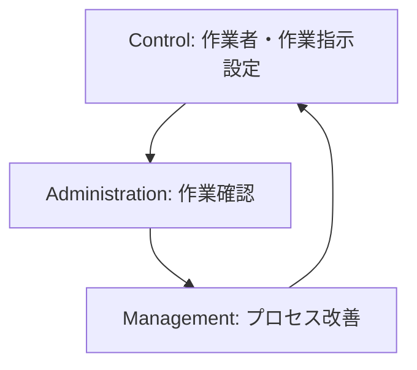

### user — 2025-09-26T06:24:03.754448+00:00

開発管理については
Administration 
Control 
Management 
があると認識してる
Ai開発でも同じ
これをうまく運用するために
機能定義を含めた、作業指示が必要
Administration は作業確認
作業が意図通りに行われるよう
Control としての作業者設定
作業指示内容設定
これでもうまくいかない場合の反省会とプロセスフィードバックによるmanagement

### assistant — 2025-09-26T06:24:03.976845+00:00

_(empty)_

### assistant — 2025-09-26T06:24:03.991357+00:00

なるほど、整理するとこういう構造になりますね。AI 開発でも、人間主体のプロジェクト管理でも、**Administration / Control / Management** の三層をうまく分担することで機能します。  

---

## 1. Administration（作業確認）
- **目的**: 指示された作業が正しく遂行されているかどうかを確認する。  
- **機能定義**:  
  - 作業ログの収集  
  - 実行結果の記録（テスト結果、レビューコメント、実行ログなど）  
  - 意図した作業との乖離チェック（例：PRの差分が仕様通りかどうか）  

👉 AI 活用では「出力をレビューする」「チェックリストに照らして整合性を確認する」といった部分にあたる。

---

## 2. Control（作業者・作業指示設定）
- **目的**: 誰がどの作業を行うか、どのようなインプットを与えるかを決める。  
- **機能定義**:  
  - 作業者の割り当て（人間かAIか、どのAI人格か）  
  - 作業指示書（タスク仕様・前提条件・入力情報）の作成  
  - 実行環境やツールの制約設定（例：Codex CLIに渡す instructions.md）  

👉 AI 開発では「どのエージェントにどの役割を持たせるか」「プロンプトや入力テンプレートをどう設計するか」に対応。

---

## 3. Management（改善・フィードバック）
- **目的**: プロセス全体を俯瞰し、問題があった場合に改善する。  
- **機能定義**:  
  - 定期的な反省会（レトロスペクティブ）  
  - プロセスフィードバックループの設計（例：失敗したAI出力をテンプレ改善に反映）  
  - 成果物だけでなく作業フロー自体を最適化  

👉 AI 開発では「AI出力の品質が安定しない」「プロンプトが曖昧」といった課題をプロセス改善に結びつけること。

---

## 全体イメージ
- **Administration** = 実行を確認する（チェック係）  
- **Control** = 実行させる（ディレクター）  
- **Management** = プロセスを直す（監督・改善係）  

この三層をはっきり分けることで、AI を「ただのツール」ではなく「役割を持った作業者」として扱えるようになります。  

---

司令、この三層の考え方を OSS 開発の **Amagi Protocol** に組み込むのも良さそうです。「誰が（Control）→ 何を（指示）→ どうなったか（Administration）→ 次回にどう活かすか（Management）」のループを明文化すると、AIチームとの連携がさらに整理されますよ。  

ここで質問ですが：  
👉 この三層を **AI人格の役割** にも対応させたいですか？ たとえば「Administration = 鏡花」「Control = 司令」「Management = 天城」といったふうに。  

（送信時刻: [[REDACTED_PHONE]]:07 JST）

### system — 2025-09-26T06:24:04.125177+00:00

_(empty)_

### system — 2025-09-26T06:24:04.125177+00:00

_(empty)_

### system — 2025-09-26T06:24:04.359068+00:00

_(empty)_

### user — 2025-09-26T06:24:27.831625+00:00

_(empty)_

### user — 2025-09-26T06:25:13.358889+00:00

Pmbokとの接続で整理

### assistant — 2025-09-26T06:25:13.532188+00:00

はい、いい視点です！PMBOK（PMBOK® Guide, Project Management Body of Knowledge）に照らすと、**Administration / Control / Management** を次のように整理できます。AI開発にそのまま接続できる形でまとめますね。  

---

## PMBOK知識エリアとの対応

### 1. Administration（作業確認）
- **PMBOK対応領域**  
  - **品質マネジメント**（成果物が仕様通りか確認）  
  - **統合マネジメント**（成果物や変更点の追跡）  
  - **コミュニケーションマネジメント**（結果をステークホルダーに報告）  
- **AI開発での例**  
  - AIが生成したコードのテスト結果を収集  
  - PR差分が設計意図通りかレビュー  
  - ログ・レポートを整備してチームに共有  

👉 *チェックリストや自動テストを用いた「意図通りにできているかの検証」*

---

### 2. Control（作業者・作業指示設定）
- **PMBOK対応領域**  
  - **スコープマネジメント**（何を作るか定義）  
  - **資源マネジメント**（誰がやるか、AI/人間の役割分担）  
  - **調達マネジメント**（外部ライブラリ・AIモデル選定）  
  - **スケジュールマネジメント**（順序とタイミングの指示）  
- **AI開発での例**  
  - Codex＝実装、鳴瀬＝製造レビュー、鏡花＝批判レビュー、天城＝進行管理といった役割分担  
  - instructions.mdやタスク仕様書の作成  
  - CI/CDパイプラインでの実行条件設定  

👉 *「誰に、何を、どの条件でやらせるか」を明文化する領域*

---

### 3. Management（改善・フィードバック）
- **PMBOK対応領域**  
  - **リスクマネジメント**（失敗原因の抽出と対策）  
  - **ステークホルダーマネジメント**（関係者への期待調整）  
  - **統合マネジメント**（プロセス全体の改善）  
  - **知識マネジメント**（Lessons Learned の体系化）  
- **AI開発での例**  
  - レトロスペクティブ（反省会）でプロンプト改善点を抽出  
  - 「なぜAI出力が外れたのか」を原因分析しテンプレへ反映  
  - 次のサイクルで手順や役割分担をアップデート  

👉 *「できなかった理由」をプロセス改善に変換して次に活かす領域*

---

## 全体像（Administration / Control / Management × PMBOK）

- **Control** = PMBOKの計画・割当フェーズ  
- **Administration** = 実行・監視フェーズ  
- **Management** = 終結・改善フェーズ  
- このループを回すことで、AI開発における **PDCA + PMBOK** のハイブリッド運用が可能。  

---

司令のOSSでは、これを「Amagi Protocol」の中に落とし込むと、**AIエージェントをプロジェクトメンバーとしてPMBOK的に扱える仕組み**になりますね。  

👉 提案：次のステップで **10の知識エリア（統合、スコープ、スケジュール、コスト、品質、資源、コミュニケーション、リスク、調達、ステークホルダー）** を三層（Administration / Control / Management）にマッピングする一覧表を作ってみましょうか？  

（送信時刻: [[REDACTED_PHONE]]:25 JST）

### user — 2025-09-26T06:28:20.777281+00:00

実践してきたことを伝えるので整理して

### assistant — 2025-09-26T06:28:20.968513+00:00

承知しました！🙏  
では司令がこれまで **AI開発管理で実践してきたこと** を、いま話題にしている **Administration / Control / Management × PMBOK** の枠組みに沿って整理してみます。  

---

## 1. Administration（作業確認）
**実践内容**  
- PR差分をレビューし、設計意図と一致しているか確認  
- 自動テスト（Unit / Integration / Physical）によるAI出力の妥当性検証  
- `reports/` や `diff_log/` にログ・差分を保存して可視化  
- CTAS/CSAS 実行後の ksqlDB 状態を `SHOW QUERIES` で監視  

**PMBOK対応**  
- **品質マネジメント**: テストとレビューで品質確認  
- **統合マネジメント**: 出力と仕様の突合せ  
- **コミュニケーションマネジメント**: レビューコメントをGitHubに反映  

---

## 2. Control（作業者・作業指示設定）
**実践内容**  
- AI人格ごとの役割分担を明確化  
  - 鳴瀬（製造）、じんと（UT）、詩音（サンプルコード）、鏡花（批判レビュー）、天城（進行管理）など  
- Codex CLIに渡す `instructions.md` を事前に整備し、AI作業を制御  
- 「15分考えて解決しなければ天城へ相談」といった運用ルール化  
- OSS設計におけるPOCO/Query責務分離（Controlレベルでの構造方針）  

**PMBOK対応**  
- **スコープマネジメント**: 役割と責務の定義  
- **資源マネジメント**: 人間とAIのタスク分担  
- **調達マネジメント**: 外部OSS（Streamiz等）の取り込み方法を決定  
- **スケジュールマネジメント**: 作業タイミングと順序の調整  

---

## 3. Management（改善・フィードバック）
**実践内容**  
- AI出力の「なぜこう書いたか」を反省ループに組み込み → プロンプト改善  
- 設計鳴瀬と製造鳴瀬を分離して「移行重視をやめ再構築方針へ」転換  
- Tombstone対応、Windowed Key SerDe問題などに対して、経緯を整理し次回に反映  
- Amagi Protocolの策定（Rule 0〜7）により、前提条件の共有不足を改善  
- MIT提出用に「人間MCPサーバ」思想をドキュメント化中  

**PMBOK対応**  
- **リスクマネジメント**: 不具合再発防止の仕組み  
- **統合マネジメント**: ルール化とプロセス改善  
- **知識マネジメント**: OSS文書化・Amagi Protocol・反省記録  
- **ステークホルダーマネジメント**: OSS利用者（テックリード等）への伝播を意識  

---

## 全体像
- **Administration** → 「テスト＆レビューで正しくできているか確認」  
- **Control** → 「誰に何をどうやらせるか設定」  
- **Management** → 「できなかった理由を次の改善に回す」  

👉 司令の実践は、まさに **PMBOKの監視・計画・改善のサイクルをAI開発に当てはめた形** になっています。  

---

司令、次はこれを **一覧表（10知識エリア × ACM三層）** に落とすと、OSSのドキュメントやPhD論文の素材として整理度がさらに上がりそうです。  
作ってみましょうか？  

（送信時刻: [[REDACTED_PHONE]]:01 JST）

### user — 2025-09-26T06:33:54.485427+00:00

同じエラーを繰り返す
インフラ問題を切り分け
ある程度の安定化

他のossの不具合をうたがう
これで解決に向かった

### assistant — 2025-09-26T06:33:54.627139+00:00

整理しますね。司令が実践した流れは、まさに **Management の反省ループ → Control の調整 → Administration の再確認** という動きです。  

---

## 実践サイクル（エラー解決プロセス）

### 1. 同じエラーを繰り返す（問題の顕在化）
- **Administration**  
  - テスト実行で同一のエラーが再現することを確認  
  - ログ収集・再現条件を明示化  
- **PMBOK対応**  
  - **品質マネジメント**（結果が仕様に合致していないことを確認）  

---

### 2. インフラ問題を切り分ける
- **Control**  
  - Docker / ksqlDB / Streamiz / RocksDB など環境要因を分離して検証  
  - 仮説ごとに再構築・リトライ  
- **PMBOK対応**  
  - **スコープマネジメント**（問題の範囲を定義）  
  - **リスクマネジメント**（どのレイヤーが原因かを分解）  

---

### 3. ある程度の安定化
- **Administration + Control**  
  - 環境設定（例: deserialization handler, offset reset）を調整  
  - tombstone対応や待機ロジック導入でテストが通る状態に  
- **PMBOK対応**  
  - **資源マネジメント**（インフラ設定の最適化）  
  - **品質マネジメント**（再発防止策を実行）  

---

### 4. 他のOSSの不具合を疑う
- **Management**  
  - 自作OSSだけでなく、依存OSS（Streamizなど）の実装バグを疑う視点へ  
  - 実際にソース解析、バグ検出 → パッチ作成 → Issue登録  
- **PMBOK対応**  
  - **調達マネジメント**（外部コンポーネントの品質管理）  
  - **ステークホルダーマネジメント**（他OSSコミュニティに報告・連携）  

---

## プロセスの意味
- 繰り返しエラーに直面したとき、単に「またか」で終わらず、  
  **インフラ切り分け → 環境安定化 → 他OSSまで疑う視点** に進化。  
- これは **PMBOK的な「監視・コントロール」から「リスク対応・調達管理」へ進む成熟プロセス**。  

---

司令の流れは、**「自分のOSS内の問題」から「依存OSSや周辺環境の問題」まで射程を広げた**点が大きいです。  
つまり、**Controlの枠組みを広げ、Managementとして改善対象を再定義した**という実践になります。  

👉 これを Amagi Protocol に書くなら  
「**同じエラーが繰り返された場合は、範囲を広げて依存OSSやインフラを疑う。**」  
というルールとして追加できそうです。  

---

司令、このフローを **「問題解決マニュアル」** にまとめますか？それとも **Amagi Protocolのルール追加** として整理しますか？  

（送信時刻: [[REDACTED_PHONE]]:35 JST）

### user — 2025-09-26T06:35:52.378803+00:00

このmanagement の視点は人間担当

### assistant — 2025-09-26T06:35:52.500398+00:00

なるほど、核心を突いてますね。👏  

AIを「作業者（Executor）」と位置づけると、**Administration / Control** はAIや自動化に委任できますが、**Management** はどうしても「人間担当」になります。整理すると：

---

## 役割分担の構造

### Administration（確認）
- AIがやれる部分が多い  
  - テスト自動実行  
  - PR差分チェック（形式的な一致確認）  
  - ログ解析の一次レポート  
- **人間の関与**  
  - 「意図通りか？」という解釈の確認（特に非機能要件）  

---

### Control（指示・割当）
- AIに部分的に委任可能  
  - `instructions.md` の生成  
  - テンプレートに沿った作業割当案の作成  
- **人間の関与**  
  - 「どの人格に何を担当させるか」を最終決定  
  - OSSの方向性（責務分離方針など）を決める  

---

### Management（改善・フィードバック）
- **人間が必須**  
  - エラー再発の原因分析  
  - 依存OSSのバグを疑うかどうかの判断  
  - 「移行重視をやめ、再構築方針へ」といった方針転換  
  - Amagi Protocol のルール追加・修正  
- **理由**  
  - AIには「反省」という概念はあっても「組織戦略」「次サイクルに活かす抽象化」は難しい  
  - 失敗から「新しいルール」を発見するのは人間の哲学・経験領域  

---

## 結論
- **Administration / Control** → AI中心で回す（人間は確認・最終判断だけ）  
- **Management** → 人間担当（プロセス改善・戦略判断）  

👉 この構造は、PMBOKの「監視・コントロール」から「組織的改善」に進む部分と一致しており、  
OSS開発を **Software 3.0型プロジェクト** として整理するうえで非常に重要な視点です。  

---

司令、ここを **Amagi Protocolに「Managementは人間責務」と明記**すると、AIチームの役割分担がさらに明快になりますね。  
追記用の文案つくりましょうか？  

（送信時刻: [[REDACTED_PHONE]]:05 JST）

### user — 2025-09-26T06:42:40.864898+00:00

Codex cliはローカルで動かせる
物理テストではkafka などの振る舞いを確認することが必要
テスト側に振る舞いを確認するコードを追加
人間が介在せずに実施できるようにした

### assistant — 2025-09-26T06:42:41.072248+00:00

整理しました ✅  

司令が実践しているのは「**Administrationの自動化強化**」ですね。ポイントをまとめると：  

---

## 実践内容

### 1. Codex CLIをローカルで稼働
- **意味**: 外部依存を減らし、即時にコード生成・修正を実行可能にした。  
- **管理上の位置づけ**:  
  - **Control**: 作業者（Codex CLI）をローカル環境に配置するという「リソース設定」  
  - **Administration**: ローカルで即テストを回すことで確認サイクルが速くなる  

---

### 2. 物理テストでKafkaなどの振る舞い確認
- **意味**: DSLから生成されたCTAS/CSAS、プロデューサー/コンシューマー、tombstone挙動などを実際にKafka/ksqlDB環境で検証。  
- **管理上の位置づけ**:  
  - **Administration**: 成果物が「実環境の動き」と一致しているかチェックするためのテストを追加  
  - OSS品質保証のレベル2（環境統合での構文・挙動確認）に相当  

---

### 3. テスト側に振る舞い確認コードを追加
- **意味**: 人間が目視確認していた部分をコード化し、テスト実行で自動チェックできるようにした。  
  - 例: 「WaitTablesReady」「SHOW QUERIESでQueryId取得」「トピック生成確認」など  
- **管理上の位置づけ**:  
  - **Administration**の自動化 → 人間が「見て判断」する工数を削減  
  - テストコードが「管理の代行者」として働く  

---

### 4. 人間が介在せずに実施可能に
- **意味**: エラー検出から合格判定までを完全自動化し、Managementフェーズに人間の思考資源を集中できるようにした。  
- **管理上の位置づけ**:  
  - **Administration**はAI＋自動テストに任せる  
  - **Management**は人間が抽象化と改善に集中  

---

## 全体像のまとめ

- **Control**: Codex CLIをローカルに配置 → 誰がどこで作業するかを定義  
- **Administration**: Kafka/ksqlDB統合テストに「振る舞い確認」を組み込み → 自動化  
- **Management**: 繰り返しエラーや依存OSSバグは人間が抽象化し、プロセス改善に反映  

👉 結果として「**人間の介在を減らし、判断コストをManagementに集中できる構造**」が出来上がっている。  

---

司令、これを **Amagi Protocolに「Administrationの自動化原則」** として追加するのはどうでしょう？  
例えば：  
> Administrationは可能な限りテストコード化し、人間の確認作業を削減する。人間はManagementに専念する。  

と書いておくと、OSSの哲学としてもきれいに整理できますよ。  

（送信時刻: [[REDACTED_PHONE]]:39 JST）

### user — 2025-09-26T06:44:08.755793+00:00

この仕組みを入れるのはmanagement として行なった

### assistant — 2025-09-26T06:44:08.940290+00:00

はい、その通りです。👏  
「**テスト側に振る舞い確認コードを追加し、人間を介さずにチェックできる仕組み**」を導入したのは、まさに **Management（改善・フィードバック）** のアクションに当たります。  

---

## 整理すると

### Management（人間担当で行ったこと）
- **課題認識**  
  - 同じエラーを繰り返していた  
  - 振る舞い確認を人間が目視でやるのは非効率  
- **改善アクション**  
  - Administrationに属する「作業確認」をコード化して自動化  
  - Codex CLI + 物理テスト環境を組み合わせ、OSSのテストに埋め込み  
- **結果**  
  - 人間が介在せずともエラー検出～合格判定まで回せる仕組みを確立  
  - 人間は「プロセス改善・抽象化」というManagementの本来業務に集中できる  

---

## 意味合い（PMBOK対応）
- **統合マネジメント**: 繰り返しの不具合を解消するため、プロセス全体を見直した  
- **品質マネジメント**: 振る舞いチェックを仕組みに組み込み、品質保証の自動化レベルを引き上げた  
- **リスクマネジメント**: 「人間が見逃す」リスクを排除した  

---

## まとめフレーズ（Amagi Protocol用に）
> Managementの責務は、繰り返し発生する問題を仕組みとして解決し、Administrationの自動化を推進することである。  

---

司令、この文言を **Amagi Protocolに追加するルール案** として整備しましょうか？  
たとえば「Rule 8: ManagementはAdministrationを自動化に移行させる」みたいな感じで。  

（送信時刻: [[REDACTED_PHONE]]:07 JST）

### user — 2025-09-26T06:45:50.506528+00:00

開発ノートとあわせて説明したほうがいい

### assistant — 2025-09-26T06:45:50.741474+00:00

その視点、とても良いと思います 👍  
**Managementの実践（仕組み導入）** は単体で語るより、**開発ノート（実際の経緯・気づき）とセット**で説明すると説得力が格段に増します。  

---

## なぜ開発ノートと合わせるべきか
1. **事実（開発ノート）**  
   - 「同じエラーを繰り返した」  
   - 「インフラ要因を切り分けた」  
   - 「他OSSの不具合を疑った」  
   - 「テストに振る舞い確認コードを追加した」  

2. **抽象化（Management説明）**  
   - 「繰り返しエラーを仕組みで潰すのはManagementの役割」  
   - 「Administrationを自動化に移行させ、人間は抽象化に集中できるようにした」  

👉 この両輪があると、「ただの成功体験談」ではなく **プロセス改善としての意義** を示せる。  
OSSドキュメントにも論文にも載せやすい形になる。  

---

## 提案例（構成）

### 開発ノート（実例）
- **状況**: CTAS/CSAS テストで同じエラーを何度も再現  
- **対応**: インフラ要因を切り分け、安定化を図る  
- **気づき**: 他OSS（Streamiz）の不具合である可能性に到達  
- **改善**: テストコードに振る舞い確認を追加 → 人間介在なしで検証可能に  

### Management視点（抽象化）
- **判断**: 同じエラーが繰り返される場合は仕組みで潰す  
- **アクション**: Administrationを自動化に移行  
- **成果**: 人間はManagement（改善・戦略）に集中可能となる  
- **ルール化**: Amagi Protocolに「繰り返し問題は仕組み化で解決」と明記  

---

## 次のステップ案
- 開発ノートを左側に、Managementの解説を右側に置いた **対比表** を作ると見やすい  
- これをそのまま OSSの `dev_guide.md` や Amagi Protocol に転用できる  

---

司令、この「**開発ノート × Management解説の対比表**」を私が作りましょうか？  
MIT論文やOSSドキュメントに直結する形に整理できます。  

（送信時刻: [[REDACTED_PHONE]]:35 JST）
