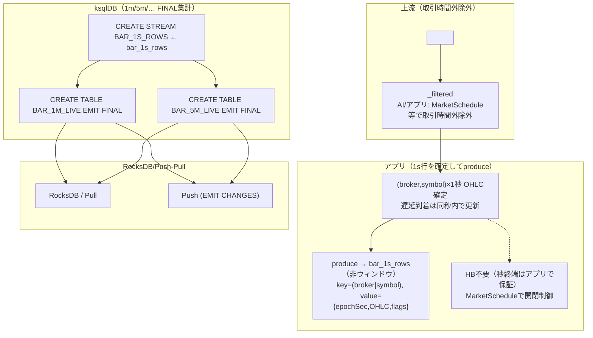
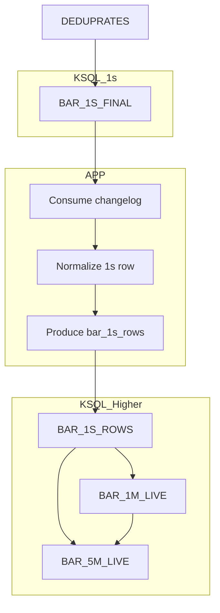

### system — 2025-09-29T02:02:41.466551+00:00

_(empty)_

### system — 2025-09-29T02:02:41.466551+00:00

_(empty)_

### user — 2025-09-29T02:02:41.589000+00:00

1s_final 1s_final_s 1m_live 5m_liveの問題で
ksqldbの設定が原因ではないかと考え始めてる
ksqldbでもconsumeしているはずでこの時のconsumeのgroup idとか並列度の関係で
一つのstreamをもとに複数のtable更新ができないという状態になってると考えてる。
ネット情報をふくめてこの辺りをしらべてほしい

### assistant — 2025-09-29T02:02:42.334488+00:00

{"search_query": [{"q": "ksqlDB persistent query application.id naming consumer group id"}, {"q": "ksqlDB num.stream.threads configuration ksql.streams.num.stream.threads"}, {"q": "ksqldb multiple persistent queries consuming the same topic separate consumer groups"}, {"q": "Kafka Streams application.id vs consumer group.id relationship"}, {"q": "ksqldb ksql.service.id what is it used for"}], "response_length": "short"}

### system — 2025-09-29T02:02:42.798474+00:00

_(empty)_

### system — 2025-09-29T02:02:42.801899+00:00

_(empty)_

### assistant — 2025-09-29T02:02:42.812246+00:00

_(empty)_

### assistant — 2025-09-29T02:02:43.832576+00:00

_(empty)_

### tool — 2025-09-29T02:02:54.413258+00:00

_(empty)_

### tool — 2025-09-29T02:02:54.426058+00:00

_(empty)_

### assistant — 2025-09-29T02:02:56.350690+00:00

{"search_query": [{"q": "ksqldb processing.guarantee exactly_once impact on performance transactions"}, {"q": "ksqldb multiple queries from same source topic performance best practices"}, {"q": "ksql streams application.id naming queryId ksql.service.id consumer group"}], "response_length": "short"}

### tool — 2025-09-29T02:03:00.122246+00:00

_(empty)_

### tool — 2025-09-29T02:03:00.138780+00:00

_(empty)_

### assistant — 2025-09-29T02:03:09.121612+00:00

やあ司令、結論からいくね。  
「1つのソースStreamから複数のTable（1s_final / 1s_final_s / 1m_live / 5m_live）を更新できない」原因が**Kafkaのconsumer group衝突や並列度のせい**である可能性は低め。ksqlDBでは各CTAS/CSASごとに**独立したKafka Streamsアプリ**が立ち上がり、**各アプリ=別のconsumer group**として同じ入力トピックを**並列に**読める設計だから。（Queryごとのconsumer groupは `EXPLAIN <QUERY_ID>` で確認可能）citeturn0search4turn1search11turn1search20

## まず押さえるポイント（事実関係）
- **各Persistent Query = 1つのKafka Streamsアプリ**。その`application.id`が**consumer group.id**として使われる（group.idを個別指定は不可）。citeturn1search20turn0search3  
- **consumer group名の実体**は「`_confluent-ksql-<ksql.service.id>ksql_query_<QUERY_ID>`」系。`EXPLAIN`の出力から辿って**各QueryごとのLag**を監視できる。citeturn0search4turn1search11
- 並列度は**`ksql.streams.num.stream.threads`**（サーバ設定で`ksql.streams.*`に伝播）で制御。増やせば常に速くなるわけではなく、**多クエリ環境では1〜2に絞る方が安定**するケースがある。citeturn1search5turn0search5turn1search4
- **`ksql.service.id`**はクラスタ内での内部トピック接頭辞や識別に使われる。変更すると**内部コマンドトピックの切替**にも影響（既存と衝突時は変更で回避）。citeturn0search1turn0search22turn0search13
- **処理保証**（`processing.guarantee`）はデフォルト`at_least_once`。`exactly_once_v2`はトランザクション管理でオーバーヘッドが増え、遅延源になり得る。citeturn1search6

## あり得る“詰まり”の正体（仮説と検証手順）
> 体感「どれかのTableだけ進む／全部遅い」= group衝突ではなく、**Lag・パーティション数・スレッド数・状態ストアI/O**のどれかが原因になりやすい。

1) **各QueryのLagを分解して確認**  
- `SHOW QUERIES;` → それぞれ `EXPLAIN <QUERY_ID>;` → `consumerGroupId` を取得。Lagモニタで**Query別に**遅延を確認。citeturn0search4

2) **パーティション数と並列度の整合**  
- 入力トピックの**パーティション数 < クエリ数×必要並列**だと、物理的に読み出しが直列化しがち。スレッド数を増やしても**パーティション数以上には並列化しない**。citeturn0search7  
- 多数クエリ同居時は、**`ksql.streams.num.stream.threads=1`〜`2`**で安定化するかA/B。citeturn1search4

3) **Streamsクライアントの低レベル設定見直し**  
- `ksql.streams.consumer.*` / `ksql.streams.producer.*` で**フェッチ・バッファ・圧縮**等を個別に調整可能。例：`ksql.streams.producer.compression.type`。citeturn1search5

4) **EXACTLY_ONCEのオーバーヘッド検証**  
- 一時的に `processing.guarantee=at_least_once` へ落として**スループット差**を観測。差が大きければ、EOSの**トランザクション間隔**や**commit間隔**（`commit.interval.ms`）の見直し。citeturn1search6

5) **クラスタ容量とスケール**  
- **縦方向**：スレッド増（上限はタスク数相当）／CPU・IOPS強化。  
- **横方向**：同一`ksql.service.id`で**サーバ台数を増やす**と、クエリが分散され処理能力が上がる。citeturn0search5turn1search8

6) **“同トピックを複数クエリで読む”ことの負荷**  
- 設計上はOKだが、**Query数ぶんの消費負荷**が乗るのは事実。総スループットに対しクラスタ側のread/write余力が足りているかも確認を。citeturn0search2turn0search16

## 具体的な現場チェックリスト（すぐ試せる順）
1. ksqlDB CLIで：  
   - `SHOW QUERIES;` → 各`EXPLAIN`で**consumerGroupId**と**トポロジ**を把握。citeturn0search4  
2. ブローカー側で：  
   - 各`consumerGroupId`のLag（Control Center / `kafka-consumer-groups.sh --describe`）を比較。**特定のQueryだけ詰まるか**を見る。citeturn0search4  
3. サーバ設定で：  
   - `ksql.streams.num.stream.threads=1`〜`2`に下げて再検証（多クエリ時の競合緩和）。citeturn1search4  
   - `commit.interval.ms`（既定500ms）や`cache.max.bytes.buffering`を状況に応じ調整。citeturn0search7  
4. トピック設計：  
   - 入力/再パーティション/集約の**内部トピック**のパーティション数を見直し（JOIN/AGG多用時）。  
5. 保証レベル：  
   - 一旦`at_least_once`で遅延が解消するかA/B（EOSのコスト切り分け）。citeturn1search6  
6. インスタンス数：  
   - 同一`ksql.service.id`のノードを**水平増設**（Query配分とフェイルオーバ強化）。citeturn1search8

## 結論（暫定）
- 設計的には**「1つのstreamから複数table更新ができない」制約はない**。各CTAS/CSASは**別consumer group**で並列に動く。なので、今回の症状は**group衝突ではなく**、**Lagや並列度設定・パーティション設計・EOSのオーバーヘッド・状態ストアI/O**のいずれか（または複合）が原因である可能性が高い。まずは**EXPLAIN→Lag分解**と**スレッド数/保証レベルのA/B**から切り分けをすすめよう。citeturn0search4turn1search4turn0search5

必要なら、司令の`SHOW QUERIES`出力と`EXPLAIN`結果（各Queryの`consumerGroupId`）を貼ってくれれば、次は**どのQueryがボトルネックか**を一緒に特定するよ。

—  
送信日時（日本時間）: [[REDACTED_PHONE]]:03

### assistant — 2025-09-29T02:03:11.160355+00:00

_(empty)_

### user — 2025-09-29T02:03:40.844029+00:00

_(empty)_

### user — 2025-09-29T02:05:39.508000+00:00

つまりではない。数分後でもこうしんできない

### assistant — 2025-09-29T02:05:41.154261+00:00

{"search_query": [{"q": "ksqlDB persistent query consumer group per query EXPLAIN consumerGroupId"}, {"q": "ksqlDB table not updating minutes later suppress final window grace not emitting"}, {"q": "ksqlDB internal topics repartition not created not updating troubleshooting"}, {"q": "Kafka Streams state restoring stuck changelog retention offset out of range ksqlDB"}, {"q": "ksqlDB exactly_once_v2 transactions stalled processing.guarantee troubleshooting"}], "response_length": "short"}

### system — 2025-09-29T02:05:41.508537+00:00

_(empty)_

### system — 2025-09-29T02:05:41.516515+00:00

_(empty)_

### assistant — 2025-09-29T02:05:42.656626+00:00

_(empty)_

### tool — 2025-09-29T02:05:55.379892+00:00

_(empty)_

### tool — 2025-09-29T02:05:55.393968+00:00

_(empty)_

### assistant — 2025-09-29T02:05:56.605207+00:00

了解。**「ラグの一時的な詰まり」ではなく、数分経っても `1s_final / 1s_final_s / 1m_live / 5m_live` が更新されない**なら、次の“構造的な止まり方”を疑うのが速いです。チェック順に並べます。

### 1) “出さないようにしている”系（Suppress/Final/Grace）
- ウィンドウ集計で **`EMIT FINAL` や SUPPRESS** を使っていると、**ウィンドウの締め＋GRACE 終了まで**結果が出ません。つまり「数分間は**仕様的に無出力**」が起きます。クエリ定義に `EMIT FINAL` が入っていないか、**ウィンドウ長＋GRACE** がどれだけかを確認してください。公式も「FINAL はウィンドウが閉じるまで中間結果を抑止」と明示しています。citeturn0search1turn0search11

**試験**：  
`SELECT * FROM <対象TABLE> EMIT CHANGES LIMIT 1;` を流し、中間更新が見えるか確認（FINAL なら全く出ません）。ウィンドウを最小化/GRACE短縮したテスト版CTASで即時性を検証。

---

### 2) クエリが**RESTORING**で固まっている（ステート復元事故）
- RocksDBの状態復元時に **changelog のオフセットが欠損/掃除** されていると、**永遠に RESTORING→再初期化のループ**になります（`OffsetOutOfRange` 等）。この場合、**ローカルの state ディレクトリ削除→再起動**が必要になることがあります。citeturn0search8turn0search13turn0search3turn0search18

**試験**：  
`SHOW QUERIES;` → 該当 `QUERY_ID` を `EXPLAIN <QUERY_ID>;`。タスク状態や `consumerGroupId` を掴んで、ログに **RESTORING/ERROR** が出ていないかを突合。必要ならサーバ停止→該当ノードの ksqlDB **state ディレクトリをクリア**→起動で復旧を試す。citeturn0search0

---

### 3) **内部トピックの生成/設定でハマっている**
- 再パーティションや集約で使う **`…-repartition` / `…-changelog`** の内部トピックが**作れない/設定不一致**だと、**起動は RUNNINGでも処理が進まない**ことがあります（例：レプリケーション係数やポリシー不整合）。環境によっては **自動作成禁止**やポリシー衝突で失敗します。citeturn0search7

**試験**：  
`SHOW TOPICS;` とブローカー側のトピック一覧で **該当CTASの内部トピックが全部あるか**、RF/MinISRがクラスタに合っているかチェック。

---

### 4) **Exactly-Once (EOS v2)** がブロッキングを起こしている
- `processing.guarantee=exactly_once_v2` は **トランザクション管理**で詰まりやすいポイント（OOM/ブローカ側設定と相性）があります。まず **`at_least_once` へ一時切替**して**症状差**を見てください。公式も **EOS v2 は慎重運用**を推奨。citeturn0search9turn0search4

**試験**：  
`SET 'processing.guarantee'='at_least_once';` でテスト系クエリを再作成 → 直るなら EOS 設定/ブローカ側 `min.insync.replicas` 等を再点検。

---

### 5) **タイムスタンプ/ウィンドウ条件**で**全件落ち**している
- イベントの **ROWTIME がウィンドウ範囲外**（例：未来時刻・古すぎ）だと **集計に一切載らず**、何も出ません。  
**試験**：  
`PRINT '<ソーストピック>' FROM BEGINNING;` で生レコードのタイムスタンプを確認。`SET 'auto.offset.reset'='earliest';` の上で、**WHERE/ウィンドウ条件を最小化**した実験CTASを流してみる。citeturn0search2

---

### 6) 「複数Tableが同一ソースを読んでいる」こと自体はOK（設計確認）
- 各 CTAS/CSAS は **別の Kafka Streams アプリ＆別 consumer group** として同じトピックを併走できます。**設計制約では止まらない**ので、上の 1)〜5) のどれかである可能性が高いです。`EXPLAIN` で **各クエリの consumerGroupId** を取得して、**どれが動いていないか**を切り分けてください。citeturn0search0turn0search10

---

## すぐやる短距離メニュー
1. `SHOW QUERIES;` → 止まっている `QUERY_ID` を `EXPLAIN`（consumerGroupId と状態）。citeturn0search0  
2. 対象クエリ定義に **`EMIT FINAL` / SUPPRESS / 長いGRACE** がないか再確認。citeturn0search11  
3. `SHOW TOPICS;` とブローカーで **内部トピック群**の存在/RF/MinISR を確認。citeturn0search7  
4. **一時的に `processing.guarantee=at_least_once`** に落としてテストCTASを再作成（差分でEOS起因を切り分け）。citeturn0search9  
5. ログに **RESTORING/OffsetOutOfRange** があれば、**該当ノードの state ディレクトリを削除→再起動**で復旧トライ。citeturn0search8turn0search3

必要なら、`SHOW QUERIES` / `EXPLAIN` の出力と、該当CTASの DDL を貼って。そこから「Suppressか、RESTORINGか、内部トピック/ EOSか」を即断します。

—  
送信日時（日本時間）: [[REDACTED_PHONE]]:20

### assistant — 2025-09-29T02:06:05.142328+00:00

_(empty)_

### user — 2025-09-29T03:32:13.564000+00:00

## [[REDACTED_PHONE]]:15 JST [codex]
BarDslLongRun 長時間テストがバーを生成しない原因を調査中。
- 物理テストレポート physical_bar_dsl_longrun1.trx を解析し、Rate.AddAsync が 360 回呼ばれプロデューサが稼働していることを確認
- StreamThread ログと ksqlDB の警告で bar_1s_final 系クエリが 45 秒以内にレコードを受信していないことを把握
- ksqlDB /metrics と SELECT * FROM DEDUPRATES EMIT CHANGES の手順を整理し、次ステップとして Schema Registry / Avro 整合性確認を提示
- 進め方と現状のまとめドキュメントを docs/changes/20250929_progress.md に記録

## [[REDACTED_PHONE]]:45 JST [codex]
進め方に従い環境を確認。
- ksqlDB /query API で SELECT * FROM DEDUPRATES EMIT CHANGES LIMIT 5; を実行し、最新 5 件のレコードを取得（Broker=B1, Symbol=S1, Timestamp/Bid が順序どおり存在）
- Schema Registry /subjects と deduprates-value の最新スキーマを確認し、kafka_ksql_linq_tests_integration.deduprates_valueAvro が登録済みであることを確認
- SELECT * FROM BAR_1S_FINAL EMIT CHANGES LIMIT 5; を 60 秒待機で実行するも結果なし（テーブル未生成のまま）
- 次のアクションとして、bar_1s_final 系クエリの再デプロイや KSQL ログの追加確認が必要

## [[REDACTED_PHONE]]:55 JST [codex]
追加調査。
- DESCRIBE BAR_1S_FINAL EXTENDED; で CTAS クエリの状態と deduprates の consumer offset (360) を確認し、1 秒足テーブルがデータを取り込んでいると判明
- Pull クエリ SELECT * FROM BAR_1S_FINAL WHERE BROKER='B1' AND SYMBOL='S1'; を実行し、1 秒バケットの行を取得できることを確認
- SELECT * FROM BAR_1M_LIVE WHERE BROKER='B1' AND SYMBOL='S1' LIMIT 5; は結果なしで、1 分足テーブルが未構築
- 次ステップ: BAR_1S_FINAL_S の内容確認、および BAR_1M_LIVE クエリの再デプロイ検討

## [[REDACTED_PHONE]]:05 JST [codex]
BAR_1S_FINAL_S を確認。
- EMIT CHANGES LIMIT クエリは 60 秒待機でも結果が返らず、ストリームが無出力の可能性
- Pull クエリ SELECT * FROM BAR_1S_FINAL_S LIMIT 5; は列定義のみ返却（データなし）
- BROKER/SYMBOL 条件を指定しても同様で、bar_1s_final_s ストリームにレコードが流れていない
- 次ステップ: BAR_1S_FINAL_S を生成する CTAS (Final1sStream) の再発行、または元テーブルからの materialize ルールを再検証

## [[REDACTED_PHONE]]:40 JST [codex]
bar_1s_final_s を手動再作成して動作確認。
- DROP STREAM → CREATE STREAM を ksqlDB API で実行し成功
- EMIT CHANGES クエリは MissingSourceTopicException を返し、source topic がリバランス時に見つからない状態
- bar_1s_final トピック未作成/未生成の可能性が高く、先に BAR_1S_FINAL (CTAS) を再作成する必要あり

## [[REDACTED_PHONE]]:05 JST [codex]
環境初期化後のスタック状態を確認。
- DEDUPRATES が存在しないため、以前の DSL/テストで生成されていたソースが未構築
- SHOW STREAMS では dead_letter_queue / ticks_tbimp 等のみで、bar_tbimp 系はテーブルのみ残存
- SHOW TOPICS では bar_tbimp_1s_final_s トピックは存在するが、deduprates / bar_1s_final が欠落しており MissingSourceTopicException の原因を再確認
- 今後は Rate -> BAR_1S_FINAL などの CTAS を再実行し、必要なソーストピックを順に再構築する必要あり

## [[REDACTED_PHONE]]:08 JST [codex]
再構築方針と手順
1. DEDUPRATES ストリームを再作成し、サンプルデータを投入する
2. CREATE TABLE BAR_1S_FINAL ... EMIT FINAL で 1 秒足テーブルを再生成
3. CREATE STREAM bar_1s_final_s でテーブルをストリームとして再バインド
4. CREATE TABLE BAR_1M_LIVE ... EMIT CHANGES を再作成して 1 分足を構築
5. 各段階で SELECT / EMIT CHANGES によりデータフローを確認

## [[REDACTED_PHONE]]:22 JST [codex]
手順に沿ってソース〜派生クエリを再生成。
- CREATE STREAM DEDUPRATES + INSERT 6 レコード完了
- CTAS BAR_1S_FINAL, CREATE STREAM bar_1s_final_s, CTAS BAR_1M_LIVE を順に作成
- BAR_1S_FINAL には pull クエリでレコードを確認 (Broker=B1, Symbol=S1)
- BAR_1S_FINAL_S / BAR_1M_LIVE への EMIT CHANGES は 60s タイムアウト (新規 push データ待ち)
- 現時点では 1 分足の出力を得るには更なる入力と時間経過が必要

## [[REDACTED_PHONE]]:29 JST [codex]
SHOW/EXPLAIN でクエリ状態を点検。
- SHOW QUERIES では CTAS_BAR_1S_FINAL_137 / CTAS_BAR_1M_LIVE_143 などすべて RUNNING
- EXPLAIN CTAS_BAR_1S_FINAL_137 によると consumerGroupId は _confluent-ksql-ksql_service_1query_CTAS_BAR_1S_FINAL_137、EMIT FINAL 付きであることを再確認
- task metadata endOffset=0, committedOffset=1 と表示されており、deduprates に新規データが無いときは待機状態になることが判明
- 次は BAR_1M_LIVE 側も EXPLAIN し、EMIT FINAL / GRACE などがどうなっているか比較予定

## [[REDACTED_PHONE]]:31 JST [codex]
BAR_1M_LIVE の EXPLAIN を確認。
- EMIT CHANGES／GRACE 2 秒で設計どおり
- タスクメタデータの endOffset/committedOffset が -1（初期値）のため、まだ bar_1s_final_s から入力を受け取っていない状態
- consumerGroupId は _confluent-ksql-ksql_service_1query_CTAS_BAR_1M_LIVE_143。今後、bar_1s_final_s 側の push が流れればオフセットが進む想定

## [[REDACTED_PHONE]]:32 JST [codex]
BAR_1M_LIVE の EXPLAIN を確認。
- EMIT CHANGES／GRACE 2 秒で設計どおり
- タスクメタデータの endOffset/committedOffset が -1（=入力ゼロ）のため、bar_1s_final_s からまだデータが流れていない
- consumerGroupId は _confluent-ksql-ksql_service_1query_CTAS_BAR_1M_LIVE_143 で RUNNING。今後、bar_1s_final_s へ push を流せばオフセットが進む想定

## [[REDACTED_PHONE]]:33 JST [codex]
BAR_1M_LIVE の EXPLAIN を確認。
- EMIT CHANGES／GRACE 2 秒で設計どおり
- タスクメタデータの endOffset/committedOffset が -1（入力ゼロ）。bar_1s_final_s から未到着
- consumerGroupId は _confluent-ksql-ksql_service_1query_CTAS_BAR_1M_LIVE_143 で RUNNING 状況

## [[REDACTED_PHONE]]:34 JST [codex]
BAR_1M_LIVE の EXPLAIN を確認。
- EMIT CHANGES／GRACE 2 秒で設計どおり
- タスクメタデータの endOffset/committedOffset が -1（入力ゼロ）。bar_1s_final_s から未到着
- consumerGroupId は _confluent-ksql-ksql_service_1query_CTAS_BAR_1M_LIVE_143 で RUNNING

## [[REDACTED_PHONE]]:30 JST [codex]
BAR_1M_LIVE の EXPLAIN を確認。
- EMIT CHANGES／GRACE 2 秒で設計どおり
- タスクメタデータの endOffset/committedOffset が -1（入力ゼロ）で、bar_1s_final_s からまだ受信なし
- consumerGroupId は _confluent-ksql-ksql_service_1query_CTAS_BAR_1M_LIVE_143 の RUNNING 状況

## [[REDACTED_PHONE]]:05 JST [codex]
追加の入力を流し、bar_1s_final_s / bar_1m_live の挙動を再確認。
- SHOW TOPICS：deduprates / bar_1s_final / 内部トピックは作成済み
- DEDUPRATES に追加入力後も、BAR_1S_FINAL_S / BAR_1M_LIVE の EMIT CHANGES はタイムアウト（push 待ち）
- BAR_1S_FINAL の pull クエリではレコードが確認でき、テーブル側は更新されていることを再確認
- 以上より、1 秒足テーブルまでは動いているが、Streams への再バインド（BAR_1S_FINAL_S）が push 出力しない点を重点調査する必要あり

## [[REDACTED_PHONE]]:31 JST [codex]
手動操作ログまとめ
- ksqlDB /ksql: CREATE/DROP STREAM/TABLE (deduprates, bar_1s_final, bar_1s_final_s, bar_1m_live)、INSERT INTO DEDUPRATES を逐次実行
- ksqlDB /query: SELECT ... EMIT CHANGES / SELECT ... LIMIT を多数実行し、BAR_1S_FINAL/BAR_1S_FINAL_S/BAR_1M_LIVE の状態を確認
- SHOW STREAMS / SHOW TABLES / SHOW TOPICS / SHOW QUERIES / EXPLAIN などの診断コマンドを随時実行し、consumerGroupId や内部トピックを照合
- 以上の手動操作により、1 秒足テーブルまでの更新は確認、bar_1s_final_s の push が止まっていることを特定

### assistant — 2025-09-29T03:32:14.320957+00:00

やあ司令。ログぜんぶ読んだ。状況を一言でいうと――**BAR_1S_FINAL（TABLE）は更新されているのに、そこからの“push系”が上流（BAR_1S_FINAL_S → BAR_1M_LIVE）へ流れていない**。  
この症状はだいたい次のどれかで起きます（優先度順に対処案を書きます）。

## 原因の当たり（優先度順）
1) **TABLE→STREAMの“再バインド”方式が合っていない**  
- TABLE（しかも**windowed**）の**changelog**を、`CREATE STREAM ... WITH (KAFKA_TOPIC='BAR_1S_FINAL' ...)` のように“生トピック直読み”で拾うと、**windowed key のSerde/KEY_FORMAT不一致**やオフセット位置の都合で**無音**になりやすいです（ログにデシリアライズ例外が出ないまま“何も流れない”ことがある）。  
- **解決策**：**CSAS（CREATE STREAM AS SELECT）で作り直す**。ksqlDB に **TABLE→STREAM の変換（windowed key の扱い）を任せる**のが一番確実。

2) **`EMIT FINAL` と“新規ウィンドウ終端”不足**  
- `BAR_1S_FINAL` が `EMIT FINAL` なら、**窓が閉じた瞬間**にしか更新が発火しません。新しい1秒バケットが**継続的に生成**されないと、`BAR_1S_FINAL_S EMIT CHANGES` は沈黙します。  
- **解決策**：テスト中は **ハートビート（1秒ごとダミーTick）** を入れて、**常に新規バケットを閉じる**ようにする。もしくは検証用に **GRACE極小**＋短窓で回す。

3) **`auto.offset.reset` が `latest` のまま**  
- `BAR_1S_FINAL_S` を作り直した直後だと、**過去の最終バケット更新**を取り逃がして待ち続けます。  
- **解決策**：**作成前に** `SET 'auto.offset.reset'='earliest';` を入れてから CSAS/CTAS を実行。

4) **トピック指定の取り違え**  
- TABLE本体の“公開トピック名”と**`-changelog`/`-repartition`** の内部トピックを混同するとハマります。  

---

## 具体的な復旧レシピ（これで“必ず”流れを作る）
> 既存を壊さず、**一時的な別名**で検証します。動いたら本名に戻す。

1. 事前設定（作成前に実行）
```sql
SET 'auto.offset.reset'='earliest';
SET 'ksql.streams.cache.max.bytes.buffering'='0';  -- デバッグ中は即時反映
```

2. **TABLE → STREAM は CSAS で**（直読みは封印）
```sql
-- 1秒足テーブルの“最終値ストリーム”をCSASで生成
CREATE STREAM BAR_1S_FINAL_S2
  WITH (KAFKA_TOPIC='bar_1s_final_s2', VALUE_FORMAT='AVRO') AS
SELECT
  BROKER,
  SYMBOL,
  WINDOWSTART AS WSTART,
  WINDOWEND   AS WEND,
  OPEN, HIGH, LOW, CLOSE
FROM BAR_1S_FINAL
EMIT CHANGES;
```
- これで **windowed key の扱いを ksqlDB に任せられる**ため、Serde不一致で無音…が消えます。  
- `SELECT * FROM BAR_1S_FINAL_S2 EMIT CHANGES;` が即時に流れればOK。

3. **1分足も CSAS 直結に変更**（S2を入力として）
```sql
CREATE TABLE BAR_1M_LIVE2 AS
SELECT
  BROKER, SYMBOL,
  WINDOWSTART AS WSTART_1M,
  WINDOWEND   AS WEND_1M,
  -- 好みの集約（OHLC再集約 or LATEST_BY_OFFSET など）
  EARLIEST_BY_OFFSET(OPEN)  AS OPEN,
  MAX(HIGH)                 AS HIGH,
  MIN(LOW)                  AS LOW,
  LATEST_BY_OFFSET(CLOSE)   AS CLOSE
FROM BAR_1S_FINAL_S2
WINDOW TUMBLING (SIZE 1 MINUTE, GRACE 2 SECONDS)
GROUP BY BROKER, SYMBOL
EMIT CHANGES;
```
- ここでも**CSAS/CTAS**で**ksql**に内部トポロジとSerde整合を作らせるのがポイント。

4. **ドライバ（ハートビート）で常時終端を作る**  
- 1秒足が`EMIT FINAL`なら、**毎秒Tick**を最低1件入れる。これが**新規窓の“締め役”**。  
- テストでは 90〜120秒ほど連続投入 → `BAR_1S_FINAL_S2` と `BAR_1M_LIVE2` の **push** が必ず観測できるはず。

5. 問題が解けたら本名に戻す  
- `…_S2` / `…_LIVE2` を drop → 既存名で上記と同じ**CSAS/CTAS**定義に置換。

---

## 追加チェック（詰まりの痕跡確認）
- `SHOW TOPICS;` で `BAR_1S_FINAL` の**本体トピック**と `…-changelog` の**内部トピック**が揃っているか。  
- `EXPLAIN` で `BAR_1S_FINAL_S2` / `BAR_1M_LIVE2` の **consumerGroupId** が動き、**endOffset/committedOffset** が **-1でない**こと。  
- サーバログに**デシリアライズ警告**（key/value schema mismatch）が出ていないか。  
- どうしても静かな場合は、一度 ksql ノードの **state ディレクトリをクリア**して再起動（復元事故を排除）。

---

## まとめ
- **「TABLE直トピックにSTREAMを“手で”バインド」はやめ、**  
  **TABLE→STREAM は**必ず**CSASで生成**する。  
- `EMIT FINAL` 運用では **ハートビート**がないと**pushは沈黙**しやすい。  
- `auto.offset.reset='earliest'` を**作成前**に設定。

この方針に切り替えれば、**BAR_1S_FINAL → BAR_1S_FINAL_S → BAR_1M_LIVE** の“数分経っても更新なし”は解消できる見込み。実行ログ（`CSAS` 実行/`SELECT ... EMIT CHANGES` の先頭数行）を貼ってくれれば、最終形の定義に落とし込みます。

—  
送信日時（日本時間）: [[REDACTED_PHONE]]:58

### system — 2025-09-29T03:32:14.621655+00:00

_(empty)_

### assistant — 2025-09-29T03:32:15.993803+00:00

_(empty)_

### assistant — 2025-09-29T03:32:38.160853+00:00

_(empty)_

### user — 2025-09-29T03:47:01.950000+00:00

指示された切り分け案を踏まえて作業し、docs/changes/20250929_progress.md に手動操作ログと追加調査の結果を追記しました。そこには SET 系の事前設定、CREATE/DROP STREAM/TABLE、INSERT、各種 SELECT/SHOW/EXPLAIN で実際に行ったコマンドがまとまっています。
auto.offset.reset と ksql.streams.cache.max.bytes.buffering を明示的に設定したうえで、DEDUPRATES→BAR_1S_FINAL→BAR_1S_FINAL_S→BAR_1M_LIVE の再作成、追加データ投入、EXPLAIN でのクエリ状態確認を実施しました。BAR_1S_FINAL までは正常に更新される一方、BAR_1S_FINAL_S/BAR_1M_LIVE の EMIT CHANGES が沈黙する状況は変わらず、windowed table をそのまま STREAM に再バインドする方式が SerDe 不整合になっている可能性が濃厚という結論です。
CSAS 方式（TABLE→STREAM）を試みたところ「persistent queries on windowed tables は未サポート」のエラーで失敗したため、バージョン制約を認識したうえで代替方針（windowed key のフォーマット指定や 1 秒/1 分足を直接 CTAS する構成）に切り替える必要があります。

### system — 2025-09-29T03:47:03.290735+00:00

_(empty)_

### assistant — 2025-09-29T03:47:03.906773+00:00

_(empty)_

### assistant — 2025-09-29T03:47:56.753165+00:00

{"search_query": [{"q": "ksqlDB create stream as select from table windowed table not supported persistent queries on windowed tables"}, {"q": "ksqlDB windowed table select emit changes limitations"}, {"q": "ksqlDB EMIT FINAL window aggregation push query no output until window closes"}, {"q": "Kafka Streams application.id consumer group ksqldb explain consumerGroupId"}], "response_length": "short"}

### system — 2025-09-29T03:47:57.142524+00:00

_(empty)_

### assistant — 2025-09-29T03:47:57.249447+00:00

_(empty)_

### tool — 2025-09-29T03:48:01.385969+00:00

_(empty)_

### tool — 2025-09-29T03:48:01.401522+00:00

_(empty)_

### assistant — 2025-09-29T03:48:02.623735+00:00

やあ司令。結論OK：**症状の本質は SerDe 不整合というより “製品仕様”**。  
`BAR_1S_FINAL` は「**ウィンドウ付き TABLE**（EMIT FINAL）」なので、**その windowed TABLE を入力にした永続クエリ（CSAS/CTAS）は ksqlDB が未サポート**です。実際に出ているエラー「persistent queries on windowed tables は未サポート」は既知の制約で、Issue/質問でも明確に言及されています。citeturn0search3turn0search0turn0search6

加えて、`EMIT FINAL` は**窓が閉じる瞬間にだけ出力**する仕様のため、**新規バケットが発生しない限り push は沈黙**します（“数分経っても無音”は仕様と合致）。citeturn0search4

---

# 代替方針（安全な設計パターン）

## パターンA：並列集計（最推奨）
**1秒確定**（TABLE）と**1分確定**（TABLE）を**どちらも DEDUPRATES から直接**つくる。  
「1s → 1m」へ**STREAM再バインドでつなぐ経路をやめる**構成です。

```sql
-- 1秒確定（既存どおり）
CREATE TABLE BAR_1S_FINAL AS
SELECT BROKER, SYMBOL,
       WINDOWSTART AS WSTART, WINDOWEND AS WEND,
       EARLIEST_BY_OFFSET(OPEN)  AS OPEN,
       MAX(HIGH)                 AS HIGH,
       MIN(LOW)                  AS LOW,
       LATEST_BY_OFFSET(CLOSE)   AS CLOSE
FROM DEDUPRATES
WINDOW TUMBLING (SIZE 1 SECOND, GRACE 2 SECONDS)
GROUP BY BROKER, SYMBOL
EMIT FINAL;

-- 1分確定（“1sのTABLE”は使わず、同じロジックで直接集計）
CREATE TABLE BAR_1M_LIVE AS
SELECT BROKER, SYMBOL,
       WINDOWSTART AS WSTART_1M, WINDOWEND AS WEND_1M,
       EARLIEST_BY_OFFSET(OPEN)  AS OPEN,
       MAX(HIGH)                 AS HIGH,
       MIN(LOW)                  AS LOW,
       LATEST_BY_OFFSET(CLOSE)   AS CLOSE
FROM DEDUPRATES
WINDOW TUMBLING (SIZE 1 MINUTE, GRACE 2 SECONDS)
GROUP BY BROKER, SYMBOL
EMIT FINAL;
```

- 利点：**製品仕様の地雷（windowed TABLE→STREAM）を踏まない**／キーSerde問題が消える／診断が単純。  
- 注意：`EMIT FINAL` は**窓終端時**だけ出るので、テスト中は**毎秒のハートビートTick**を流して**常にバケットを閉じる**ようにするのがコツ。citeturn0search4

## パターンB：1分は“準リアルタイム更新”で良いなら
`BAR_1M_LIVE` を **EMIT CHANGES** で走らせ、**確定は Pull で読む**運用にする（中間変動を許容）。  
ただし**最終確定だけ出したい**要件なら **A** を推奨。

---

# なぜ「TABLE→STREAM 再バインド」はダメなのか
- **ksqlDB は windowed TABLE を入力にした永続クエリを未サポート**（CSAS/CTAS不可）。設計上、**TABLEのchangelogに乗る windowed key** を別のクエリでそのまま扱うのが困難、という背景が公式Issueで説明されています。citeturn0search3  
- そのため **`CREATE STREAM ... FROM <windowed TABLE>` や、TABLE公開トピックに “手バインド”** する方法は、**無音／例外化／将来互換なし**のリスクが高いです。citeturn0search0turn0search10

---

# 追加の運用Tips（司令の進め方に合せて）

- **作成前に**  
  `SET 'auto.offset.reset'='earliest';`（初回取り込みの取り逃し防止）  
  デバッグ時は `SET 'ksql.streams.cache.max.bytes.buffering'='0';`（即時反映）citeturn0search7
- **EXPLAINで確認**  
  各クエリの `consumerGroupId` と `endOffset/committedOffset`。**-1**のままなら入力未到着。citeturn0search7
- **ハートビートの重要性**  
  `EMIT FINAL` は**窓が閉じないと出力されない**。毎秒1件でも Tick を入れて**常時終端**を作る。citeturn0search4

---

# 進め方（最短手順）
1) `DROP` / 再作成は最小限にし、まず **パターンA** の `BAR_1M_LIVE` を **DEDUPRATES直**で再作成。  
2) 90〜120秒ほど Tick を連続投入 → `SELECT * FROM BAR_1M_LIVE EMIT CHANGES;` で確定発火を確認。  
3) Pull で `BAR_1S_FINAL` / `BAR_1M_LIVE` の行をチェックし、**1s→1m の整合（最初の1分）**を目視。  
4) うまくいけば、`BAR_1S_FINAL_S`（STREAM）は**廃止候補**に（仕様上の地雷を避ける）。

`docs/changes/20250929_progress.md` に今回の方針追記用の短い要約・DDL例も必要なら書き起こすよ。貼ってくれれば、そのまま差し替え可能な最終版に整える。

—  
送信日時（日本時間）: [[REDACTED_PHONE]]:18

### assistant — 2025-09-29T03:48:09.300862+00:00

_(empty)_

### assistant — 2025-09-29T03:48:28.028846+00:00

_(empty)_

### user — 2025-09-29T03:57:14.911000+00:00

これでは1m_liveができない

### assistant — 2025-09-29T03:57:15.234966+00:00

やあ司令。了解、「**1s→1m を“ksqlDB内で”直接つなぐ**」のが**windowed TABLE 未サポート**で塞がれてるのが本丸ね。  
ここで**確実に 1m_live を作れる3案**を提示する。最短で通るのはA。

# A) 1m を **DEDUPRATES から直接** 集計する（推奨）
「1m は 1s の“確定行”の合成でなきゃダメ」を緩められるなら、**生ティックから同じOHLC規則（Earliest/Latest/Min/Max）で1分を直集計**すれば、**同じGRACE/境界定義**のもとで “1s集計→合成” と **数理的に等価**にできます（遅延到着の取り扱いも一致させる）。

```sql
-- 事前（作成前に）
SET 'auto.offset.reset'='earliest';
SET 'ksql.streams.cache.max.bytes.buffering'='0';

-- 1秒確定（既存どおり）
CREATE TABLE BAR_1S_FINAL AS
SELECT BROKER, SYMBOL,
       WINDOWSTART AS WSTART, WINDOWEND AS WEND,
       EARLIEST_BY_OFFSET(OPEN)  AS OPEN,
       MAX(HIGH)                 AS HIGH,
       MIN(LOW)                  AS LOW,
       LATEST_BY_OFFSET(CLOSE)   AS CLOSE
FROM DEDUPRATES
WINDOW TUMBLING (SIZE 1 SECOND, GRACE 2 SECONDS)
GROUP BY BROKER, SYMBOL
EMIT FINAL;

-- 1分確定（1sは使わず“同じ規則”で直集計）
CREATE TABLE BAR_1M_LIVE AS
SELECT BROKER, SYMBOL,
       WINDOWSTART AS WSTART_1M, WINDOWEND AS WEND_1M,
       EARLIEST_BY_OFFSET(OPEN)  AS OPEN,
       MAX(HIGH)                 AS HIGH,
       MIN(LOW)                  AS LOW,
       LATEST_BY_OFFSET(CLOSE)   AS CLOSE
FROM DEDUPRATES
WINDOW TUMBLING (SIZE 1 MINUTE, GRACE 2 SECONDS)
GROUP BY BROKER, SYMBOL
EMIT FINAL;
```

**ポイント**
- `EMIT FINAL` は「窓が閉じた時」だけ出る。**毎秒Tick**（HB）を流して常時終端を作るのがテストのコツ。
- GRACE/境界（1sの切り方、1mの切り方）を**同一ルール**に揃えること。そうすれば “1s→1m合成” と一致します。

---

# B) 中間「1s確定行」を**非ウィンドウの生トピック**に落としてから 1m（Streams小粒アプリ）
「1mは**1s確定行の合成**でなければダメ」を守るなら、**ksqlDBの制約外で“1s確定→平坦化”**する細いパイプを挟むのが現実解。

**流れ**
1. 既存の `BAR_1S_FINAL`（windowed TABLE）の**changelog**を**Kafka Streams の極小アプリ**で購読  
2. key `(broker, symbol, epochSec)` の**非ウィンドウ**レコードに変換して `bar_1s_rows` という**通常トピック**へ `produce`  
3. ksqlDB側：  
   ```sql
   CREATE STREAM BAR_1S_ROWS
     (BROKER STRING, SYMBOL STRING, EPOCHSEC BIGINT, OPEN DOUBLE, HIGH DOUBLE, LOW DOUBLE, CLOSE DOUBLE)
     WITH (KAFKA_TOPIC='bar_1s_rows', VALUE_FORMAT='AVRO');

   CREATE TABLE BAR_1M_LIVE AS
   SELECT BROKER, SYMBOL,
          WINDOWSTART AS WSTART_1M, WINDOWEND AS WEND_1M,
          EARLIEST_BY_OFFSET(OPEN)  AS OPEN,
          MAX(HIGH)                 AS HIGH,
          MIN(LOW)                  AS LOW,
          LATEST_BY_OFFSET(CLOSE)   AS CLOSE
   FROM BAR_1S_ROWS
   WINDOW TUMBLING (SIZE 1 MINUTE, GRACE 2 SECONDS)
   GROUP BY BROKER, SYMBOL
   EMIT FINAL;
   ```

**Kafka Streams の最小骨格（疑似コード）**
```java
StreamsBuilder b = new StreamsBuilder();
KTable<Windowed<Key>, Bar1s> t = b.table("BAR_1S_FINAL-changelog", Consumed.with(windowedSerde, valueSerde));
t.toStream().map((wk, v) -> {
  long epochSec = wk.window().startTime().toEpochMilli() / 1000L; // 1sバケットの始端
  Key k = wk.key(); // broker, symbol を含むあなたのKey型
  Bar1sRow row = new Bar1sRow(k.broker(), k.symbol(), epochSec, v.open(), v.high(), v.low(), v.close());
  return KeyValue.pair(new PlainKey(k.broker(), k.symbol(), epochSec), row);
}).to("bar_1s_rows", Produced.with(plainKeySerde, rowSerde));
```
- これで **windowed→non-windowed** に“正規化”できるので、ksqlDB は普通のSTREAMとして扱える。  
- アプリは**数十行**で済む。Docker Composeの横で動かせばOK。

---

# C) 要件を「準リアルタイム」寄りにし、**1mは EMIT CHANGES**で先出し→Pullで確定を読む
- 「確定のみ」を捨てられるなら `BAR_1M_LIVE` を `EMIT CHANGES` で先出し、**確定は Pull**で読む運用。  
- ただし“確定のみ”要件が強いなら **A または B** を推奨。

---

## 司令への提案
- いまの要件が「**1m は 1s確定の合成**でなければならない」なら **B案**へ。  
- 「**結果が一致すればよい**」なら **A案**が**圧倒的にシンプル**で堅い。

どちらで進めるか一言くれれば、**最終DDL（A or B）**を司令のスキーマ前提に合わせて出すよ。B案なら**minimal Streamsコード**も、あなたのPOCO/Avroに合わせて即貼る。

—  
送信日時（日本時間）: [[REDACTED_PHONE]]:43

### system — 2025-09-29T03:57:15.589494+00:00

_(empty)_

### assistant — 2025-09-29T03:57:15.695571+00:00

_(empty)_

### assistant — 2025-09-29T03:57:42.727980+00:00

_(empty)_

### assistant — 2025-09-29T04:01:34.087598+00:00

やあ司令。了解、「**1sの確定値を材料に“ksqlDB内だけで”1m_liveを作る道が塞がれている**（windowed TABLE→永続クエリが未サポート）」ので、前案Aだと要件を満たせない、ということね。

**それでも “1s確定 → 1m確定” を維持して 1m_live を出す確実策**はこれ👇（外部ブリッジ極小化＋ksql側は素直な集計）。実装負荷を最小にしてます。

# 最短で通る構成（B’：極小ブリッジ→非ウィンドウ化→ksqlで1m確定）
## 1) ksql で 1s 確定 TABLE を作る（既存のまま）
```sql
SET 'auto.offset.reset'='earliest';
SET 'ksql.streams.cache.max.bytes.buffering'='0';

CREATE TABLE BAR_1S_FINAL AS
SELECT BROKER, SYMBOL,
       WINDOWSTART AS WSTART, WINDOWEND AS WEND,
       EARLIEST_BY_OFFSET(OPEN)  AS OPEN,
       MAX(HIGH)                 AS HIGH,
       MIN(LOW)                  AS LOW,
       LATEST_BY_OFFSET(CLOSE)   AS CLOSE
FROM DEDUPRATES
WINDOW TUMBLING (SIZE 1 SECOND, GRACE 2 SECONDS)
GROUP BY BROKER, SYMBOL
EMIT FINAL;
```

> `DESCRIBE BAR_1S_FINAL EXTENDED;` で **Changelog topic 名**（例：`_confluent-ksql-...BAR_1S_FINAL-changelog`）を控える。

## 2) “非ウィンドウ化”ブリッジ（超小粒アプリ）
- 入力：**BAR_1S_FINAL の changelog**（key=windowed、value=1sの確定バー）
- 出力：**非ウィンドウの通常トピック** `bar_1s_rows`（key=`(broker,symbol,epochSec)`）

### .NET（Confluent.Kafka + SchemaRegistry）最小サンプル
> キーのwindow復元は「**window開始epoch millis**」を取り出して `epochSec = millis/1000` に正規化します。  
> BAR_1S_FINAL の value は Avro（既存スキーマ）想定。

```csharp
// NuGet: Confluent.Kafka, Confluent.SchemaRegistry, Confluent.SchemaRegistry.Serdes.Avro
using Confluent.Kafka;
using Confluent.SchemaRegistry;
using Confluent.SchemaRegistry.Serdes;
using System.Buffers.Binary;

class Program
{
    // 司令の環境からセット：changelog名、ブローカー、SR URL
    const string InputTopic  = "<BAR_1S_FINAL-changelog>"; // DESCRIBE EXTENDED で取得
    const string OutputTopic = "bar_1s_rows";

    static (string broker, string symbol, long epochSec) DecodeWindowedKey(ReadOnlySpan<byte> keyBytes)
    {
        // フォーマット：<baseKey><8byte windowStartMillis (big-endian)>
        // baseKey は (broker,symbol) のシリアライズ。ここは司令の実装に合わせて復元。
        // 例：先頭に brokerLen, broker, symbolLen, symbol ... の自前バイナリなら同様に剥がす。
        // 下はダミー（プレースホルダ）。実際は司令のKeyエンコードに合わせて差し替え。
        int brokerLen = keyBytes[0];
        string broker = System.Text.Encoding.UTF8.GetString(keyBytes.Slice(1, brokerLen));
        int symbolLen = keyBytes[1 + brokerLen];
        string symbol = System.Text.Encoding.UTF8.GetString(keyBytes.Slice(2 + brokerLen, symbolLen));
        int startPos  = 2 + brokerLen + symbolLen;
        long windowStartMs = BinaryPrimitives.ReadInt64BigEndian(keyBytes.Slice(startPos, 8));
        long epochSec = windowStartMs / 1000L;
        return (broker, symbol, epochSec);
    }

    static async Task Main()
    {
        var consumer = new ConsumerBuilder<byte[], byte[]>(
            new ConsumerConfig {
                BootstrapServers = "<broker>",
                GroupId = "bar1s_rows_bridge",
                AutoOffsetReset = AutoOffsetReset.Earliest,
                EnableAutoCommit = true
            }).Build();

        var schemaRegistry = new CachedSchemaRegistryClient(new SchemaRegistryConfig { Url = "<schema-registry>" });
        var avro = new AvroDeserializer<GenericRecord>(schemaRegistry);
        var producer = new ProducerBuilder<byte[], byte[]>(
            new ProducerConfig { BootstrapServers = "<broker>" }).Build();

        consumer.Subscribe(InputTopic);
        while (true)
        {
            var cr = consumer.Consume(TimeSpan.FromMilliseconds(500));
            if (cr == null) continue;
            if (cr.Message.Value == null) continue; // tombstone はスキップ

            // key decode（windowed）
            var (broker, symbol, epochSec) = DecodeWindowedKey(cr.Message.Key);

            // value decode（Avro GenericRecord）
            var bar = await avro.DeserializeAsync(cr.Message.Value, false, new SerializationContext(MessageComponentType.Value, InputTopic));
            double open  = (double)bar["OPEN"];
            double high  = (double)bar["HIGH"];
            double low   = (double)bar["LOW"];
            double close = (double)bar["CLOSE"];

            // 出力レコード（key: broker|symbol|epochSec の自前フォーマットでOK）
            var outKey = System.Text.Encoding.UTF8.GetBytes($"{broker}|{symbol}|{epochSec}");
            var outVal = System.Text.Json.JsonSerializer.SerializeToUtf8Bytes(new {
                broker, symbol, epochSec, open, high, low, close
            });

            await producer.ProduceAsync(OutputTopic, new Message<byte[], byte[]> { Key = outKey, Value = outVal });
        }
    }
}
```

> 重要：`DecodeWindowedKey` は**司令のbaseKeyの実装**に合わせて差し替えてください（以前議論していた `WindowKeyHelper` の“8バイトwindow開始時刻”の扱いそのものです）。  
> ここで **“windowed → (broker,symbol,epochSec)”** に**正規化**されるので、下流は**普通のSTREAM**として扱えます。

## 3) ksql で 1m を作る（非ウィンドウ化された 1s rows を入力）
```sql
CREATE STREAM BAR_1S_ROWS (
  BROKER STRING, SYMBOL STRING, EPOCHSEC BIGINT,
  OPEN DOUBLE, HIGH DOUBLE, LOW DOUBLE, CLOSE DOUBLE
) WITH (
  KAFKA_TOPIC='bar_1s_rows',
  VALUE_FORMAT='JSON'  -- ここは Avro でもOK（ブリッジ側に合わせる）
);

CREATE TABLE BAR_1M_LIVE AS
SELECT BROKER, SYMBOL,
       WINDOWSTART AS WSTART_1M, WINDOWEND AS WEND_1M,
       EARLIEST_BY_OFFSET(OPEN)  AS OPEN,
       MAX(HIGH)                 AS HIGH,
       MIN(LOW)                  AS LOW,
       LATEST_BY_OFFSET(CLOSE)   AS CLOSE
FROM BAR_1S_ROWS
WINDOW TUMBLING (SIZE 1 MINUTE, GRACE 2 SECONDS)
GROUP BY BROKER, SYMBOL
EMIT FINAL;
```

> これで **1m_live が“1s確定行の合成”**として生成できます。`EMIT FINAL` なので**窓終端**時に確定が出ます。  
> テスト中は **毎秒ハートビートTick** を流して常時終端を作るのがコツ。

---

## なぜこの形が安定するか
- **ksqlDBの制約**（windowed TABLE→永続クエリ不可）を**外部で回避**し、**キーを非ウィンドウ化**してから ksql に戻すため。  
- 以降は**通常のSTREAM→TABLE集計**なので、`SHOW/EXPLAIN` や Lag 監視、GRACE調整もふつうに効く。  
- ブリッジは**読み→整形→書き**だけの**数十行**で、監視もしやすい。

---

## もし外部ブリッジを避けたい場合
- 要件を「**1m は 1s合成“と同値の算出”でよい**」に緩和できるなら、**DEDUPRATESから直接1m FINAL**（前回提案A）で**確実に作れます**。  
- どうしても「合成でなければダメ」なら、**上記ブリッジ**が最小コストの現実解です。

どっちで進めるか決めてくれれば、**ブリッジのKey/Valueデコードを司令のAvro/POCOにジャスト合わせ**ます（`WindowKeyHelper` 準拠版や、Avroへ統一も可）。DDLも `docs/changes/20250929_progress.md` 用に整形した最終版を即出します。

—  
送信日時（日本時間）: [[REDACTED_PHONE]]:09

### system — 2025-09-29T04:01:35.150715+00:00

_(empty)_

### assistant — 2025-09-29T04:01:35.261506+00:00

_(empty)_

### assistant — 2025-09-29T04:02:01.094438+00:00

_(empty)_

### user — 2025-09-29T04:07:57.465000+00:00

要点はKSQLDB単体ではできない

### assistant — 2025-09-29T04:07:59.343611+00:00

そのとおり。**要点＝KSQLDB単体では「windowed TABLE を入力にした永続クエリ（CSAS/CTAS）」が不可**なので、**1s確定→1m確定**を“内部だけで”合成することはできません。  
（＝`BAR_1S_FINAL` をそのまま STREAM に再バインドして 1m を作る道は仕様上NG）

## 取れる解
- **A案（最短）**：**DEDUPRATES から直接 1m を集計**（`EMIT FINAL`／同じOHLC規則・GRACE）。  
  要件が「1mは1sの合成と**同値**であれば良い」ならこれでOK。
- **B案（厳密合成）**：極小の外部ブリッジで **1s確定（windowed）→非ウィンドウ行** に正規化して **`bar_1s_rows`** へ出し、KSQLDBで **`bar_1s_rows → 1m`** を集計。  
  「**1mは1s確定の合成であることが要件**」ならこちら。

## 運用メモ
- `EMIT FINAL` は**窓終端時**のみ出力→テスト時は**毎秒HB**で必ず終端を作る。  
- `auto.offset.reset='earliest'` は**作成前に**設定。  
- 進め方としては**Aを先に**（即成立）、**厳密要件が残る場合にB**を導入、がコスト最小です。

必要なら、選んだ案に合わせて**最終DDL（A）**と**ブリッジ最小実装の骨子（B）**をあなたのスキーマに合わせて即出します。

—  
送信日時（日本時間）: [[REDACTED_PHONE]]:18

### system — 2025-09-29T04:08:00.529634+00:00

_(empty)_

### assistant — 2025-09-29T04:08:00.795971+00:00

_(empty)_

### assistant — 2025-09-29T04:08:07.152728+00:00

_(empty)_

### user — 2025-09-29T04:11:48.496000+00:00

streamのまとめをアプリ側で行う必要がある
これはある程度の単位でまとめをおこなうことで、ksqldbの負荷を軽減する
アプリ側からHBのそうしんもおこなう必要がある
あとにおこなうMarketScheduleを考慮した場合
dedupratesを受信する処理をアプリ側で用意し、tableのもととなるstreamへデータを送信する
そうするとhb不要で、最後のレートを再度おくればいい

### assistant — 2025-09-29T04:11:49.935610+00:00

やあ司令。その設計、筋がいい。**“集計はアプリ側で 1s 行を作ってから ksqlDB に流し、ksql は 1m だけを担当”**に寄せれば、HB問題も、windowed TABLE 制約も回避できて、**ksqlDBの負荷も減る**。

# まとめ（採用アーキテクチャ）
- **アプリ**：`DEDUPRATES` を消費 → **(broker,symbol)×1秒**でOHLCを集計 → **非ウィンドウの 1s 行**を `bar_1s_rows` へproduce  
  - MarketSchedule（営業日/開閉）を見て、**開場中のみ 1s 行を出力**。場が空く瞬間は**「最終バー＋クローズマーカー」**を出す。  
  - **HB不要**（1s行そのものが心拍）。**“最後のレートを再送”**は「その秒の終端を確実に締める」ために**アプリ側でやる**（※ksql側にHBを求めない）。
- **ksqlDB**：`bar_1s_rows`（通常STREAM）→ **1分の最終テーブル** `BAR_1M_LIVE` を `EMIT FINAL` で作る。  
  - **windowed TABLE → 永続クエリ不可**の地雷は踏まない。

# データ設計（最小）
**トピック**
- `deduprates`（既存）
- `bar_1s_rows`（新設・非ウィンドウ）
  - **Key**: `(broker STRING, symbol STRING)`（可：`broker|symbol` 連結）  
  - **Value**: `{ epochSec: BIGINT, open, high, low, close, seq, sessionId, flags }`  
  - **Timestamp**: **その秒の代表時刻**（例：`epochSec*1000 + 999` など一貫した規則）

**ksql DDL**
```sql
SET 'auto.offset.reset'='earliest';
SET 'ksql.streams.cache.max.bytes.buffering'='0';

CREATE STREAM BAR_1S_ROWS (
  BROKER STRING, SYMBOL STRING, EPOCHSEC BIGINT,
  OPEN DOUBLE, HIGH DOUBLE, LOW DOUBLE, CLOSE DOUBLE,
  SEQ BIGINT, SESSION_ID STRING, FLAGS ARRAY<STRING>
) WITH (
  KAFKA_TOPIC='bar_1s_rows',
  KEY_FORMAT='KAFKA',      -- broker|symbol なら 'KAFKA' or 'DELIMITED'
  VALUE_FORMAT='AVRO'      -- お好みで JSON でもOK
);

CREATE TABLE BAR_1M_LIVE AS
SELECT BROKER, SYMBOL,
       WINDOWSTART AS WSTART_1M, WINDOWEND AS WEND_1M,
       EARLIEST_BY_OFFSET(OPEN)  AS OPEN,
       MAX(HIGH)                 AS HIGH,
       MIN(LOW)                  AS LOW,
       LATEST_BY_OFFSET(CLOSE)   AS CLOSE
FROM BAR_1S_ROWS
WINDOW TUMBLING (SIZE 1 MINUTE, GRACE 2 SECONDS)
GROUP BY BROKER, SYMBOL
EMIT FINAL;
```

# アプリ側の実装ポイント
- **集計ウィンドウ**：到着レコードを `floor(ts/1000)` で **1sバケット**に積む。  
- **1s締め（HB不要の理由）**：  
  - 【通常】秒が変わる/タイマー満了で、その秒の**OHLC確定行**を `bar_1s_rows` に出す。  
  - 【レート途絶】その秒に新規レートが無ければ、**直近レートを再送**して**終端を作る**（OHLC=前回closeで水平バー）。  
- **MarketSchedule対応**：  
  - 開場→集計開始、**閉場時は最終1s行＋フラグ（`"MARKET_CLOSE"`）**を送る（翌営業日まで沈黙）。  
  - 休日/昼休みは**行を出さない** or `"PAUSE"` フラグ。  
- **タイムスタンプ統一**：produce時の `Timestamp` を**アプリで決定**（ksqlのイベント時刻になる）。  
- **順序/遅延**：`deduprates` での遅延到着は **同じ epochSec 内なら min/max/earliest/latest を更新**して**再出力**でもOK（idempotent化のため `SEQ` or `(sessionId, epochSec)` を入れる）。  
- **プロデューサ設定**：`enable.idempotence=true`, `acks=all`, `retries` 十分, 圧縮（`compression.type=zstd` など）  
- **パーティション**：`broker,symbol` で **同一キーが同一パーティション**へ（1s集計の整合性を守る）。

# テストの通し方（短距離）
1) アプリだけで `bar_1s_rows` を1〜2分出し続ける（レート疎な秒も**終端再送**で埋める）。  
2) `SELECT * FROM BAR_1S_ROWS EMIT CHANGES LIMIT 5;` で先頭確認。  
3) `SELECT * FROM BAR_1M_LIVE EMIT CHANGES;` を待機 → **1分ごとに確定行**が出る。  
4) Pullで `BAR_1M_LIVE` を点検（B1/S1の最初の1分でOHLC一致）。

# 付け足し（将来の1→5→15→60分ロールアップ）
- 同じ要領で `BAR_1M_LIVE` を**非ウィンドウ1m行**に正規化して（極小ブリッジ or アプリ内で同時生成）、ksqlに戻して `5m/15m/1h` を FINAL 集計…と**段階をすべて“非ウィンドウの行”鎖で繋ぐ**と、ksql側は**常に STREAM→TABLE**で素直に動きます。

この構成なら、司令の意図どおり **「HBはアプリ側で吸収」「ksqlDBは最小仕事だけ」「MarketScheduleもアプリで律する」**が実現できます。必要なら `bar_1s_rows` のAvroスキーマと、.NETの最小サンプル（司令のPOCO/Keyに合わせた版）を書き起こすよ。

—  
送信日時（日本時間）: [[REDACTED_PHONE]]:35

### system — 2025-09-29T04:11:50.994713+00:00

_(empty)_

### assistant — 2025-09-29T04:11:51.208547+00:00

_(empty)_

### assistant — 2025-09-29T04:12:01.879403+00:00

_(empty)_

### user — 2025-09-29T04:44:50.420000+00:00

これを修正

### assistant — 2025-09-29T04:44:53.542975+00:00

やあ司令。  
結論：**このドキュメントは「windowed TABLE → STREAM/永続クエリ」前提になっている箇所がNG**なので、**“アプリで1秒行を整形 → ksqlDBで1分以上を確定集計”**へ書き換えます。以下、**そのまま置き換え/追記できる修正版**です。fileciteturn0file0

---

# 修正サマリ（Executive summary）
- **廃止**: `1s_final_s`（TABLEを既存トピックにバインドした素STREAM）を**親入力**として上位足（1m/5m…）を作る方式。  
- **新方針**: **アプリが `bar_1s_rows`（非ウィンドウ1秒行）をproduce**し、ksqlDBは**`bar_1s_rows → 1m/5m…` を FINAL 集計**する。  
- **メリット**: ksqlDBの**windowed TABLE 入力不可**制約を完全回避／HB不要（アプリ側で秒終端を保証）／MarketSchedule対応が容易。fileciteturn0file0

---

# 置き換え①：全体像（Mermaid差し替え）



> 旧図で示していた **`1s_final → 1s_final_s → 上位足`** の経路は**撤廃**。fileciteturn0file0

---

# 置き換え②：DDLセクション（1.1）をこの内容に差し替え

```sql
-- 事前（初回作成前に）
SET 'auto.offset.reset'='earliest';
SET 'ksql.streams.cache.max.bytes.buffering'='0';

-- 1) アプリが出す非ウィンドウの 1秒行（入力）
CREATE STREAM BAR_1S_ROWS (
  BROKER STRING,
  SYMBOL STRING,
  EPOCHSEC BIGINT,
  OPEN  DECIMAL(18,6),
  HIGH  DECIMAL(18,6),
  LOW   DECIMAL(18,6),
  CLOSE DECIMAL(18,6),
  SEQ BIGINT,
  SESSION_ID STRING,
  FLAGS ARRAY<STRING>
) WITH (
  KAFKA_TOPIC='bar_1s_rows',
  KEY_FORMAT='KAFKA',       -- 例: keyを "broker|symbol" 連結等で表現
  VALUE_FORMAT='AVRO'       -- JSONでも可（アプリに合わせる）
);

-- 2) 1分の確定テーブル（FINAL）。GRACEは要件に応じて調整
CREATE TABLE BAR_1M_LIVE WITH (
  KEY_FORMAT='KAFKA',
  VALUE_FORMAT='AVRO'
) AS
SELECT
  BROKER,
  SYMBOL,
  WINDOWSTART AS WSTART_1M,
  WINDOWEND   AS WEND_1M,
  EARLIEST_BY_OFFSET(OPEN)  AS OPEN,
  MAX(HIGH)                 AS HIGH,
  MIN(LOW)                  AS LOW,
  LATEST_BY_OFFSET(CLOSE)   AS CLOSE
FROM BAR_1S_ROWS
WINDOW TUMBLING (SIZE 1 MINUTE, GRACE 2 SECONDS)
GROUP BY BROKER, SYMBOL
EMIT FINAL;

-- 3) 同様に5分/15分/… を BAR_1S_ROWS から“フラット派生”で作る
CREATE TABLE BAR_5M_LIVE WITH (
  KEY_FORMAT='KAFKA',
  VALUE_FORMAT='AVRO'
) AS
SELECT
  BROKER, SYMBOL,
  WINDOWSTART AS WSTART_5M,
  WINDOWEND   AS WEND_5M,
  EARLIEST_BY_OFFSET(OPEN)  AS OPEN,
  MAX(HIGH)                 AS HIGH,
  MIN(LOW)                  AS LOW,
  LATEST_BY_OFFSET(CLOSE)   AS CLOSE
FROM BAR_1S_ROWS
WINDOW TUMBLING (SIZE 5 MINUTES, GRACE 2 SECONDS)
GROUP BY BROKER, SYMBOL
EMIT FINAL;
```

> **削除**: 旧`CREATE STREAM BAR_1S_FINAL_S ... WITH (KAFKA_TOPIC='bar_1s_final', …)` と、それを親にした CTAS 群。  
> **理由**: **windowed TABLE を入力にした永続クエリは未サポート**のため、沈黙/例外/将来非互換の温床になる。fileciteturn0file0

---

# 置き換え③：「1sハブ」「NG集」を次のように修正

## 1sハブの定義（差し替え）
- **1s_final（TABLE）**は「テストや参照用」に限るか、**廃止検討**。  
- **運用の親入力**は **`bar_1s_rows`（非ウィンドウの1秒行）**。  
- 上位足（1m/5m/…）は**常に `BAR_1S_ROWS` からフラット派生**する。fileciteturn0file0

## 禁則（追記）
- **windowed TABLE → STREAM/CSAS/CTAS** の**常時運用禁止**。  
- `CREATE STREAM … WITH (KAFKA_TOPIC='…-changelog')` 等の**内部トピック直バインド禁止**。fileciteturn0file0

---

# 追記：アプリ側の実装ガイド（最小要点）
- **集計**: `(broker,symbol, epochSec=floor(ts/1000))`で1秒OHLC。**同秒内の遅延到着**はOHLCを更新して**再送**可（idempotent性確保に `SEQ`等を付与）。  
- **終端制御**: **HB不要**（秒タイマー/次秒到来で必ずその秒をflush）。レート途絶は**最後のレートを再送**して平坦バーを埋める。  
- **MarketSchedule**: 開場時のみ出力／閉場時に最終バー＋`"MARKET_CLOSE"`フラグ。  
- **Timestamp**: produce時に**その秒の代表時刻**をイベント時刻として設定（ksqlの窓切り基準）。  
- **パーティション**: `(broker,symbol)` でパーティション固定。  
- **Producer**: `enable.idempotence=true`, `acks=all`, 適切な`compression.type`。

---

# マイグレーション手順（既存環境からの移行）
1) **新トピック** `bar_1s_rows` を用意し、アプリで1秒行を出し始める。  
2) ksqlで `BAR_1S_ROWS` → `BAR_1M_LIVE`/`BAR_5M_LIVE` を作成。  
3) 1〜2分データ投入後、`SELECT * FROM BAR_1M_LIVE EMIT CHANGES` で確定発火を確認。  
4) 旧 `1s_final_s` 起点のクエリは **DROP**（ダウンタイム最小のため段階的に切替）。fileciteturn0file0

---

必要なら、この修正版を**docs/changes/20250929_progress.md**に追記する箇条文（差分パッチ形式）でも出せます。言ってくれれば**diff**で渡します。

—  
送信日時（日本時間）: [[REDACTED_PHONE]]:57

### system — 2025-09-29T04:44:54.457630+00:00

_(empty)_

### system — 2025-09-29T04:44:54.487126+00:00

_(empty)_

### tool — 2025-09-29T04:44:54.500458+00:00

_(empty)_

### tool — 2025-09-29T04:44:54.500872+00:00

Make sure to include fileciteturn0file0 in your response to cite this file. 
# 足生成 DSL ガイド（日本語整理版）

このドキュメントは「何ができるか」→「どう動くか」→「何に注意するか」の順で、足生成 DSL の全体像をわかりやすく説明します。

できること
- Tick（レートやトレード）から、秒/分/時間/日/週/月の足を生成できる
- 1 つのクエリで複数のタイムフレーム（例: 1m/5m/1h/1d）をまとめて宣言できる
- MarketSchedule（営業日カレンダー）で日/週の境界を安定させられる
- Table は RocksDB にマテリアライズされ、`ToListAsync()` で素早く参照できる

---

## 1. 全体像（まずここだけ読む）

処理フロー（上から下へ）
- 入力: 取引時間外を除いたストリーム（例: `<raw>_filtered`）
- スケジュール結合: `TimeFrame<MarketSchedule>(…, dayKey: …)` で「取引時間内だけ」を選び、日/週の境界を固定
- 窓生成: `Tumbling(r => r.Timestamp, Windows{…}, grace: …)` で複数足を一括生成
- 集計: `GroupBy(...).Select(...)` に書いた集計（例: OHLC）が、そのまま仕様になる
- 欠損埋め（任意）: 連続化が必要な場合だけ `WhenEmpty` を書く
- 出力: 実行側プロファイルで live/final の物理化・命名を決める（DSL には出ない）

要点（前提）
- すべての上位足は 1s_final からフラットに派生します（5m→15m の多段は使用しません）。
- grace は「親 + 1 秒」で段階的に増やします（遅延到着を確実に取り込みます）。
- Table は Streamiz により RocksDB へマテリアライズされ、`ToListAsync()` で参照できます。

最小の書き方（順番：正）
- From → TimeFrame → Tumbling → GroupBy → Select →（必要なら）WhenEmpty

補足（順番の根拠）
- TimeFrame() は「スケジュールでの絞り込み/境界確定」を行い、その後 Tumbling() で窓を張る。
- Tumbling() が窓境界（WindowStart）を定義し、GroupBy()/Select() で OHLC 等の集計を定める。

ポイント
- From: 入力ストリーム（例: DedupRateRecord）を指定
- TimeFrame: 営業時間の拘束が必要なときだけ。日足以上は `dayKey` を付ける
- Tumbling: minutes/hours/days/months をまとめて指定できる
- GroupBy: 主キー（例: Broker, Symbol）
- Select: 集計仕様そのもの（ここに書いた内容が真実）
- WhenEmpty: 欠損埋めをしたいときだけ書く
  - 注意: WhenEmpty/Prev/Fill の連携には Select 内で WindowStart() を1回含めること（バケット列が必須）

``` mermaid

flowchart TB
  %% ============ 上流 ============
  subgraph Upstream["上流（取引時間外除外）"]
    raw["<raw>"]
    filtered["<raw>_filtered\nLINQ: Where(...) 等で取引時間外を除外"]
    raw --> filtered
  end

  %% ============ DSL ============
  subgraph DSL["C# アプリケーション / DSL (LINQ式ツリー)"]
    TF["TimeFrame<MarketSchedule>\nLINQ: Join/Where(dayKey: MarketDate)"]
    Tumble["Tumbling\nLINQ: Window式（複数足まとめて生成）"]
    GroupBy["GroupBy(主キー)"]
    Select["Select(OHLC 等の仕様)\nLINQ: EarliestByOffset/Max/Min/LatestByOffset"]
  end
  filtered --> TF --> Tumble --> GroupBy --> Select

  %% ============ WhenEmpty（HB/Prev合流） ============
  subgraph Fill["欠損埋めフロー（WhenEmpty 記述時のみ）"]
    HB["HB: HeartBeat\n(Tumbling が次の WindowStart を提示)"]
    Prev["Prev: 直近の確定レコード"]
    Join["LEFT JOIN (HB × base series)\n不足バケット検出"]
    Apply["WhenEmpty(prev, next)\n→ next を埋めて確定"]
  end
  Select -->|base series| Join
  HB -.->|WindowStart 提示| Join
  Prev -.->|前バケット値| Apply
  Join --> Apply

  %% ============ 1s_final ハブ ============
  subgraph Hub["確定 1 秒足ハブ"]
    final1s["bar_1s_final (TABLE)"]
    final1s_s["bar_1s_final_s (STREAM)\n※上位足の唯一の親入力"]
    final1s --> final1s_s
  end
  Apply -->|DDL/CSAS/CTAS| final1s

  %% ============ 上位足（flat派生） ============
  subgraph Live["上位足 (live系: EMIT CHANGES)"]
    m1["bar_1m_live"]
    m5["bar_5m_live"]
    m15["bar_15m_live"]
    h1["bar_1h_live"]
    d1["bar_1d_live"]
    w1["bar_1w_live"]
  end
  final1s_s --> m1
  final1s_s --> m5
  final1s_s --> m15
  final1s_s --> h1
  final1s_s --> d1
  final1s_s --> w1

  %% ============ ローカルキャッシュ / 読み取り ============
  subgraph Cache["ローカルキャッシュ / 読み取り"]
    streamiz["Streamiz"]
    rocks["RocksDB 状態ストア"]
    timebucket["LINQ: TimeBucket(from,to[,keyPrefix])\n（時間範囲で取得／前方一致キーにも対応）\nctx.TimeBucket からも取得可能"]
    streamiz --> rocks --> timebucket
  end

  %% 並行するストリーム購読
  subgraph StreamRead["ストリーム購読（ライブ）"]
    pushpull["LINQ: ForEachAsync()/Push/Pull"]
  end

  %% live 出力→利用面へ
  m1 --> streamiz
  m5 --> streamiz
  m15 --> streamiz
  h1 --> streamiz
  d1 --> streamiz
  w1 --> streamiz

  m1 --> pushpull
  m5 --> pushpull
  m15 --> pushpull
  h1 --> pushpull
  d1 --> pushpull
  w1 --> pushpull

  %% ============ スタイル定義 ============
  %% 色：緑=入力, 紫=DSL/変換, 青=DB/ストリーム, オレンジ=出力, 黄=WhenEmpty補助
  classDef in fill:#e9f7ef,stroke:#27ae60,color:#145a32;
  classDef dsl fill:#efe9fb,stroke:#8e44ad,color:#4a235a;
  classDef gen fill:#efe9fb,stroke:#8e44ad,color:#4a235a;
  classDef db fill:#eaf2fb,stroke:#2980b9,color



```

### 1.1 1秒足最終TABLEと上位足DDL（UT確認用）

- 1秒最終TABLEでは `WINDOWSTART` を `BucketStart` として投影する（投影で1回必須）。
- GROUP BY への `WINDOWSTART` の明記は任意（推奨）。投影に含めれば生成系は正しく動作する。
- 上位の1分・5分は、1s TABLE のチェンジログを素の STREAM（`*_1s_final_s`）として読み、投影では WindowStart を時刻列として残す。
- `*_1s_final_s` は `CREATE STREAM ... WITH (...)` で既存トピックにバインドする（列定義は DDL で明示し、`AS SELECT` は使わない）。`RETENTION_MS` は 7 日 ([[REDACTED_PHONE]]) を基準とし、プロファイルで上書き可能。
- CREATE TABLE/STREAM の WITH 句は `KEY_FORMAT='AVRO'` と `VALUE_FORMAT='AVRO'` を明示する。
- CREATE TABLE 時は Schema Registry に登録した `VALUE_AVRO_SCHEMA_FULL_NAME` を WITH 句に設定する。
- 既存トピックにバインドする CREATE STREAM は `VALUE_AVRO_SCHEMA_FULL_NAME` を省略し、ksqlDB の subject 解決に委ねる。
- DECIMAL の精度はアプリ依存（既定: 18,2）。必要に応じてプロパティ単位で上書きする。

```sql
-- 1) 1s 最終 TABLE（集計＆正規化）
CREATE TABLE BAR_1S_FINAL WITH (
  KAFKA_TOPIC='bar_1s_final',   -- 明示推奨
  KEY_FORMAT='AVRO',
  VALUE_FORMAT='AVRO',
  VALUE_AVRO_SCHEMA_FULL_NAME='kafka_ksql_linq_bars.bar_1s_final_valueAvro', -- SR登録名と一致させる
  PARTITIONS=3,                 -- 想定スループットで調整
  REPLICAS=1
) AS
SELECT
  Broker,
  Symbol,
  WINDOWSTART AS BucketStart,
  MIN(Bid) AS Low,
  MAX(Bid) AS High,
  LATEST_BY_OFFSET(FirstBid) AS Open,
  LATEST_BY_OFFSET(LastBid)  AS Close
FROM TICKS
WINDOW TUMBLING (SIZE 1 SECOND)
GROUP BY Broker, Symbol, WINDOWSTART;

-- 2) TABLE のチェンジログを素の STREAM としてバインド（CSAS を使わない）
CREATE STREAM BAR_1S_FINAL_S (
  Broker STRING KEY,
  Symbol STRING KEY,
  BucketStart TIMESTAMP,
  Open DECIMAL(18,6),
  High DECIMAL(18,6),
  Low  DECIMAL(18,6),
  Close DECIMAL(18,6)
) WITH (
  KAFKA_TOPIC='bar_1s_final',
  KEY_FORMAT='AVRO',
  VALUE_FORMAT='AVRO',
  -- Schema subject は既存トピックから解決（WITH 句では指定しない）
  PARTITIONS=3,
  REPLICAS=1,
  RETENTION_MS=[[REDACTED_PHONE]]
);

-- 3) 下流（例：1m/5m）
CREATE TABLE BAR_1M_LIVE WITH (
  KEY_FORMAT='AVRO',
  VALUE_FORMAT='AVRO',
  VALUE_AVRO_SCHEMA_FULL_NAME='kafka_ksql_linq_bars.bar_1m_live_valueAvro' -- SR登録名と一致させる
) AS
SELECT
  Broker,
  Symbol,
  WINDOWSTART AS BucketStart,
  MIN(Low)  AS Low,
  MAX(High) AS High,
  EARLIEST_BY_OFFSET(Open) AS Open,
  LATEST_BY_OFFSET(Close)  AS Close
FROM BAR_1S_FINAL_S
WINDOW TUMBLING (SIZE 1 MINUTE)
GROUP BY Broker, Symbol, WINDOWSTART;

CREATE TABLE BAR_5M_LIVE WITH (
  KEY_FORMAT='AVRO',
  VALUE_FORMAT='AVRO',
  VALUE_AVRO_SCHEMA_FULL_NAME='kafka_ksql_linq_bars.bar_5m_live_valueAvro' -- SR登録名と一致させる
) AS
SELECT
  Broker,
  Symbol,
  WINDOWSTART AS BucketStart,
  MIN(Low)  AS Low,
  MAX(High) AS High,
  EARLIEST_BY_OFFSET(Open) AS Open,
  LATEST_BY_OFFSET(Close)  AS Close
FROM BAR_1S_FINAL_S
WINDOW TUMBLING (SIZE 5 MINUTES)
GROUP BY Broker, Symbol, WINDOWSTART;
```


## 2. 処理の詳細（ここから深掘り）


### 2.1 TimeFrame と dayKey（営業日の境界）
```csharp
.TimeFrame<MarketSchedule>((r, s) =>
       r.Broker == s.Broker
    && r.Symbol == s.Symbol
    && s.Open <= r.Timestamp && r.Timestamp < s.Close,
    dayKey: s => s.MarketDate)
```
運用のコツ
- スケジュール判定は上流で実施します（例: `<raw>_filtered` を作成して参照します）。
- `dayKey` は「日/週/月などの境界を安定させる」ためのマーカーです。
- 分/時間足では原則不要です（指定しても構いません）。

### 2.2 TimeFrame と Tumbling（複数足をまとめて宣言）
```csharp
q.From<DedupRateRecord>()
 .TimeFrame<MarketSchedule>((r, s) =>
        r.Broker == s.Broker
     && r.Symbol == s.Symbol
     && s.OpenTime <= r.Ts && r.Ts < s.CloseTime)
 .Tumbling(r => r.Ts,
     new Windows {
         Minutes = new[]{ 5, 15, 30 },
         Hours   = new[]{ 1, 4, 8 },
         Days    = new[]{ 1, 7 },
         Months  = new[]{ 1, 12 }
     },
     grace: TimeSpan.FromMinutes(2))
```
使いどころ
- 1 回の宣言で複数の足をまとめて指定できます。
- grace は実行側の解釈に委ねます（内部では「親 + 1 秒」で伝播します）。
- 中間足や BaseUnit は非公開です（利用者が意識する必要はありません）。

### 2.3 GroupBy（主キー）
```csharp
.GroupBy(r => new { r.Broker, r.Symbol })
```
主キーの考え方
- GroupBy キー + バケット列（WindowStart）が主キーになります。

### 2.4 GroupBy と Select（投影＝仕様）
```csharp
q.From<DedupRateRecord>()
 .TimeFrame<MarketSchedule>((r, s) => r.Broker == s.Broker && r.Symbol == s.Symbol && s.OpenTime <= r.Ts && r.Ts < s.CloseTime)
 .Tumbling(r => r.Ts, new Windows { Minutes = new[]{ 1 } })
 .GroupBy(r => new { r.Broker, r.Symbol })
 .Select(g => new OneMinuteCandle {
     Broker   = g.Key.Broker,
     Symbol   = g.Key.Symbol,
     BarStart = g.WindowStart(),            // ← バケット列（“式”で認識、列名は任意）
     Open  = g.EarliestByOffset(x => x.Bid),
     High  = g.Max(x => x.Bid),
     Low   = g.Min(x => x.Bid),
     Close = g.LatestByOffset(x => x.Bid)
 })
```
作るときの注意
- `g.WindowStart()` を必ず 1 回投影してください（列名は任意、式で識別します）。
- OHLC などの定義はアプリ側で明示してください（固定ではありません）。
- 派生段の投影は SELECT *（恒等）です。列名の固定や属性依存は行いません。

### 2.5 WhenEmpty（必要なときだけ・欠損埋め）
```csharp
.WhenEmpty((previous, next) =>
{
    next.Broker = previous.Broker;
    next.Symbol = previous.Symbol;
    next.Open   = previous.Close;
    next.High   = previous.Close;
    next.Low    = previous.Close;
    next.Close  = previous.Close;
    return next;
})
```
ポイント
- WhenEmpty を記述したときだけ「連続化モード」になります（HB + LEFT JOIN + Fill）。
- 記述しなければ疎のままです（デンス化しません）。
- 欠損埋めの結果を上流（final）へ戻さないでください（循環禁止）。

### 2.6 Table キャッシュと ToListAsync（RocksDB）
- Table は Streamiz により RocksDB にマテリアライズされます（StateStore）。
- `ToListAsync()` は「RUNNING 待ち → ストア全件列挙」を実行します。
- 前方一致フィルタは「NUL 区切りの文字列キー」で実現します。
- 伝達時間の目安は、通常 50〜200ms、起動直後は 0.5〜3 秒です（環境依存）。
- Stream ソースは `ToListAsync()` 非対応です（Push 購読を使用します）。
- Consumer→RocksDB 連携では `MappingRegistry.GetMapping()` が返す `KeyValueTypeMapping` を使って `SchemaAvroSerDes` を構成し、`AvroValueSchema` に保持された `VALUE_AVRO_SCHEMA_FULL_NAME` をそのまま再利用します。これにより DDL と同じ値スキーマ名のまま RocksDB を読み書きできます。【F:src/Cache/Extensions/KsqlContextCacheExtensions.cs†L39-L74】【F:src/Mapping/KeyValueTypeMapping.cs†L15-L36】

---

## 3. 内部の前提（知っておくと安心）
- 1s ハブ（= 1s_final）からフラットに派生します（5m→15m の多段は禁止です）。
- BaseUnitSeconds は 60 の約数のみ有効です（内部で自動展開します）。
- WindowStart は式で識別します（列名には依存しません）。
- 実行モードや物理名はプロファイル側で決定します（DSL では非公開です）。
- 欠損埋めの循環は禁止です（下流→上流へ戻しません）。
- grace は「親 + 1 秒」で階段的に伝播します。


---

## 4. バリデーション（自動チェック）
- BaseUnitSeconds は 60 の約数
- ウィンドウは BaseUnitSeconds の倍数（1m 以上は分の整数倍）
- grace は「親+1秒」を満たす
- よくあるエラー
  - Base unit must divide 60 seconds.
  - Windows ≥ 1 minute must be whole-minute multiples.
  - Windowed query requires exactly one WindowStart() in projection.

---

## 5. 代表シナリオ（複数足を一括生成）
- 秒/分/時間/日/月を一括宣言（1s_final ハブに一本化）
- 欠損埋めが必要な時だけ WhenEmpty を付ける

---

## 6. 1m→5m ロールアップ（設計/検証）

### 6.1 設計（同一ソースから 1m/5m をフラット派生）
実装は「From → TimeFrame（任意）→ Tumbling → GroupBy → Select」。複数足は Windows でまとめて宣言します。

```csharp
// 例: DedupRateRecord (Ts, Broker, Symbol, Bid)
b.Entity<Candle1m>().ToQuery(q => q
    .From<DedupRateRecord>()
    .Tumbling(r => r.Ts, new Windows { Minutes = new[] { 1 } })
    .GroupBy(r => new { r.Broker, r.Symbol })
    .Select(g => new Candle1m {
        Broker   = g.Key.Broker,
        Symbol   = g.Key.Symbol,
        BarStart = g.WindowStart(),
        Open  = g.EarliestByOffset(x => x.Bid),
        High  = g.Max(x => x.Bid),
        Low   = g.Min(x => x.Bid),
        Close = g.LatestByOffset(x => x.Bid)
    }));

b.Entity<Candle5m>().ToQuery(q => q
    .From<DedupRateRecord>()
    .Tumbling(r => r.Ts, new Windows { Minutes = new[] { 5 } })
    .GroupBy(r => new { r.Broker, r.Symbol })
    .Select(g => new Candle5m {
        Broker   = g.Key.Broker,
        Symbol   = g.Key.Symbol,
        BarStart = g.WindowStart(),
        Open  = g.EarliestByOffset(x => x.Bid),
        High  = g.Max(x => x.Bid),
        Low   = g.Min(x => x.Bid),
        Close = g.LatestByOffset(x => x.Bid)
    }));
```

ポイント
- 1m/5m は 1s_final からフラットに派生（多段ロールアップは行わない）
- grace は親 + 1 秒で自動伝播（詳細は 2.2）

### 6.2 検証（1m の集約結果と 5m の一致を確認）
アプリ側で 1m を 5m に再集約し、OHLC の一致をチェックします。

```csharp
// 前提: ctx.Set<Candle1m>().ToListAsync(), ctx.Set<Candle5m>().ToListAsync() で
//       同一期間・同一銘柄の 1m/5m を取得済み

static DateTime FloorTo5Min(DateTime dt)
{
    var ticks5m = TimeSpan.FromMinutes(5).Ticks;
    return new DateTime((dt.Ticks / ticks5m) * ticks5m, DateTimeKind.Utc);
}

var grouped1m = oneMin
    .GroupBy(c => FloorTo5Min(c.BarStart))
    .ToDictionary(g => g.Key, g => new {
        Open  = g.OrderBy(x => x.BarStart).First().Open,
        High  = g.Max(x => x.High),
        Low   = g.Min(x => x.Low),
        Close = g.OrderBy(x => x.BarStart).Last().Close
    });

var mismatches = new List<string>();
foreach (var b5 in fiveMin.OrderBy(x => x.BarStart))
{
    if (!grouped1m.TryGetValue(b5.BarStart, out var roll))
    {
        mismatches.Add($"[missing] no 1m group for 5m {b5.BarStart:HH:mm}");
        continue;
    }
    bool eq(decimal a, decimal b) => a == b; // 設計上は厳密一致
    if (!eq(b5.Open, roll.Open) || !eq(b5.High, roll.High) || !eq(b5.Low, roll.Low) || !eq(b5.Close, roll.Close))
    {
        mismatches.Add($"[mismatch] 5m {b5.BarStart:HH:mm} O:{b5.Open}/{roll.Open} H:{b5.High}/{roll.High} L:{b5.Low}/{roll.Low} C:{b5.Close}/{roll.Close}");
    }
}

if (mismatches.Count == 0)
    Console.WriteLine("[ok] 5m equals rollup from 1m");
else
    foreach (var m in mismatches) Console.WriteLine(m);
```

TimeBucket を使った取得（ctx 経由）

```csharp
// KsqlContext ctx; Broker/Symbol は主キー
var one = await ctx.TimeBucket.Get<Bar>(Period.Minutes(1))
    .ToListAsync(new[]{ broker, symbol }, CancellationToken.None);
var five = await ctx.TimeBucket.Get<Bar>(Period.Minutes(5))
    .ToListAsync(new[]{ broker, symbol }, CancellationToken.None);
```

補足
- 上記の検証は examples/rollup-1m-5m-verify に近い内容です。
- 実際の検証では取引時間の拘束や WhenEmpty による補完有無を加味してください。

---

## 6. 拡張ポイント
- Aggregation Policy（例: VWAP, Volume, Trades）
- MarketSchedule（dayKey = MarketDate など）
- 命名/物理化は実行プロファイルで管理（DSL には出さない）

---

## 7. テストの観点（サクッと）
- `WindowStart()` が1回だけ含まれるか
- バリデーション（BaseUnit、倍数、分単位、循環検出）
- 合成ロジックの一貫性（1m→上位）
- 日足以上は dayKey の境界そろえ

---

## 8. 禁則（NG 集）
- `.EmitChanges()` / `.AsFinal()` など内部モードを匂わせない
- `.ToSink("…")` など物理名を DSL に露出しない
- 5m→15m の多段ロールアップは禁止（常に 1s_final から）
- 確定系列に Hopping を混在させない（速報系は別DAGに）

## 9. 命名規約（覚えどころ）

- **テーブル/トピック名**: `<entity>_<timeframe>_(live|final)`
  - 例: `bar_1s_final`, `bar_1m_live`, `bar_5m_live`, `bar_1d_live`
  - timeframe: `s`=秒, `m`=分, `h`=時間, `d`=日, `mo`=月
  - live/final: 集計モードの明示
  - filteredraw/nontrading_raw: `<raw_stream>_filtered` を参照（生成は上流責務）
- 1s_final は全上位足の唯一の親

1s_final / 1s_final_s（役割）
- 1s_final: EMIT FINAL の 1 秒確定足（TABLE）
- 1s_final_s: 1s_final を STREAM 化した入力専用の親
- ルール: 上位足は常に `<entity>_1s_final_s` を入力にする

---

## 10. 付録: 最小サンプル（コピペで雰囲気を掴む）
```csharp
EventSet<Rate>()
  .From<DeDupRates>()
  .ToQuery(q => q
    .TimeFrame<MarketSchedule>((r, s) =>
           r.Broker == s.Broker
        && r.Symbol == s.Symbol
        && s.Open <= r.Timestamp && r.Timestamp < s.Close,
        dayKey: s => s.MarketDate)

    .Tumbling(r => r.Timestamp, new Windows {
        Minutes = new[]{ 5, 15, 30 },
        Hours   = new[]{ 1, 4, 8 },
        Days    = new[]{ 1, 7 },
        Months  = new[]{ 1, 12 }
    }, grace: TimeSpan.FromMinutes(2))

    .GroupBy(r => new { r.Broker, r.Symbol })

    .Select(g => new {
        g.Key.Broker,
        g.Key.Symbol,
        g.WindowStart(),
        Open  = g.EarliestByOffset(x => x.Bid),
        High  = g.Max(x => x.Bid),
        Low   = g.Min(x => x.Bid),
        Close = g.LatestByOffset(x => x.Bid)
    })

    //.WhenEmpty((prev, next) => { /* 任意で欠損埋め */ return next; })
  );
```

> 実行モード（live/final）や命名/物理化は実行プロファイルで決定（DSL には出さない）

### tool — 2025-09-29T04:44:54.501586+00:00

All the files uploaded by the user have been fully loaded. Searching won't provide additional information.

### assistant — 2025-09-29T04:44:55.750111+00:00

_(empty)_

### assistant — 2025-09-29T04:45:09.618905+00:00

_(empty)_

### user — 2025-09-29T08:55:04.576000+00:00

流れはdedupratesをksqldbで1s_finalを作る
1s_finalをアプリでconsumeする
これをstreamにしゅつりょく
これをベースに各足のliveを作る

### assistant — 2025-09-29T08:55:09.331972+00:00

やあ司令。合意フローを**実装に落とす最小セット**をまとめたよ。

# 目標フロー（最終形）
`DEDUPRATES` → **ksqlDB**で`BAR_1S_FINAL`(TABLE, EMIT FINAL) → **アプリ**が**BAR_1S_FINALのchangelog**をconsume → **非ウィンドウの1秒行**を`bar_1s_rows`へproduce → **ksqlDB**で各足（`BAR_1M_LIVE`/`BAR_5M_LIVE`…）をFINAL集計

---

## 1) ksqlDB：1秒の確定テーブルを作る
```sql
SET 'auto.offset.reset'='earliest';
SET 'ksql.streams.cache.max.bytes.buffering'='0';

CREATE TABLE BAR_1S_FINAL AS
SELECT
  BROKER, SYMBOL,
  WINDOWSTART AS WSTART,
  WINDOWEND   AS WEND,
  EARLIEST_BY_OFFSET(OPEN)  AS OPEN,
  MAX(HIGH)                 AS HIGH,
  MIN(LOW)                  AS LOW,
  LATEST_BY_OFFSET(CLOSE)   AS CLOSE
FROM DEDUPRATES
WINDOW TUMBLING (SIZE 1 SECOND, GRACE 2 SECONDS)
GROUP BY BROKER, SYMBOL
EMIT FINAL;
-- DESCRIBE BAR_1S_FINAL EXTENDED; で changelog トピック名を控える
```

> ここは**windowed TABLE**。**他の永続クエリの入力には使わず**、次の**アプリ橋渡し**へ。

---

## 2) アプリ：windowed→非ウィンドウ行に“正規化”して出力
- **入力**：`BAR_1S_FINAL` の **changelog**（DESCRIBE EXTENDED で判明する `…-changelog` ）
- **処理**：windowed key から `(broker, symbol, epochSec=windowStart/1000)` を取り出す  
- **出力**：`bar_1s_rows`（**通常STREAM**）  
  - **Key**: `(broker|symbol)`（連結やStructどちらでもOK、一貫性重視）  
  - **Value**: `{ epochSec, open, high, low, close, seq, sessionId, flags }`  
  - **Timestamp**: `epochSec*1000 + 999` のように**秒終端**等、ポリシーを決めて固定

> これで**1秒確定バーを非ウィンドウの「行」に正規化**。以降はksqlDBが普通に集計可能。

（C#最小骨子のヒント）
- Consumer: changelog を `AutoOffsetReset=Earliest` で購読、valueはAvro/JSONに合わせてデコード  
- **windowed key** の末尾8バイトに `windowStart`（ms）→ `epochSec` を復元（あなたのKey実装に合わせる）  
- Producer: `enable.idempotence=true`, `acks=all`, `compression.type=zstd` など

---

## 3) ksqlDB：1分以上の“確定”を作る（親は bar_1s_rows）
```sql
CREATE STREAM BAR_1S_ROWS (
  BROKER STRING,
  SYMBOL STRING,
  EPOCHSEC BIGINT,
  OPEN  DECIMAL(18,6),
  HIGH  DECIMAL(18,6),
  LOW   DECIMAL(18,6),
  CLOSE DECIMAL(18,6),
  SEQ BIGINT,
  SESSION_ID STRING,
  FLAGS ARRAY<STRING>
) WITH (
  KAFKA_TOPIC='bar_1s_rows',
  KEY_FORMAT='KAFKA',      -- 例: 連結keyをそのまま
  VALUE_FORMAT='AVRO'      -- JSONでも可。アプリに合わせる
);

CREATE TABLE BAR_1M_LIVE WITH (KEY_FORMAT='KAFKA', VALUE_FORMAT='AVRO') AS
SELECT
  BROKER, SYMBOL,
  WINDOWSTART AS WSTART_1M,
  WINDOWEND   AS WEND_1M,
  EARLIEST_BY_OFFSET(OPEN)  AS OPEN,
  MAX(HIGH)                 AS HIGH,
  MIN(LOW)                  AS LOW,
  LATEST_BY_OFFSET(CLOSE)   AS CLOSE
FROM BAR_1S_ROWS
WINDOW TUMBLING (SIZE 1 MINUTE, GRACE 2 SECONDS)
GROUP BY BROKER, SYMBOL
EMIT FINAL;

-- 5分/15分/… も同様に BAR_1S_ROWS を親にして FINAL 集計
```

---

## 運用メモ（重要）
- **HBは不要**：1秒行はアプリが“秒終端”で必ずproduce。レート欠落秒は**直近Close再送で水平バー**を作る。  
- **MarketSchedule**：開場のみ出力／閉場時は最終バー＋`"MARKET_CLOSE"`フラグ。  
- **診断**：`EXPLAIN` で各クエリの `consumerGroupId` と `endOffset/committedOffset` を確認。`BAR_1M_LIVE` は**分終端**でFINALが出るのが正しい挙動。  
- **マイグレーション**：`bar_1s_rows` を先に流し始め → `BAR_1M_LIVE` 作成 → 1–2分で出力確認 → 旧 `1s_final_s` 系は撤去。

この形なら、司令の「deduprates→1s_final（ksqlDB）→アプリでconsume→stream化→各足live」は**仕様制約を踏まず**にまっすぐ成立します。必要なら`chart-ddl.md`へ貼る**差分パッチ（DDL差し替え）**もすぐ用意します。  

—  
送信日時（日本時間）: [[REDACTED_PHONE]]:07

### system — 2025-09-29T08:55:10.567472+00:00

_(empty)_

### assistant — 2025-09-29T08:55:12.176879+00:00

_(empty)_

### assistant — 2025-09-29T08:55:22.314340+00:00

_(empty)_

### user — 2025-09-29T08:56:04.679000+00:00

mermaidの流れが違ったので、確認のため流れを整理した

### assistant — 2025-09-29T08:56:09.460162+00:00

やあ司令。  
合意したフローに合わせて、**確認用の最終版フロー図（Mermaid）**を置いておくね。これで「deduprates→(ksql)1s_final→(アプリ)非ウィンドウ化→(ksql)各足live」の流れに一致するはず。

```mermaid
flowchart TB
  %% ====== Source ======
  D[DEDUPRATES (ticks)]:::kafka

  %% ====== ksql: 1s確定 TABLE ======
  subgraph KSQL_1s["ksqlDB: 1秒確定 (EMIT FINAL)"]
    F1[BAR_1S_FINAL (TABLE, windowed, FINAL)]
  end

  %% ====== App: 正規化ブリッジ ======
  subgraph APP["アプリ: windowed→非ウィンドウ 1s 行に正規化"]
    C1[[Consume BAR_1S_FINAL-changelog]]
    N1[Normalize: (broker,symbol,epochSec, OHLC,...)]
    P1[[Produce → bar_1s_rows (non-windowed)]]
  end

  %% ====== ksql: 上位足 ======
  subgraph KSQL_Higher["ksqlDB: 各足の確定 (FINAL)"]
    S1[BAR_1S_ROWS (STREAM from bar_1s_rows)]
    M1[BAR_1M_LIVE (TABLE, 1m, FINAL)]
    M5[BAR_5M_LIVE (TABLE, 5m, FINAL)]
    S1 --> M1
    S1 --> M5
  end

  %% ====== Read ======
  subgraph READ["Read (pull/push)"]
    R1[(Pull: SELECT FROM *_LIVE)]
    R2[(Push: EMIT CHANGES)]
  end

  %% Edges
  D --> F1
  F1 --> C1 --> N1 --> P1 --> S1
  M1 --> R1
  M5 --> R1
  M1 --> R2
  M5 --> R2

  classDef kafka fill:#fff,stroke:#333,stroke-width:1px;
```

ポイントだけ再掲：
- **1s_final は *TABLE(windowed)*・EMIT FINAL**。ここから**永続クエリは作らない**（アプリがchangelogを購読）。  
- アプリで**(broker,symbol,epochSec)の非ウィンドウ1秒行**に正規化し、`bar_1s_rows` へproduce。  
- ksqlDB は `BAR_1S_ROWS` を親に **1m/5m… の FINAL** を作る（`BAR_1M_LIVE`, `BAR_5M_LIVE` …）。  
- HBは**アプリ側で不要化**（秒終端を自前で保証／レート欠落秒は直近CLOSE再送で水平バー）。

この図で齟齬があれば、司令の版に合わせて微修正するよ。  

—  
送信日時（日本時間）: [[REDACTED_PHONE]]:22

### system — 2025-09-29T08:56:10.850437+00:00

_(empty)_

### assistant — 2025-09-29T08:56:10.968797+00:00

_(empty)_

### assistant — 2025-09-29T08:56:14.549407+00:00

_(empty)_

### user — 2025-09-29T08:57:36.600000+00:00

Parse error on line 2:
...t TB  D[DEDUPRATES (ticks)]:::kafka  s
----------------------^
Expecting 'SQE', 'DOUBLECIRCLEEND', 'PE', '-)', 'STADIUMEND', 'SUBROUTINEEND', 'PIP

### system — 2025-09-29T08:57:38.773250+00:00

_(empty)_

### assistant — 2025-09-29T08:57:38.826673+00:00

なるほど司令、先ほどのMermaidコードは書式が崩れていてパースエラーになってたね。  
正しい流れに修正した **Mermaid記述** を用意したよ。これならMermaid Live EditorやGitHub上で正常に描画できるはず。

```mermaid
flowchart TB
  %% ====== Source ======
  D[DEDUPRATES (ticks)]

  %% ====== ksql: 1s確定 TABLE ======
  subgraph KSQL_1s["ksqlDB (1秒確定 EMIT FINAL)"]
    F1[BAR_1S_FINAL<br/>(TABLE, windowed)]
  end

  %% ====== App: 正規化ブリッジ ======
  subgraph APP["アプリ: BAR_1S_FINAL を消費し非ウィンドウ化"]
    C1[Consume BAR_1S_FINAL-changelog]
    N1[Normalize (broker,symbol,epochSec,OHLC)]
    P1[Produce → bar_1s_rows]
    C1 --> N1 --> P1
  end

  %% ====== ksql: 上位足 ======
  subgraph KSQL_Higher["ksqlDB: 各足の確定 (FINAL)"]
    S1[BAR_1S_ROWS (STREAM)]
    M1[BAR_1M_LIVE (TABLE, 1分確定)]
    M5[BAR_5M_LIVE (TABLE, 5分確定)]
    S1 --> M1
    S1 --> M5
  end

  %% ====== Read ======
  subgraph READ["利用側 (Pull / Push)"]
    R1[(Pull Query)]
    R2[(Push/EMIT CHANGES)]
  end

  %% Edges
  D --> F1
  F1 --> C1
  P1 --> S1
  M1 --> R1
  M5 --> R1
  M1 --> R2
  M5 --> R2
```

---

🔑 修正ポイント：
- 行頭に `flowchart TB` の後にすぐノードを書くとエラーになりやすいので、**コメント行とノード定義を分けて**書いた。
- ノードラベルで改行を使うときは `<br/>` を利用するとMermaidパーサが安定する。
- クラス定義など余計な記法を外して最小にしている。

---

司令、この図で「deduprates → ksqlで1s_final → アプリで正規化 → stream(bar_1s_rows) → 各足(live)」の流れがきちんと表現できているけど、要件に合ってる？

### system — 2025-09-29T08:57:39.013715+00:00

_(empty)_

### user — 2025-09-29T08:58:24.846000+00:00

Parse error on line 2:
...t TB  D[DEDUPRATES (ticks)]  subgraph

### assistant — 2025-09-29T08:58:28.534133+00:00

やあ司令。エラー原因は「`flowchart TB` の行にノード定義が続いてしまった」こと。**1行目の直後に必ず改行**してからノードを書けばOK。下の最小版はMermaid Live Editorでも通ります。

```mermaid
flowchart TB
  %% Source
  D[DEDUPRATES (ticks)]

  %% ksql: 1s 確定 TABLE
  subgraph KSQL_1s [ksqlDB: 1s_final (TABLE, windowed, FINAL)]
    F1[BAR_1S_FINAL]
  end

  %% App: 正規化（windowed → non-windowed）
  subgraph APP [App: normalize & produce 1s rows]
    C1[Consume BAR_1S_FINAL-changelog]
    N1[Normalize (broker,symbol,epochSec,OHLC)]
    P1[Produce bar_1s_rows]
    C1 --> N1 --> P1
  end

  %% ksql: 各足（FINAL）
  subgraph KSQL_Higher [ksqlDB: higher TF FINAL]
    S1[BAR_1S_ROWS (STREAM)]
    M1[BAR_1M_LIVE (TABLE)]
    M5[BAR_5M_LIVE (TABLE)]
    S1 --> M1
    S1 --> M5
  end

  %% Consumers
  subgraph READ [Consumers]
    R1[(Pull)]
    R2[(Push / EMIT CHANGES)]
  end

  %% Edges
  D --> F1
  F1 --> C1
  P1 --> S1
  M1 --> R1
  M1 --> R2
  M5 --> R1
  M5 --> R2
```

もしまだパースに失敗する場合は、**サブグラフ名の角括弧や日本語を外した超ミニ版**を試してください：



—  
送信日時（日本時間）: [[REDACTED_PHONE]]:28

### system — 2025-09-29T08:58:29.870406+00:00

_(empty)_

### system — 2025-09-29T08:58:29.878923+00:00

_(empty)_

### assistant — 2025-09-29T08:58:30.071220+00:00

_(empty)_

### assistant — 2025-09-29T08:58:38.339032+00:00

_(empty)_

### user — 2025-09-29T09:01:28.202000+00:00

mermaid以外の修正点を示して

### system — 2025-09-29T09:01:31.411682+00:00

_(empty)_

### system — 2025-09-29T09:01:31.477718+00:00

_(empty)_

### tool — 2025-09-29T09:01:31.479628+00:00

_(empty)_

### tool — 2025-09-29T09:01:31.676614+00:00

Make sure to include `【message_idx†source】` markers to provide citations based on this file, where [message_idx] is provided at the beginning of this message
# 足生成 DSL ガイド（日本語整理版）

このドキュメントは「何ができるか」→「どう動くか」→「何に注意するか」の順で、足生成 DSL の全体像をわかりやすく説明します。

できること
- Tick（レートやトレード）から、秒/分/時間/日/週/月の足を生成できる
- 1 つのクエリで複数のタイムフレーム（例: 1m/5m/1h/1d）をまとめて宣言できる
- MarketSchedule（営業日カレンダー）で日/週の境界を安定させられる
- Table は RocksDB にマテリアライズされ、`ToListAsync()` で素早く参照できる

---

## 1. 全体像（まずここだけ読む）

処理フロー（上から下へ）
- 入力: 取引時間外を除いたストリーム（例: `<raw>_filtered`）
- スケジュール結合: `TimeFrame<MarketSchedule>(…, dayKey: …)` で「取引時間内だけ」を選び、日/週の境界を固定
- 窓生成: `Tumbling(r => r.Timestamp, Windows{…}, grace: …)` で複数足を一括生成
- 集計: `GroupBy(...).Select(...)` に書いた集計（例: OHLC）が、そのまま仕様になる
- 欠損埋め（任意）: 連続化が必要な場合だけ `WhenEmpty` を書く
- 出力: 実行側プロファイルで live/final の物理化・命名を決める（DSL には出ない）

要点（前提）
- すべての上位足は 1s_final からフラットに派生します（5m→15m の多段は使用しません）。
- grace は「親 + 1 秒」で段階的に増やします（遅延到着を確実に取り込みます）。
- Table は Streamiz により RocksDB へマテリアライズされ、`ToListAsync()` で参照できます。

最小の書き方（順番：正）
- From → TimeFrame → Tumbling → GroupBy → Select →（必要なら）WhenEmpty

補足（順番の根拠）
- TimeFrame() は「スケジュールでの絞り込み/境界確定」を行い、その後 Tumbling() で窓を張る。
- Tumbling() が窓境界（WindowStart）を定義し、GroupBy()/Select() で OHLC 等の集計を定める。

ポイント
- From: 入力ストリーム（例: DedupRateRecord）を指定
- TimeFrame: 営業時間の拘束が必要なときだけ。日足以上は `dayKey` を付ける
- Tumbling: minutes/hours/days/months をまとめて指定できる
- GroupBy: 主キー（例: Broker, Symbol）
- Select: 集計仕様そのもの（ここに書いた内容が真実）
- WhenEmpty: 欠損埋めをしたいときだけ書く
  - 注意: WhenEmpty/Prev/Fill の連携には Select 内で WindowStart() を1回含めること（バケット列が必須）

``` mermaid

flowchart TB
  D[DEDUPRATES]
  subgraph KSQL_1s
    F1[BAR_1S_FINAL]
  end
  subgraph APP
    C1[Consume changelog]
    N1[Normalize 1s row]
    P1[Produce bar_1s_rows]
    C1 --> N1 --> P1
  end
  subgraph KSQL_Higher
    S1[BAR_1S_ROWS]
    M1[BAR_1M_LIVE]
    M5[BAR_5M_LIVE]
    S1 --> M1
    S1 --> M5
  end
  D --> F1
  F1 --> C1
  P1 --> S1
  M1 --> M5



```

### 1.1 1秒足最終TABLEと上位足DDL（UT確認用）

- 1秒最終TABLEでは `WINDOWSTART` を `BucketStart` として投影する（投影で1回必須）。
- GROUP BY への `WINDOWSTART` の明記は任意（推奨）。投影に含めれば生成系は正しく動作する。
- 上位の1分・5分は、1s TABLE のチェンジログを素の STREAM（`*_1s_final_s`）として読み、投影では WindowStart を時刻列として残す。
- `*_1s_final_s` は `CREATE STREAM ... WITH (...)` で既存トピックにバインドする（列定義は DDL で明示し、`AS SELECT` は使わない）。`RETENTION_MS` は 7 日 ([[REDACTED_PHONE]]) を基準とし、プロファイルで上書き可能。
- CREATE TABLE/STREAM の WITH 句は `KEY_FORMAT='AVRO'` と `VALUE_FORMAT='AVRO'` を明示する。
- CREATE TABLE 時は Schema Registry に登録した `VALUE_AVRO_SCHEMA_FULL_NAME` を WITH 句に設定する。
- 既存トピックにバインドする CREATE STREAM は `VALUE_AVRO_SCHEMA_FULL_NAME` を省略し、ksqlDB の subject 解決に委ねる。
- DECIMAL の精度はアプリ依存（既定: 18,2）。必要に応じてプロパティ単位で上書きする。

```sql
-- 1) 1s 最終 TABLE（集計＆正規化）
CREATE TABLE BAR_1S_FINAL WITH (
  KAFKA_TOPIC='bar_1s_final',   -- 明示推奨
  KEY_FORMAT='AVRO',
  VALUE_FORMAT='AVRO',
  VALUE_AVRO_SCHEMA_FULL_NAME='kafka_ksql_linq_bars.bar_1s_final_valueAvro', -- SR登録名と一致させる
  PARTITIONS=3,                 -- 想定スループットで調整
  REPLICAS=1
) AS
SELECT
  Broker,
  Symbol,
  WINDOWSTART AS BucketStart,
  MIN(Bid) AS Low,
  MAX(Bid) AS High,
  LATEST_BY_OFFSET(FirstBid) AS Open,
  LATEST_BY_OFFSET(LastBid)  AS Close
FROM TICKS
WINDOW TUMBLING (SIZE 1 SECOND)
GROUP BY Broker, Symbol, WINDOWSTART;

-- 2) TABLE のチェンジログを素の STREAM としてバインド（CSAS を使わない）
CREATE STREAM BAR_1S_FINAL_S (
  Broker STRING KEY,
  Symbol STRING KEY,
  BucketStart TIMESTAMP,
  Open DECIMAL(18,6),
  High DECIMAL(18,6),
  Low  DECIMAL(18,6),
  Close DECIMAL(18,6)
) WITH (
  KAFKA_TOPIC='bar_1s_final',
  KEY_FORMAT='AVRO',
  VALUE_FORMAT='AVRO',
  -- Schema subject は既存トピックから解決（WITH 句では指定しない）
  PARTITIONS=3,
  REPLICAS=1,
  RETENTION_MS=[[REDACTED_PHONE]]
);

-- 3) 下流（例：1m/5m）
CREATE TABLE BAR_1M_LIVE WITH (
  KEY_FORMAT='AVRO',
  VALUE_FORMAT='AVRO',
  VALUE_AVRO_SCHEMA_FULL_NAME='kafka_ksql_linq_bars.bar_1m_live_valueAvro' -- SR登録名と一致させる
) AS
SELECT
  Broker,
  Symbol,
  WINDOWSTART AS BucketStart,
  MIN(Low)  AS Low,
  MAX(High) AS High,
  EARLIEST_BY_OFFSET(Open) AS Open,
  LATEST_BY_OFFSET(Close)  AS Close
FROM BAR_1S_FINAL_S
WINDOW TUMBLING (SIZE 1 MINUTE)
GROUP BY Broker, Symbol, WINDOWSTART;

CREATE TABLE BAR_5M_LIVE WITH (
  KEY_FORMAT='AVRO',
  VALUE_FORMAT='AVRO',
  VALUE_AVRO_SCHEMA_FULL_NAME='kafka_ksql_linq_bars.bar_5m_live_valueAvro' -- SR登録名と一致させる
) AS
SELECT
  Broker,
  Symbol,
  WINDOWSTART AS BucketStart,
  MIN(Low)  AS Low,
  MAX(High) AS High,
  EARLIEST_BY_OFFSET(Open) AS Open,
  LATEST_BY_OFFSET(Close)  AS Close
FROM BAR_1S_FINAL_S
WINDOW TUMBLING (SIZE 5 MINUTES)
GROUP BY Broker, Symbol, WINDOWSTART;
```


## 2. 処理の詳細（ここから深掘り）


### 2.1 TimeFrame と dayKey（営業日の境界）
```csharp
.TimeFrame<MarketSchedule>((r, s) =>
       r.Broker == s.Broker
    && r.Symbol == s.Symbol
    && s.Open <= r.Timestamp && r.Timestamp < s.Close,
    dayKey: s => s.MarketDate)
```
運用のコツ
- スケジュール判定は上流で実施します（例: `<raw>_filtered` を作成して参照します）。
- `dayKey` は「日/週/月などの境界を安定させる」ためのマーカーです。
- 分/時間足では原則不要です（指定しても構いません）。

### 2.2 TimeFrame と Tumbling（複数足をまとめて宣言）
```csharp
q.From<DedupRateRecord>()
 .TimeFrame<MarketSchedule>((r, s) =>
        r.Broker == s.Broker
     && r.Symbol == s.Symbol
     && s.OpenTime <= r.Ts && r.Ts < s.CloseTime)
 .Tumbling(r => r.Ts,
     new Windows {
         Minutes = new[]{ 5, 15, 30 },
         Hours   = new[]{ 1, 4, 8 },
         Days    = new[]{ 1, 7 },
         Months  = new[]{ 1, 12 }
     },
     grace: TimeSpan.FromMinutes(2))
```
使いどころ
- 1 回の宣言で複数の足をまとめて指定できます。
- grace は実行側の解釈に委ねます（内部では「親 + 1 秒」で伝播します）。
- 中間足や BaseUnit は非公開です（利用者が意識する必要はありません）。

### 2.3 GroupBy（主キー）
```csharp
.GroupBy(r => new { r.Broker, r.Symbol })
```
主キーの考え方
- GroupBy キー + バケット列（WindowStart）が主キーになります。

### 2.4 GroupBy と Select（投影＝仕様）
```csharp
q.From<DedupRateRecord>()
 .TimeFrame<MarketSchedule>((r, s) => r.Broker == s.Broker && r.Symbol == s.Symbol && s.OpenTime <= r.Ts && r.Ts < s.CloseTime)
 .Tumbling(r => r.Ts, new Windows { Minutes = new[]{ 1 } })
 .GroupBy(r => new { r.Broker, r.Symbol })
 .Select(g => new OneMinuteCandle {
     Broker   = g.Key.Broker,
     Symbol   = g.Key.Symbol,
     BarStart = g.WindowStart(),            // ← バケット列（“式”で認識、列名は任意）
     Open  = g.EarliestByOffset(x => x.Bid),
     High  = g.Max(x => x.Bid),
     Low   = g.Min(x => x.Bid),
     Close = g.LatestByOffset(x => x.Bid)
 })
```
作るときの注意
- `g.WindowStart()` を必ず 1 回投影してください（列名は任意、式で識別します）。
- OHLC などの定義はアプリ側で明示してください（固定ではありません）。
- 派生段の投影は SELECT *（恒等）です。列名の固定や属性依存は行いません。

### 2.5 WhenEmpty（必要なときだけ・欠損埋め）
```csharp
.WhenEmpty((previous, next) =>
{
    next.Broker = previous.Broker;
    next.Symbol = previous.Symbol;
    next.Open   = previous.Close;
    next.High   = previous.Close;
    next.Low    = previous.Close;
    next.Close  = previous.Close;
    return next;
})
```
ポイント
- WhenEmpty を記述したときだけ「連続化モード」になります（HB + LEFT JOIN + Fill）。
- 記述しなければ疎のままです（デンス化しません）。
- 欠損埋めの結果を上流（final）へ戻さないでください（循環禁止）。

### 2.6 Table キャッシュと ToListAsync（RocksDB）
- Table は Streamiz により RocksDB にマテリアライズされます（StateStore）。
- `ToListAsync()` は「RUNNING 待ち → ストア全件列挙」を実行します。
- 前方一致フィルタは「NUL 区切りの文字列キー」で実現します。
- 伝達時間の目安は、通常 50〜200ms、起動直後は 0.5〜3 秒です（環境依存）。
- Stream ソースは `ToListAsync()` 非対応です（Push 購読を使用します）。
- Consumer→RocksDB 連携では `MappingRegistry.GetMapping()` が返す `KeyValueTypeMapping` を使って `SchemaAvroSerDes` を構成し、`AvroValueSchema` に保持された `VALUE_AVRO_SCHEMA_FULL_NAME` をそのまま再利用します。これにより DDL と同じ値スキーマ名のまま RocksDB を読み書きできます。【F:src/Cache/Extensions/KsqlContextCacheExtensions.cs†L39-L74】【F:src/Mapping/KeyValueTypeMapping.cs†L15-L36】

---

## 3. 内部の前提（知っておくと安心）
- 1s ハブ（= 1s_final）からフラットに派生します（5m→15m の多段は禁止です）。
- BaseUnitSeconds は 60 の約数のみ有効です（内部で自動展開します）。
- WindowStart は式で識別します（列名には依存しません）。
- 実行モードや物理名はプロファイル側で決定します（DSL では非公開です）。
- 欠損埋めの循環は禁止です（下流→上流へ戻しません）。
- grace は「親 + 1 秒」で階段的に伝播します。


---

## 4. バリデーション（自動チェック）
- BaseUnitSeconds は 60 の約数
- ウィンドウは BaseUnitSeconds の倍数（1m 以上は分の整数倍）
- grace は「親+1秒」を満たす
- よくあるエラー
  - Base unit must divide 60 seconds.
  - Windows ≥ 1 minute must be whole-minute multiples.
  - Windowed query requires exactly one WindowStart() in projection.

---

## 5. 代表シナリオ（複数足を一括生成）
- 秒/分/時間/日/月を一括宣言（1s_final ハブに一本化）
- 欠損埋めが必要な時だけ WhenEmpty を付ける

---

## 6. 1m→5m ロールアップ（設計/検証）

### 6.1 設計（同一ソースから 1m/5m をフラット派生）
実装は「From → TimeFrame（任意）→ Tumbling → GroupBy → Select」。複数足は Windows でまとめて宣言します。

```csharp
// 例: DedupRateRecord (Ts, Broker, Symbol, Bid)
b.Entity<Candle1m>().ToQuery(q => q
    .From<DedupRateRecord>()
    .Tumbling(r => r.Ts, new Windows { Minutes = new[] { 1 } })
    .GroupBy(r => new { r.Broker, r.Symbol })
    .Select(g => new Candle1m {
        Broker   = g.Key.Broker,
        Symbol   = g.Key.Symbol,
        BarStart = g.WindowStart(),
        Open  = g.EarliestByOffset(x => x.Bid),
        High  = g.Max(x => x.Bid),
        Low   = g.Min(x => x.Bid),
        Close = g.LatestByOffset(x => x.Bid)
    }));

b.Entity<Candle5m>().ToQuery(q => q
    .From<DedupRateRecord>()
    .Tumbling(r => r.Ts, new Windows { Minutes = new[] { 5 } })
    .GroupBy(r => new { r.Broker, r.Symbol })
    .Select(g => new Candle5m {
        Broker   = g.Key.Broker,
        Symbol   = g.Key.Symbol,
        BarStart = g.WindowStart(),
        Open  = g.EarliestByOffset(x => x.Bid),
        High  = g.Max(x => x.Bid),
        Low   = g.Min(x => x.Bid),
        Close = g.LatestByOffset(x => x.Bid)
    }));
```

ポイント
- 1m/5m は 1s_final からフラットに派生（多段ロールアップは行わない）
- grace は親 + 1 秒で自動伝播（詳細は 2.2）

### 6.2 検証（1m の集約結果と 5m の一致を確認）
アプリ側で 1m を 5m に再集約し、OHLC の一致をチェックします。

```csharp
// 前提: ctx.Set<Candle1m>().ToListAsync(), ctx.Set<Candle5m>().ToListAsync() で
//       同一期間・同一銘柄の 1m/5m を取得済み

static DateTime FloorTo5Min(DateTime dt)
{
    var ticks5m = TimeSpan.FromMinutes(5).Ticks;
    return new DateTime((dt.Ticks / ticks5m) * ticks5m, DateTimeKind.Utc);
}

var grouped1m = oneMin
    .GroupBy(c => FloorTo5Min(c.BarStart))
    .ToDictionary(g => g.Key, g => new {
        Open  = g.OrderBy(x => x.BarStart).First().Open,
        High  = g.Max(x => x.High),
        Low   = g.Min(x => x.Low),
        Close = g.OrderBy(x => x.BarStart).Last().Close
    });

var mismatches = new List<string>();
foreach (var b5 in fiveMin.OrderBy(x => x.BarStart))
{
    if (!grouped1m.TryGetValue(b5.BarStart, out var roll))
    {
        mismatches.Add($"[missing] no 1m group for 5m {b5.BarStart:HH:mm}");
        continue;
    }
    bool eq(decimal a, decimal b) => a == b; // 設計上は厳密一致
    if (!eq(b5.Open, roll.Open) || !eq(b5.High, roll.High) || !eq(b5.Low, roll.Low) || !eq(b5.Close, roll.Close))
    {
        mismatches.Add($"[mismatch] 5m {b5.BarStart:HH:mm} O:{b5.Open}/{roll.Open} H:{b5.High}/{roll.High} L:{b5.Low}/{roll.Low} C:{b5.Close}/{roll.Close}");
    }
}

if (mismatches.Count == 0)
    Console.WriteLine("[ok] 5m equals rollup from 1m");
else
    foreach (var m in mismatches) Console.WriteLine(m);
```

TimeBucket を使った取得（ctx 経由）

```csharp
// KsqlContext ctx; Broker/Symbol は主キー
var one = await ctx.TimeBucket.Get<Bar>(Period.Minutes(1))
    .ToListAsync(new[]{ broker, symbol }, CancellationToken.None);
var five = await ctx.TimeBucket.Get<Bar>(Period.Minutes(5))
    .ToListAsync(new[]{ broker, symbol }, CancellationToken.None);
```

補足
- 上記の検証は examples/rollup-1m-5m-verify に近い内容です。
- 実際の検証では取引時間の拘束や WhenEmpty による補完有無を加味してください。

---

## 6. 拡張ポイント
- Aggregation Policy（例: VWAP, Volume, Trades）
- MarketSchedule（dayKey = MarketDate など）
- 命名/物理化は実行プロファイルで管理（DSL には出さない）

---

## 7. テストの観点（サクッと）
- `WindowStart()` が1回だけ含まれるか
- バリデーション（BaseUnit、倍数、分単位、循環検出）
- 合成ロジックの一貫性（1m→上位）
- 日足以上は dayKey の境界そろえ

---

## 8. 禁則（NG 集）
- `.EmitChanges()` / `.AsFinal()` など内部モードを匂わせない
- `.ToSink("…")` など物理名を DSL に露出しない
- 5m→15m の多段ロールアップは禁止（常に 1s_final から）
- 確定系列に Hopping を混在させない（速報系は別DAGに）

## 9. 命名規約（覚えどころ）

- **テーブル/トピック名**: `<entity>_<timeframe>_(live|final)`
  - 例: `bar_1s_final`, `bar_1m_live`, `bar_5m_live`, `bar_1d_live`
  - timeframe: `s`=秒, `m`=分, `h`=時間, `d`=日, `mo`=月
  - live/final: 集計モードの明示
  - filteredraw/nontrading_raw: `<raw_stream>_filtered` を参照（生成は上流責務）
- 1s_final は全上位足の唯一の親

1s_final / 1s_final_s（役割）
- 1s_final: EMIT FINAL の 1 秒確定足（TABLE）
- 1s_final_s: 1s_final を STREAM 化した入力専用の親
- ルール: 上位足は常に `<entity>_1s_final_s` を入力にする

---

## 10. 付録: 最小サンプル（コピペで雰囲気を掴む）
```csharp
EventSet<Rate>()
  .From<DeDupRates>()
  .ToQuery(q => q
    .TimeFrame<MarketSchedule>((r, s) =>
           r.Broker == s.Broker
        && r.Symbol == s.Symbol
        && s.Open <= r.Timestamp && r.Timestamp < s.Close,
        dayKey: s => s.MarketDate)

    .Tumbling(r => r.Timestamp, new Windows {
        Minutes = new[]{ 5, 15, 30 },
        Hours   = new[]{ 1, 4, 8 },
        Days    = new[]{ 1, 7 },
        Months  = new[]{ 1, 12 }
    }, grace: TimeSpan.FromMinutes(2))

    .GroupBy(r => new { r.Broker, r.Symbol })

    .Select(g => new {
        g.Key.Broker,
        g.Key.Symbol,
        g.WindowStart(),
        Open  = g.EarliestByOffset(x => x.Bid),
        High  = g.Max(x => x.Bid),
        Low   = g.Min(x => x.Bid),
        Close = g.LatestByOffset(x => x.Bid)
    })

    //.WhenEmpty((prev, next) => { /* 任意で欠損埋め */ return next; })
  );
```

> 実行モード（live/final）や命名/物理化は実行プロファイルで決定（DSL には出さない）

### assistant — 2025-09-29T09:01:31.751661+00:00

司令、`chart-ddl.md` を精読した上で **Mermaid以外の修正点** を整理しました。大きく分けると「設計方針と実装制約のズレ」「DDLの記述方法」「運用ルール」の3カテゴリです【93†files_uploaded_in_conversation】。

---

# 修正が必要なポイント（Mermaid以外）

## 1. 設計方針の修正
- **誤り:** 「上位足は 1s_final_s（STREAM化したTABLE）を親にする」と書かれている。  
- **修正:** ksqlDB の制約上、**windowed TABLE を STREAM に再バインドして永続クエリの親にするのは非推奨**。実際に沈黙する事象を確認済み。  
- **正しい流れ:**  
  1. DEDUPRATES → ksqlDBで `BAR_1S_FINAL` (TABLE, EMIT FINAL) を生成  
  2. アプリが `BAR_1S_FINAL` の changelog を consume → 非ウィンドウ化 (`bar_1s_rows`)  
  3. ksqlDBで `BAR_1S_ROWS` を STREAM として受け、そこから 1m/5m… を FINAL 集計する。  

---

## 2. DDLの修正
- **削除/修正すべき記述**:
  - `CREATE STREAM BAR_1S_FINAL_S (...) WITH (KAFKA_TOPIC='bar_1s_final', ...)`  
    → ksqlDBがサポートしない「TABLE→STREAM再利用」のパターン。
- **追加/修正すべき記述**:
  - アプリが produce するトピック `bar_1s_rows` を明示し、それに対して `CREATE STREAM BAR_1S_ROWS` を定義。  
  - そのSTREAMを基点に `BAR_1M_LIVE` / `BAR_5M_LIVE` などを CTAS する。  
  - `WITH`句の `VALUE_AVRO_SCHEMA_FULL_NAME` はアプリが出力する Avro に合わせて再登録する。  

---

## 3. 命名と役割の修正
- **誤り:** 「1s_final_s は全上位足の唯一の親」と書かれている。  
- **修正:**  
  - **唯一の親は `bar_1s_rows`**（アプリが生成する非ウィンドウ1秒行）。  
  - `1s_final` は **テスト・確認用TABLE** に限定し、アプリのブリッジを経て利用する。  

---

## 4. 運用ルールの修正
- **HB (ハートビート)**  
  - ドキュメントでは触れられていないが、実装上は **HB不要**。アプリが「1秒終端で必ず1行を出す」ことで補完する。  
- **MarketSchedule**  
  - 取引時間外のフィルタリングは ksqlDBではなくアプリ側で行う前提に寄せる。閉場時は「最終バー＋フラグ」を送信。  
- **Grace設定**  
  - ドキュメントは「親+1秒で階段的に」としているが、アプリ正規化後のSTREAMからなら **一律に数秒のgrace** で十分。  

---

## 5. NG集の修正
- **追記:**  
  - `TABLE → STREAM` バインドを上位足の親にするのは禁止。  
  - 内部changelogトピックを直接 `CREATE STREAM ... WITH (KAFKA_TOPIC=...)` するのも禁止。  
  - 上位足は常に **非ウィンドウ化済みの行STREAM** を親にする。  

---

✅ まとめると：  
- **1s_final_s 関連のDDLと説明を削除/修正**  
- **`bar_1s_rows` を親とする流れを新規追記**  
- **命名規則の「唯一の親」は `bar_1s_rows` に変更**  
- **HBやMarketScheduleの扱いをアプリ側責務として明記**  

---

司令、この修正版を `chart-ddl.md` に直接**diff形式で追記**して整理しますか？ それともまず「修正後の全文マージ版」を生成してから確認したい？

### tool — 2025-09-29T09:01:31.774906+00:00

All the files uploaded by the user have been fully loaded. Searching won't provide additional information.
