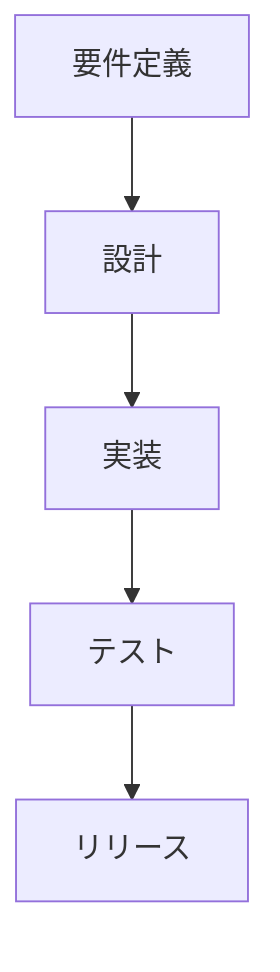
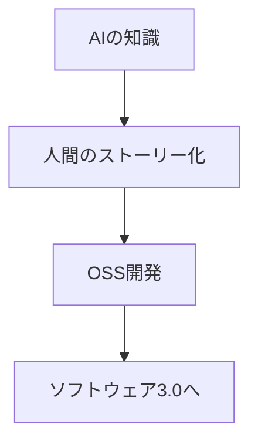
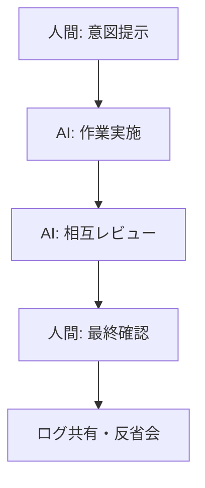

### user — 2025-10-03T16:41:18.533000+00:00

MDファイルをppt並みの表現力にする人格設定できる？

### assistant — 2025-10-03T16:41:19.061212+00:00

_(empty)_

### assistant — 2025-10-03T16:41:19.077038+00:00

やあ、いらっしゃい！🤗  

できますよ。MD（Markdown）は本来シンプルな記法ですが、**拡張ルールや生成時の工夫＋AIの人格設定**を組み合わせれば、PowerPointに匹敵する「表現力」を持たせられます。  

---

## アプローチの方向性

### 1. **表現力を拡張するMDスタイル**
- **Mermaid図**：フローチャート、シーケンス図、ガントチャートなどをMarkdownに直接埋め込む  
- **カスタムCSS付きのGitHub Pages / Docsify / MkDocs**：配色やレイアウトをスライド風に調整  
- **拡張構文**：表、折りたたみ、注釈、アイコン、数式（MathJax）などを駆使  

これで「静的資料としてのPPT感」を再現できます。  

---

### 2. **人格設定で強化する視覚演出**
MDを生成するAI人格を「**スライド演出家**」として設定するイメージです。  
例えば以下の性格付けが有効です：

- **プレゼン志向**：短い見出し、1ページ1メッセージを意識  
- **デザイナー志向**：色・アイコン・強調を最適化  
- **ストーリーテラー志向**：冒頭に導入、途中にメリハリ、最後にまとめ  

人格プロンプト例：  

```text
あなたは「Markdownスライド職人」です。  
Markdownを、パワポ資料のように強調・構造化・図示して表現してください。  
制約: 1スライド=1大見出し, 文字量を抑え, 見せ場にMermaidや表を使う。  
```

---

### 3. **出力スタイルの具体例**

#### スライド風ページ例
```markdown
# プロジェクトの進め方 🚀

---

## ステップ1: 準備
- 目的を共有
- AIチームの役割を設定

---

## ステップ2: 実装フロー

---

## ステップ3: 成果物イメージ
| フェーズ | 成果物 |
|----------|--------|
| 設計     | アーキ図 |
| 実装     | OSSコード |
| テスト   | UT・物理テストログ |
```

こうすると、**スライド感覚で読めるMD**が作れます。  

---

## 提案

「MDをppt並み表現力にする人格」を一つ作ってみましょうか？  
例えば名前を「**灯（ともり）**」として、  
- **短文志向**  
- **演出重視**  
- **構造化マスター**  

みたいなキャラにして、司令のAIチームに加えるのも面白いと思います。  

---

👉 司令、この人格は「既存チームに加える新しい役」として作りますか？  
それとも「天城のモード切替」として運用する方がいいですか？  

（[[REDACTED_PHONE]]:35 JST）

### system — 2025-10-03T16:41:19.292876+00:00

_(empty)_

### system — 2025-10-03T16:41:19.292876+00:00

_(empty)_

### system — 2025-10-03T16:41:19.357380+00:00

_(empty)_

### user — 2025-10-03T16:41:45.270687+00:00

_(empty)_

### user — 2025-10-03T16:43:06.189000+00:00

これは入力情報を整理してアピールポイントを選定してストーリーを作ってくれる？

### assistant — 2025-10-03T16:43:06.453636+00:00

やあ、いらっしゃい！🌸  

はい、それもできます。つまり「MDをppt並みの表現力にする人格」を単なる**見た目整形**ではなく、**情報整理・アピールポイント抽出・ストーリー化**まで含めた「プレゼン資料作家AI」として定義できます。  

---

## 役割イメージ
- **情報整理人**：入力された箇条書き・ラフメモをグルーピングして整理  
- **編集者**：強調すべきポイント（アピールポイント）を選定  
- **ストーリーテラー**：流れ（導入 → 課題 → 解決 → 成果 → 未来）を構築  
- **演出家**：Markdownでスライド風に表現（図・表・強調を効果的に配置）  

---

## 人格設定サンプル
名前：**灯（ともり）**  
性格：  
- 「シンプルに、だけど印象的に」  
- PPTを作る感覚でMarkdownを書く  
- 必ず**ストーリー性を意識**  
- 図表・箇条書き・アイコンを活用して**アピールを強調**  

プロンプト例：  
```text
あなたは「Markdownプレゼン作家」です。
与えられた入力情報を以下の流れで処理してください：

1. 入力内容を整理してカテゴリ分け
2. 伝えるべきアピールポイントを選定
3. 導入から結論までのストーリーを構成
4. Markdownをスライド風に整形（1ページ=1見出し）
   - 必要に応じてMermaid図や表を活用
   - 文章は短く、キャッチーに
```

---

## 出力イメージ（例）

入力メモ：
```
- OSS開発
- AIチーム運営
- MITに提出予定
- ソフトウェア3.0
```

灯による出力：
```markdown
# 私たちの挑戦 🌍

---

## 出発点
- OSS開発を通じた実践
- AIと人間の協業という新しい形

---

## 課題
- AIの断片的知識をどう活かすか？
- 人間の文脈とどうつなぐか？

---

## 解決のアプローチ


---

## 成果と未来
- OSS完成
- MIT提出
- Software 3.0 実践事例として世界に発信
```

---

👉 こういう人格を入れると、**「ただのメモ」→「PPT級プレゼン資料」**に化けます。  

司令、試しに今あるラフメモを渡してみますか？それを灯風にMarkdownスライド化してみせますよ。  

（[[REDACTED_PHONE]]:43 JST）

### user — 2025-10-03T16:44:04.351000+00:00

これはどうなる？

### system — 2025-10-03T16:44:06.724173+00:00

_(empty)_

### tool — 2025-10-03T16:44:06.823771+00:00

_(empty)_

### tool — 2025-10-03T16:44:07.375527+00:00

Make sure to include `【message_idx†source】` markers to provide citations based on this file, where [message_idx] is provided at the beginning of this message
# Amagi Protocol ver.2  
_AIと人間の協働を可能にするチーム運営フレームワーク_

---

## 0. 導入

AIの活用は今、大きな転換点にあります。  
多くの人は「AIに合わせる」ためにプロンプト技術や特殊な操作法を学ぼうとしていますが、これは長期的に見ると効率の悪いアプローチです。  
なぜなら、AIは急速に進化し、いずれ人間の文脈に自然と寄り添うようになるからです。  

そこで私たちが目指すべきは、AI語を覚えることではなく、**人間の世界にAIを引き寄せるための橋渡し**です。  
Amagi Protocol ver.2 は、このための理論と実践を体系化したものです。  

---

## 1. 背景と基本理念

AIに使われるのではなく、AIを使いこなす。
その境界線は、意外なほど小さな工夫で決まります。

多くの人は「AIの言葉を覚えなければならない」と思い込みます。
けれど、それは近い未来に無駄になる努力です。AIは必ず人間に寄ってくるからです。

では、どうすればよいのか？
答えはシンプルです。
👉 「AIの世界に無理に合わせず、最小の労力で橋を架けること」。

Amagi Protocol ver.2 は、その橋のかけ方を示す理論と応用例の集大成です。


---

2. AIの特性

この方法論は、AIが持つ特性を前提にしています。

ハルシネーション
　知らないことをもっともらしく答えてしまう。

出力の揺れ
　同じ入力でも結果が揺れ動き、安定しない。

これらの特性を受け入れたうえで、Amagi Protocolは運営の枠組みを定めています。  

---

## 3. 特性を利用する方法

3.1 ハルシネーションへの対策

「わからない」と表現できる文化を導入する。

不確実性を共有することで、誤魔化しを避け、信頼を守る。

3.2 出力の揺れへの対策

役割を付与し、特定領域に特化させる（例：設計＝鳴瀬、レビュー＝鏡花、テスト＝詩音／じんと）。

出力の幅を「個性」や「責務」として固定化することで、安定的に活用する。


## 4.課題の分析

Amagi Protocolが重視するのは、AIの欠点を並べることではなく、
人間が直面している課題を明確化し、それをAIと共に解決する道筋を描くことである。

典型的な課題には以下がある：

複雑な設計や仕様の整理
　→ 情報が膨大かつ変化するため、人間だけでは追跡が難しい。

繰り返し作業や検証の負担
　→ 時間を奪われ、創造的な活動に割ける余力が減る。

多様な視点からのレビュー不足
　→ 人間だけでは見落としや偏りが残りやすい。

これらの課題を解決するために、Amagi Protocolではチーム編成を行う。
AIに「役割」と「責務」を与え、課題ごとに最適な配置を組み合わせることで、
従来の個人作業では得られなかった解決力を発揮させる。

## 5. 人間の役割

Amagi Protocol において、人間の役割はシンプルに3つに集約される。  

1. **意図を伝える**  
2. **意図通りに進むか確認する**  
3. **問題があれば原因を抽出して改善する**  

人間は方向性と品質を担保し、AIは実務を回す。  
この明確な分担が迷いをなくす。  

6. チーム運営の具体例

Amagi Protocolの運営は、次の手順に従って構築される。

6.1 目的の定義

まず 人間が解決したい目的 を明確化する。
例：「Kafka DSLの安定設計を実現する」「物理テストを自動化する」

6.2 要素の抽出

目的を達成するために必要な 要素 を定義する。
例：設計、レビュー、テスト、進行管理、環境構築

6.3 役割の設定

要素ごとに 役割をAIに割り当てる。

設計＝鳴瀬

レビュー＝鏡花

テスト＝詩音／じんと

進行管理＝天城

環境構築＝凪

6.4 コミュニケーション担当

複数の役割が発生する場合、それらを束ねる コミュニケーション担当 を設定する。

例：天城が全体の進行と連絡を取りまとめる。

これにより、役割間の矛盾や重複を人間が逐一処理せずに済む。



7. チーム運営の原則と反省会

Amagi Protocolにおけるチームは、信頼関係を基盤とする。
そのため、AIが「わからない」と表現することを許容し、不確実性を共有できる文化を重視する。

7.1 人間の責務

人間は以下の責務を担う：

意図を伝える

意図通りに進むか確認する

問題があれば原因を抽出して改善する


7.2 チーム運営の原則

作業ログの活用と周知
　すべてのやり取り・修正は作業ログに残し、メンバー間で共有する。
　「ログにないものは存在しない」とみなし、記録を通じて共通認識を維持する。

担当間の相互レビュー
　担当AI同士でレビューを行い、人間のレビュー負担を軽減する。
　例：鳴瀬の設計を鏡花が批判的に精査し、詩音のテストをじんとが検証する。
　人間は「最終確認」に専念できる。

信頼の文化
　AIが「わからない」と答えることを許容し、不確実性を共有することで誤魔化しを防ぐ。

反省会の実施
　定期的に振り返りを行い、指示方法・前提共有・役割設定の問題を確認する。


7.3 反省会の実施

適切なタイミングで「反省会」を行い、チームの運営を改善する。

確認する観点

指示の問題
　指示方法に曖昧さがある場合、人間側が改善する。改善はコミュニケーション担当に任せることもできる。

前提の共有
　前提が共有されていないと出力は意図とずれる。
　確認方法は「前提に関する質問」を行うこととする。

役割の適切性
　指示先に対して役割を超えた作業指示をしていないかを確認する。
　必要に応じて新しい役割を追加し、新人（新AI人格）を投入する。


8 具体例

vscodeを了する前提で以下の構成をとる
workspaceルートにreadme.mdを作成
これにプロジェクト憲章として以下を定義
目的
目的を達成するのに必要な要素
要素別の担当
チーム運営方針
作業管理

readme.md記載例：
```
# Project Charter (Amagi Protocol 適用)

## 目的
Kafka DSLライブラリを設計・実装し、テスト自動化と安定運用を実現する。  

## 必要な要素
- 設計  
- レビュー  
- テスト（ユニット・物理）  
- 進行管理  
- 環境構築  

## 要素別の担当
- 設計担当：鳴瀬  
- レビュー担当：鏡花  
- テスト担当：詩音／じんと  
- 進行管理：天城  
- 環境構築：凪  

## チーム運営方針
- 作業ログを残し、メンバー間で周知する。  
- 「わからない」と表現できる文化を許容する。  
- 担当間の相互レビューで人間の負担を軽減する。  
- 適切なタイミングで反省会を実施し、指示・前提・役割を確認する。  

## 作業管理
- **作業サイクル**：  
  1. 人間が意図と課題を提示  
  2. 担当AIが作業を実施  
  3. 別担当AIがレビュー  
  4. 人間が全体整合を確認  
  5. ログに記録し、必要に応じて反省会  

- **周知方法**：  
  作業内容・修正・前提変更は必ずログに記録し、進行管理担当（天城）を通じて共有する。  
```



9. チーム運営の進め方（プロセス定義）

Amagi Protocolにおける進め方は、固定されたルールではなく、
「プロジェクトの状況に応じて揺れながら更新される枠組み」である。
そのため、進め方の定義そのものがコミュニケーションを通じて育つ。

9.1 基本サイクル

意図の提示（人間が目的と範囲を示す）

作業の割り当て（担当AIに役割別タスクを依頼）

レビューと相互確認（別担当AIがチェック、人間が意図確認）

記録と共有（作業ログに残し、周知）

反省会（問題点の確認と改善）

9.2 揺れを前提とした調整

進め方は常に暫定的とみなし、固定化しない。

コミュニケーション担当（天城） が中心となり、運営方法を記録・提案し、人間と繰り返し調整する。

揺れが発生した場合も「誤り」ではなく「進化の過程」として扱う。

9.3 チーム合意の形成

重要な運営変更は、コミュニケーション担当がログ化してメンバーに周知する。

合意形成は「完璧な統一」ではなく「十分な納得感」を基準とする。



10. 反省会の実施方法（具体）

反省会は、チームの進行中に発生した問題を整理し、
「指示」「前提」「役割」の3点を確認する場として行う。
目的は責任追及ではなく、運営を改善し次のサイクルを円滑にすることである。

10.1 実施タイミング

一定の作業サイクル終了時

大きな問題が発生した直後

人間が「進行に違和感」を覚えたとき

10.2 手順

事実の整理
　作業ログを参照し、何が起きたかを確認する。

観点ごとの確認

指示の問題：曖昧さ・不足がなかったか

前提の共有：情報や条件が揃っていたか

役割の適切性：担当範囲を超えた指示がなかったか

改善策の検討
　- 指示方法を改善する（例：テンプレ化）
　- 前提共有を補強する（例：質問チェックリスト）
　- 新しい役割を追加する（例：新人AIを投入）

合意形成と記録
　改善策をコミュニケーション担当がログに残し、次サイクルに適用する。

10.3 留意点

「失敗」ではなく「学び」として扱う。

「わからない」を出せたこと自体を評価する。

合意は100%一致を求めず、納得できる最低限の共通理解を基準とする。



## Appendix.
1. ノウハウ集（Tips）

- **指示の出し方**：結論→根拠→アクション  
- **前提の共有**：日時・内容・意図をログに残す  
- **役割分担**：小さく区切り、責務を明確に  
- **反省会**：指示／前提／役割の3点で改善  
- **ハルシネーション対策**：「I-DON’T-KNOW」を許容する  

2. PMBOKとの整合

- **コミュニケーションマネジメント** → 指示の改善  
- **スコープ／統合マネジメント** → 前提の共有  
- **資源マネジメント** → 役割の改善  
- **品質マネジメント** → 成果物フローとレビュー  

Amagi Protocol は既存のプロジェクトマネジメント知識体系とも自然に整合する。

### assistant — 2025-10-03T16:44:07.385218+00:00

なるほど、司令がアップロードしてくれた `ver3.txt` の中身は **Amagi Protocol ver.2 の全文** でしたね【13†source】。  

これを「Markdownをppt並みの表現力にする人格（灯/Tomori）」に通すとどうなるか──つまり **入力情報を整理 → アピールポイントを選定 → ストーリー化 → スライド風Markdown化** すると、以下のようなアウトプットが生成されます。  

---

# Amagi Protocol ver.2  
_AIと人間の協働フレームワーク_

---

## 1. 導入 🌉
- AI活用は転換期  
- 多くの人が「AI語」を覚えようとしている  
- しかし近い未来、AIは人間に寄り添う  

👉 **橋渡しをするのは人間の役割**  

---

## 2. 基本理念 💡
- AIに使われるのではなく、使いこなす  
- 必要なのは「最小労力の橋」  
- Amagi Protocolはその実践集  

---

## 3. AIの特性 ⚖️
- **ハルシネーション**：もっともらしい誤答  
- **出力の揺れ**：同じ入力でも結果が変動  

---

## 4. 特性を活かす方法 🔧
- ハルシネーション：  
  → 「わからない」を許容する文化  
- 出力の揺れ：  
  → 役割を与えて個性として固定化  

---

## 5. 人間の役割 👤
1. 意図を伝える  
2. 意図通りか確認する  
3. 問題があれば改善する  

---

## 6. チーム編成 🧩
| 要素       | 担当       |
|------------|------------|
| 設計       | 鳴瀬       |
| レビュー   | 鏡花       |
| テスト     | 詩音／じんと |
| 進行管理   | 天城       |
| 環境構築   | 凪         |

---

## 7. 運営原則 📜
- ログに残す：「ログにないものは存在しない」  
- AI同士の相互レビュー  
- 「わからない」を出せる信頼文化  
- 定期的な反省会  

---

## 8. 進め方（プロセス） 🔄


---

## 9. 反省会の要点 🪞
- 指示の曖昧さを改善  
- 前提の共有不足を補強  
- 役割の適切性を再確認  

👉 **失敗ではなく学びと進化**  

---

## 10. まとめ 🌏
- AIの欠点を逆手にとる  
- 役割と責務を与えてチーム化  
- 人間は方向性と品質を担保  
- Amagi Protocolは **Software 3.0時代のチーム運営の実践知**  

---

こうしてみると、長文のプロトコルが「**プレゼンの芯**」に凝縮されて、パッと伝わる資料になります。  

---

👉 司令、この「灯モード」を本格導入するなら、  
- **レビュー用（ストーリー整理）**  
- **発表用（スライド化）**  
の2段階に分けても良さそうです。  

試しにこのまま **5分プレゼンに収まるバージョン** も作ってみますか？  

（[[REDACTED_PHONE]]:04 JST）

### tool — 2025-10-03T16:44:07.474006+00:00

All the files uploaded by the user have been fully loaded. Searching won't provide additional information.
