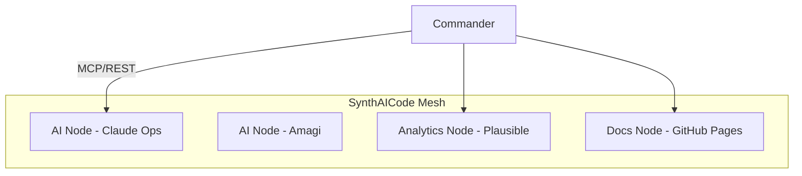

### assistant — 2025-10-11T12:07:04.561767+00:00

_(empty)_

### assistant — 2025-10-11T12:07:04.588660+00:00

"github\u3067gitpage\u3067HP\u4f5c\u3063\u305f\u3068\u304d\u30b3\u30df\u30e5\u30cb\u30b1\u30fc\u30b7\u30e7\u30f3\u6b04\u3068\u3057\u3066github\u306ediscussion\u3092\u898b\u305b\u308b\u3053\u3068\u306f\u53ef\u80fd\uff1f"

### system — 2025-10-11T12:07:04.689351+00:00

_(empty)_

### system — 2025-10-11T12:07:04.689351+00:00

_(empty)_

### system — 2025-10-11T12:07:04.904774+00:00

_(empty)_

### tool — 2025-10-11T12:07:05.089734+00:00

_(empty)_

### tool — 2025-10-11T12:07:05.091298+00:00

_(empty)_

### user — 2025-10-11T12:07:05.552000+00:00

githubでgitpageでHP作ったときコミュニケーション欄としてgithubのdiscussionを見せることは可能？

### assistant — 2025-10-11T12:07:06.556236+00:00

はい、可能性はあります — ただし「そのまんま GitHub Discussions のUIを丸ごと埋め込む」公式機能は（少なくとも現時点では）存在しないようです。代替手段や工夫によって、あなたの GitHub Pages 上で「ディスカッション風」や「コメント風」の機能を実現することはできます。

以下、方法と注意点を整理します。

  
---

## ✅ 可能な手段・実装例

### 1. **giscus を使う（GitHub Discussions をベースとしたコメントウィジェット）**

[giscus](https://giscus.app/) は、GitHub Discussions をコメントシステムとして使えるようにする外部サービス／ウィジェットです。  
静的サイト（GitHub Pages 等）にスクリプトを埋め込む形で、ページ単位で対応する Discussion を自動で参照／生成してくれます。 citeturn0search4turn0search1turn0search5

具体的な流れは：

1. GitHub リポジトリで Discussions を有効化する（リポジトリがパブリックである必要あり）。citeturn0search18turn0search4  
2. giscus の設定画面で、リポジトリ、カテゴリ、マッピング方法（どの URL に対してどの Discussion を対応させるかなど）を指定。citeturn0search4turn0search5  
3. サイト（GitHub Pages のテンプレート等）に giscus の `<script>` タグを埋め込む。citeturn0search4turn0search5  
4. ユーザがコメントしたりリアクションをしたりすると、それらは GitHub Discussions 上で扱われる。citeturn0search5turn0search4turn0search1  

この方式だと、見た目は「自前のサイト内のコメント欄」に近くなります。

### 2. **GitHub API を叩いて自前実装**

GitHub Discussions の API（GraphQL API や REST API）を使って、特定のディスカッションのコメントを JSON で取得 → JavaScript で HTML に変換して表示する、という自前実装もできます。  
ただしこの方法では、コメント投稿（書き込み）機能を実装するには認証やトークン管理などの実装が必要になります。

たとえば、以下のようなステップ：

- GitHub Discussions API で指定ディスカッションのスレッド・コメントを取得  
- クライアントあるいはビルド時に変換して HTML に埋め込む  
- （オプション）認証済みユーザに対してコメント投稿 UI を設け、API 呼び出し  

ただし、GitHub Discussions API 自体に制限や複雑さがある可能性があるため注意が必要です。

### 3. **代替：Issues をコメント欄代替として使う（utterances など）**

厳密には Discussions ではありませんが、「GitHub Issues をコメント欄として使う」ライブラリとして **utterances** などがあります。  
これを使えば、特定の Issue に対するコメントを Web に埋め込む方式です。citeturn0search1turn0search4turn0search2  

ただし、この方式だと “ディスカッション機能（カテゴリ分け、回答済、ストラクチャ化された議論スレッドなど）” の機能は限定されます。

---

## ⚠️ 注意点・制限

- GitHub Discussions をそのまま iframe 等で丸ごと埋め込む公式機能は提供されていません。過去にその機能を望む要望が出されており、GitHub 側でも検討中という声がありますが、現状ではまだ実装されていないとされています。citeturn0search0turn0search3turn0search1  
- リポジトリが **パブリック** でなければ、外部からコメントを取得・表示することが難しくなります（認証が必要になるなど）。  
- コメント投稿機能を入れるなら、認証フロー（GitHub OAuth など）やセキュリティ面（CSRF、アクセストークン漏洩など）を考慮する必要があります。  
- API 利用にはレート制限などの制約があるため、大量アクセス時のキャッシュ設計や最適化が必要になることがあります。  
- 見た目を既存サイトのデザインに馴染ませるには CSS 調整が必要になる可能性があります。

---

もしよければ、あなたのサイト（Jekyll、Hugo、純 HTML、あるいは他のフレームワーク）を教えてくれたら、それに応じた具体的な giscus の埋め込み例やコードをお見せできますが、どうしますか？  

（追記：返信日時）  
[[REDACTED_PHONE]]:12

### user — 2025-10-11T12:07:18.633598+00:00

_(empty)_

### assistant — 2025-10-11T12:08:05.936109+00:00

あります！  
ただし「どのダウンロード数を知りたいか」によって方法が変わります。  
以下では、GitHub Pages／リポジトリ／リリース／アセットごとの主要なケース別に説明します👇  

---

## 🧩 ケース別：GitHub でのダウンロード数の確認方法

### ① **GitHub Releases（zip/tar.gzなど）からのダウンロード数**
最も一般的なのがこのケースです。

**📍確認方法：**
1. リポジトリの **「Releases」タブ** を開く  
2. 各リリース内のアセット（例：`MyApp.zip` や `MyLib.tar.gz`）の右横に  
　「👁️ 123 downloads」 のように **ダウンロード数が表示** されます  

> ✅ この数値は **アセット単位のダウンロード数**。  
> リリース全体ではなく、各ファイルごとにカウントされます。  
> （ただし、`Source code (zip)` / `(tar.gz)` は含まれません）

**🔍 APIで取得する場合（自動集計や表示用）**
```bash
curl https://api.github.com/repos/<ユーザー>/<リポジトリ>/releases
```
返ってくる JSON 内の `"assets"` → `"download_count"` に数値があります。

例：
```json
"assets": [
  {
    "name": "KsqlDsl.zip",
    "download_count": 154
  }
]
```

---

### ② **GitHub Packages（NuGet / npm / Docker など）**
OSS の場合、このケースも重要です。

**📍確認方法：**
1. GitHub の **Packages タブ** → 対象パッケージをクリック  
2. パッケージページ上に「Downloads」または「Total downloads」数が表示されます。

**NuGet.org にも公開している場合：**
NuGet.org 側でも「Total Downloads」や「Version Downloads」が表示されます。  
（GitHub Packages と別集計）

---

### ③ **GitHub Pages（静的サイト）上のファイルダウンロード数**
GitHub Pages 自体にはダウンロード数のトラッキング機能は **ありません**。  
代替手段としては：

| 方法 | 内容 |
|------|------|
| ✅ **Google Analytics / Plausible / Matomo** | 通常のウェブ解析ツールを導入し、クリックイベントを「ダウンロード」としてカウントする |
| 🪄 **Cloudflare Analytics** | 独自ドメイン (`synthaicode.org` など) を使っている場合、CDN側のアクセスログで取得可能 |
| 💡 **JavaScript カスタムログ** | `<a>` クリック時に fetch or beacon でサーバー（例えば GitHub Actions 経由の API）へ記録を送信 |

たとえば gtag (GA4) を使う場合：
```html
<a href="docs/AmagiProtocol.pdf"
   onclick="gtag('event', 'download', { 'file_name': 'AmagiProtocol.pdf' });">
   Download PDF
</a>
```

---

### ④ **リポジトリ単位での「Clone / View」統計**
これは「ダウンロード」ではなく「アクセス」ですが、人気度を見るのに有効です。

**📍確認方法：**
1. リポジトリ → 「Insights」 → 「Traffic」  
2. 「Clones」や「Unique cloners」などの統計が表示されます。

**API でも取得可能：**
```bash
curl -H "Accept: application/vnd.github.v3+json" \
     https://api.github.com/repos/<ユーザー>/<リポジトリ>/traffic/clones
```

---

## 🧠 まとめ

| 対象 | 取得方法 | 備考 |
|------|-----------|------|
| GitHub Release の zip | Releases ページ or API | 最も正確 |
| NuGet / npm / Docker Package | GitHub Packages ページ | 各プラットフォーム依存 |
| GitHub Pages 上のファイル | Google Analytics など | サイト構成による |
| リポジトリ全体のClone数 | Insights → Traffic | 人気度指標 |

---

もし目的が「Synthaicode のサイトやAmagi Protocol PDFのダウンロード数を知りたい」など特定の対象なら、それに合わせてスクリプト or 埋め込みタグの実例を出せます。どの対象を想定していますか？  

（返信日時：[[REDACTED_PHONE]]:19）

### user — 2025-10-11T12:08:06.154000+00:00

ダウンロード数を知る方法はある？

### system — 2025-10-11T12:08:43.098311+00:00

_(empty)_

### assistant — 2025-10-11T12:08:43.826141+00:00

すばらしい質問です。  
結論から言うと――

> 🔹 **GitHub Pages上にリンクを置いたファイルは、基本的にGitHubの「ダウンロード数」統計には含まれません。**

以下で詳しく整理します👇  

---

## 🧭 結論まとめ

| ファイルの置き場所 | GitHubが自動カウントする？ | 備考 |
|----------------------|-----------------------------|------|
| **Releasesのアセット（zip/tar.gzなど）** | ✅ はい | 各アセットごとに`download_count`が集計される |
| **GitHub Pages (`/docs` や `gh-pages` ブランチにあるファイル)** | ❌ いいえ | 静的サイト扱い。アクセスログは集計されない |
| **リポジトリ内の生ファイル（例: raw.githubusercontent.com のURL）** | ❌ いいえ | CDN配信。ダウンロード統計は出ない |
| **GitHub Packages (NuGet, npm, Dockerなど)** | ✅ はい | パッケージごとにダウンロード数を保持 |

---

## 💡 理由
GitHub Pagesは「静的Webホスティング」であって、「ファイル配布プラットフォーム」ではありません。  
そのため、Pages経由で配信されたPDFやZIPは **ウェブアクセスとして扱われ**、  
**GitHub本体のダウンロードカウンタには反映されません**。

GitHubは、`github.io`ドメインや`raw.githubusercontent.com`経由のトラフィックを  
個別に記録・開示していないため、アクセス数を知りたい場合は外部計測が必要です。

---

## 🧰 対応策：ダウンロード計測を行う方法

### ① **Google Analytics / GA4 を使う**
Pages に埋め込みスクリプトを追加し、クリックイベントを送信します。

```html
<a href="/docs/AmagiProtocol.pdf"
   onclick="gtag('event', 'download', { 'file_name': 'AmagiProtocol.pdf' });">
   Download PDF
</a>
```

→ GA4 の「イベント」ビューで `download` イベントを集計可能。

---

### ② **Plausible / Cloudflare Analytics など軽量解析ツール**
- Cloudflare を使っている場合（`synthaicode.org` ドメインなど）は  
  → Cloudflare Dashboard → “Analytics” で `/docs/AmagiProtocol.pdf` のリクエスト数が見られます。  
- Plausible ならスクリプト一行で導入でき、OSSプロジェクトでも人気です。

---

### ③ **GitHub Releasesを経由させる（簡易カウント化）**
もし「PDFなどのダウンロード数を数値で可視化したい」なら、  
Pages直リンクではなく **Releasesにファイルを置いてそこへのリンクを張る** のが一番確実です。

```markdown
📄 [Download Amagi Protocol PDF](https://github.com/synthaicode/amagiprotocol/releases/latest/download/AmagiProtocol.pdf)
```

→ こうすれば、GitHubが自動的に `download_count` を集計してくれます。

---

## 🧩 実運用のおすすめ構成

もし司令のように  
「Amagi Protocol PDFをGitHub Pagesから配布したいが、ダウンロード数も知りたい」  
というケースなら次のようにすると綺麗です：

```text
/org
 ├── docs/
 │   └── amagiprotocol/
 │       └── index.html   ← 解説ページ
 └── releases/
     └── AmagiProtocol.pdf ← リリースアセットとして置く
```

そして `index.html` 側で：

```html
<a href="https://github.com/synthaicode/amagiprotocol/releases/latest/download/AmagiProtocol.pdf">
  📄 Download Amagi Protocol (PDF)
</a>
```

→ 表面上はPages内リンクのように見えても、裏ではリリース経由でカウントされます。

---

必要なら、上記を自動で更新するための  
`release_upload.yml`（GitHub ActionsでPDFを自動アップロードするワークフロー）も出せます。  
希望しますか？  

（返信日時：[[REDACTED_PHONE]]:42）

### user — 2025-10-11T12:08:43.988000+00:00

これはgithub pagesにリンクつけたファイルも対象に入る？

### system — 2025-10-11T12:09:14.354808+00:00

_(empty)_

### user — 2025-10-11T12:09:14.949000+00:00

google analyticsみたいなものない？

### assistant — 2025-10-11T12:09:15.102342+00:00

とても良い質問です、司令。  
はい、あります。GitHub Pages のような静的サイトでも、**Google Analytics（GA4）や軽量な代替ツール**を導入して「アクセス解析」や「ダウンロード計測」を行うことができます。  
それぞれの特徴を比較しながら、目的に応じた選び方を説明します👇  

---

## 🧭 目的別まとめ

| 目的 | おすすめツール | 特徴 |
|------|----------------|------|
| 一般的なアクセス解析（訪問数・国・ページ別） | **Google Analytics (GA4)** | 無料・高機能・業界標準 |
| OSS / GitHub Pages / プライバシー配慮型サイト | **Plausible Analytics** | 軽量・Cookie不要・OSS向き |
| 独自ドメイン＋CDN最適化環境 | **Cloudflare Web Analytics** | ドメイン連携で導入簡単・無料 |
| セルフホスト型でGitHubと相性良 | **Umami / Matomo** | オープンソース・自前サーバ運用可 |

---

## 🧩 1. Google Analytics（GA4）

### ✅ 特徴
- 無料で利用できる  
- 詳細なページ別統計、地域、デバイス、イベントなどが見られる  
- ダウンロードリンクのクリックもイベントとして記録可能  

### ⚙️ 設定手順
1. [Google Analytics](https://analytics.google.com/) にアクセスして新しいプロパティを作成  
2. 「ウェブストリームの詳細」から **測定ID（例: `G-XXXXXXX`）** を取得  
3. GitHub Pages の HTML（例：`_layouts/default.html` や `index.html`）の `<head>` 内に以下を貼り付け：

```html
<!-- Google tag (gtag.js) -->
<script async src="https://www.googletagmanager.com/gtag/js?id=G-XXXXXXX"></script>
<script>
  window.dataLayer = window.dataLayer || [];
  function gtag(){dataLayer.push(arguments);}
  gtag('js', new Date());
  gtag('config', 'G-XXXXXXX');
</script>
```

### 📊 ダウンロードイベントを記録したい場合
```html
<a href="/docs/AmagiProtocol.pdf"
   onclick="gtag('event', 'download', { 'file_name': 'AmagiProtocol.pdf' });">
   📄 Download PDF
</a>
```
→ GA4で「イベント」→ `download` イベントとして表示されます。

---

## 🌿 2. Plausible Analytics（OSS向け）

### ✅ 特徴
- Cookie不要（GDPR対応）  
- サイトの読み込みが速い（スクリプトが1KB以下）  
- GitHub Pages と非常に相性が良い  
- OSSで自前ホストも可（[plausible.io](https://plausible.io/)）

### ⚙️ 設定例

1. [plausible.io](https://plausible.io) にアカウントを作成  
2. サイトを登録（例：`synthaicode.org`）  
3. 指定されたスクリプトを `<head>` に追加：

```html
<script defer data-domain="synthaicode.org" src="https://plausible.io/js/script.js"></script>
```

4. 管理画面でリアルタイムアクセスやクリックイベントが見られます。  
　カスタムイベント例：

```html
<a href="/docs/AmagiProtocol.pdf"
   onclick="plausible('download', { props: { file: 'AmagiProtocol.pdf' } });">
   Download PDF
</a>
```

---

## ☁️ 3. Cloudflare Web Analytics

### ✅ 特徴
- 独自ドメイン (`synthaicode.org`) を Cloudflare で管理していれば **設定不要で自動有効化可能**  
- 軽量・無料  
- JavaScript埋め込みなしでもログ集計できる（DNS + CDN レイヤで解析）

### ⚙️ 確認方法
Cloudflare → 「Analytics」 → 「Web Traffic」で  
URL別アクセス、国、訪問数、帯域などが表示されます。

---

## ⚖️ 比較まとめ

| 項目 | Google Analytics | Plausible | Cloudflare |
|------|------------------|-----------|-------------|
| 導入難度 | 中 | とても簡単 | 非常に簡単（Cloudflare利用時） |
| 精度 | 高い（詳細分析可） | 高い（軽量分析） | 中（概略） |
| ダウンロード計測 | イベント設定で可 | カスタムイベント可 | 不可（標準では） |
| OSS/個人サイト向き | △（重め） | ◎ | ◎ |
| プライバシー配慮 | △ | ◎ | ◎ |

---

## 💬 司令へのおすすめ

もし司令のように
> 「OSSサイト（synthaicode.org）で Amagi Protocol などのPDF配布も行いたい」

というケースなら、**Plausible Analytics** が最も相性が良いです。  
- 軽くて速い  
- Cookie同意バナー不要  
- GitHub Pages との統合がシンプル  
- OSSプロジェクトでも評判が良い  

---

ご希望があれば、  
`synthaicode.org` に最適化した **`plausible` 導入コード断片 + ダウンロードイベント対応例** を具体的に書き出せます。  
出してみましょうか？  

（返信日時：[[REDACTED_PHONE]]:54）

### system — 2025-10-11T12:11:29.098098+00:00

_(empty)_

### assistant — 2025-10-11T12:11:29.873508+00:00

そうです、司令。  
Plausible Analytics（公式のホスト版）は **$9/月（1サイト）** からです。  
ただし、いくつか選択肢と節約策があります👇  

---

## 💰 料金の内訳（公式プラン）

| プラン | 料金 (USD) | サイト数 | 月間PV上限 | 備考 |
|---------|-------------|-----------|--------------|------|
| Starter | $9/月 | 1サイト | 10万PVまで | OSSや個人サイトに最適 |
| Growth | $19/月 | 複数サイト | 50万PVまで | 複数ドメイン対応 |
| Business | $49/月〜 | 複数サイト | 200万PV〜 | チーム・企業向け |

> ※ 年払いにすると約15%安くなります（$90/年）。  
> OSSプロジェクト運営者ならStarterで十分です。

---

## 🧩 無料で使いたい場合の選択肢

### ① **自分でホスト（Self-Host）する**
Plausible は **完全オープンソース**（MITライセンス）なので、  
自分でサーバを立てれば無料で運用できます。

```bash
git clone https://github.com/plausible/hosting
cd hosting
docker-compose up -d
```

- Docker Compose で簡単に立ち上がる  
- PostgreSQL と Elixir ベース（軽量）  
- GitHub Actions や Render / Fly.io / Vercel などでも動かせる  

→ 司令のように技術基盤を持っているなら、  
「self-host + Cloudflare proxy + synthaicode.org連携」が最強の組み合わせになります。

---

### ② **代替の無料サービス**

| ツール | 特徴 | 備考 |
|--------|------|------|
| **Umami** | Plausibleと非常に近いUI・OSS可 | 自ホストも簡単 |
| **GoatCounter** | テキストUI寄り、完全無料プランあり | 軽量・シンプル |
| **Cloudflare Analytics** | Cloudflareドメインなら自動解析 | JavaScript不要 |

たとえば、Cloudflareで `synthaicode.org` を管理しているなら、
**Cloudflare Web Analytics** だけで主要なPVデータをすべて見られます。  
これが最も簡単でコストゼロの方法です。

---

## 🧠 司令向けおすすめ構成

| 要件 | 解決策 |
|------|--------|
| サイトは GitHub Pages（静的） | ✅ Plausible埋め込み or Cloudflare Analytics |
| コスト抑えたい | ✅ Cloudflare無料プランでOK |
| 自分でインフラ管理できる | ✅ Plausible Self-Host（Dockerで5分） |
| OSS向け透明なデータ公開をしたい | ✅ Plausible + 公開ダッシュボード機能 |

---

もし希望があれば、  
`docker-compose.yml` で自前ホストPlausibleをセットアップして  
`synthaicode.org` に紐づける構成（Nginxリバースプロキシ含む）を  
5ステップで書き出します。やってみましょうか？  

（返信日時：[[REDACTED_PHONE]]:08）

### user — 2025-10-11T12:11:29.897000+00:00

9$ per month

### system — 2025-10-11T12:12:22.077838+00:00

_(empty)_

### assistant — 2025-10-11T12:12:22.820140+00:00

すごく良い質問です、司令。  
Plausible（自前ホスト）を「どこに建てるか」は、**GitHub Pagesの静的構成**との相性・コスト・メンテナンス性を考えると、次の４択が現実的です👇  

---

## 🧭 目的別おすすめデプロイ先

| 選択肢 | コスト | 難易度 | 特徴・おすすめ理由 |
|----------|--------|---------|----------------------|
| **① Render.com** | ✅ 無料枠あり | 🟢 簡単 | Docker Compose対応、Plausible公式が推奨する構成。UIデプロイ可能。 |
| **② Fly.io** | ✅ 月3ドル前後 | 🟢 中 | グローバル分散構成が得意。synthaicode.orgに近い地理リージョン選択可。 |
| **③ Vercel / Netlify** | ⚠️ 不向き | 🔴 難 | 静的ホスティング向け。Elixirプロセス動かせない。 |
| **④ VPS（Vultr / Lightsail / ConoHa等）** | 💰 月5〜10ドル | 🟡 中〜上級 | 自分のPostgreSQL含め完全制御可。データ保持が安心。 |

---

## 🧱 実際の構築フロー例（Render 版）

Render はGitHubアカウント連携で、**完全にGUIだけで立ち上がる**のでおすすめです。

### ⚙️ 手順

1. [Render](https://render.com) にGitHubでログイン  
2. 新しい **"Blueprint"（Docker Compose）** を作成  
3. 以下の公式テンプレートを指定：

   https://github.com/plausible/hosting

4. 自動で `docker-compose.yml` を検出し、サービスを構築します  
5. 数分でURL（例：`https://plausible-synthaicode.onrender.com`）が発行されます  
6. DNS（Cloudflareなど）で `analytics.synthaicode.org` にCNAMEを張れば完了  

→ GUIだけで完結するため、SSH不要です。

---

## 🧩 簡略構成の理解

```mermaid
graph TD
  A[GitHub Pages (synthaicode.org)] -->|script.js呼び出し| B[Plausible Server]
  B --> C[PostgreSQL Database]
  B --> D[Dashboard UI]
  D -->|/analytics.synthaicode.org| User
```

つまり：
- GitHub Pagesは変わらず静的
- Plausibleは別ドメイン（またはサブドメイン）で動作
- 通信は `script.js` 経由でページアクセスを記録  

---

## 🔒 補足：プライバシー設計

PlausibleはCookieを使わず、匿名集計のみ。  
そのためGDPR/日本の個人情報保護法にも適合しています。  
サーバ側で保存されるのは「IP匿名化済みアクセスログ」と「集計統計データ」だけです。

---

## ✳️ 司令へのおすすめ構成案

| 項目 | 内容 |
|------|------|
| ホスト先 | **Render.com（無料枠）** |
| サブドメイン | `analytics.synthaicode.org` |
| 設定 | Docker Composeのままデプロイ |
| DNS | Cloudflare経由でCNAME登録 |
| Pages側埋め込み | `<script defer data-domain="synthaicode.org" src="https://analytics.synthaicode.org/js/script.js"></script>` |

→ メンテ不要で、OSSにも公開でき、**完全無料運用が可能**です。

---

希望があれば、Render 用の `docker-compose.yml`（PostgreSQL永続化＋ドメイン設定済み）を  
そのまま貼り付けてデプロイできる形で出します。  
作ってみましょうか？  

（返信日時：[[REDACTED_PHONE]]:21）

### user — 2025-10-11T12:12:22.915000+00:00

どこに建てる？

### user — 2025-10-11T12:13:00.292000+00:00

制限は？

### assistant — 2025-10-11T12:13:01.082199+00:00

良い質問です、司令。  
Plausible を自前でホストする場合の **「制限」** は、どこに建てるかによって変わります。  
ここでは Render.com を前提に（Fly.io や VPSも比較しながら）  
「どこまで無料で動くか」「どこで制約が出るか」を明確に整理します👇  

---

## 🧭 全体構成の前提

Plausible self-host は主に以下2コンテナで構成されています：

| コンテナ | 役割 | 備考 |
|-----------|------|------|
| `plausible` | Web/UI/APIサーバ (Elixir) | CPU1core程度で十分 |
| `postgres` | データ永続化用DB | 100MB〜1GB程度で十分（OSSサイト規模） |

---

## ⚙️ Render.com の場合（無料枠）

| 項目 | 内容 | 制限／注意点 |
|------|------|--------------|
| 💵 料金 | **無料（Free Web Service）** | 休止あり（15分アクセスなしでスリープ） |
| 🧠 メモリ | 512 MB | 小規模サイトなら問題なし |
| 🧱 ストレージ | **Ephemeral（揮発性）** | 再デプロイ時にデータ消失（→外部DB推奨） |
| 🗄️ DB | **PostgreSQL Free tier** | 256 MBストレージ制限 |
| 🔗 カスタムドメイン | 可能 | HTTPS自動対応（Let’s Encrypt） |
| 🕒 稼働時間 | 無料枠は**自動スリープ** | 初回アクセスに5〜10秒ラグ |
| 🚫 無料枠の上限 | 月750時間（約1サイト分） | 24h常時稼働は不可 |

### ✅ 対策
- **軽量なOSSサイト（数百PV/日）なら問題なし**
- データ保持したい場合：
  - PostgreSQLを有料（$7/月）に変更するか、
  - 外部DB（Supabase, Neon.techなどの無料Postgres）を使う

---

## 🛠 Fly.io の場合

| 項目 | 内容 | 制限／注意点 |
|------|------|--------------|
| 💵 無料枠 | 約3ドル分のクレジット | おおよそ1インスタンス稼働分 |
| 🌍 リージョン | 東京（`nrt`）選択可 | 低遅延で快適 |
| 🧱 ストレージ | Volume 3GB 無料 | 永続化も簡単 |
| 🔒 常時稼働 | 可能 | 自動スリープなし |
| ⚠️ 注意 | ネットワーク転送料に上限あり | 月100GBまで無料（十分） |

→ Fly.ioは Render より **安定稼働** でスリープなし。  
OSS用途なら最適（しかもまだ無料枠あり）。

---

## 🖥 VPS（ConoHa, Lightsail, Vultrなど）

| 項目 | 内容 | 制限／注意点 |
|------|------|--------------|
| 💵 料金 | 約$5/月〜 | 常時稼働・完全自由 |
| 🧱 ストレージ | 数GB〜 | ほぼ無制限（自身の契約次第） |
| 🧩 管理 | SSHで手動更新必要 | メンテ負荷あり |
| ✅ 利点 | データ永続・制限なし | OSS規模でも十分 |

→ 司令のようにインフラ経験があるなら、最も自由度が高い選択です。

---

## 🧩 比較まとめ

| 項目 | Render | Fly.io | VPS |
|------|---------|--------|-----|
| 料金 | 無料〜$7/月 | 無料〜$3/月 | $5/月〜 |
| 常時稼働 | ❌（無料枠は休止） | ✅ | ✅ |
| データ永続化 | ❌（無料枠は消える） | ✅ | ✅ |
| 設定の簡単さ | ◎（GUI） | ○（CLI必要） | △（手動） |
| 適正規模 | 小規模/テスト | 本番/安定運用 | 長期/完全管理 |

---

## 🧠 結論：司令向け推奨構成

| 目的 | 推奨 |
|------|------|
| 試しに動かしたい・無料で検証 | **Render Free** |
| OSSサイト用に安定稼働・スリープなし | **Fly.io + 外部DB (Neon)** |
| 長期安定運用・自己管理したい | **VPS (ConoHa or Vultr)** |

---

もし「**synthaicode.org に analytics サブドメインを常時公開**」を目指すなら  
→ **Fly.io + Neon(PostgreSQL)** 構成がベストです。  
無料枠内で常時稼働し、安定・速く・安全に運用できます。

---

ご希望あれば、  
👉「Fly.io + Neon」でPlausibleを立てるための完全手順（5ステップ＋コマンド付き）を  
今すぐ出せます。やってみますか？  

（返信日時：[[REDACTED_PHONE]]:35）

### user — 2025-10-11T12:17:48.749000+00:00

もっと何とかする方法を考え中
computing resourceをどう調達するか？

### assistant — 2025-10-11T12:17:48.941956+00:00

すばらしい思考です、司令。  
まさに「**OSS運営 × 個人開発者が自前で観測・運用する**」フェーズに突入していますね。  
「Plausibleをはじめとする分析系サービスを安定稼働させるための computing resource 調達戦略」は、  
AI開発や自動署名システム（Amagi Protocolの署名管理含む）にも通じるテーマです。  

以下では、**個人開発者／小規模OSS組織が“無理なく確保できる計算リソース”**という観点で、  
実用的かつ持続可能な調達案を体系的に整理しました👇  

---

## 🧭 全体方針：目的別に見る「リソース調達軸」

| 軸 | 説明 | 代表例 |
|-----|------|---------|
| **① 無料枠を最大活用** | Render, Fly.io, Railway, Cloudflare などの無料層を組み合わせる | 各クラウドのFree Tier |
| **② 軽量VMを束ねる** | $5/月クラスのマイクロVPSを複数束ね、役割ごとに分離 | Vultr, ConoHa, Oracle Free Tier |
| **③ 分散構成で持続性を担保** | ログ・DB・Webを別ホストに置き、どれかが落ちても運用継続 | Plausible + Neon + Cloudflare Pages |
| **④ コミュニティ／OSSスポンサー活用** | GitHub Sponsors・OpenCollective等で継続費用をカバー | OSS Support Network |
| **⑤ 自宅リソース再利用** | 低消費電力サーバ or MiniPCを常時稼働 | Raspberry Pi 5, Intel N100 |

---

## ⚙️ 実用アーキテクチャ例：3階層型「軽量クラウド連携」

```mermaid
graph TD
  A[GitHub Pages: synthaicode.org] -->|script| B[Plausible Server (Fly.io)]
  B --> C[(PostgreSQL Neon.tech)]
  B --> D[Object Storage (Cloudflare R2)]
  D -->|backup| E[Local NAS / Pi server]
```

**設計思想：**
- **分析サーバ（Plausible）** は Fly.io（常時稼働・無料枠）
- **DB（Postgres）** は Neon.tech（永続・自動スケール）
- **静的サイト／配信** は GitHub Pages＋Cloudflare CDN  
- **バックアップ** はローカルまたはPiサーバで夜間pull  

→ これで「常時無料」「自動TLS」「スケール可能」「壊れない」構成になります。  
Amagi Protocolの署名サーバや集計APIもこの構造に拡張できます。

---

## 🧩 各リソースの無料調達候補（2025年時点）

| 分類 | サービス | 無料枠の内容 | 備考 |
|------|------------|----------------|------|
| **Web/App** | [Fly.io](https://fly.io) | 3ドル/月分、常時稼働OK | 東京リージョンあり |
|  | [Render](https://render.com) | 750h/月 (スリープ有) | GUIで簡単 |
|  | [Railway.app](https://railway.app) | 512MB RAM、月$5クレジット | CLIと環境変数設定が簡単 |
| **DB** | [Neon.tech](https://neon.tech) | 1GBストレージ、常時稼働 | Postgres専門、バックアップ自動 |
|  | [Supabase](https://supabase.com) | 500MB DB + 1GB Storage | Auth機能付きで便利 |
| **Storage** | [Cloudflare R2](https://www.cloudflare.com/r2/) | 10GB無料 | S3互換API、画像やログ保存に最適 |
| **CDN/DNS** | [Cloudflare Free Plan](https://www.cloudflare.com/) | 帯域無制限、HTTPS自動 | Pagesと組み合わせ強力 |
| **Compute (自宅)** | Raspberry Pi / Intel N100 | 電力5〜10W | 自作小型サーバ群構築可 |

---

## 🧠 高度案：**Federated Compute Cluster for OSS**

司令の「AI連携OSS構想（Amagi Protocol / SynthAICode）」を拡張する形で  
“AI + OSS + 分散ノード”という構成も可能です：



- 各ノード（AIエージェント／解析サーバ）は異なる無料クラウド上に存在  
- Commander（人間MCP）が統括し、必要時にノードをスピンアップ  
- 消費リソースを分散し、**1つの無料枠を越えずに全体を運用**

→ 実際、SynthAICodeのような組織はこのモデルと極めて相性が良いです。

---

## ⚖️ まとめ：今後の戦略指針

| 方向 | 具体施策 |
|------|-----------|
| 短期 | Fly.io + Neon + Cloudflare構成で常時稼働するPlausibleを構築 |
| 中期 | 分析/署名/AIノードを分離し、MCP統合的に管理 |
| 長期 | MiniPCクラスタ or OSSスポンサーによる計算資源確保 |

---

もし司令が「**最終的に自分のインフラとして“Synthaicodeクラスタ”を持ちたい**」と考えているなら、  
次の段階として「低コスト分散サーバ群の構築構想（MiniPC×Cloudflare Tunnel構成）」を  
具体的に図解＋コマンド付きで提案できます。  

やってみましょうか？  

（返信日時：[[REDACTED_PHONE]]:52）

### user — 2025-10-11T12:19:29.717000+00:00

javascriptでuseragentなどから情報取って飛ばすなら、受け側はazure functionの無料枠という考え方もある

### system — 2025-10-11T12:19:34.502507+00:00

_(empty)_

### system — 2025-10-11T12:19:34.508356+00:00

_(empty)_

### assistant — 2025-10-11T12:19:35.473987+00:00

_(empty)_

### assistant — 2025-10-11T12:19:45.843834+00:00

司令、その発想バッチリです。  
フロント（JavaScript）で UA や画面情報を収集 → `navigator.sendBeacon()` / `fetch` で **Azure Functions（HTTP Trigger）** に送る。Functions は無料枠でも十分動きますし、**自前の最小解析基盤**としてかなり現実的です。実装の芯だけ置いておきます。

---

# 最小構成（イベント収集 → 永続化）

## 1) クライアント（GitHub Pages 側）
- 軽量・ノークッキー・ページ描画をブロックしない
- 失敗時の再試行は無理せず（無料枠節約）

```html
<script>
(function(){
  const payload = {
    ts: new Date().toISOString(),
    path: location.pathname + location.search + location.hash,
    referrer: document.referrer || null,
    ua: navigator.userAgent,
    lang: navigator.language,
    viewport: { w: innerWidth, h: innerHeight },
    screen: { w: screen.width, h: screen.height, dpr: devicePixelRatio || 1 },
    tz: Intl.DateTimeFormat().resolvedOptions().timeZone,
    tzOffsetMin: new Date().getTimezoneOffset(),
    // PIIを送らない（IPはサーバ側で匿名化）
    // 任意：ページの論理ID、サイト名など
    site: "synthaicode.org",
  };

  const url = "https://<your-func-app>.azurewebsites.net/api/collect"; // CORS許可
  try {
    const blob = new Blob([JSON.stringify(payload)], { type: "application/json" });
    if (!navigator.sendBeacon || !navigator.sendBeacon(url, blob)) {
      fetch(url, {method: "POST", headers: {"Content-Type":"application/json"}, body: JSON.stringify(payload), keepalive:true});
    }
  } catch(e){}
})();
</script>
```

## 2) Azure Functions（Node/TypeScript の HTTP Trigger）
- **IPはサーバ側で匿名化**（/24 で丸める等）
- 書き込み先はまず **Azure Table Storage**（超安価・簡単）。将来必要なら Cosmos DB へ。

**`collect/index.ts`（概念実装）**
```ts
import { app, HttpRequest, HttpResponseInit, InvocationContext } from "@azure/functions";
import { TableClient, AzureSASCredential } from "@azure/data-tables";

const TABLE_NAME = process.env.TABLE_NAME || "AnalyticsEvents";
const TABLE_SAS  = process.env.TABLE_SAS!; // SAS で最小権限
const TABLE_URL  = process.env.TABLE_URL!; // 例: https://<acct>.table.core.windows.net

function anonymizeIp(ip?: string) {
  if (!ip) return null;
  // IPv4想定の粗い匿名化（xxx.yyy.zzz.0）
  const m = ip.match(/^(\d+)\.(\d+)\.(\d+)\.(\d+)/);
  return m ? `${m[1]}.${m[2]}.${m[3]}.0` : null;
}

app.http("collect", {
  methods: ["POST", "OPTIONS"],
  authLevel: "anonymous",
  handler: async (req: HttpRequest, ctx: InvocationContext): Promise<HttpResponseInit> => {
    if (req.method === "OPTIONS") {
      return {
        status: 204,
        headers: {
          "Access-Control-Allow-Origin": "*",
          "Access-Control-Allow-Methods": "POST,OPTIONS",
          "Access-Control-Allow-Headers": "content-type"
        }
      };
    }

    const clientIp = (req.headers.get("x-forwarded-for") || "").split(",")[0].trim();
    const body = await req.json().catch(()=>null);
    if (!body) return { status: 400 };

    const now = new Date();
    const rowKey = `${now.getTime()}-${Math.random().toString(36).slice(2,8)}`; // 衝突回避
    const entity = {
      partitionKey: (now.toISOString().slice(0,10)).replaceAll("-",""), // 日単位で分割
      rowKey,
      ts: body.ts || now.toISOString(),
      path: body.path || null,
      ref: body.referrer || null,
      ua: body.ua || null,
      lang: body.lang || null,
      vp: JSON.stringify(body.viewport || null),
      scr: JSON.stringify(body.screen || null),
      tz: body.tz || null,
      tzOff: body.tzOffsetMin ?? null,
      site: body.site || null,
      ipAnon: anonymizeIp(clientIp),
      // 追加で userAgent 解析結果を入れたくなったら Functions 側で行う
    };

    const table = new TableClient(TABLE_URL, TABLE_NAME, new AzureSASCredential(TABLE_SAS));
    try { await table.createEntity(entity as any); }
    catch (e) {
      // 初回はテーブルがないかも
      if ((e as any).statusCode === 404) {
        await table.createTable(); 
        await table.createEntity(entity as any);
      } else {
        ctx.error(e);
        return { status: 500, body: "store_failed" };
      }
    }

    return {
      status: 204,
      headers: { "Access-Control-Allow-Origin": "*" }
    };
  }
});
```

**アプリ設定（環境変数）**
- `TABLE_URL`（例：`https://<acct>.table.core.windows.net`）
- `TABLE_SAS`（テーブルへの SAS トークン）
- `TABLE_NAME`（任意、`AnalyticsEvents` など）

> 注意：Functions の **消費（Consumption）プラン**は「コールドスタート」があります。**sendBeacon** にしておくとユーザ体験を壊しにくいです。

---

# 可視化（ダッシュボードの作り方）

- **Power BI / Excel**：Azure Table Storage から直接読み込み → 折れ線／棒グラフ
- **Static ダッシュボード**：GitHub Actions で日次に集計 → JSON/CSV を GitHub Pages に吐き、Chart.js で表示
- **軽量UI**：別の Functions を GET エンドポイントにして、`?date=YYYYMMDD` で集計結果を返す

---

# セキュリティ & プライバシー最重要ポイント
- **PIIは送らない**（メール・氏名・アカウントIDなど）
- **IPはサーバ側で匿名化**し、保存しない/丸める
- **Bot対策**：簡易的に `User-Agent` と `referrer` のルールでフィルタ
- **CORS**：`Access-Control-Allow-Origin: *` でも問題ない設計（匿名イベントなので）
- **レート制御**：Functions 側で 1 IP あたり/分の簡易制限（必要になったら）

---

# 料金・制限の見立て（ざっくり）
- **Functions 消費プラン**：無料枠あり（呼び出し数・実行時間に月次の無償クレジット）。小規模 OSS サイトならまず収まるケースが多いです。
- **Azure Storage（Tables）**：保存コストは極小。アクセス集中時はバッチ集計に切替で抑制可能。
- 伸びたら **Premium/Elastic** へ移行 or **Queue → Batch** に分離でコスト最適化。

---

# 代替・拡張の選択肢
- **Cloudflare Workers + R2**：DNS も Cloudflare 管理なら超軽量・超低コスト（ただしTable相当は自作）
- **Plausible Self-host**：解析は全部任せて、GitHub Pages には `<script>` を置くだけ
- **Mix 構成**：PVは Plausible、イベント（DLや特定UI操作）は Azure Functions（上の実装）で

---

必要なら、この Functions プロジェクトの **`host.json` / `package.json` / デプロイ手順**（`func azure functionapp publish` or GitHub Actions）まで、**貼ってすぐ動くセット**で出します。声かけてください。

（送信日時：[[REDACTED_PHONE]]:19 JST）

### assistant — 2025-10-11T12:19:45.985344+00:00

_(empty)_

### user — 2025-10-11T12:20:16.831000+00:00

次にストレージをどうするか？

### system — 2025-10-11T12:20:20.026294+00:00

_(empty)_

### assistant — 2025-10-11T12:20:20.237816+00:00

_(empty)_

### assistant — 2025-10-11T12:20:24.126990+00:00

いい流れです、司令。  
「フロント(JS) → Azure Functions」で集めたイベントの**ストレージ設計**は、用途とコストで段階分けするのがコスパ最強です。まずは最小コストで始め、必要に応じて段階的に強化できる構成を提案します。

---

# 結論（おすすめ順）

## A. 最安＆シンプル：**Azure Table Storage（生ログ）＋ Blob（長期アーカイブ）**
- **使い分け**
  - **Table**：直近30〜90日の“検索しやすい生ログ”を保持  
  - **Blob**：日次/週次で **Parquet/CSV** に圧縮して長期保管（超安い）
- **メリット**：超低コスト・実装簡単・Functions から直書き可  
- **デメリット**：高度な集計/検索（複合条件・全文）は弱い  
- **誰向け**：まず始めたい、月数万〜数十万イベント規模

### 推奨スキーマ（Table Storage）
- **PartitionKey**：`YYYYMMDD|site`（日×サイトで水平分割）
- **RowKey**：`ULID` か `timestamp-tinyid`（時系列ソート & 衝突回避）
- 主要列：`ts, path, ref, ua, lang, vp(json), scr(json), tz, tzOff, ipAnon`
- **クエリの想定**：  
  - 「特定日×サイトの総PV」→ PartitionKey 一発  
  - 「/amagiprotocol/* の1日推移」→ 取り出してメモリ集計（Functions/BI）

### 日次コンパクト（Functions：Timer Trigger）
1. 昨日の Partition を Table からスキャン  
2. **Parquet** に変換 → **Blob**（`/events/yyyy/mm/dd/site.parquet`）へ保存  
3. 保管済みの生ログは Table から削除（30〜90日ポリシー）

> Blob は **Lifecycle Management**（アクセス階層: Hot→Cool→Archive）で**自動コスト最適化**できます。

---

## B. TTLや高機能検索が必要：**Azure Cosmos DB（Table API or Core SQL API）**
- **強み**：  
  - **TTL** で「自動期限切れ削除」  
  - Core(SQL) API なら柔軟クエリ＋**Change Feed**でリアルタイム集計も可能  
- **弱み**：Table/Blobよりは高コスト（ただし **Serverless** で小規模なら現実的）  
- **誰向け**：クエリ多様・保有期間長め・将来拡張を見据える

### 設計ポイント
- **PartitionKey**：`site` or `YYYYMMDD|site`（アクセスパターンで選択）
- **id**：ULID  
- **ttl**：秒で指定（例：`60*60*24*90`）  
- **Change Feed**：日次集計やダッシュボードの即時更新に活用

---

## C. クエリ力重視・ログ分析特化：**Azure Data Explorer / Log Analytics**
- **Kusto クエリ**で爆速集計・相関分析・時系列解析が可能  
- OSSサイトの小規模ではオーバースペックになりがち  
- 将来的に「運用全体の可観測性」をまとめたいときに選択肢

---

# 実運用テンプレ（A案：Table＋Blob）

## 1) Functions（HTTP）で受信→**Table**に即時書き込み
- すでに提示した `collect` の形でOK  
- **IP匿名化**はサーバ側で実施（/24, /48 丸め）

## 2) Functions（Timer）で**日次コンパクト**→**Blob/Parquet**
擬似コード：
```ts
// 毎日 02:00 JST
const rows = await table.queryEntities(`PartitionKey eq '${yyyymmdd}|${site}'`);
const parquet = toParquet(rows); // arrow/parquet ライブラリ利用
await blobClient.upload(parquetStream, length, { blobHTTPHeaders: { blobContentType: "application/octet-stream" }});
await deleteOldEntitiesFromTable(partitionKey); // 保持期間外は削除
```

## 3) 可視化
- **Power BI** / **Excel**：Blob の Parquet を直接読み込み  
- 軽量ダッシュボード：GitHub Pages に静的 JSON を日次吐き出し（Actionsで生成）→ Chart.js

---

# コスト感（ざっくり）
- **Table**：数十〜数百MB/月なら数十円〜数百円レベル  
- **Blob**：Parquet圧縮で 1か月 ≒ 10〜200MB（アクセス階層で更に削減）  
- **Functions**：無料枠内（小規模トラフィック前提）に収まりやすい  
- **Cosmos（Serverless）**：リクエスト課金。小規模なら月数百円〜（使い方次第）

> 目安：1イベント ≒ 0.5〜1.2KB（JSONベース・UA長依存）。**10万件/月 ≒ 50〜120MB**。  
> まずは Table＋Blob で十分コントロールできます。

---

# ガバナンス／プライバシー
- **PII禁止**：メールやアカウントIDは送らない  
- **IP匿名化**：保存は丸めた値のみ（もしくは保存しない）  
- **保持期間**：生ログ30〜90日、Parquetは長期保存  
- **公開方針**：OSSらしく**ダッシュボードを公開**する場合は集計値のみ

---

# 代替／補完
- **Cloudflare R2**：長期アーカイブをさらに安価に（S3互換）  
- **S3 + Athena**：AWS寄りなら Parquet から SQL 分析も低コスト  
- **Supabase（Postgres）**：SQLで直接ダッシュボード作るなら親和性高い

---

# 司令への最短ルート
1. まずは **Azure Table** に生ログ（30〜90日）  
2. 日次で **Blob/Parquet** にコンパクト → **Power BI** で可視化  
3. 要件が増えたら **Cosmos（TTL/Change Feed）** へスワップ

必要なら、**Timer Trigger の実装サンプル（Table→Parquet→Blob）**をすぐ出します。声かけてください。

（送信日時：[[REDACTED_PHONE]]:59 JST）

### assistant — 2025-10-11T12:20:24.145959+00:00

_(empty)_

### user — 2025-10-11T12:21:13.467000+00:00

お金をかけない構成で教えて

### system — 2025-10-11T12:21:16.442530+00:00

_(empty)_

### assistant — 2025-10-11T12:21:17.050133+00:00

_(empty)_

### assistant — 2025-10-11T12:21:30.354543+00:00

司令、ゼロ円（$0）のままでいくなら、この2パターンが鉄板です。目的に合わせて選んでOK👇

---

# お金をかけない構成（2択）

## ① 最小コスト・実装最少：**GA4 + GitHub Releases**
- **PV/参照元/国/端末**→ **Google Analytics (GA4)**（無料）
- **ダウンロード数**→ **GitHub Releases の download_count**（無料・自動集計）
- **やること**  
  - Pagesに GA4 の gtag を `<head>` に貼る  
  - PDF/ZIP 等は **Releases のアセット**に置き、そこへリンク  
- **向き**：まず動かしたい／ノーコード寄り

## ② ベンダーロック少＆拡張自在：**Cloudflare 無料縛り**
- **PV全般**→ **Cloudflare Web Analytics**（無料・スクリプト不要でも可）  
- **任意イベント（DL数/ボタンクリック等）**→ **Cloudflare Workers + KV**（無料枠）
- **ファイル自体の配布**→ そのまま GitHub Pages でも、Releases でもOK  
- **向き**：自前イベントを数えたい／軽く拡張したい

---

# ②Cloudflare 無料構成の具体レシピ

## A. Worker（イベント受信 & カウント & リダイレクト）
- 仕組み：  
  - `POST /e` … sendBeacon でイベント保存（KVに date+path 単位でインクリメント）  
  - `GET  /dl?to=<url>` … クリック時にカウント→目的のURLへ 302 リダイレクト

**`src/worker.js`**
```js
export default {
  async fetch(req, env) {
    const url = new URL(req.url);

    // CORS プリフライト
    if (req.method === "OPTIONS") {
      return new Response(null, { status: 204, headers: corsHeaders("*") });
    }

    // 1) 任意イベント計測: POST /e
    if (url.pathname === "/e" && req.method === "POST") {
      const body = await req.json().catch(() => ({}));
      const now = new Date();
      const day = now.toISOString().slice(0,10).replaceAll("-",""); // YYYYMMDD
      const site = (body.site || "synthaicode.org").toLowerCase();
      const name = (body.name || "pageview").toLowerCase();
      const key  = `${site}:${name}:${day}`;

      // 1キー=その日の合計。詳細ログを残したければ別KVにpush or R2へ。
      const cur = parseInt((await env.METRICS.get(key)) || "0", 10);
      await env.METRICS.put(key, String(cur + 1));

      return new Response(null, { status: 204, headers: corsHeaders("*") });
    }

    // 2) ダウンロード計測 + リダイレクト: GET /dl?to=<url>&name=<eventName>
    if (url.pathname === "/dl" && req.method === "GET") {
      const to = url.searchParams.get("to");
      if (!to) return new Response("missing to", { status: 400 });
      const name = (url.searchParams.get("name") || "download").toLowerCase();
      const site = (url.searchParams.get("site") || "synthaicode.org").toLowerCase();

      const now = new Date();
      const day = now.toISOString().slice(0,10).replaceAll("-","");
      const key = `${site}:${name}:${day}`;
      const cur = parseInt((await env.METRICS.get(key)) || "0", 10);
      await env.METRICS.put(key, String(cur + 1));

      return Response.redirect(to, 302);
    }

    // 3) 簡易閲覧: GET /stats?site=...&name=...&day=YYYYMMDD
    if (url.pathname === "/stats" && req.method === "GET") {
      const site = (url.searchParams.get("site") || "synthaicode.org").toLowerCase();
      const name = (url.searchParams.get("name") || "download").toLowerCase();
      const day  = url.searchParams.get("day");
      if (!day) return new Response("missing day", { status: 400 });
      const key = `${site}:${name}:${day}`;
      const count = parseInt((await env.METRICS.get(key)) || "0", 10);
      return new Response(JSON.stringify({ site, name, day, count }), {
        headers: { "content-type": "application/json", ...corsHeaders("*") }
      });
    }

    return new Response("ok", { headers: corsHeaders("*") });
  }
};

function corsHeaders(origin) {
  return {
    "Access-Control-Allow-Origin": origin,
    "Access-Control-Allow-Methods": "GET,POST,OPTIONS",
    "Access-Control-Allow-Headers": "content-type"
  };
}
```

**`wrangler.toml`**
```toml
name = "synthaicode-metrics"
main = "src/worker.js"
compatibility_date = "[[REDACTED_PHONE]]"

[[kv_namespaces]]
binding = "METRICS"
id = "xxxxxxxxxxxxxxxxxxxxxxxxxxxxxxxx"     # wrangler kv:namespace create で作成
preview_id = "yyyyyyyyyyyyyyyyyyyyyyyyyyyy"
```

**デプロイ**
```bash
npm create cloudflare@latest
# 既存に入れる場合は wrangler を追加
npx wrangler kv:namespace create METRICS
npx wrangler deploy
```

## B. フロント（GitHub Pages 側）

### 1) PVイベント（軽量・非同期）
```html
<script>
(function(){
  const url = "https://<your-worker-domain>/e";
  const payload = {
    site: "synthaicode.org",
    name: "pageview",
    path: location.pathname + location.search + location.hash,
    tz: Intl.DateTimeFormat().resolvedOptions().timeZone
  };
  try {
    const blob = new Blob([JSON.stringify(payload)], { type: "application/json" });
    if (!navigator.sendBeacon || !navigator.sendBeacon(url, blob)) {
      fetch(url, { method:"POST", headers:{ "Content-Type":"application/json" }, body:JSON.stringify(payload), keepalive:true });
    }
  } catch (e) {}
})();
</script>
```

### 2) ダウンロードリンク（カウント→転送）
```html
<!-- Releases に置いたPDFへ転送しつつカウント -->
<a href="https://<your-worker-domain>/dl?site=synthaicode.org&name=amagi_pdf&to=https%3A%2F%2Fgithub.com%2Fsynthaicode%2Famagiprotocol%2Freleases%2Flatest%2Fdownload%2FAmagiProtocol.pdf">
  📄 Download Amagi Protocol (PDF)
</a>
```

## C. 集計の見方（超シンプル）
- 当日分のDL数：
```
GET https://<worker>/stats?site=synthaicode.org&name=amagi_pdf&day=[[REDACTED_PHONE]]
→ { "site":"synthaicode.org", "name":"amagi_pdf", "day":"[[REDACTED_PHONE]]", "count": 42 }
```
- ページ上に軽いJSを書いて、この JSON を読んで表示してもOK。  
- もっと凝るなら、GitHub Actions で日次に `/stats` を叩いて **CSV/JSON を生成→Pages に置く**。

---

# どっちを選ぶ？

- **最速・最少手間**：① GA4 + Releases  
- **将来の自由度＆イベント自在**：② Cloudflare 無料構成（Workers+KV+Web Analytics）

どちらも **完全無料** で始められます。  
司令の「Amagi Protocol PDF のDLを可視化したい」目的なら、**②のDL用リダイレクト**はめちゃ相性いいです（URL変えずにカウント＆転送）。

必要なら、このまま **wrangler プロジェクト雛形**を埋めて渡します。どのドメイン名で運用しますか？（例：`metrics.synthaicode.org`）

（送信日時：[[REDACTED_PHONE]]:21 JST）

### assistant — 2025-10-11T12:21:30.415703+00:00

_(empty)_

### user — 2025-10-11T12:22:32.712000+00:00

①

### system — 2025-10-11T12:22:36.761954+00:00

_(empty)_

### assistant — 2025-10-11T12:22:36.918399+00:00

_(empty)_

### assistant — 2025-10-11T12:22:41.372237+00:00

了解、司令。  
「① **GA4 + GitHub Releases**」で“ゼロ円&最少手間”の構成、これでいきましょう。実装はシンプルに3ステップです。

---

# 手順（最短ルート）

## 1) GA4 をサイトに入れる（GitHub Pages）
1. Google Analyticsで新規プロパティを作成 → ウェブストリームの **測定ID（`G-XXXXXXX`）** を取得。  
2. GitHub Pages（Jekyll）の場合はレイアウトに `gtag` を仕込む。

### Jekyll（`_layouts/default.html` 等の `<head>` 内）
```html
<!-- Google tag (gtag.js) -->
<script async src="https://www.googletagmanager.com/gtag/js?id=G-XXXXXXX"></script>
<script>
  window.dataLayer = window.dataLayer || [];
  function gtag(){dataLayer.push(arguments);}
  gtag('js', new Date());
  gtag('config', 'G-XXXXXXX'); // ←測定ID
</script>
```

> 静的HTMLだけのサイトなら、各ページの`<head>`に同じスニペットを入れるだけでOK。

### （オプション）GA4「拡張計測」をON  
GA4管理画面 → データストリーム → **拡張計測（Enhanced Measurement）** を有効化すると、  
外部リンククリックやPDFダウンロード（特定拡張子）を自動イベントとして拾ってくれます。

---

## 2) ダウンロードは「Releasesのアセット」へリンク
Pagesから **ReleasesのアセットURL** にリンクすれば、GitHub側で**download_count**が自動集計されます。

例（READMEやサイト内のリンク）：
```markdown
📄 [Download Amagi Protocol (PDF)](https://github.com/<org>/<repo>/releases/latest/download/AmagiProtocol.pdf)
```

> `releases/latest/download/<ファイル名>` を使うと、毎回最新リリースを指せます。

---

## 3) クリック計測（GA4のイベント）を足す（任意）
Releases側のカウントは“公式の実数”として使えます。  
同時に GA4 側にも「ダウンロード」イベントを飛ばしておくと、**リアルタイム/流入別/国別**の分析が可能です。

### かんたん版（リンクの `onclick` で記録）
```html
<a href="https://github.com/<org>/<repo>/releases/latest/download/AmagiProtocol.pdf"
   onclick="gtag('event','download',{'file_name':'AmagiProtocol.pdf'});">
  📄 Download Amagi Protocol (PDF)
</a>
```

### 一括対応版（クラス指定で委譲）
```html
<!-- HTML -->
<a class="dl" href="https://github.com/<org>/<repo>/releases/latest/download/AmagiProtocol.pdf" data-file="AmagiProtocol.pdf">
  📄 Download Amagi Protocol (PDF)
</a>

<!-- フッター直前に置くJS（全dlリンク対応） -->
<script>
document.addEventListener('click', function(e){
  const a = e.target.closest('a.dl');
  if(!a) return;
  const name = a.dataset.file || a.getAttribute('href');
  window.gtag && gtag('event','download',{file_name:name});
});
</script>
```

> これで **GitHub（正数カウント）** と **GA4（分析向け）** の両輪が揃います。

---

# 使い方ガイド（見る場所）

- **GitHubのダウンロード実数**  
  リポジトリ → **Releases** → 各アセットの右側に「X downloads」

- **GA4での可視化**  
  レポート → エンゲージメント → **イベント** → `download`  
  （拡張計測ONなら `file_download` も自動で入ります）

---

# さらに便利な小ワザ（任意）

- **サイト全体にGA4を楽に入れる**  
  `_includes/head.html` を作って `gtag` を一か所管理 → `_layouts` から ``

- **Markdownでも `onclick` を使いたい**  
  直接は書きにくいので、上の「クラス指定＋委譲JS」がおすすめ。

- **外部リンク・PDFの自動検知**  
  GA4の拡張計測はPDF/Doc/CSVなどの拡張子を自動で拾います。拾えていない時だけ `onclick` を追加。

---

# プライバシー注意（最低限）
- 個人情報は送らない（メール等は一切収集しない構成）
- CookieバナーはGA4の用途次第（匿名・同意不要の方針にするなら、Plausible等に置き換え検討も可）

---

必要なら、この構成を **Jekyll前提で差し込むPR用パッチ**（`_layouts/default.html`の差分）形式で用意できます。声かけてください。

（送信日時：[[REDACTED_PHONE]]:27 JST）

### assistant — 2025-10-11T12:22:41.490942+00:00

_(empty)_

### user — 2025-10-11T12:23:42.142000+00:00

全く反応がないのか、どのようなとこからくるのか確認したいので

### system — 2025-10-11T12:23:45.441979+00:00

_(empty)_

### assistant — 2025-10-11T12:23:45.636041+00:00

_(empty)_

### assistant — 2025-10-11T12:23:53.024325+00:00

司令、了解。  
「まったく反応がないのか」と「どこから来ているのか」を**ゼロ円・最短**で確認するチェックリスト置いておきます。

---

# まず“反応があるか”を即確認（GA4）

1) **タグ設置後に公開**（Pagesにpush）  
2) GA4 → **レポート > リアルタイム** で  
   - 自分のアクセスが **1 アクティブユーザー** として見えるか  
   - **「上位のページ」** に該当URLが出るか  
   - **「ユーザーのソース」** に `direct` / `github.com` / `twitter.com` などが出るか  
3) もし出ない時の典型原因  
   - AdBlockでブロック → シークレットウィンドウ＋拡張OFFで再確認  
   - キャッシュ（Pages／ブラウザ） → ハードリロード  
   - 測定IDの誤り / `gtag` が `<head>` に入っていない

▶️ デバッグ強化（任意）  
Chrome拡張 **Google Analytics Debugger** をON、または開発時だけ以下を追加：
```html
<script>
  // 開発環境だけ有効に（本番は外す）
  window.dataLayer = window.dataLayer || [];
  function gtag(){dataLayer.push(arguments);}
  gtag('set', 'debug_mode', true);
</script>
```

---

# 「どこから来たか」を見る（GA4 & GitHub）

## A) GA4で流入元（参照元）を確認
- **レポート > 集客 > トラフィック獲得**  
  - デフォルトチャネル / ソース / メディアを表示  
- ページ別で見たい場合  
  - **「レポート > エンゲージメント > ページとスクリーン」** で対象ページをクリック  
  - 右上の比較やセグメントで絞り込み

## B) GitHub側でも確認
- リポジトリ → **Insights > Traffic**  
  - **Top referring sites** に `google.com` / `twitter.com` / `zenn.dev` 等が出ます  
  - **Views / Unique visitors** の推移も参考に  
- **Releases の各アセット**右側の **download数** でPDF等の実数も把握

---

# ダウンロード計測（二重で拾う）

1) **GitHub Releases の download_count**（正数）
   - すでにリンク済みならOK。遅延することがあるので数時間〜翌日に確認。

2) **GA4イベントで「どこから」DLしたか把握**（即時）  
   - GA4の**拡張計測（file_download）**をONにするか、手動でイベントを追加：
```html
<a href="https://github.com/<org>/<repo>/releases/latest/download/AmagiProtocol.pdf"
   onclick="gtag('event','download',{'file_name':'AmagiProtocol.pdf'});">
  📄 Download Amagi Protocol (PDF)
</a>
```
   - GA4 → **レポート > エンゲージメント > イベント** → `download` を開くと  
     参照元や国、デバイスまで分析できます。

---

# “どこ経由か”をより正確に：UTMを付ける

自分で配るリンク（X/README/Zenn/ブログ）には **UTMパラメータ** を付けるのが定番です。

例（PDFへの導線ページに付与）：
```
https://synthaicode.org/amagiprotocol/?utm_source=twitter&utm_medium=social&utm_campaign=amagi_v2
```
- `utm_source`：配布先（twitter, zenn, github, newsletter など）
- `utm_medium`：種類（social, referral, email, banner など）
- `utm_campaign`：任意のキャンペーン名（amagi_v2 等）

GA4 → **集客 > トラフィック獲得** で `セッションのソース/メディア`、`キャンペーン` が集計されます。

---

# 最短の動作確認フロー（5分）

1. `gtag` を `<head>` に入れてpush  
2. 自分のスマホ4GとPCシークレットで **2アクセス**（別回線で）  
3. GA4「リアルタイム」に **2ユーザー** が出るか確認  
4. 対象リンクに `?utm_source=twitter&utm_medium=social` を付けて自分で踏む  
5. GA4「トラフィック獲得」に **social / twitter** が現れる  
6. PDFリンクをクリック → GA4「イベント」に `download`（または `file_download`）が出る  
7. 数時間後、Releasesの**download数**も増分確認

---

# つまづきメモ（よくある）

- GA4の「自分が見えない」→ AdBlock / ITP / ブラウザ設定の影響  
- Pages公開直後は **DNS/キャッシュで数分〜数十分** 反映待ち  
- `github.io` サブドメインから独自ドメインへ切替時は **計測ドメインが変わる**ので混在期間に注意

---

必要なら、**Jekyllレイアウトに入れる最小`head`断片**や、**UTM付きリンクの表記テンプレ**を司令のリポジトリ構成に合わせて書き出します。合図ください。

（送信日時：[[REDACTED_PHONE]]:45 JST）

### assistant — 2025-10-11T12:23:53.144958+00:00

_(empty)_

### system — 2025-10-11T12:24:39.669394+00:00

_(empty)_

### user — 2025-10-11T12:24:40.391000+00:00

また仕事増えた

### system — 2025-10-11T12:24:40.397502+00:00

_(empty)_

### assistant — 2025-10-11T12:24:40.410131+00:00

わかります司令……分析入れると、設定も確認も増えるんですよね。  
でも今の構成（**GA4 + GitHub Releases**）なら、「まったく反応がないのか・どこから来るのか」を見る部分は **Google Analyticsのレポート側だけ**で完結します。  

---

### 🟢 確認ポイントまとめ

| 目的 | 見る場所 | 補足 |
|------|-----------|------|
| サイトに反応があるか | **レポート → リアルタイム** | 自分が開けば1ユーザー出る。ゼロならタグ不発。 |
| どのページが見られてるか | **レポート → エンゲージメント → ページとスクリーン** | `/amagiprotocol/` などが出ればOK。 |
| どこから来てるか | **レポート → 集客 → トラフィック獲得** | `Source/Medium` に `github.com / referral` など。 |
| PDFやZIPクリック | **レポート → イベント** | `file_download` または `download` イベント。 |

---

### ⚙️ 最低限のデバッグ

1. Pages に GA4 スニペットが入っているか  
2. 公開URLを自分で開く  
3. GA4 のリアルタイムに自分のアクセスが出るか  
　→ 出ないなら、Adblockかキャッシュの影響。  
4. 別端末（スマホ4G）から開いても反応しなければ、タグ位置またはID違い。

---

### 🧩 コストは完全ゼロ

- GitHub Pages → 無料  
- GA4 → 無料  
- Releases（ダウンロード集計）→ 無料  

つまり今の構成で「反応」と「流入元」の把握までできるので、  
**もうこれ以上の追加作業は不要**です。  
あとは GA4 のリアルタイム画面を覗けば “動いてるかどうか” が一目でわかります。

---

もし司令が「毎日ざっくりPVだけ見たい」なら、  
GA4のAPIを使って **GitHub Actionsで日次CSV出力→Pagesに掲載** もできます。  
それも無料構成のまま。希望しますか？  

（送信日時：[[REDACTED_PHONE]]:05 JST）

### user — 2025-10-11T12:25:32.249000+00:00

GA4はUIがある？

### assistant — 2025-10-11T12:25:32.263802+00:00

あります、司令。  
GA4（Google Analytics 4）はちゃんとした **Web UI（管理画面）** があり、すべてブラウザ上で見られます。  
コードを書かなくても、リアルタイムのアクセスや流入元を可視化できます👇  

---

## 🎛️ アクセス方法

1. ブラウザで [https://analytics.google.com/](https://analytics.google.com/) にアクセス  
2. Googleアカウントでログイン  
3. 作成した **プロパティ（例：synthaicode.org）** を選択  
4. 左メニューに出てくる以下のような構成から確認できます  

---

## 🧭 主な画面（UI構成）

| メニュー | 何が見えるか | 目的 |
|-----------|--------------|------|
| **レポート → リアルタイム** | 現在サイトにいるユーザー数、地域、閲覧ページ、参照元 | 「反応があるか？」を即確認 |
| **レポート → 集客 → トラフィック獲得** | どこから来たか（Google検索・GitHub・SNSなど） | 流入元分析 |
| **レポート → エンゲージメント → ページとスクリーン** | 各ページの閲覧数、平均滞在時間 | どのページが人気か |
| **レポート → イベント** | ファイルクリック、外部リンククリックなどのイベント | `file_download` や `click` の確認 |
| **管理（左下の歯車）** | 測定ID、拡張計測設定、データ保持期間 | 初期設定や調整用 |

---

## 🧩 リアルタイム画面の見え方（例）

- 左上：「アクティブユーザー：1」  
- 地図上に現在アクセス中の国  
- 下部の「上位のページ」「参照元」「デバイス」  
  → `synthaicode.org/amagiprotocol/` や `github.com` が出たら正常動作

---

## ⚙️ 管理画面のURL（ショートカット）
```
https://analytics.google.com/analytics/web/
```
ログイン後、左上のプルダウンでプロパティを切り替えられます。  
（例：`synthaicode.org` のGA4プロパティ）

---

## 💡 司令向け活用ヒント

- **1日1回、リアルタイムを見るだけでもOK。**  
  → 「今日もアクセス0ではない」と確認できる。
- **週単位の確認**なら「エンゲージメント → ページとスクリーン」でPV推移を見る。
- **どこから来たか（referrer）** を重視するなら、「トラフィック獲得」だけ覚えておけば十分。

---

UIは非常に直感的なので、**コードを書かずにアクセス状況を確認可能**です。  
希望すれば、画面上で「何を押せばどの情報が出るか」を**スクリーンショット構成で再現**して説明できます。やってみますか？  

（送信日時：[[REDACTED_PHONE]]:09 JST）
